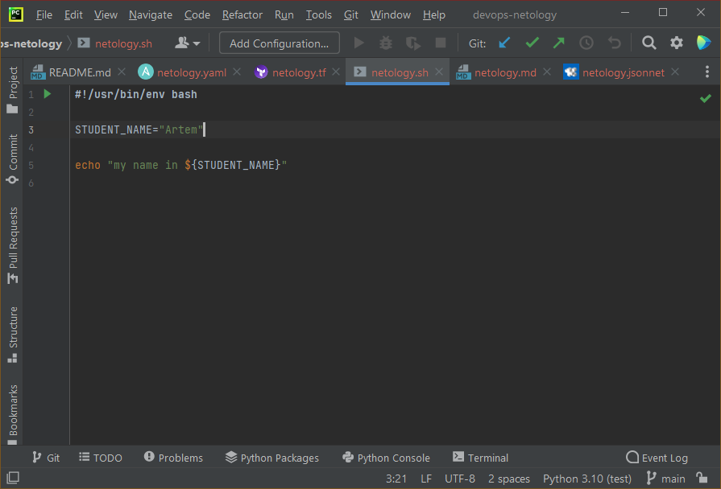

## Домашнее задание к занятию «1.1. Введение в DevOps»

### Задание №1

- Terraform

- Bash

- Markdown

- Yaml

- Jsonnet

### Задание №2

1. Менеджеры собирают feedback от покупателей, формируя список фич, которые нужно добавить.
1. Разработчики реализуют составленный по feedback список задач.
1. Тестировщики проводят тестирование.
1. Менеджеры утверждают готовые к выпуску фичи. Не утверждённые отправляются на доработку.
1. Новая версия интернет-магазина заливается на "боевой" хостинг. Перед обновлением делается резервная копия.
1. В случае возникновения ошибок в продакшене определяются "сбойные" фичи. По возможности в релизной сборке
откатываются только они, иначе откатываются все изменения этапа. Полученная сборка заливается на хостинг.

DevOps инженер должен обеспечить эффективное взаимодействие менеджеров, разработчиков и тестировщиков в процессе
разработки (внедрения новых фич в интернет-магазин) для чего:
- выбрать подходящие инструменты (ПО, сервисы)
- подготовить всю необходимую инфраструктуру (среды разработки, тестовые окружения)
- наладить непосредственно сам процесс разработки и тестирования (настройка ПО и сетевого взаимодействия между средами)
- добиться максимальной автоматизации процессов (CI, мониторирование, оповещение, выгрузка на сервера и т.п.)
"new line"
