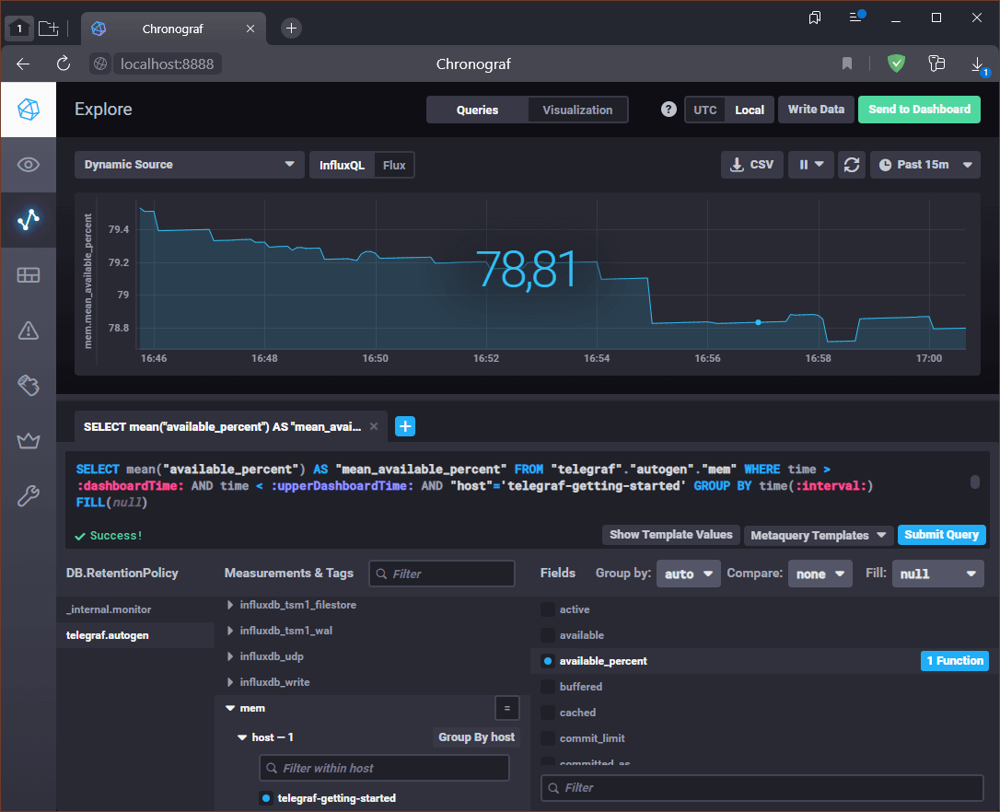

# Домашнее задание по лекции "10.2. Системы для мониторинга"

## Обязательная задача 1

> Опишите основные плюсы и минусы pull и push систем мониторинга.

Системы мониторинга **Push** и **Pull** отличаются инициатором отправки/получения данных:
в **push** системах - агенты инициируют отправку метрик (агенты в соответствии со своими настройками сами отправляют данные в систему мониторинга),
в **pull** - сама система опрашивает список своих агентов (агенты собирают и отправляют метрики в ответ на запрос системы мониторинга).

Из принципа построения модели мониторинга следуют их преимущества и недостатки:

**Push** модель:
  - :heavy_plus_sign: Настройка точёк приёма метрик осуществляется на агентах, что позволяет настроить вывод метрик в несколько систем мониторирования и реализовать репликацию;
  - :heavy_plus_sign: Каждый агент можно настроить на достаточную для данного узла полноту сбора данных и частоту отправки;
  - :heavy_plus_sign: Как правило для доставки данных используется протокол UDP, который может снизить затраты ресурсов на передачу данных;
  - :heavy_minus_sign: Затрудняется верификация данных в системах мониторирования (можно эмулировать действия агента и размыть данные мониторинга ложной информацией);
  - :heavy_minus_sign: При использовани протокола UDP нельзя гарантировать доставку данных.

**Pull** модель:
  - :heavy_plus_sign: Настройка опроса агентов выполняется в системе мониторинга, что гарантирует достоверность всех получаемых данных, так как мы сами выбирает какие агенты опрашивать;
  - :heavy_plus_sign: Для агентов, использующих защищённый канал связи (TLS), реализовав единый **proxy** сервер можно разнести систему мониторинга и агенты без ущерба безопасности;
  - :heavy_plus_sign: Существенно упрощается отладка узлов агентов, так как метрики могут быть запрощены сторонним ПО в рамках тестирования;
  - :heavy_plus_sign: Низкая вероятность потери метрик с агентов при передачи данных, так как используется TCP/HTTP;
  - :heavy_minus_sign: Немного более высокие требования к ресурсам, особенно при использовании защищённых каналов связи.

---

## Обязательная задача 2

> Какие из ниже перечисленных систем относятся к push модели, а какие к pull ?
> А может есть гибридные?
>
>   - Prometheus
>   - TICK
>   - Zabbix
>   - VictoriaMetrics
>   - Nagios

### Prometheus

Изначально `pull` модель, которая при использовании специального ПО **Pushgateway**  фактически становится `гибридной`.


**Pushgateway** является связующим звеном между задачами (агентами), построенными по **push** модели и **Prometheus**. В основном применяется в коротких по времени задачах.

### TICK

**TICK** - это аббревиатура от **Telegraf** + **InfluxDB** + **Chronograf** + **Kapacitor**

**Telegraf** - средство сбора и передачи метрик, основанное на механизме **plugin** модулей.

**InfluxDB** - база данных временных рядов. Служит хранилищем метрик с функцией чистки (хранение данных определённое время).

**Chronograf** - средство визуализации данных с функцией оповещений.

**Kapacitor** - компомент, реализующий функции обработки и анализа данных, а также генерирование и отправки оповещений (**alert**).


С одной стороны - в стандартной схеме работы метрики собираются и отправляются агентом **Telegraf** в базу **InfluxDB**, что соответствует `push` модели.
Но с другой стороны - **Telegraf** можно настроить на вывод данных в другие источники (например, в облачные сервисы, в файлы и различные протоколы, включая **Prometheus**), что может соответствовать **pull** модели.
И потом, **Chronograf** и **Kapacitor** получают данные для оповещений из базы **InfluxDB** уже по своим правилам (настройка периода опроса, агрегации и трансформации данных), что тоже похоже на **pull** модель.

Вывод: если не `гибридная`, то `push` модель

### Zabbix

Продукт имеет свой кросс-платформенный агент для сбора метрик, а также позволяет собирать данные без агента, например: web-мониторинг, проверки SSH/Telnet, ODBC, сбор данных из HTTP точек доступа, протокол Prometheus и другие.
В соответствии с [описанием разработчика](https://www.zabbix.com/features#metric_collection) в системе реализованы методы сбора данных `Push and pull`.

Вывод: система `гибридная`

### VictoriaMetrics

По заявлению разработчика проект является высокопроизводительным **Open Source** решением, объединяющим базу данных временных рядов и систему мониторинга. Совместима с **Prometheus** и **Grafana**. Может принимать метрики в протоколах **InfluxDB**, **Graphite**, **OpenTSDB** и **CSV**.
В [презентации продукта](https://victoriametrics.com/products/open-source/) также говорится о возможности работы с обоими моделями: `both push and pull models`.

Вывод: система `гибридная`

### Nagios

Насколько я понял описание, архитестура решения **Nagios XI** строится на клиент-серверном принципе,
а точнее по принципу сервер-агент. **Nagios** устанавливается как сервер.
На мониторируемые ресурсы устанавливаются его агенты,
которые производят сбор и отправку метрик при обращении к ним сервера.
Таким образом на вид типичная `pull` модель.

---

## Обязательная задача 3

> Склонируйте себе [репозиторий](https://github.com/influxdata/sandbox/tree/master) и запустите TICK-стэк, используя технологии docker и docker-compose.
> В виде решения на это упражнение приведите выводы команд с вашего компьютера (виртуальной машины):
>
>   - curl http://localhost:8086/ping
>   - curl http://localhost:8888
>   - curl http://localhost:9092/kapacitor/v1/ping
>
> А также скриншот веб-интерфейса ПО chronograf (`http://localhost:8888`).
> P.S.: если при запуске некоторые контейнеры будут падать с ошибкой - проставьте им режим `Z`, например `./data:/var/lib:Z`

В репозитории файл манифеста `Docker Compose` содержит переменные окружения, которые устанавливаются в скрипте запуска `sandbox`,
поэтому вместо разворачивания контейнеров напрямую через **Docker**,
лучше воспользоваться имеющимся скриптом управления - `sandbox`, благо он имеет дополнительные возможности (например, чистку TICK, вход в контейнеры и т.д.).
Однако данный вариант требует наличия отдельного компонента **docker-compose**, который в актуальных версиях **Docker** уже встроен в движок, поэтому я использовал скрипт-обёртку (~/.local/bin/docker-compose):

```bash
#!/usr/bin/env bash
docker compose $*
```

После успешного разворачивания **TICK** стэка скрипт управления пытается запусить браузер со страницами документации и **Chronograf** из контейнеров для чего используется команда **xdg-open** (для ОС Linux) из пакет **xdg-utils**.
Но, в моём окружении используется серверная версия **Ubuntu** без графического интерфейса и соответственно в работе скрипта будет ошибка. Чтобы всё было красиво я написал второй скрипт-заглушку на команду `xdg-open` заменив её использованием **curl** (~/.local/bin/xdg-open):

```bash
#!/usr/bin/env bash
curl --retry 5 --retry-all-errors --retry-delay 3 -s $* >/dev/null
if [ $? -eq 0 ]; then
   echo "$* is OK"
else
   echo "$* is FAIL"
fi
```

Из описания **Docker** манифеста видно, что используются следующие порты:
  - InfluxDB: `8086`, `8082`, `8089/udp`
  - Kapacitor: `9092`
  - Chronograf: `8888`
  - Документация: `3010`

Разворачивание **TICK** стэка:

```console
sa@ubuntu22:~/10.2/sandbox$ ./sandbox up
Using latest, stable releases
Spinning up Docker Images...
If this is your first time starting sandbox this might take a minute...
[+] Building 39.1s (28/28) FINISHED
 => [chrono_config internal] load build definition from Dockerfile                                                 0.0s
 => => transferring dockerfile: 199B                                                                               0.0s
 => [kapacitor internal] load build definition from Dockerfile                                                     0.0s
 => => transferring dockerfile: 85B                                                                                0.0s
 => [influxdb internal] load build definition from Dockerfile                                                      0.0s
 => => transferring dockerfile: 83B                                                                                0.0s
 => [telegraf internal] load build definition from Dockerfile                                                      0.0s
 => => transferring dockerfile: 83B                                                                                0.0s
 => [sandbox_documentation internal] load build definition from Dockerfile                                         0.0s
 => => transferring dockerfile: 251B                                                                               0.0s
 => [chrono_config internal] load .dockerignore                                                                    0.0s
 => => transferring context: 2B                                                                                    0.0s
 => [kapacitor internal] load .dockerignore                                                                        0.0s
 => => transferring context: 2B                                                                                    0.0s
 => [influxdb internal] load .dockerignore                                                                         0.0s
 => => transferring context: 2B                                                                                    0.0s
 => [telegraf internal] load .dockerignore                                                                         0.0s
 => => transferring context: 2B                                                                                    0.0s
 => [sandbox_documentation internal] load .dockerignore                                                            0.0s
 => => transferring context: 2B                                                                                    0.0s
 => [chrono_config internal] load metadata for docker.io/library/chronograf:latest                                 2.0s
 => [kapacitor internal] load metadata for docker.io/library/kapacitor:latest                                      1.8s
 => [influxdb internal] load metadata for docker.io/library/influxdb:1.8                                           1.7s
 => [telegraf internal] load metadata for docker.io/library/telegraf:latest                                        1.8s
 => [sandbox_documentation internal] load metadata for docker.io/library/alpine:3.12                               1.7s
 => [sandbox_documentation 1/4] FROM docker.io/library/alpine:3.12@sha256:c75ac27b49326926b803b9ed43bf088bc220d22  0.7s
 => => resolve docker.io/library/alpine:3.12@sha256:c75ac27b49326926b803b9ed43bf088bc220d22556de1bc5f72d742c91398  0.0s
 => => sha256:24c8ece58a1aa807c0d8ea121f91cee2efba99624d0a8aed732155fb31f28993 1.47kB / 1.47kB                     0.0s
 => => sha256:1b7ca6aea1ddfe716f3694edb811ab35114db9e93f3ce38d7dab6b4d9270cb0c 2.81MB / 2.81MB                     0.6s
 => => sha256:c75ac27b49326926b803b9ed43bf088bc220d22556de1bc5f72d742c91398f69 1.64kB / 1.64kB                     0.0s
 => => sha256:cb64bbe7fa613666c234e1090e91427314ee18ec6420e9426cf4e7f314056813 528B / 528B                         0.0s
 => => extracting sha256:1b7ca6aea1ddfe716f3694edb811ab35114db9e93f3ce38d7dab6b4d9270cb0c                          0.1s
 => [sandbox_documentation internal] load build context                                                            0.1s
 => => transferring context: 12.89MB                                                                               0.1s
 => [influxdb 1/1] FROM docker.io/library/influxdb:1.8@sha256:cd5c854675531ee4cf74a6e48b5956a4bef0ce20414d2fc9e7  16.2s
 => => resolve docker.io/library/influxdb:1.8@sha256:cd5c854675531ee4cf74a6e48b5956a4bef0ce20414d2fc9e7cf72be793c  0.0s
 => => sha256:cd5c854675531ee4cf74a6e48b5956a4bef0ce20414d2fc9e7cf72be793c95f8 776B / 776B                         0.0s
 => => sha256:23858da423a6737f0467fab0014e5b53009ea7405d575636af0c3f100bbb2f10 55.03MB / 55.03MB                  11.6s
 => => sha256:326f452ade5c33097eba4ba88a24bd77a93a3d994d4dc39b936482655e664857 5.16MB / 5.16MB                     1.6s
 => => sha256:c436689dc135f204734d63b82fd03044fa3a5205127cb2d1fa7398ff224936b1 1.99kB / 1.99kB                     0.0s
 => => sha256:8dd1ac1f245f25ec432e5711e92b728b4c5f0905f8b268e987f47fa1f23438e9 5.00kB / 5.00kB                     0.0s
 => => sha256:a42821cd14fb31c4aa253203e7f8e34fc3b15d69ce370f1223fbbe4252a64202 10.88MB / 10.88MB                   2.8s
 => => sha256:15dd8cf5de76734de3a2383c6dea158953903eb1672d56bb1f5aa1de7ee5c77c 2.89kB / 2.89kB                     1.8s
 => => sha256:6289d10e8b37410e42763482ac0a8e412bdd33e69fa83148fa0c19bc0e823f77 54.89MB / 54.89MB                  13.2s
 => => sha256:09aa8a5cbb5f5e04a33509d80a5a34071f1a71f2deb4fb67c54a4c01b46b2521 225B / 225B                         3.3s
 => => sha256:6b5ab308c5f54206ee7a54124d8045f3b6eb8136dc0af86b75d23458691479fe 210B / 210B                         6.1s
 => => sha256:4e7965b1794bd0a719427dd9ae5a09bfee4ad56dfc61dbb7b2ba1a61abdf35ac 1.28kB / 1.28kB                     6.7s
 => => extracting sha256:23858da423a6737f0467fab0014e5b53009ea7405d575636af0c3f100bbb2f10                          1.2s
 => => extracting sha256:326f452ade5c33097eba4ba88a24bd77a93a3d994d4dc39b936482655e664857                          0.1s
 => => extracting sha256:a42821cd14fb31c4aa253203e7f8e34fc3b15d69ce370f1223fbbe4252a64202                          0.2s
 => => extracting sha256:15dd8cf5de76734de3a2383c6dea158953903eb1672d56bb1f5aa1de7ee5c77c                          0.0s
 => => extracting sha256:6289d10e8b37410e42763482ac0a8e412bdd33e69fa83148fa0c19bc0e823f77                          0.9s
 => => extracting sha256:09aa8a5cbb5f5e04a33509d80a5a34071f1a71f2deb4fb67c54a4c01b46b2521                          0.0s
 => => extracting sha256:6b5ab308c5f54206ee7a54124d8045f3b6eb8136dc0af86b75d23458691479fe                          0.0s
 => => extracting sha256:4e7965b1794bd0a719427dd9ae5a09bfee4ad56dfc61dbb7b2ba1a61abdf35ac                          0.0s
 => [kapacitor 1/1] FROM docker.io/library/kapacitor:latest@sha256:a747f7ab94bcfc2408927f8e05e98b6b44c40a5705ce2  29.9s
 => => resolve docker.io/library/kapacitor:latest@sha256:a747f7ab94bcfc2408927f8e05e98b6b44c40a5705ce22a5dd235530  0.0s
 => => sha256:a747f7ab94bcfc2408927f8e05e98b6b44c40a5705ce22a5dd235530f0488b48 549B / 549B                         0.0s
 => => sha256:c2a70395fda60512bd3639ee15a5ed6b1b41240dcec9f5131c5f528f97f2f14d 1.79kB / 1.79kB                     0.0s
 => => sha256:565a3350862a8df04b89d23408dee606ed3379d90739e13e0df5b1fce9690ea7 5.17kB / 5.17kB                     0.0s
 => => sha256:2b55860d4c667a7200a0cb279aec26777df61e5d3530388f223ce7859d566e7a 30.43MB / 30.43MB                  14.7s
 => => sha256:728cfcfa2f7739d87ae3efda60d01680593fcb2b55fdb5840721012c19335b9a 3.80MB / 3.80MB                    12.9s
 => => sha256:09eda6154af3733cdc766a287039ebbd0d78265b3a7c64ed165045c8849ba1ce 3.56MB / 3.56MB                    14.6s
 => => sha256:022eacd29a31f793678f3f063aba5fa0decc77669bbbf3d3dce74efb03173e21 26.22MB / 26.22MB                  19.3s
 => => sha256:6b60612d8c7ec8bec5b1a0706e0ce0829f49543a379e08179ba64168fabb7911 64.42MB / 64.42MB                  27.8s
 => => sha256:033b9ba7190612613f02c47a448cfcc3714fe2277d68cd7e67398cc978ebe84f 226B / 226B                        15.2s
 => => extracting sha256:2b55860d4c667a7200a0cb279aec26777df61e5d3530388f223ce7859d566e7a                          0.9s
 => => sha256:0c928b9d95f4b3b674a36e6349f76eee0f1e2b0b3efd77c4510f901d5f7c4995 231B / 231B                        15.7s
 => => extracting sha256:728cfcfa2f7739d87ae3efda60d01680593fcb2b55fdb5840721012c19335b9a                          0.3s
 => => extracting sha256:09eda6154af3733cdc766a287039ebbd0d78265b3a7c64ed165045c8849ba1ce                          0.1s
 => => extracting sha256:022eacd29a31f793678f3f063aba5fa0decc77669bbbf3d3dce74efb03173e21                          0.2s
 => => extracting sha256:6b60612d8c7ec8bec5b1a0706e0ce0829f49543a379e08179ba64168fabb7911                          0.8s
 => => extracting sha256:033b9ba7190612613f02c47a448cfcc3714fe2277d68cd7e67398cc978ebe84f                          0.0s
 => => extracting sha256:0c928b9d95f4b3b674a36e6349f76eee0f1e2b0b3efd77c4510f901d5f7c4995                          0.0s
 => [telegraf 1/1] FROM docker.io/library/telegraf:latest@sha256:e5e60be2be76f16c4f8772951d3636317a0518dfe3c2385  31.1s
 => => resolve docker.io/library/telegraf:latest@sha256:e5e60be2be76f16c4f8772951d3636317a0518dfe3c238558ee901226  0.0s
 => => sha256:aba4489dc3f53ca3d8d489ca7f22ad5e9f72ee58b2b116faa6b10d6e6c7ba4e6 1.79kB / 1.79kB                     0.0s
 => => sha256:ce8d7a472ebd3fe966e17068b4a84fa262ab780ded3281734eb3ccba5b4bfd5d 4.78kB / 4.78kB                     0.0s
 => => sha256:326f452ade5c33097eba4ba88a24bd77a93a3d994d4dc39b936482655e664857 5.16MB / 5.16MB                     1.5s
 => => sha256:e5e60be2be76f16c4f8772951d3636317a0518dfe3c238558ee901226a7b9468 776B / 776B                         0.0s
 => => sha256:23858da423a6737f0467fab0014e5b53009ea7405d575636af0c3f100bbb2f10 55.03MB / 55.03MB                  11.5s
 => => sha256:a42821cd14fb31c4aa253203e7f8e34fc3b15d69ce370f1223fbbe4252a64202 10.88MB / 10.88MB                   2.7s
 => => extracting sha256:23858da423a6737f0467fab0014e5b53009ea7405d575636af0c3f100bbb2f10                          1.2s
 => => extracting sha256:326f452ade5c33097eba4ba88a24bd77a93a3d994d4dc39b936482655e664857                          0.1s
 => => extracting sha256:a42821cd14fb31c4aa253203e7f8e34fc3b15d69ce370f1223fbbe4252a64202                          0.2s
 => => sha256:1cfb39d3f3786c76fffb986ff0092bf7e14fa947dc58edade563c2ab950276ee 18.76MB / 18.76MB                  23.1s
 => => sha256:b34ca274d85bef3e27c3994985878b4a4442fae094ba9739c90d86dc894ce0fe 2.90kB / 2.90kB                    20.2s
 => => sha256:3c9223cc715c07bafab461225a2be26af0eefb8877008aa3443882d55e53faac 43.94MB / 43.94MB                  29.5s
 => => extracting sha256:1cfb39d3f3786c76fffb986ff0092bf7e14fa947dc58edade563c2ab950276ee                          0.5s
 => => sha256:9cbf488c5267e2a62d9a72ec93d70285c8062d40b04b3fec90c4ed828c6ce496 342B / 342B                        23.3s
 => => extracting sha256:b34ca274d85bef3e27c3994985878b4a4442fae094ba9739c90d86dc894ce0fe                          0.0s
 => => extracting sha256:3c9223cc715c07bafab461225a2be26af0eefb8877008aa3443882d55e53faac                          0.9s
 => => extracting sha256:9cbf488c5267e2a62d9a72ec93d70285c8062d40b04b3fec90c4ed828c6ce496                          0.0s
 => [chrono_config 1/3] FROM docker.io/library/chronograf:latest@sha256:a3dd2ea5f162b90eb91cc50bf553ea801d93f249  36.1s
 => => resolve docker.io/library/chronograf:latest@sha256:a3dd2ea5f162b90eb91cc50bf553ea801d93f2492d3ea3aa8d76f7d  0.0s
 => => sha256:a3dd2ea5f162b90eb91cc50bf553ea801d93f2492d3ea3aa8d76f7dff8f922fd 776B / 776B                         0.0s
 => => sha256:4e6c386352e5d3d8acedc1b7778f7016879414197db6bd43b691ba41db62e1c3 4.82kB / 4.82kB                     0.0s
 => => sha256:0131956c284642aa5046d24151f4c62239af3e7dbfba6b344647c7d883d68c21 1.58kB / 1.58kB                     0.0s
 => => sha256:31b3f1ad4ce1f369084d0f959813c51df0ca17d9877d5ee88c2db6ff88341430 31.40MB / 31.40MB                  31.3s
 => => sha256:fa9912bf5b6c0d0a8c9f83f63b25e9d2594eba49ae7977f589f65cb3c6db68ee 5.23MB / 5.23MB                    29.3s
 => => sha256:5465fc1b879a85d93348bfabdfcdefbb0690206998bead3c44f8d6c22cd0d42a 44.59MB / 44.59MB                  34.7s
 => => sha256:5cb13e1bf85984003fc04f672635ce3823c659d7a0256ecb8f4bf05818263c11 12.25kB / 12.25kB                  36.9s
 => => sha256:4b396867a07f1e6c1663ed3f2f1fce140e3f25d0e1b220ec844910e28d75a7dc 11.91kB / 11.91kB                  30.0s
 => => sha256:80bc49be513cee5763ad65b584f9dc6dda843bd132432ee82a4e99cf3af6a830 239B / 239B                        30.8s
 => => extracting sha256:31b3f1ad4ce1f369084d0f959813c51df0ca17d9877d5ee88c2db6ff88341430                          0.7s
 => => extracting sha256:fa9912bf5b6c0d0a8c9f83f63b25e9d2594eba49ae7977f589f65cb3c6db68ee                          0.1s
 => => extracting sha256:5465fc1b879a85d93348bfabdfcdefbb0690206998bead3c44f8d6c22cd0d42a                          0.6s
 => => extracting sha256:5cb13e1bf85984003fc04f672635ce3823c659d7a0256ecb8f4bf05818263c11                          0.0s
 => => extracting sha256:4b396867a07f1e6c1663ed3f2f1fce140e3f25d0e1b220ec844910e28d75a7dc                          0.0s
 => => extracting sha256:80bc49be513cee5763ad65b584f9dc6dda843bd132432ee82a4e99cf3af6a830                          0.0s
 => [chrono_config internal] load build context                                                                    0.0s
 => => transferring context: 481B                                                                                  0.0s
 => [sandbox_documentation 2/4] RUN mkdir -p /documentation                                                        0.2s
 => [sandbox_documentation 3/4] COPY builds/documentation /documentation/                                          0.1s
 => [sandbox_documentation 4/4] COPY static/ /documentation/static                                                 0.0s
 => [chrono_config] exporting to image                                                                             1.1s
 => => exporting layers                                                                                            0.8s
 => => writing image sha256:66c80f452f2699dbaf9df9ebd62a6d923cabec39a6045b512f1a422010e1c7a5                       0.0s
 => => naming to docker.io/library/sandbox_documentation                                                           0.0s
 => => writing image sha256:99fc9c709dd4acb9b15b8d5233c24d566f7d0c467f5ce0e1efec3db857898619                       0.0s
 => => naming to docker.io/library/influxdb                                                                        0.0s
 => => writing image sha256:c10124cb076dbcdf4dcd0a0cf647ef227827604be82ccc10d40f005107d20002                       0.0s
 => => naming to docker.io/library/kapacitor                                                                       0.0s
 => => writing image sha256:a3fb391bc9272fcb79b7822f3fa787f840078a0a25ebd7b757490a8a35060df9                       0.0s
 => => naming to docker.io/library/telegraf                                                                        0.0s
 => => writing image sha256:8aeafa48a494650eb79332e6123bfded518c2eb8d524c3f698ec4ee173321013                       0.0s
 => => naming to docker.io/library/chrono_config                                                                   0.0s
 => [chrono_config 2/3] ADD ./sandbox.src ./usr/share/chronograf/resources/                                        0.0s
 => [chrono_config 3/3] ADD ./sandbox-kapa.kap ./usr/share/chronograf/resources/                                   0.0s

Use 'docker scan' to run Snyk tests against images to find vulnerabilities and learn how to fix them
[+] Running 6/6
 ⠿ Network sandbox_default            Created                                                                      0.0s
 ⠿ Container sandbox-influxdb-1       Started                                                                      0.5s
 ⠿ Container sandbox-documentation-1  Started                                                                      0.4s
 ⠿ Container sandbox-kapacitor-1      Started                                                                      0.8s
 ⠿ Container sandbox-telegraf-1       Started                                                                      0.9s
 ⠿ Container sandbox-chronograf-1     Started                                                                      1.5s
Opening tabs in browser...
http://localhost:8888 is OK
http://localhost:3010 is OK
sa@ubuntu22:~/10.2/sandbox$
```

Результат:

```console
sa@ubuntu22:~/10.2/sandbox$ curl http://localhost:8086/ping
sa@ubuntu22:~/10.2/sandbox$ curl http://localhost:9092/kapacitor/v1/ping
sa@ubuntu22:~/10.2/sandbox$ curl http://localhost:8888 && echo
<!DOCTYPE html><html><head><link rel="stylesheet" href="/index.c708214f.css"><meta http-equiv="Content-type" content="text/html; charset=utf-8"><title>Chronograf</title><link rel="icon shortcut" href="/favicon.70d63073.ico"></head><body> <div id="react-root" data-basepath=""></div> <script type="module" src="/index.e81b88ee.js"></script><script src="/index.a6955a67.js" nomodule="" defer></script> </body></html>
sa@ubuntu22:~/10.2/sandbox$
```


---

## Обязательная задача 4

> Перейдите в веб-интерфейс Chronograf (`http://localhost:8888`) и откройте вкладку `Data explorer`.
>   - Нажмите на кнопку `Add a query`
>   - Изучите вывод интерфейса и выберите БД `telegraf.autogen`
>   - В `measurments` выберите mem->host->telegraf_container_id , а в `fields` выберите used_percent. 
>     Внизу появится график утилизации оперативной памяти в контейнере telegraf.
>   - Вверху вы можете увидеть запрос, аналогичный SQL-синтаксису. 
>     Поэкспериментируйте с запросом, попробуйте изменить группировку и интервал наблюдений.
>
> Для выполнения задания приведите скриншот с отображением метрик утилизации места на диске (disk->host->telegraf_container_id) из веб-интерфейса.

Приведённые в условиях задания плагины ([mem](https://github.com/influxdata/telegraf/tree/master/plugins/inputs/mem), [disk](https://github.com/influxdata/telegraf/tree/master/plugins/inputs/disk)) в текущей версии **sandbox** по умолчанию отключены.
Для их активации необходимо в проброшенный конфигурационный файл `telegraf/telegraf.conf` добавить следующие строки:

```conf
[[inputs.mem]]
[[inputs.disk]]
  ignore_fs = ["tmpfs", "devtmpfs", "devfs", "iso9660", "overlay", "aufs", "squashfs"]
```

Для применения изменений нужно перезапустить контейнер **Telegraf** командой: `docker restart sandbox-telegraf-1`

> Метрика утилизации места на диске смотрится не очень интересно, поэтому дополнительно приведена метрика нагрузки ЦПУ

Использование памяти


Утилизация накопителя


Нагрузка на ЦПУ


---

## Обязательная задача 5

> Изучите список [telegraf inputs](https://github.com/influxdata/telegraf/tree/master/plugins/inputs). 
> Добавьте в конфигурацию telegraf следующий плагин - [docker](https://github.com/influxdata/telegraf/tree/master/plugins/inputs/docker):
> ```
> [[inputs.docker]]
>   endpoint = "unix:///var/run/docker.sock"
> ```
> 
> Дополнительно вам может потребоваться донастройка контейнера telegraf в `docker-compose.yml` дополнительного volume и 
> режима privileged:
> ```
>   telegraf:
>     image: telegraf:1.4.0
>     privileged: true
>     volumes:
>       - ./etc/telegraf.conf:/etc/telegraf/telegraf.conf:Z
>       - /var/run/docker.sock:/var/run/docker.sock:Z
>     links:
>       - influxdb
>     ports:
>       - "8092:8092/udp"
>       - "8094:8094"
>       - "8125:8125/udp"
> ```
> 
> После настройке перезапустите telegraf, обновите веб интерфейс и приведите скриншотом список `measurments` в 
> веб-интерфейсе базы telegraf.autogen . Там должны появиться метрики, связанные с docker.
> 
> Факультативно можете изучить какие метрики собирает telegraf после выполнения данного задания.

В **Sandbox** актуальной версии **plugin** для **Docker** уже активен.
Однако его метрик у меня не наблюдается, так как в манифесте **Docker** проброшен **socket** файл для **root** режима работы **Docker**.
У меня же используется **rootless** режим и соответственно путь **socket** файла другой:

```console
sa@ubuntu22:~/10.2/sandbox$ echo $DOCKER_HOST
unix:///run/user/1000/docker.sock
sa@ubuntu22:~/10.2/sandbox$
```

Поэтому в настройках `docker-compose.yml` нужно заменить проброс файла `/var/run/docker.sock` на `/var/run/user/1000/docker.sock`, то есть:

```yaml
    volumes:
      - ./telegraf/:/etc/telegraf/
      - /var/run/user/1000/docker.sock:/var/run/docker.sock
```

Других изменений вносить не пришлось (Ubuntu 22)

Список метрик **Docker plugin**


Наглядная визуализация потребления памяти контейнерами **Docker** в стэке (каждый последующий график рисуется от предыдущего, а не от линии абсцисс)


---

## Дополнительная задача (со звездочкой*) - необязательно к выполнению

> В веб-интерфейсе откройте вкладку `Dashboards`. Попробуйте создать свой dashboard с отображением:
>   - утилизации ЦПУ
>   - количества использованного RAM
>   - утилизации пространства на дисках
>   - количество поднятых контейнеров
>   - аптайм
>   - ...
>   - фантазируйте)
>   


> На **dashboard** проиллюстрирована работа **molecule** при тестировании ролей ([fullstack](https://github.com/ArtemShtepa/devops-netology/tree/homework-8.5/homework/8.5/fullstack)) из домашнего задания [8.5](https://github.com/ArtemShtepa/devops-netology/tree/homework-8.5/homework/8.5/)
> 
> **Dashboard** создавался на другой машине, поэтому и браузер и параметры машины другие

---

Дополнительные материалы:

Список правил [Prometheus Alert](https://awesome-prometheus-alerts.grep.to/rules.html)
