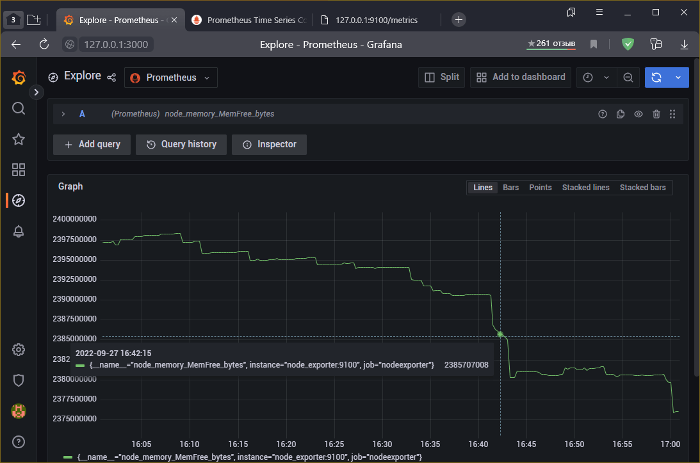

# Домашнее задание по лекции "10.3 Средство визуализации Grafana"

## Задание повышенной сложности

> **В части задания 1** не используйте директорию [help](./help) для сборки проекта, самостоятельно разверните grafana, где в 
> роли источника данных будет выступать prometheus, а сборщиком данных node-exporter:
> - grafana
> - prometheus-server
> - prometheus node-exporter
> 
> За дополнительными материалами, вы можете обратиться в официальную документацию grafana и prometheus.
> 
> В решении к домашнему заданию приведите также все конфигурации/скрипты/манифесты, которые вы 
> использовали в процессе решения задания.
> 
> **В части задания 3** вы должны самостоятельно завести удобный для вас канал нотификации, например Telegram или Email
> и отправить туда тестовые события.
> 
> В решении приведите скриншоты тестовых событий из каналов нотификаций.

В условии не говорится о том, как нужно разворачивать **Grafana** и **Prometheus** - устанавливать прямо в систему или использовать контейнеры.
Но установка в систему - не *наш метод*, поэтому я буду использовать контейнеры **Docker** с пробросом необходимых ресурсов с хоста.

Планируемый к разворачиванию стэк и назначение:
  - **Prometheus Node-Exporter** - Агент сбора метрик. Будет опрашиватсья Prometheus-server
  - **Prometheus-server** - Агрегатор метрик
  - **Grafana** - Будет использоваться в качестве визуализатора метрик и как система оповещений

---

## Задача 1

> Используя директорию [help](./help) внутри данного домашнего задания - запустите связку prometheus-grafana.
> 
> Зайдите в веб-интерфейс графана, используя авторизационные данные, указанные в манифесте docker-compose.
> 
> Подключите поднятый вами prometheus как источник данных.
> 
> Решение домашнего задания - скриншот веб-интерфейса grafana со списком подключенных Datasource.

### Забегая вперёд

По заданию требуется развернуть **NodeExporter**. В его [документации](https://github.com/prometheus/node_exporter#docker) не рекомендуют разворачивать **NodeExporter** в контейнере, так как всё равно нужен доступ к системе.
Но если контейнеризация необходима, то потребуется пробросить корневой каталог `/` внутрь контейнера и указать его дополнительным параметром `--path.rootfs`.

Однако, доступ к корневому каталогу может быть предоставлен только в стандартном режиме работы **Docker** (с правами **root**),
а значит при использовании **compose** весь стэк будет стартовать от **root**.

Поэтому для корректной работы **Grafana** и **NodeExporter** потребуется указать пользователя.

По умолчанию в **Docker compose** все контейнеры объединяются в одну сеть с драйвером **bridge** и выражения `localhost` / `127.0.0.1` будут указывать на свой контейнер, поэтому при необходимости связи с другим контейнером нужно использовать его имя.

Так как окружение настраивается в целях обучения и проведения тестов, то для облегчения отладки контейнерам не устанавливается параметр **restart** (по умолчанию имеет значение `no`).

### Настройка контейнера **Prometheus NodeExporter**

Документация:
  - [Monitoring Linux Host Metrics With The Node Exporter](https://prometheus.io/docs/guides/node-exporter/)
  - [Node exporter в GitHub](https://github.com/prometheus/node_exporter)

На странице проекта указано, что **Node Exporter** изначально прослушивает порт `9100`, значит он должен быть доступным как минимум внутри сети контейнеров

```yaml
  node_exporter:
    image: quay.io/prometheus/node-exporter
    container_name: node_exporter
    command:
      - '--path.rootfs=/host'
    pid: host
    ports:
      - "9100:9100"
    volumes:
      - '/:/host:ro,rslave'
```

  - В качестве образа используется последняя версия **Prometheus NodeExporter** со страницы в [GitHub](https://github.com/prometheus/node_exporter): `quay.io/prometheus/node-exporter`
  - Добавлен дополнительный параметр `--path.rootfs=/host`, который говорит **NodeExporter** считать корневым каталогом системы директорию `/host` внутри контейнера
  - Порт `9100` выведен наружу (**ports**), чтобы в ручном режиме проверить функционирование **NodeExporter**. Если этого не требуется, можно перенести его в группу **expose**
  - Внутренний каталог `/host` связан с корневой директорией хоста в режиме **ReadOnly** (только чтение)

> При установке параметра `rootfs` подкаталоги `proc` и `sys` если они не заданы отдельными параметрами становятся подкаталогами `rootfs`, то есть в нашем слечае: **proc** = `/host/proc`, **sys** = `/host/sys`, а так как `/host` связан с карневым каталогом хоста (`/`), соответствующие каталоги **proc** и **sys** уже связаны и задавать их не обязательно.

Функционирование контейнера **NodeExporter**


### Настройка контейнера **Prometheus**

В соответствии с [документацией](https://prometheus.io/docs/prometheus/latest/installation/) **Prometheus** может быть щапущен в **Docker** контейнере командой: `docker run -p 9090:9090 prom/prometheus`
Данная команда запуска говорит о минимальных настройках для функционирования **Prometheus**, а именно: использовании подготовленного разработчиком образа `prom/prometheus` и пробросе порта `9090`.

Чтобы использовать свой конфигурационный файл для **Prometheus** необходимо пробросить либо соответствующий файл `/etc/prometheus/prometheus.yml` либо всю директорию `/etc/prometheus/`.
Но нужно учёсть, что если проброшенного конфигурационного файла **Prometheus** на хосте нет, то контейнер после запуска сразу остановится с ошибкой.
Этого можно избежать:
  - Запустить контейнер без проброса конфигурационного файла
  - Открыть в браузере **Prometheus** по адресу `http://127.0.0.1:9090/config`
  - Скопировать текущие настройки и сохранить их в конфигурационный файл
  - Пробросить конфигурационный файл или весь каталог
  - Перезапустить контейнер c **Prometheus**

```yaml
  prometheus:
    image: "prom/prometheus"
    container_name: prometheus
    user: "${USER}:${USER}"
    volumes:
      - ./data/prometheus:/prometheus/
      - ./data/prom-config.yml:/etc/prometheus/prometheus.yml
    ports:
      - "9090:9090"
    depends_on:
      - node_exporter
```

Для подключения метрик из **NodeExporter** нужно в конфигурационный файл **Prometheus** добавить следующие строки
```yaml
- job_name: nodeexporter
  static_configs:
  - targets: ['node_exporter:9100']
```

Итоговый конфигурационный файл **Prometheus**: [prometheus.yml](prometheus.yml)

  - В качестве образа используется последняя версия **Prometheus** от разработчика: `prom/prometheus`
  - Чтобы иметь возможность изменять настройки **Prometheus** его конфигурационный файл заменяется хостовым `data/prom-config.yml`
  - Чтобы не терять накопленные **Prometheus** данные, каталог базы проброшен на хостовую машину в каталог `data/prometheus`
  - Чтобы сохранить возможность открывать **Prometheus** в браузере наружу проброшен порт `9090`
  - Добавлена зависимость от контейнера **NodeExporter** для того, чтобы он уже был готов, когда начнёт запускаться **Prometheus** (можно убрать)

Функционирование контейнера **Prometheus** с активными агентами


### Настройка контейнера **Grafana**

В соответствии с [документацией](https://grafana.com/grafana/download?edition=oss&pg=oss-graf&plcmt=resources&platform=docker) **Grafana** может быть запущена в **Docker** контейнере командой: `docker run -d --name=grafana -p 3000:3000 grafana/grafana-oss`
Данная команда запуска говорит о минимальных настройках для функционирования **Grafana**, а именно: использовании подготовленного разработчиком образа `grafana/grafana-oss` и пробросе порта `3000`.

Также использовались:
  - Подробная инструкция по установке **Grafana** - [Run Grafana Docker image](https://grafana.com/docs/grafana/latest/setup-grafana/installation/docker/).
  - Дополнительная настройка контейнера - [Configure a Grafana Docker image](https://grafana.com/docs/grafana/latest/setup-grafana/configure-docker/)
  - Переопределение настроек переменными среды - [Override configuration with environment variables](https://grafana.com/docs/grafana/latest/setup-grafana/configure-grafana/#override-configuration-with-environment-variables)

Настройка контейнера **Grafana**:
```yaml
  grafana:
    image: "grafana/grafana-oss"
    container_name: grafana
    user: "${USER}:${USER}"
    volumes:
      - ./data/grafana:/var/lib/grafana
    ports:
      - "3000:3000"
    depends_on:
      - prometheus
```

  - В качестве образа используется последняя версия бесплатной редакции **Grafana**: `grafana/grafana-oss`
  - Чтобы не терять настройки **Grafana** и созданные **dashboards**, каталог хранения внутренних файлов **Grafana** проброшен на хостовую машину в каталог `data/grafana`
  - Чтобы сохранить возможность открыть **Grafana** в браузере наружу проброшен порт `3000`
  - Добавлена зависимость от контейнера **Prometheus** для того, чтобы **Grafana** стартовала последней (можно убрать)

Функционирование контейнера **Grafara** с активным подключением **Prometheus** как источника данных


Просмотр (**explore**) метрики, собранной **NodeExporter** в интерфейсе **Grafana**


Конфигурационный файл **Prometheus**: [prometheus.yml](prometheus.yml)

Файл манифеста **Docker**: [docker-compose.yml](docker-compose.yml)

---

## Задача 2

> Изучите самостоятельно ресурсы:
> - [Promql-for-humans](https://timber.io/blog/promql-for-humans/#cpu-usage-by-instance)
> - [Understanding prometheus cpu metrics](https://www.robustperception.io/understanding-machine-cpu-usage)
> - [Filesystem metrics from the node exporter](https://www.robustperception.io/filesystem-metrics-from-the-node-exporter)
> 
> Создайте Dashboard и в ней создайте следующие Panels:
> - Утилизация CPU для nodeexporter (в процентах, 100-idle)
> - CPULA 1/5/15
> - Количество свободной оперативной памяти
> - Количество места на файловой системе
> 
> Для решения данного ДЗ приведите promql запросы для выдачи этих метрик, а также скриншот получившейся Dashboard.

В качесте нагрузки использовался специальный пакет **stress**: `sudo apt install stress`

Запуск нагрузки осуществлялся командой со следующими параметрами: `stress -c 1 -m 2 --vm-bytes 2GB -d 1`


### CPULA 1/5/15

Показатели состоят из трёх панелей, данные для которых получены командами простого запроса метрики: `node_load1`, `node_load5`, `node_load15`

### Утилизация CPU (100 - idle)

Для построения показателя была использована команда:
```prometheus
100 - (avg by (instance) (rate(node_cpu_seconds_total{mode="idle"}[$__rate_interval])) * 100)
```

Поскольку значения загрузки всегда округляются до одной секунды в секунду, расчёт утилизации выполняется по времени простоя, а именно:
  - запрашивается параметр **node_cpu_seconds_total** с фильтром по тэгу **mode** равному режиму простоя ЦПУ: `node_cpu_seconds_total{mode="idle"}`
  - вычисляется разница времён простоя на выбранном отрезке времени (в данном случае `$__rate_interval` - определяется **Grafana**)
  - полученное значение делится на размер отрезка времени: `rate(node_cpu_seconds_total{mode="idle"}[$__rate_interval])`
  - вычисляется среднее значение (**avg**) всех показателей с группировкой по хосту: `avg by (instance) (rate(node_cpu_seconds_total{mode="idle"}[$__rate_interval]))` - это даcт возможность абстрагироваться от числа ядер, чтобы итоговый показатель не выходил за 1 - то есть 1 будет означать простой всех ядер, а 0 означать, что ни одно ядро не простаивало на выбранном отрезке времени.
  - вычисляется разница 100 и полученного значения, нормированного до 100%: `100 - (avg by (instance) (rate(node_cpu_seconds_total{mode="idle"}[$__rate_interval])) * 100)`

### Количество свободной памяти

Определяется простым запросов метрики: `node_memory_MemFree_bytes`

### Количество места на файловой системе

Графическая панель построена на команде: `sum by(device) (node_filesystem_avail_bytes{fstype!="tmpfs"})`, где:
  - метрика `node_filesystem_avail_bytes` фильтрауется по тегу типа файловой системы `fstype!="tmpfs"` (не следить за временными файловыми хранилищами)
  - суммирование по устройству `sum by(device)` фактически добавлено только для красивой легенды (группировки по точке монтирования), так как в данном случае функция агрегации выполняется на единственном значении ряда (нет **rate** и подобных)

---

## Задача 3

> Создайте для каждой Dashboard подходящее правило alert (можно обратиться к первой лекции в блоке "Мониторинг").
> 
> Для решения ДЗ - приведите скриншот вашей итоговой Dashboard.

В качестве системы оповещения был выбран **Discord**, так как его было проще настроить.
Примерный путь:
  - Создать свой сервер Discord
  - В настройках сервера выбрать меню `Интеграция`
  - Выбрать пункт `Webhooks`
  - Сгенерировать новый

Создать **alert** правило можно непосредственно в интерфейсе **Alerting** -> **Alert rules**, либо через панель типа **Time series** (график).
В работе использованы оба способа. Первым (через интерфейс) созданы **alert** `CPULA1`, `CPULA5` и `CPULA15` так как для их визуализации использовалась **Gauge** панель.
Остальные **alert** созданы через соответствующие графики.
Такие **alert** помимо простоты создания (команда запроса для **alert** копируется из панели) обладают важной особенностью -
на данной панели отображется статус **alert** и временные отметки его изменения.
Панели, отличного от **Time series** типа, визуально никак не меняются.

Список **alert**


Визуализация отметок **alert** на **dashboard**


Вертикальные прерывистые линии на графиках показывают изменение статуса, привязанного к графику **alert**, где цвет соответствует статусу:
  - `жёлтый` - изменение статуса на `Pending` - пограничное состояние, которое может либо вернуться в норму, либо в **alert**
  - `красный` - изменение статуса на `Alerting` - метрика превысила указанные параметры за определённое время - в это время генерируется оповещение
  - `зелёный` - изменение статуса на `Normal` - метрика вернулась к нормальным показателям - при переходе из статуса **Alerting** также генерируется оповещение

Единичный **alert** в сообщении **Discord**

> Пример оповещения со статусом `Alerting` от одной метрики

Групповое сообщение о нескольких **alert**

> Grafana позволяет периодически напоминать об **alert** через определённые промежутки времени, а также группировать несколько в одно сообщение

Сообщение о нормализации метрики

> Пример сообщения **alert** перешедшего из статуса `Alerting` в `Normal`

---

## Задача 4

> Сохраните ваш Dashboard.
> 
> Для этого перейдите в настройки Dashboard, выберите в боковом меню "JSON MODEL".
> 
> Далее скопируйте отображаемое json-содержимое в отдельный файл и сохраните его.
> 
> В решении задания - приведите листинг этого файла.

Модель построенной **dashboard**:
```json
{
  "annotations": {
    "list": [
      {
        "builtIn": 1,
        "datasource": {
          "type": "prometheus",
          "uid": "kIcdLk4Vz"
        },
        "enable": true,
        "hide": true,
        "iconColor": "rgba(0, 211, 255, 1)",
        "name": "Annotations & Alerts",
        "target": {
          "limit": 100,
          "matchAny": false,
          "tags": [],
          "type": "dashboard"
        },
        "type": "dashboard"
      }
    ]
  },
  "editable": true,
  "fiscalYearStartMonth": 0,
  "graphTooltip": 0,
  "id": 4,
  "links": [],
  "liveNow": false,
  "panels": [
    {
      "datasource": {
        "type": "prometheus",
        "uid": "kIcdLk4Vz"
      },
      "fieldConfig": {
        "defaults": {
          "color": {
            "mode": "thresholds"
          },
          "mappings": [],
          "max": 4,
          "min": 0,
          "thresholds": {
            "mode": "absolute",
            "steps": [
              {
                "color": "dark-green",
                "value": null
              },
              {
                "color": "yellow",
                "value": 1
              },
              {
                "color": "dark-orange",
                "value": 2
              },
              {
                "color": "dark-red",
                "value": 3
              }
            ]
          },
          "unit": "percentunit"
        },
        "overrides": []
      },
      "gridPos": {
        "h": 6,
        "w": 8,
        "x": 0,
        "y": 0
      },
      "id": 4,
      "options": {
        "orientation": "auto",
        "reduceOptions": {
          "calcs": [
            "lastNotNull"
          ],
          "fields": "",
          "values": false
        },
        "showThresholdLabels": false,
        "showThresholdMarkers": true,
        "text": {}
      },
      "pluginVersion": "9.1.6",
      "targets": [
        {
          "datasource": {
            "type": "prometheus",
            "uid": "kIcdLk4Vz"
          },
          "editorMode": "builder",
          "expr": "node_load1",
          "legendFormat": "__auto",
          "range": true,
          "refId": "A"
        }
      ],
      "title": "CPULA 1m",
      "type": "gauge"
    },
    {
      "datasource": {
        "type": "prometheus",
        "uid": "kIcdLk4Vz"
      },
      "fieldConfig": {
        "defaults": {
          "color": {
            "mode": "thresholds"
          },
          "mappings": [],
          "max": 4,
          "thresholds": {
            "mode": "absolute",
            "steps": [
              {
                "color": "dark-green",
                "value": null
              },
              {
                "color": "yellow",
                "value": 1
              },
              {
                "color": "dark-orange",
                "value": 2
              },
              {
                "color": "dark-red",
                "value": 3
              }
            ]
          },
          "unit": "percentunit"
        },
        "overrides": []
      },
      "gridPos": {
        "h": 6,
        "w": 8,
        "x": 8,
        "y": 0
      },
      "id": 6,
      "options": {
        "orientation": "auto",
        "reduceOptions": {
          "calcs": [
            "lastNotNull"
          ],
          "fields": "",
          "values": false
        },
        "showThresholdLabels": false,
        "showThresholdMarkers": true
      },
      "pluginVersion": "9.1.6",
      "targets": [
        {
          "datasource": {
            "type": "prometheus",
            "uid": "kIcdLk4Vz"
          },
          "editorMode": "builder",
          "expr": "node_load5",
          "legendFormat": "__auto",
          "range": true,
          "refId": "A"
        }
      ],
      "title": "CPULA 5m",
      "type": "gauge"
    },
    {
      "datasource": {
        "type": "prometheus",
        "uid": "kIcdLk4Vz"
      },
      "fieldConfig": {
        "defaults": {
          "color": {
            "mode": "thresholds"
          },
          "mappings": [],
          "max": 4,
          "thresholds": {
            "mode": "absolute",
            "steps": [
              {
                "color": "dark-green",
                "value": null
              },
              {
                "color": "yellow",
                "value": 1
              },
              {
                "color": "dark-orange",
                "value": 2
              },
              {
                "color": "dark-red",
                "value": 3
              }
            ]
          },
          "unit": "percentunit"
        },
        "overrides": []
      },
      "gridPos": {
        "h": 6,
        "w": 8,
        "x": 16,
        "y": 0
      },
      "id": 8,
      "options": {
        "orientation": "auto",
        "reduceOptions": {
          "calcs": [
            "lastNotNull"
          ],
          "fields": "",
          "values": false
        },
        "showThresholdLabels": false,
        "showThresholdMarkers": true
      },
      "pluginVersion": "9.1.6",
      "targets": [
        {
          "datasource": {
            "type": "prometheus",
            "uid": "kIcdLk4Vz"
          },
          "editorMode": "builder",
          "expr": "node_load15",
          "legendFormat": "__auto",
          "range": true,
          "refId": "A"
        }
      ],
      "title": "CPULA 15m",
      "type": "gauge"
    },
    {
      "datasource": {
        "type": "prometheus",
        "uid": "kIcdLk4Vz"
      },
      "description": "",
      "fieldConfig": {
        "defaults": {
          "color": {
            "mode": "thresholds"
          },
          "custom": {
            "axisCenteredZero": false,
            "axisColorMode": "text",
            "axisLabel": "",
            "axisPlacement": "auto",
            "axisSoftMax": 100,
            "axisSoftMin": 0,
            "barAlignment": 0,
            "drawStyle": "line",
            "fillOpacity": 50,
            "gradientMode": "opacity",
            "hideFrom": {
              "legend": false,
              "tooltip": false,
              "viz": false
            },
            "lineInterpolation": "smooth",
            "lineStyle": {
              "fill": "solid"
            },
            "lineWidth": 1,
            "pointSize": 5,
            "scaleDistribution": {
              "type": "linear"
            },
            "showPoints": "never",
            "spanNulls": false,
            "stacking": {
              "group": "A",
              "mode": "none"
            },
            "thresholdsStyle": {
              "mode": "line"
            }
          },
          "mappings": [],
          "thresholds": {
            "mode": "absolute",
            "steps": [
              {
                "color": "dark-green",
                "value": null
              },
              {
                "color": "yellow",
                "value": 50
              },
              {
                "color": "dark-red",
                "value": 80
              }
            ]
          },
          "unit": "percent"
        },
        "overrides": []
      },
      "gridPos": {
        "h": 7,
        "w": 24,
        "x": 0,
        "y": 6
      },
      "id": 2,
      "options": {
        "legend": {
          "calcs": [],
          "displayMode": "list",
          "placement": "bottom",
          "showLegend": true
        },
        "tooltip": {
          "mode": "single",
          "sort": "none"
        }
      },
      "targets": [
        {
          "datasource": {
            "type": "prometheus",
            "uid": "kIcdLk4Vz"
          },
          "editorMode": "code",
          "expr": " 100 - (avg by (instance) (rate(node_cpu_seconds_total{mode=\"idle\"}[$__rate_interval])) * 100)",
          "legendFormat": "__auto",
          "range": true,
          "refId": "A"
        }
      ],
      "title": "CPU (100-idle)",
      "type": "timeseries"
    },
    {
      "datasource": {
        "type": "prometheus",
        "uid": "kIcdLk4Vz"
      },
      "fieldConfig": {
        "defaults": {
          "color": {
            "fixedColor": "semi-dark-purple",
            "mode": "fixed"
          },
          "custom": {
            "axisCenteredZero": false,
            "axisColorMode": "text",
            "axisLabel": "",
            "axisPlacement": "auto",
            "barAlignment": 0,
            "drawStyle": "line",
            "fillOpacity": 67,
            "gradientMode": "opacity",
            "hideFrom": {
              "legend": false,
              "tooltip": false,
              "viz": false
            },
            "lineInterpolation": "smooth",
            "lineWidth": 1,
            "pointSize": 5,
            "scaleDistribution": {
              "type": "linear"
            },
            "showPoints": "never",
            "spanNulls": false,
            "stacking": {
              "group": "A",
              "mode": "none"
            },
            "thresholdsStyle": {
              "mode": "line"
            }
          },
          "mappings": [],
          "thresholds": {
            "mode": "absolute",
            "steps": [
              {
                "color": "green",
                "value": null
              },
              {
                "color": "dark-red",
                "value": 2000000000
              }
            ]
          },
          "unit": "decbytes"
        },
        "overrides": []
      },
      "gridPos": {
        "h": 8,
        "w": 24,
        "x": 0,
        "y": 13
      },
      "id": 10,
      "options": {
        "legend": {
          "calcs": [],
          "displayMode": "list",
          "placement": "bottom",
          "showLegend": true
        },
        "tooltip": {
          "mode": "single",
          "sort": "none"
        }
      },
      "targets": [
        {
          "datasource": {
            "type": "prometheus",
            "uid": "kIcdLk4Vz"
          },
          "editorMode": "builder",
          "expr": "node_memory_MemFree_bytes",
          "legendFormat": "__auto",
          "range": true,
          "refId": "A"
        }
      ],
      "title": "RAM (Free)",
      "type": "timeseries"
    },
    {
      "datasource": {
        "type": "prometheus",
        "uid": "kIcdLk4Vz"
      },
      "fieldConfig": {
        "defaults": {
          "color": {
            "mode": "palette-classic"
          },
          "custom": {
            "axisCenteredZero": false,
            "axisColorMode": "text",
            "axisLabel": "",
            "axisPlacement": "auto",
            "barAlignment": 0,
            "drawStyle": "line",
            "fillOpacity": 31,
            "gradientMode": "opacity",
            "hideFrom": {
              "legend": false,
              "tooltip": false,
              "viz": false
            },
            "lineInterpolation": "smooth",
            "lineWidth": 1,
            "pointSize": 5,
            "scaleDistribution": {
              "type": "linear"
            },
            "showPoints": "never",
            "spanNulls": false,
            "stacking": {
              "group": "A",
              "mode": "none"
            },
            "thresholdsStyle": {
              "mode": "line"
            }
          },
          "mappings": [],
          "thresholds": {
            "mode": "absolute",
            "steps": [
              {
                "color": "green",
                "value": null
              },
              {
                "color": "dark-red",
                "value": 1000000000
              }
            ]
          },
          "unit": "decbytes"
        },
        "overrides": []
      },
      "gridPos": {
        "h": 9,
        "w": 24,
        "x": 0,
        "y": 21
      },
      "id": 12,
      "options": {
        "legend": {
          "calcs": [],
          "displayMode": "list",
          "placement": "bottom",
          "showLegend": true
        },
        "tooltip": {
          "mode": "single",
          "sort": "none"
        }
      },
      "targets": [
        {
          "datasource": {
            "type": "prometheus",
            "uid": "kIcdLk4Vz"
          },
          "editorMode": "builder",
          "expr": "sum by(device) (node_filesystem_avail_bytes{fstype!=\"tmpfs\"})",
          "legendFormat": "__auto",
          "range": true,
          "refId": "A"
        }
      ],
      "title": "Storage",
      "type": "timeseries"
    }
  ],
  "refresh": "5s",
  "schemaVersion": 37,
  "style": "dark",
  "tags": [],
  "templating": {
    "list": []
  },
  "time": {
    "from": "now-1h",
    "to": "now"
  },
  "timepicker": {},
  "timezone": "",
  "title": "Ubuntu 22",
  "uid": "NIQQaM4Vk",
  "version": 9,
  "weekStart": ""
}
```