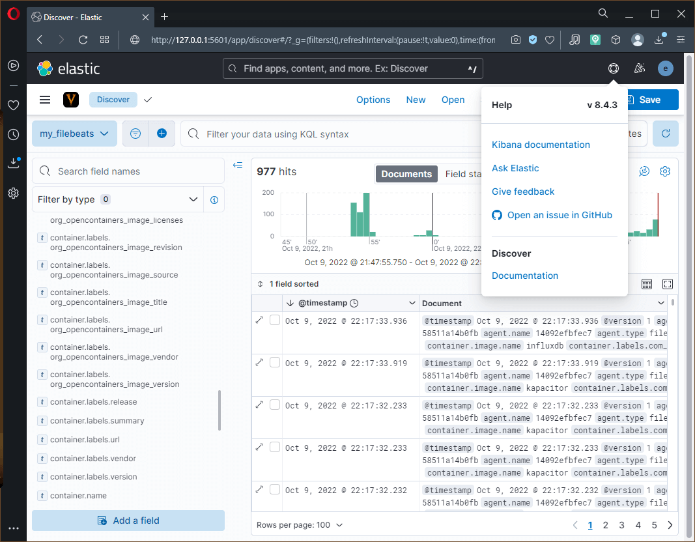
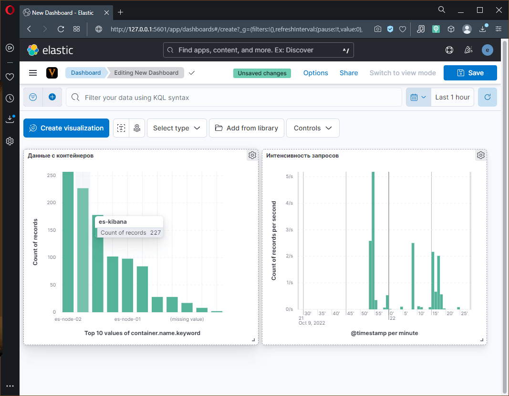
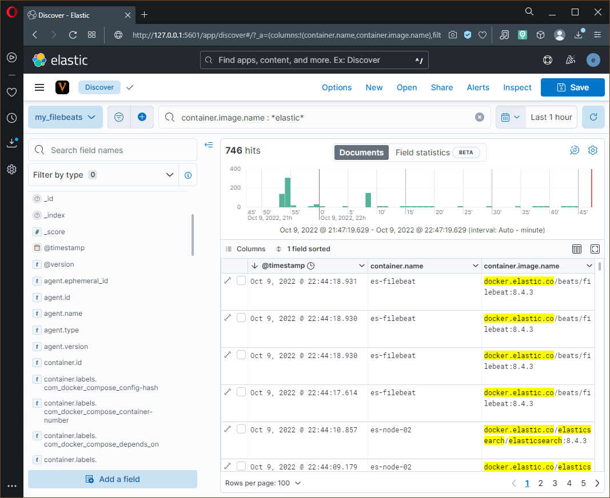
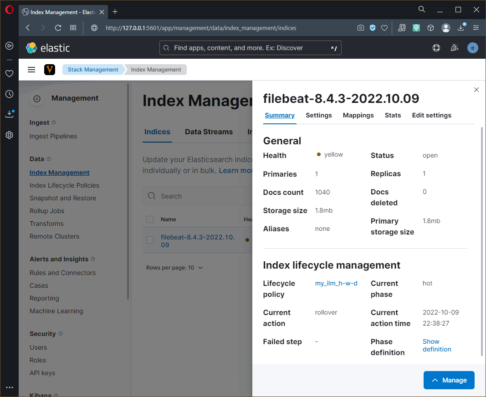
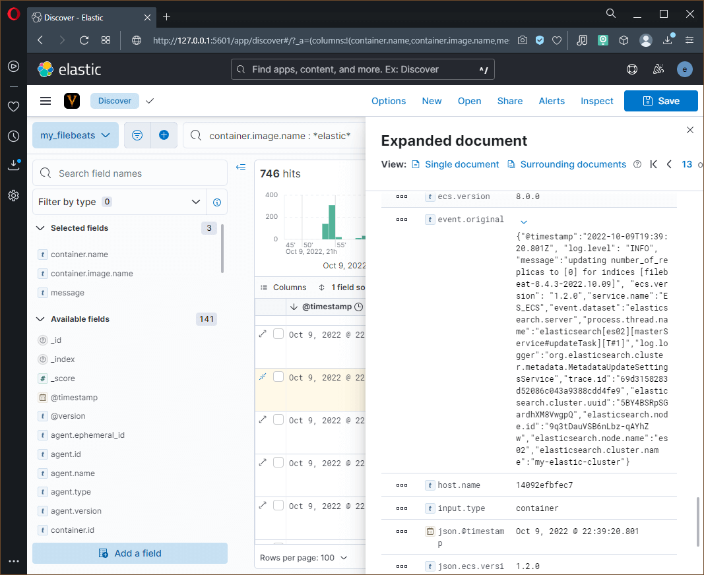
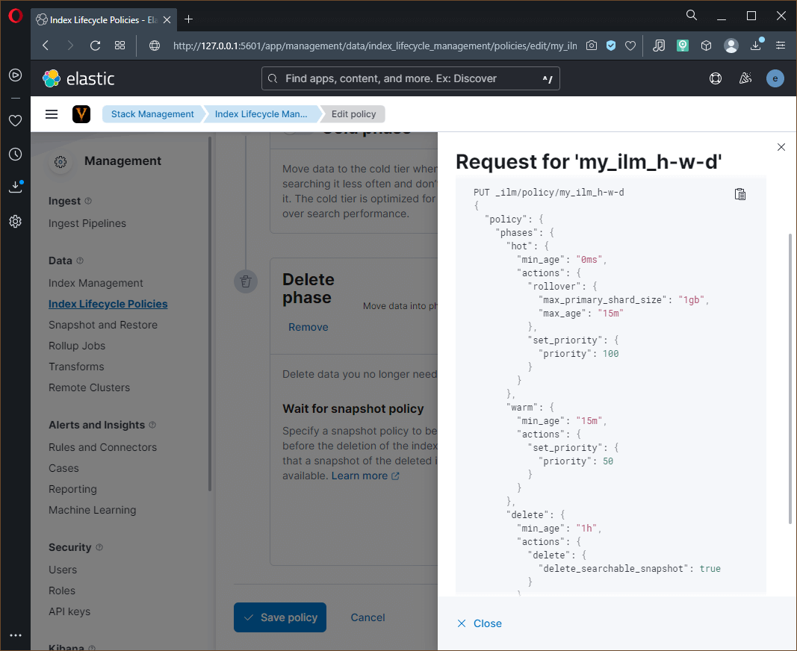

# Домашнее задание по лекции "10.4. ELK"

## Дополнительные ссылки

При выполнении задания пользуйтесь вспомогательными ресурсами:

- [поднимаем elk в докер](https://www.elastic.co/guide/en/elasticsearch/reference/current/docker.html)
- [поднимаем elk в докер с filebeat и докер логами](https://www.sarulabs.com/post/5/2019-08-12/sending-docker-logs-to-elasticsearch-and-kibana-with-filebeat.html)
- [конфигурируем logstash](https://www.elastic.co/guide/en/logstash/current/configuration.html)
- [плагины filter для logstash](https://www.elastic.co/guide/en/logstash/current/filter-plugins.html)
- [конфигурируем filebeat](https://www.elastic.co/guide/en/beats/libbeat/5.3/config-file-format.html)
- [привязываем индексы из elastic в kibana](https://www.elastic.co/guide/en/kibana/current/index-patterns.html)
- [как просматривать логи в kibana](https://www.elastic.co/guide/en/kibana/current/discover.html)
- [решение ошибки increase vm.max_map_count elasticsearch](https://stackoverflow.com/questions/42889241/how-to-increase-vm-max-map-count)

В процессе выполнения задания могут возникнуть также не указанные тут проблемы в зависимости от системы.

Используйте output stdout filebeat/kibana и api elasticsearch для изучения корня проблемы и ее устранения.

---

## Задание повышенной сложности

> Не используйте директорию [help](./help) при выполнении домашнего задания.

При решении применялось:
  - **Docker** образы от **Elastic**: [docker.elastic.co](https://www.docker.elastic.co/)
  - Документация **Logstash**: [Setting Up and Running Logstash](https://www.elastic.co/guide/en/logstash/current/setup-logstash.html)
  - Документация **Logstash**: [Parsing Logs with Logstash](https://www.elastic.co/guide/en/logstash/current/advanced-pipeline.html)
  - Настройка файла манифеста [Docker Compose](https://docs.docker.com/compose/compose-file/)
  - Спецификация [Elastic Common Schema (ECS)](https://www.elastic.co/guide/en/ecs/8.4/ecs-reference.html) для версии **8.4**
  - Настройка нод в [Elasticsearch Multi-Tier Architecture](https://opster.com/guides/elasticsearch/capacity-planning/elasticsearch-hot-warm-cold-frozen-architecture/)
  - Настройка политики [Index Lifecycle Management](https://www.elastic.co/blog/implementing-hot-warm-cold-in-elasticsearch-with-index-lifecycle-management)

При решении задачи используется **rootless** режим работы **Docker**, поэтому:
  - Вместо стандартного **Docket socket** файла (`/var/run/docker.sock`) пробрасывается пользовательский: `/var/run/user/1000/docker.sock`
  - Вместо стандартного каталога файлов **Docker** (`/var/lib/docker`) пробрасывается пользовательский: `~/.local/share/docker`
  - На вынесенные каталоги данных **Kibana** и нод **ElasticSearch** устанавливаются полные права (`rwx`) для группы

Для удобства, создание каталогов, назначение прав, разворачивание, сброс и удаления стека, а также другие вспомогательные функций реализованы в **bash** скрипте [go.sh](#исходный-код-вспомогательного-скрипта-gosh).
Список доступных для выполнения задач выводится запуском скрипта без параметров.

---

## Задача 1

> Вам необходимо поднять в докере:
> - elasticsearch(hot и warm ноды)
> - logstash
> - kibana
> - filebeat
> 
> и связать их между собой.
> 
> Logstash следует сконфигурировать для приёма по tcp json сообщений.
> 
> Filebeat следует сконфигурировать для отправки логов docker вашей системы в logstash.
> 
> В директории [help](./help) находится манифест docker-compose и конфигурации filebeat/logstash для быстрого выполнения данного задания.
>
> Результатом выполнения данного задания должны быть:
> - скриншот `docker ps` через 5 минут после старта всех контейнеров (их должно быть 5)
> - скриншот интерфейса kibana
> - docker-compose манифест (если вы не использовали директорию help)
> - ваши yml конфигурации для стека (если вы не использовали директорию help)

### Установка и настройка **Kibana** и нод **Elasticsearch**

Выпоняется по руководствам **Install** [Elasticsearch](https://www.elastic.co/guide/en/elasticsearch/reference/current/docker.html)
и [Kibana](https://www.elastic.co/guide/en/kibana/8.4/docker.html) **with Docker**

Использовался пример с **multi-node cluster with Docker Compose**, за следующими исключениями:
  - Для контейнеров добавлены имена: параметры `container_name` для работы вспомогательного скрипта `go.sh`
  - Из конфигурации убрана третья нода и генерация сертификата для неё
  - Для нод **Elasticsearch** убран блок `ulimits -> memlock`, так как его нельзя применить в **rootless** режиме **Docker**, соотвественно значение параметра `bootstrap.memory_lock` изменено на `false`
  - Изменены настройки **volumes** с `local` (системный или пользовательский кэш **Docker**) на текущую директорию

### Установка и настройка **Logstash**

В ходе исследования контейнера **Logstash** версии **8.4** видно, что программа установлена по пути `/usr/share/logstash`, причём на неё создан линк `/opt/logstash`.

Конфигурационный файл по умолчанию (`logstash.yml`) содержит настройку приёма сообщений со всех IP адресов (`http.port: "0.0.0.0"`), то есть отдельно создавать и пробрасывать данный файл не требуется. Однако это можно сделать на будущее, если разработчик решит изменить параметры по умолчанию.

Начальные настройки **Pipeline** задаются в файле `pipelines.yml`.
Это видно при запуске теста конфигурационного файла командой `logstash -f my-pipeline.conf --config.test_and_exit`, в выводе которой есть сообщение: *Ignoring the 'pipelines.yml' file because modules or command line options are specified*.
В имеющемся файле `pipelines.yml` создан один **Pipeline** с именем `main`, конфигурационный файл которого должен располагаться по пути `/usr/share/logstash/pipeline`.
Туда и будет проброшен мой файл настройки **pipeline** `logstash.conf`.

Ознакомившись с руководствами:
  - Страница документации [о создании pipeline](https://www.elastic.co/guide/en/logstash/current/configuration.html)
  - Страница документации по **input plugin** [TCP](https://www.elastic.co/guide/en/logstash/current/plugins-inputs-tcp.html)
  - Страница документации по **codec** [json](https://www.elastic.co/guide/en/logstash/8.4/codec-plugins.html)
  - Страница документации по **input plugin** [Beats](https://www.elastic.co/guide/en/logstash/current/plugins-inputs-beats.html)

Составлен файл настроек **pipeline** [logstash.conf](logstash.conf):

```conf
input {
  beats {
    port => 5044
  }
}

output {
  elasticsearch {
    hosts => [ "https://es01:9200" ]
    user => "elastic"
    password => "long_word_for_access_to_elastic"
    # ssl_certificate_verification => false
    cacert => '/usr/share/logstash/config/certs/ca/ca.crt'
    # index for Beats input plugin
    index => "%{[@metadata][beat]}-%{[@metadata][version]}-%{+YYYY.MM.dd}"
    ilm_enabled => true
  }
}
```

Где вместо приёма чистых **JSON** сообщений по **TCP** используется **Beats framework** потому что:
  - Для **FileBeat** является "родной" технологией обмена сообщениями, как и для всех остальных **Beat plugins** и поддерживается **Logstash**
  - **FileBeat** по умолчанию сжимает траффик (степень сжатия от **0 до 9**, базовая **3**), что не позволяет без преобразований считать результат плагинами, не поддерживающими распаковку
  - Даже с отключенным сжатием **input plugin json** не может декодировать данные от **FileBeat**, так как вывод "замусорен" дополнительными символами

В **ElasticSearch** начиная с версии **8** по умолчанию обмен данными ведётся по защищённому каналу связи,
для обеспечения которого в **compose** манифесте создаётся отдельный контейнер **setup** в функции
которого входит генерирование сертификатов для нод **ElasticSearch**, которые сохраняются на хосте в каталоге `certs`.
Подключение **Kibana** и **Logstash** осуществляется с использованием сертификатов.

Планировалось реализовать защищённый канал связи в **Logstash** по аналогии с **Kibana** (взято из документации **Elastic**).
Однако, запуск **Logstash** по умолчанию выполняется от одноимённого пользователя, а проброшенные сертификаты ему не доступны, так как пользователь *logstash* не является их владельцем и не входит в нужную группу.

Эту проблему можно решить как минимум тремя способами:
  - Отменой проверки сертификата сервера **ElasticSearch**, добавив в блок `output` строчку `ssl_certificate_verification => false`
  - Запуском контейнера от пользователя `root`
  - Внедрением в контейнер сертификата с нужными правами `logstash:root`

Все три способа имеют недостатки:
  - Отмена проверки сертификата понижает безопасность
  - Запуск **Logstash** с правами суперпользователя считается небезопасным и более того, в следующей **major** версии **Logstash** будет запрещён
  - Пересборка образа с использованием **Dockerfile** неудобна. При этом изменение прав может быть выполнено только при запуске контейнера от `root`, а запуск **Logstash** должен быть от другого пользователя, поэтому придётся менять базовую точку входа контейнера (**entrypoint**). В будущем она также может быть изменена и что-нибудь сломается.

Для решения задачи был выбран вариант изменения базовой точки доступа контейнера, в которой:
  - Из проброшенного с хоста каталога сертификатов копируются используемые в отдельный каталог
  - Назначаются нужные права на созданную копию
  - Выполняется подготовка окружения, аналогично базовой точки входа
  - Осуществляется запуск **Logstash** от пользователя `logstash`

### Установка и настройка **Filebeat**

Шаблон конфигурации контейнера **Docker** и настройки **Filebeat** для отправки логов **Docker** взят из статьи [Sending Docker Logs to ElasticSearch and Kibana with FileBeat](https://www.sarulabs.com/post/5/2019-08-12/sending-docker-logs-to-elasticsearch-and-kibana-with-filebeat.html)
за исключением плагинов **output**, где **elasticsearch** заменён на **logstash**.

Также изменены настройки проброса **socket** файла и стандартного каталога **Docker**, так как используется **rootless** режим работы **Docker**

Итоговый конфигурационный файл [filebeat.yml](filebeat.yml)

```yaml
---
filebeat.inputs:
- type: container
  paths:
    - '/var/lib/docker/containers/*/*.log'

processors:
- add_docker_metadata:
    host: "unix:///var/run/docker.sock"

- decode_json_fields:
    fields: ["message"]
    target: "json"
    overwrite_keys: true

output.logstash:
  hosts: ["logstash:5044"]
  compression_level: 6

logging.json: true
logging.metrics.enabled: false
...

```

### Результат

Исходный код **Docker** манифеста готового стэка **ELK** [docker-compose.yml](docker-compose.yml):

```yaml
---
version: "3.0"

services:
  setup:
    image: "docker.elastic.co/elasticsearch/elasticsearch:${STACK_VERSION}"
    container_name: "es-setup"
    volumes:
      - ./certs:/usr/share/elasticsearch/config/certs
    user: "0"
    command: >
      bash -c '
        if [ x${ELASTIC_PASSWORD} == x ]; then
          echo "Set the ELASTIC_PASSWORD environment variable in the .env file";
          exit 1;
        elif [ x${KIBANA_PASSWORD} == x ]; then
          echo "Set the KIBANA_PASSWORD environment variable in the .env file";
          exit 1;
        fi;
        if [ ! -f config/certs/ca.zip ]; then
          echo "Creating CA";
          bin/elasticsearch-certutil ca --silent --pem -out config/certs/ca.zip;
          unzip config/certs/ca.zip -d config/certs;
        fi;
        if [ ! -f config/certs/certs.zip ]; then
          echo "Creating certs";
          echo -ne \
          "instances:\n"\
          "  - name: es01\n"\
          "    dns:\n"\
          "      - es01\n"\
          "      - localhost\n"\
          "    ip:\n"\
          "      - 127.0.0.1\n"\
          "  - name: es02\n"\
          "    dns:\n"\
          "      - es02\n"\
          "      - localhost\n"\
          "    ip:\n"\
          "      - 127.0.0.1\n"\
          > config/certs/instances.yml;
          bin/elasticsearch-certutil cert --silent --pem -out config/certs/certs.zip --in config/certs/instances.yml --ca-cert config/certs/ca/ca.crt --ca-key config/certs/ca/ca.key;
          unzip config/certs/certs.zip -d config/certs;
        fi;
        echo "Setting file permissions"
        chown -R root:root config/certs;
        find . -type d -exec chmod 750 \{\} \;;
        find . -type f -exec chmod 640 \{\} \;;
        echo "Waiting for Elasticsearch availability";
        until curl -s --cacert config/certs/ca/ca.crt https://es01:9200 | grep -q "missing authentication credentials"; do sleep 30; done;
        echo "Setting kibana_system password";
        until curl -s -X POST --cacert config/certs/ca/ca.crt -u "elastic:${ELASTIC_PASSWORD}" -H "Content-Type: application/json" https://es01:9200/_security/user/kibana_system/_password -d "{\"password\":\"${KIBANA_PASSWORD}\"}" | grep -q "^{}"; do sleep 10; done;
        echo "All done!";
      '
    healthcheck:
      test: ["CMD-SHELL", "[ -f config/certs/es01/es01.crt ]"]
      interval: 1s
      timeout: 5s
      retries: 120

  es01:
    depends_on:
      setup:
        condition: service_healthy
    image: "docker.elastic.co/elasticsearch/elasticsearch:${STACK_VERSION}"
    container_name: "es-node-01"
    volumes:
      - ./certs:/usr/share/elasticsearch/config/certs
      - ./esdata01:/usr/share/elasticsearch/data
    ports:
      - ${ES_PORT}:9200
    environment:
      - node.name=es01
      - node.roles=master,data_content,data_hot
      - cluster.name=${CLUSTER_NAME}
      - cluster.initial_master_nodes=es01,es02
      - discovery.seed_hosts=es02
      - bootstrap.memory_lock=false
      - ELASTIC_PASSWORD=${ELASTIC_PASSWORD}
      - xpack.security.enabled=true
      - xpack.security.http.ssl.enabled=true
      - xpack.security.http.ssl.key=certs/es01/es01.key
      - xpack.security.http.ssl.certificate=certs/es01/es01.crt
      - xpack.security.http.ssl.certificate_authorities=certs/ca/ca.crt
      - xpack.security.http.ssl.verification_mode=certificate
      - xpack.security.transport.ssl.enabled=true
      - xpack.security.transport.ssl.key=certs/es01/es01.key
      - xpack.security.transport.ssl.certificate=certs/es01/es01.crt
      - xpack.security.transport.ssl.certificate_authorities=certs/ca/ca.crt
      - xpack.security.transport.ssl.verification_mode=certificate
      - xpack.license.self_generated.type=${LICENSE}
    mem_limit: ${MEM_LIMIT}
    healthcheck:
      test:
        [
          "CMD-SHELL",
          "curl -s --cacert config/certs/ca/ca.crt https://localhost:9200 | grep -q 'missing authentication credentials'",
        ]
      interval: 10s
      timeout: 10s
      retries: 120

  es02:
    depends_on:
      - es01
    image: "docker.elastic.co/elasticsearch/elasticsearch:${STACK_VERSION}"
    container_name: "es-node-02"
    volumes:
      - ./certs:/usr/share/elasticsearch/config/certs
      - ./esdata02:/usr/share/elasticsearch/data
    environment:
      - node.name=es02
      - node.roles=master,data_warm
      - cluster.name=${CLUSTER_NAME}
      - cluster.initial_master_nodes=es01,es02
      - discovery.seed_hosts=es01
      - bootstrap.memory_lock=false
      - ELASTIC_PASSWORD=${ELASTIC_PASSWORD}
      - xpack.security.enabled=true
      - xpack.security.http.ssl.enabled=true
      - xpack.security.http.ssl.key=certs/es02/es02.key
      - xpack.security.http.ssl.certificate=certs/es02/es02.crt
      - xpack.security.http.ssl.certificate_authorities=certs/ca/ca.crt
      - xpack.security.http.ssl.verification_mode=certificate
      - xpack.security.transport.ssl.enabled=true
      - xpack.security.transport.ssl.key=certs/es02/es02.key
      - xpack.security.transport.ssl.certificate=certs/es02/es02.crt
      - xpack.security.transport.ssl.certificate_authorities=certs/ca/ca.crt
      - xpack.security.transport.ssl.verification_mode=certificate
      - xpack.license.self_generated.type=${LICENSE}
    mem_limit: ${MEM_LIMIT}
    healthcheck:
      test:
        [
          "CMD-SHELL",
          "curl -s --cacert config/certs/ca/ca.crt https://localhost:9200 | grep -q 'missing authentication credentials'",
        ]
      interval: 10s
      timeout: 10s
      retries: 120

  kibana:
    depends_on:
      es01:
        condition: service_healthy
      es02:
        condition: service_healthy
    image: "docker.elastic.co/kibana/kibana:${STACK_VERSION}"
    container_name: "es-kibana"
    volumes:
      - ./certs:/usr/share/kibana/config/certs
      - ./kibanadata:/usr/share/kibana/data
    ports:
      - ${KIBANA_PORT}:5601
    environment:
      - SERVERNAME=kibana
      - ELASTICSEARCH_URL="https://es01:9200"
      - ELASTICSEARCH_HOSTS=["https://es01:9200","https://es02:9200"]
      - ELASTICSEARCH_USERNAME=kibana_system
      - ELASTICSEARCH_PASSWORD=${KIBANA_PASSWORD}
      - ELASTICSEARCH_SSL_CERTIFICATEAUTHORITIES=config/certs/ca/ca.crt
    mem_limit: ${MEM_LIMIT}
    healthcheck:
      test:
        [
          "CMD-SHELL",
          "curl -s -I http://localhost:5601 | grep -q 'HTTP/1.1 302 Found'",
        ]
      interval: 10s
      timeout: 10s
      retries: 120

  logstash:
    depends_on:
      kibana:
        condition: service_healthy
    image: "docker.elastic.co/logstash/logstash-oss:${STACK_VERSION}"
    container_name: "es-logstash"
    volumes:
      - ./config/logstash.conf:/usr/share/logstash/pipeline/logstash.conf
      - ./certs:/usr/share/certs
    expose:
      - 5044
    user: root
    command: >
      bash -c '
        if [ ! -d /usr/share/logstash/config/certs/ca ]; then
          mkdir -p /usr/share/logstash/config/certs
          cp -r /usr/share/certs/ca/ /usr/share/logstash/config/certs
          chown -R logstash:root /usr/share/logstash/config/certs
          echo "Certs is OK"
        fi
        env2yaml /usr/share/logstash/config/logstash.yml
        export LS_JAVA_OPTS="-Dls.cgroup.cpuacct.path.override=/ -Dls.cgroup.cpu.path.override=/ $$LS_JAVA_OPTS"
        su logstash /usr/share/logstash/bin/logstash
      '

  filebeat:
    depends_on:
      - logstash
    image: "docker.elastic.co/beats/filebeat:${STACK_VERSION}"
    container_name: "es-filebeat"
    user: root
    volumes:
      - ./config/filebeat.yml:/usr/share/filebeat/filebeat.yml:ro
      - ~/.local/share/docker:/var/lib/docker:ro
      - /var/run/user/1000/docker.sock:/var/run/docker.sock
...
```

Функционирование контейнеров спустя некоторое время (да, я долго "ковырялся" :smile: в **Kibana**)

```console
sa@ubuntu22:~/10.4$ docker ps
CONTAINER ID   IMAGE                                                 COMMAND                  CREATED       STATUS                 PORTS                                                 NAMES
14092efbfec7   docker.elastic.co/beats/filebeat:8.4.3                "/usr/bin/tini -- /u…"   3 hours ago   Up 3 hours                                                                   es-filebeat
1e1c044d327c   docker.elastic.co/logstash/logstash-oss:8.4.3         "/usr/local/bin/dock…"   3 hours ago   Up 3 hours             5044/tcp, 9600/tcp                                    es-logstash
b05e2f0832ed   docker.elastic.co/kibana/kibana:8.4.3                 "/bin/tini -- /usr/l…"   3 hours ago   Up 3 hours (healthy)   0.0.0.0:5601->5601/tcp, :::5601->5601/tcp             es-kibana
f8f71c0b33c2   docker.elastic.co/elasticsearch/elasticsearch:8.4.3   "/bin/tini -- /usr/l…"   3 hours ago   Up 3 hours (healthy)   9200/tcp, 9300/tcp                                    es-node-02
6d6482b2acaf   docker.elastic.co/elasticsearch/elasticsearch:8.4.3   "/bin/tini -- /usr/l…"   3 hours ago   Up 3 hours (healthy)   0.0.0.0:9200->9200/tcp, :::9200->9200/tcp, 9300/tcp   es-node-01
sa@ubuntu22:~/10.4$
```

Страница **Kibana**: **Discovery Data View** на индексе `filebeat-*`


Созданный **Dashboard** с двумя графиками распределения сообщений по контейнерам (слева) и по времени (справа)


> Для генерирования большего числа событий создавался и уничтожался **TICK** стэк из [ДЗ 10.2](https://github.com/ArtemShtepa/devops-netology/blob/main/homework/10.2)

---

## Задача 2

> Перейдите в меню [создания index-patterns в kibana](http://localhost:5601/app/management/kibana/indexPatterns/create) и создайте несколько index-patterns из имеющихся.
> 
> Перейдите в меню просмотра логов в kibana (Discover) и самостоятельно изучите как отображаются логи и как производить поиск по логам.
> 
> В манифесте директории help также приведенно dummy приложение, которое генерирует рандомные события в stdout контейнера.
> Данные логи должны порождать индекс logstash-* в elasticsearch. Если данного индекса нет - воспользуйтесь советами и источниками из раздела "Дополнительные ссылки" данного ДЗ.

Поиск событий по фразе `elastic` - отсев информации по контейнерам [ДЗ 10.2](https://github.com/ArtemShtepa/devops-netology/blob/main/homework/10.2)


Информация по индексу - статус `yellow` потому что не выполняется условие реплицирования шард (негде создать одну реплику)


Расширенный вид события - выбрано сообщение об изменении настройки индекса, а именно число реплик уменьшено до 0


Информация по индексу после изменения настроек репликации - статус `green`


Настройка политики **Index Lifecycle Management**


---

## Дополнительные ссылки

При выполнении задания пользуйтесь вспомогательными ресурсами:

- [поднимаем elk в докер](https://www.elastic.co/guide/en/elasticsearch/reference/current/docker.html)
- Статья [Sending Docker Logs to ElasticSearch and Kibana with FileBeat](https://www.sarulabs.com/post/5/2019-08-12/sending-docker-logs-to-elasticsearch-and-kibana-with-filebeat.html)
- [конфигурируем logstash](https://www.elastic.co/guide/en/logstash/current/configuration.html)
- [плагины filter для logstash](https://www.elastic.co/guide/en/logstash/current/filter-plugins.html)
- [конфигурируем filebeat](https://www.elastic.co/guide/en/beats/libbeat/5.3/config-file-format.html)
- [привязываем индексы из elastic в kibana](https://www.elastic.co/guide/en/kibana/current/index-patterns.html)
- [как просматривать логи в kibana](https://www.elastic.co/guide/en/kibana/current/discover.html)
- [решение ошибки increase vm.max_map_count elasticsearch](https://stackoverflow.com/questions/42889241/how-to-increase-vm-max-map-count)

В процессе выполнения задания могут возникнуть также не указанные тут проблемы в зависимости от системы.

Используйте output stdout filebeat/kibana и api elasticsearch для изучения корня проблемы и ее устранения.

---

## Альтернативы

Вместо **Elastic**:
  - [OpenSearch](https://opensearch.org/)

Вместо **Logstash**:
  - [Grafana Loki](https://grafana.com/oss/loki/)
  - [Fluentbit](https://fluentbit.io/) FluentB/FluentD
  - [Promtail](https://grafana.com/docs/loki/latest/clients/promtail/)
  - [Vector](https://vector.dev/)
  - [file.d](https://github.com/ozontech/file.d)

Вместо **Kibana**:
  - [Grafana](https://grafana.com/)

Переход от **Elastic** до **Loki**: [видео](https://www.youtube.com/watch?v=vkdNY8QaCug)

---

### Исходный код вспомогательного скрипта [go.sh](go.sh)

```bash
#!/usr/bin/env bash

# Password for the 'elastic' user (at least 6 characters)
export ELASTIC_PASSWORD="long_word_for_access_to_elastic"
# Password for the 'kibana_system' user (at least 6 characters) - not used for access to GUI
export KIBANA_PASSWORD="long_word_for_access_to_kibana"
# Version of Elastic products
export STACK_VERSION=8.4.3
# Set the cluster name
export CLUSTER_NAME=my-elastic-cluster
# Set to 'basic' or 'trial' to automatically start the 30-day trial
export LICENSE=basic
# Port to expose Elasticsearch HTTP API to the host
export ES_PORT=9200
# Port to expose Kibana to the host
export KIBANA_PORT=5601
# Increase or decrease based on the available host memory (in bytes)
export MEM_LIMIT=1073741824
# Default value for ElasticSearch requirements - used by scripts to set system value
vm_max_map_count=262144

init_dir() {
    if [ ! -d "./$1" ]; then
        mkdir ./$1
    fi
    if [ $(stat -c '%a' ./$1 | cut -c2) -lt 7 ]; then
        chmod g+rwx $1
    fi
}

init() {
    chmod go-w ./config/filebeat.yml
    init_dir kibanadata
    init_dir esdata01
    init_dir esdata02
    cur_mmc=$(cat /proc/sys/vm/max_map_count)
    if [ $cur_mmc -lt $vm_max_map_count ]; then
        echo "In order to run ElasticSearch nodes 'vm.max_max_count' must be greater $vm_max_map_count"
        read -p "Enter you decision: [T]emporary, [P]ersistent or other to quit ? " decision
        case $decision in
            t | T)
                ;;
            p | P)
                echo vm.max_map_count=$vm_max_map_count | sudo tee -a /etc/sysctl.conf
                ;;
            *)
                echo "Abort operation and quit"
                return 2
                ;;
        esac
        echo "Change value $cur_mmc to $vm_max_map_count"
        echo $vm_max_map_count | sudo tee /proc/sys/vm/max_map_count
    fi
}

clear_dir() {
    if [ -d "./$1" ]; then
        rm -Rf $1
    fi
}

clear() {
    down
    clear_dir certs
    clear_dir esdata01
    clear_dir esdata02
    clear_dir kibanadata
}

up() {
    init
    if [ $? != 2 ]; then
        docker compose up -d
    fi
}

down() {
    if [[ -n $( docker ps -q -f name="es") ]]; then
        docker compose down
    fi
}

e() {
    if [ $1 ]; then
        docker exec -ti -u root es-$1 bash
    else
        list_containers
    fi
}

l() {
    if [ $1 ]; then
        docker logs es-$1 -f
    else
        list_containers
    fi
}

list_containers() {
    echo "Set container name from list: node-01 | node-02 | kibana | logstash | filebeat"
}

pull() {
    docker compose pull
}

if [ $1 ]; then
    $1 $2
else
    echo "Possible commands:"
    echo "  init - Init directory structure"
    echo "  pull - Load/Update docker images"
    echo "  up - Up containers"
    echo "  e <cnt> - Enter to container <cnt> as root user"
    echo "  l <cnt> - Print logs of container <cnt>"
    echo "  down - Down and remove containers"
    echo "  clear - Clear nodes and data"
fi
```
