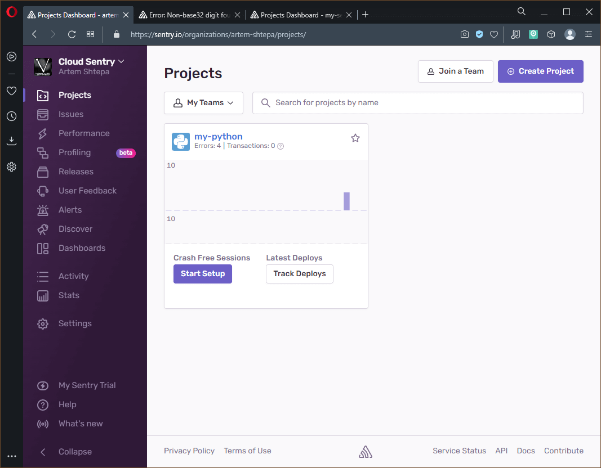
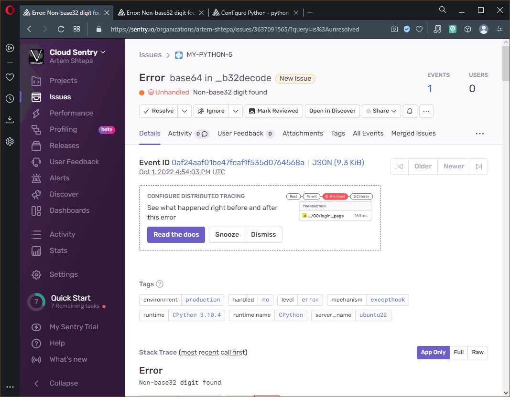
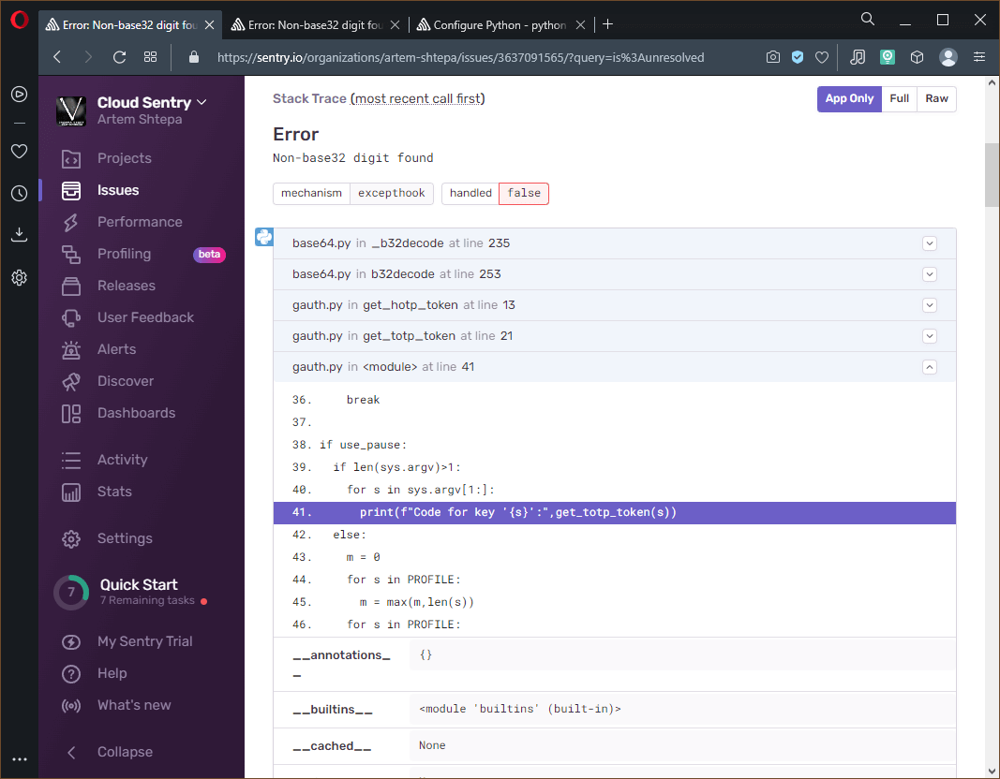
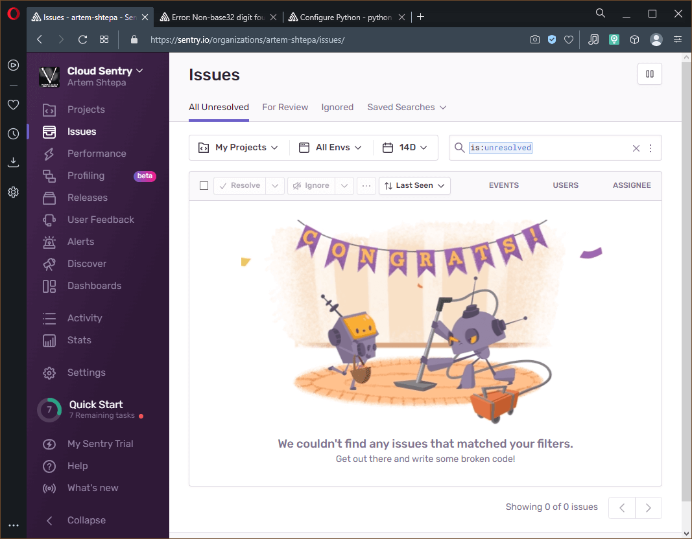
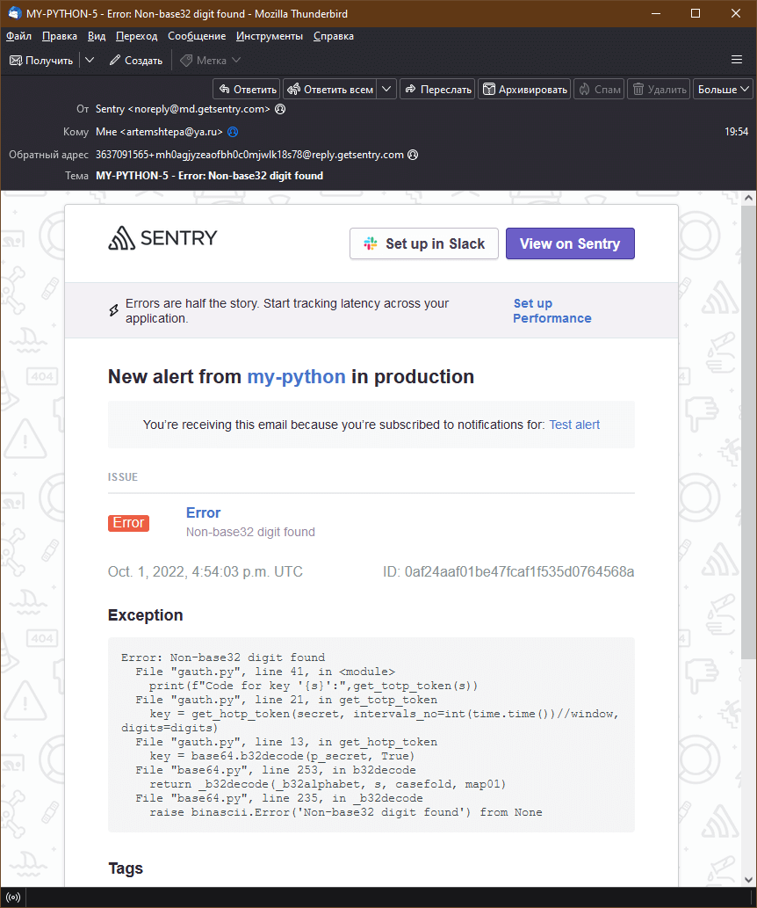
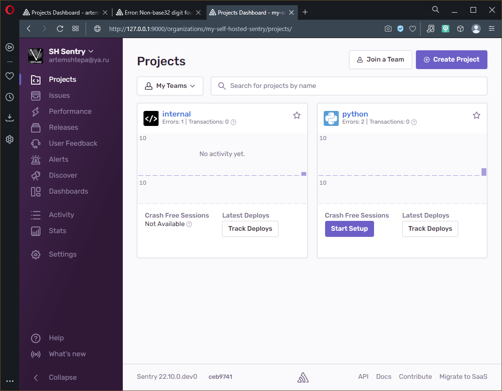
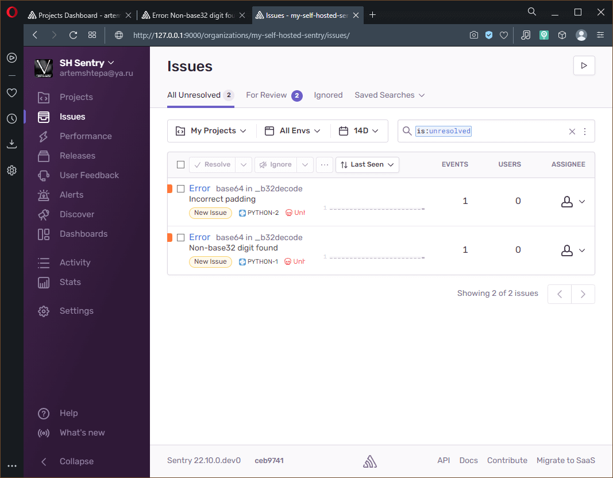

# Домашнее задание по лекции "10.5. Система перехватчик-ошибок Sentry"

## Обязательная задача 1

> Так как self-hosted Sentry довольно требовательная к ресурсам система, мы будем использовать Free cloud аккаунт.
> 
> Free cloud account имеет следующие ограничения:
> - 5 000 errors
> - 10 000 transactions
> - 1 GB attachments
> 
> Для подключения Free cloud account:
> - зайдите на [sentry.io](https://sentry.io)
> - нажжмите "Try for free"
> - используйте авторизацию через ваш github-account
> - далее следуйте инструкциям
>
> Для выполнения задания - пришлите скриншот меню Projects.

Окно проектов **Cloud Sentry**:



---

## Обязательная задача 2

> Создайте python проект и нажмите `Generate sample event` для генерации тестового события.
> 
> Изучите информацию, представленную в событии.
> 
> Перейдите в список событий проекта, выберите созданное вами и нажмите `Resolved`.
> 
> Для выполнения задание предоставьте скриншот `Stack trace` из этого события и список событий проекта, после нажатия `Resolved`.

## Дополнительное задание повышенной сложности

> Создайте проект на ЯП python или GO (небольшой, буквально 10-20 строк), подключите к нему sentry SDK и отправьте несколько тестовых событий.
> Поэкспериментируйте с различными передаваемыми параметрами, но помните об ограничениях free учетной записи cloud Sentry.
> 
> Для выполнения задания пришлите скриншот меню issues вашего проекта и 
> пример кода подключения sentry sdk/отсылки событий.

Для выполнения задания было решено использовать проект **Python** на утилите генерирования временного кода **Google Authenticator** (`gauth.py`)

```python
#!/usr/bin/env python3
import hmac, base64, struct, hashlib, time, sys

def get_hotp_token(secret, intervals_no, digits=6):
    p_secret = secret + '='*(len(secret) % 8)
    key = base64.b32decode(p_secret, True)
    msg = struct.pack(">Q", intervals_no)
    h = hmac.new(key, msg, hashlib.sha1).hexdigest()
    offset = int(h[-1], 16)
    binary = int(h[(offset * 2):((offset * 2) + 8)], 16) & 0x7fffffff
    return str(binary)[-digits:]

def get_totp_token(secret, digits=6, window=30):
    key = get_hotp_token(secret, intervals_no=int(time.time())//window, digits=digits)
    return "0"*(digits-len(key))+key

PROFILE = {
            "pf_80": "P53A6WQLAMT44ODU",
            "pf_160": "XP2BO6XE4HB6DPSLAFRBHGRA3DDRXUCL",
            "pf_256": "A4B7FDWUXCNQEPVOX2IBNLBM3Y6DN7WQ5RRJFNLATRCVGSQ7MMVQ"
          }

use_pause = True
for s in sys.argv:
  if s in PROFILE.keys():
    code = get_totp_token(PROFILE[s])
    print(f"Code for '{s}': {code}")
    use_pause = False
    break

if use_pause:
  if len(sys.argv)>1:
    for s in sys.argv[1:]:
      print(f"Code for key '{s}':",get_totp_token(s))
  else:
    m = 0
    for s in PROFILE:
      m = max(m,len(s))
    for s in PROFILE:
      print(s.ljust(m),":",get_totp_token(PROFILE[s]))
    input("Press enter to exit...")
```

> Основана на [onetimepass](https://github.com/tadeck/onetimepass) от **tadeck**

Для генерирования секретных ключей идентификаторов разной битности написана специальная утилита (`gauth-keygen.py`):

```python
#!/usr/bin/env python3
import sys, random, base64

KEY_BITS = 80 #160 # 256

if len(sys.argv) > 1:
  if sys.argv[1].isnumeric():
    KEY_BITS = int(sys.argv[1])

print(f"For key generation used {KEY_BITS} bits:")
kb = bytearray()
for i in range(0, int(KEY_BITS / 8)):
  kb.append(random.randint(0,255))
print(base64.b32encode(kb).decode())
```

Код подключения `Sentry SDK` можно посмотреть в интерфейсе:
  - В боковом меню выбрать `Projects`
  - Выбрать проект (в моём влучае `Python`)
  - Нажать на иконку щестерёнки в правом верхнем углу (настройки проекта)
  - Пункт `Instrumentation` в группе **SDK SETUP**

Конкретно для **Python** нужно добавить блок, подобный следующему (взят из **Self-Hosted** версии):

```python
import sentry_sdk
sentry_sdk.init(
    dsn="http://91f2bc34bc8344b1aef30b7019127ece@127.0.0.1:9000/4503909662457856",

    # Set traces_sample_rate to 1.0 to capture 100%
    # of transactions for performance monitoring.
    # We recommend adjusting this value in production.
    traces_sample_rate=1.0
)
```

Запуск скрипта с ошибкой (явно не валидный секретный код идентификатора):

```console
sa@ubuntu22:~/10.5$ ./gauth.py TEST_ERROR_EVENT
Traceback (most recent call last):
  File "/home/sa/10.5/./gauth.py", line 41, in <module>
    print(f"Code for key '{s}':",get_totp_token(s))
  File "/home/sa/10.5/./gauth.py", line 21, in get_totp_token
    key = get_hotp_token(secret, intervals_no=int(time.time())//window, digits=digits)
  File "/home/sa/10.5/./gauth.py", line 13, in get_hotp_token
    key = base64.b32decode(p_secret, True)
  File "/usr/lib/python3.10/base64.py", line 253, in b32decode
    return _b32decode(_b32alphabet, s, casefold, map01)
  File "/usr/lib/python3.10/base64.py", line 235, in _b32decode
    raise binascii.Error('Non-base32 digit found') from None
binascii.Error: Non-base32 digit found
Sentry is attempting to send 2 pending error messages
Waiting up to 2 seconds
Press Ctrl-C to quit
sa@ubuntu22:~/10.5$
```

**Stack trace** ошибки:

Основная информация об **issue**


Блоки кода по пути вызова функции, где возникла ошибка

> Каждый блок можно развернуть, чтобы увидеть дополнительную информацию и окружающий участок кода.
> Также в них перечисляются передаваемые переменные.
> Однако, по умолчанию работает функция фильтрации критических данных, таких как пароли, секретные слова/ключи и т.п.
> Данный механизм можно отключить в настройках **Sentry**.

Переменные окружения, команды запуска, версии используемого ПО и другое

> Видно что утилита запускалась с параметром `TEST_ERROR_EVENT`, который и вызвал ошибку, так как не является **base32** кодированным значением

После решения всех **issue** список будет выглядеть следующим образом:


> Список **issues** представлен ниже для Self-Hosted версии

---

## Обязательная задача 3

> Перейдите в создание правил алёртинга.
> 
> Выберите проект и создайте дефолтное правило алёртинга, без настройки полей.
> 
> Снова сгенерируйте событие `Generate sample event`.
> 
> Если всё было выполнено правильно - через некоторое время, вам на почту, привязанную к github аккаунту придёт оповещение о произошедшем событии.
> 
> Если сообщение не пришло - проверьте настройки аккаунта Sentry (например привязанную почту), что у вас не было 
> `sample issue` до того как вы его сгенерировали и то, что правило алёртинга выставлено по дефолту (во всех полях all).
> Также проверьте проект в котором вы создаёте событие, возможно алёрт привязан к другому.
> 
> Для выполнения задания - пришлите скриншот тела сообщения из оповещения на почте.
> 
> Дополнительно поэкспериментируйте с правилами алёртинга.
> Выбирайте разные условия отправки и создавайте sample events.

Настройка оповещений выполняется в меню:
  - В боковом меню выбрать `Alerts`
  - Нажать кнопку `Create Alert` в правом верхнем углу
  - Выбрать нужный вариант **Alert** и нажать кнопку `Set Conditions`
  - Настроить параметры **Alert** и сохранить правило нажав кнопку `Save Rule`

После соблюдения всех настроенных правил выполняется отправка оповещения, например на электронную почту:


---

## Установка **Self-Hosted Sentry**

Документация по установке [Self-Hosted Sentry](https://develop.sentry.dev/self-hosted/)

Страница в **GitHub** [Sentry Self-Hosted with Docker](https://github.com/getsentry/self-hosted)

Установка **Self-Hosted Sentry** осуществляется достаточно просто:
  - Нужно склонировать [репозиторий](https://github.com/getsentry/self-hosted): `git clone https://github.com/getsentry/self-hosted.git`
  - Перейти в каталог репозитория `self-hosted` и выполнить конфигурирование контейнеров командой: `./install.sh`
  - Развернуть инфраструктуру контейнеров **Docker** командой: `docker compose up -d`

Во время конфигурирования потребуется создать учётную запись (ввести адрес e-mail и пароль) под которой в дальнейшем будет осуществляться вход в **Sentry**.
Первое конфигурирование и развёртывание контейнеров выполняется достаточно долго, после чего GUI **Self-Hosted Sentry** станет доступен по порту **9000** если не менялись настройки по умолчанию.
Вид **Self-Hosted Sentry** после авторизации под созданной во время установки учётной запию немного отличается от облачной версии.



> Проект `internal` является внутренним и удалить его нельзя.
> На информационной панели внизу вместо политик указана установленная версия **Sentry**.

Работа в **Self-Hosted** редакции аналогична облачной. Например, демонстрация фиксации ошибок в проекте:

