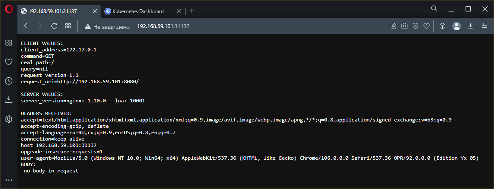
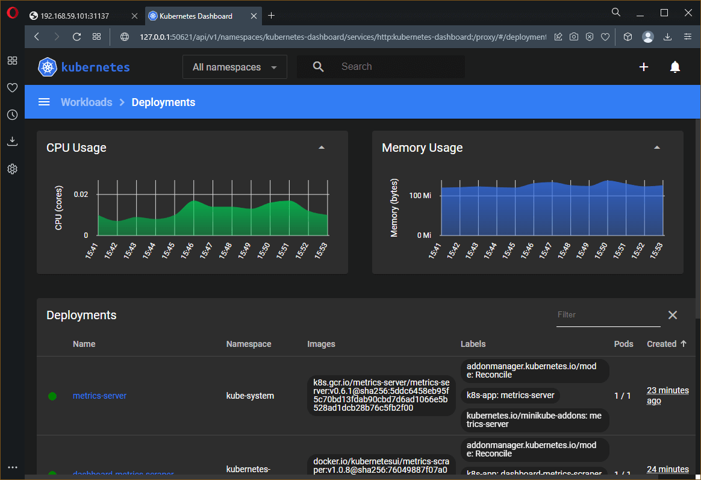

# Домашнее задание по лекции "12.1 Компоненты Kubernetes"

> Вы DevOps инженер в крупной компании с большим парком сервисов.
> Ваша задача — разворачивать эти продукты в корпоративном кластере.

---

> На "рабочей" машине для выполнения домашних заданий используются серверные варианты ОС **Linux** на виртуальных машинах **VirtualBox**,
> поэтому запуск **minikube** с драйвером соответствующего гипервизора выглядит логичным.
> Без гипервизора нужен будет **Docker**, но для его работы используются возможности встроенного в ОС **Hyper-V**,
> который конфликтует с установленным **VirtualBox**.
>
> Да... мне как начинающему **DevOps** 😀 **Windows** тоже не нравится.

## Задача 1: Установить **Minikube**

> Для экспериментов и валидации ваших решений вам нужно подготовить тестовую среду для работы с **Kubernetes**.
> Оптимальное решение - развернуть на рабочей машине **Minikube**.

Инструкция по [установке KubeCTL](https://kubernetes.io/ru/docs/tasks/tools/install-kubectl/)

Инструкция по [установке Minikube](https://kubernetes.io/ru/docs/tasks/tools/install-minikube/)

Запуск **minikube** осуществляется командой `minikube start` и может осуществляться в двух режимах:
  1. В гипервизоре и для этого он должен быть установлен: **KVM** или **VirtualBox**
  2. На хосте для чего потребуется **Docker** (`--vm-driver=none`) или **Podman** (`--vm-driver=podman`)

Если гипервизор не установлен, то драйвер по умолчанию `none`, то есть **Docker**

По сообщениям самого **Minikube**, он может работать в **rootless** режиме, в том числе и с **Docker** - для этого запуск нужно осуществлять командой `minikube start --container-runtime=containerd` или `minikube start --container-runtime=cri-o`.
Однако, для испольвозания всех возможностей рекомендуют запускать **minikube** и **docker** в **root** режиме.

Удаление кластера - `minikube delete`
> Возможно, для повторного запуска потребуется выполнить команду: sudo sysctl fs.protected_regular=0

### Решение

Запуск в **Windows** с драйвером **virtualbox**:

```console
PS E:\> kubectl version --client --output=yaml
clientVersion:
  buildDate: "2022-08-23T17:44:59Z"
  compiler: gc
  gitCommit: a866cbe2e5bbaa01cfd5e969aa3e033f3282a8a2
  gitTreeState: clean
  gitVersion: v1.25.0
  goVersion: go1.19
  major: "1"
  minor: "25"
  platform: windows/amd64
kustomizeVersion: v4.5.7

PS E:\> minikube version
minikube version: v1.28.0
commit: 986b1ebd987211ed16f8cc10aed7d2c42fc8392f
PS E:\>
```

```console
PS E:\> minikube start --vm-driver=virtualbox
😄  minikube v1.28.0 на Microsoft Windows 10 Enterprise Ltsc 2021 10.0.19044 Build 19044
✨  Используется драйвер virtualbox на основе конфига пользователя
💿  Downloading VM boot image ...
    > minikube-v1.28.0-amd64.iso....:  65 B / 65 B [---------] 100.00% ? p/s 0s
    > minikube-v1.28.0-amd64.iso:  274.45 MiB / 274.45 MiB  100.00% 421.76 KiB
👍  Запускается control plane узел minikube в кластере minikube
💾  Скачивается Kubernetes v1.25.3 ...
    > preloaded-images-k8s-v18-v1...:  385.44 MiB / 385.44 MiB  100.00% 897.44
🔥  Creating virtualbox VM (CPUs=2, Memory=6000MB, Disk=20000MB) ...
❗  This VM is having trouble accessing https://registry.k8s.io
💡  To pull new external images, you may need to configure a proxy: https://minikube.sigs.k8s.io/docs/reference/networking/proxy/
🐳  Подготавливается Kubernetes v1.25.3 на Docker 20.10.20 ...
    ▪ Generating certificates and keys ...
    ▪ Booting up control plane ...
    ▪ Configuring RBAC rules ...
    ▪ Используется образ gcr.io/k8s-minikube/storage-provisioner:v5
🔎  Компоненты Kubernetes проверяются ...
🌟  Включенные дополнения: default-storageclass, storage-provisioner
🏄  Готово! kubectl настроен для использования кластера "minikube" и "default" пространства имён по умолчанию
PS E:\>
```

---

## Задача 2: Запуск Hello World

> После установки Minikube требуется его проверить. Для этого подойдет стандартное приложение hello world. А для доступа к нему потребуется ingress.
>   - развернуть через Minikube тестовое приложение по [туториалу](https://kubernetes.io/ru/docs/tutorials/hello-minikube/#%D1%81%D0%BE%D0%B7%D0%B4%D0%B0%D0%BD%D0%B8%D0%B5-%D0%BA%D0%BB%D0%B0%D1%81%D1%82%D0%B5%D1%80%D0%B0-minikube)
>   - установить аддоны ingress и dashboard

Установка и настройка:

```console
PS E:\> kubectl create deployment hello-node --image=k8s.gcr.io/echoserver:1.4
deployment.apps/hello-node created
PS E:\> kubectl get deployments
NAME         READY   UP-TO-DATE   AVAILABLE   AGE
hello-node   1/1     1            1           102s
PS E:\> kubectl get pods
NAME                         READY   STATUS    RESTARTS   AGE
hello-node-697897c86-zw59c   1/1     Running   0          2m9s
PS E:\> kubectl get events
LAST SEEN   TYPE     REASON                    OBJECT                            MESSAGE
2m19s       Normal   Scheduled                 pod/hello-node-697897c86-zw59c    Successfully assigned default/hello-node-697897c86-zw59c to minikube
2m17s       Normal   Pulling                   pod/hello-node-697897c86-zw59c    Pulling image "k8s.gcr.io/echoserver:1.4"
83s         Normal   Pulled                    pod/hello-node-697897c86-zw59c    Successfully pulled image "k8s.gcr.io/echoserver:1.4" in 54.826429917s
82s         Normal   Created                   pod/hello-node-697897c86-zw59c    Created container echoserver
82s         Normal   Started                   pod/hello-node-697897c86-zw59c    Started container echoserver
2m19s       Normal   SuccessfulCreate          replicaset/hello-node-697897c86   Created pod: hello-node-697897c86-zw59c
2m19s       Normal   ScalingReplicaSet         deployment/hello-node             Scaled up replica set hello-node-697897c86 to 1
3m35s       Normal   Starting                  node/minikube                     Starting kubelet.
3m35s       Normal   NodeAllocatableEnforced   node/minikube                     Updated Node Allocatable limit across pods
3m35s       Normal   NodeHasSufficientMemory   node/minikube                     Node minikube status is now: NodeHasSufficientMemory
3m35s       Normal   NodeHasNoDiskPressure     node/minikube                     Node minikube status is now: NodeHasNoDiskPressure
3m35s       Normal   NodeHasSufficientPID      node/minikube                     Node minikube status is now: NodeHasSufficientPID
3m35s       Normal   NodeReady                 node/minikube                     Node minikube status is now: NodeReady
3m23s       Normal   RegisteredNode            node/minikube                     Node minikube event: Registered Node minikube in Controller
3m21s       Normal   Starting                  node/minikube
PS E:\>
```

Установка дополнений:

```console
PS E:\> minikube addons enable dashboard
💡  dashboard is an addon maintained by Kubernetes. For any concerns contact minikube on GitHub.
You can view the list of minikube maintainers at: https://github.com/kubernetes/minikube/blob/master/OWNERS
    ▪ Используется образ docker.io/kubernetesui/metrics-scraper:v1.0.8
    ▪ Используется образ docker.io/kubernetesui/dashboard:v2.7.0
💡  Some dashboard features require the metrics-server addon. To enable all features please run:

        minikube addons enable metrics-server


🌟  The 'dashboard' addon is enabled
PS E:\> minikube addons enable metrics-server
💡  metrics-server is an addon maintained by Kubernetes. For any concerns contact minikube on GitHub.
You can view the list of minikube maintainers at: https://github.com/kubernetes/minikube/blob/master/OWNERS
    ▪ Используется образ k8s.gcr.io/metrics-server/metrics-server:v0.6.1
🌟  The 'metrics-server' addon is enabled
PS E:\> minikube addons enable ingress
💡  ingress is an addon maintained by Kubernetes. For any concerns contact minikube on GitHub.
You can view the list of minikube maintainers at: https://github.com/kubernetes/minikube/blob/master/OWNERS
    ▪ Используется образ k8s.gcr.io/ingress-nginx/kube-webhook-certgen:v1.1.1
    ▪ Используется образ k8s.gcr.io/ingress-nginx/kube-webhook-certgen:v1.1.1
    ▪ Используется образ k8s.gcr.io/ingress-nginx/controller:v1.2.1
🔎  Verifying ingress addon...
🌟  The 'ingress' addon is enabled
PS E:\> minikube addons list
|-----------------------------|----------|--------------|--------------------------------|
|         ADDON NAME          | PROFILE  |    STATUS    |           MAINTAINER           |
|-----------------------------|----------|--------------|--------------------------------|
| ambassador                  | minikube | disabled     | 3rd party (Ambassador)         |
| auto-pause                  | minikube | disabled     | Google                         |
| cloud-spanner               | minikube | disabled     | Google                         |
| csi-hostpath-driver         | minikube | disabled     | Kubernetes                     |
| dashboard                   | minikube | enabled ✅   | Kubernetes                     |
| default-storageclass        | minikube | enabled ✅   | Kubernetes                     |
| efk                         | minikube | disabled     | 3rd party (Elastic)            |
| freshpod                    | minikube | disabled     | Google                         |
| gcp-auth                    | minikube | disabled     | Google                         |
| gvisor                      | minikube | disabled     | Google                         |
| headlamp                    | minikube | disabled     | 3rd party (kinvolk.io)         |
| helm-tiller                 | minikube | disabled     | 3rd party (Helm)               |
| inaccel                     | minikube | disabled     | 3rd party (InAccel             |
|                             |          |              | [info@inaccel.com])            |
| ingress                     | minikube | enabled ✅   | Kubernetes                     |
| ingress-dns                 | minikube | disabled     | Google                         |
| istio                       | minikube | disabled     | 3rd party (Istio)              |
| istio-provisioner           | minikube | disabled     | 3rd party (Istio)              |
| kong                        | minikube | disabled     | 3rd party (Kong HQ)            |
| kubevirt                    | minikube | disabled     | 3rd party (KubeVirt)           |
| logviewer                   | minikube | disabled     | 3rd party (unknown)            |
| metallb                     | minikube | disabled     | 3rd party (MetalLB)            |
| metrics-server              | minikube | enabled ✅   | Kubernetes                     |
| nvidia-driver-installer     | minikube | disabled     | Google                         |
| nvidia-gpu-device-plugin    | minikube | disabled     | 3rd party (Nvidia)             |
| olm                         | minikube | disabled     | 3rd party (Operator Framework) |
| pod-security-policy         | minikube | disabled     | 3rd party (unknown)            |
| portainer                   | minikube | disabled     | 3rd party (Portainer.io)       |
| registry                    | minikube | disabled     | Google                         |
| registry-aliases            | minikube | disabled     | 3rd party (unknown)            |
| registry-creds              | minikube | disabled     | 3rd party (UPMC Enterprises)   |
| storage-provisioner         | minikube | enabled ✅   | Google                         |
| storage-provisioner-gluster | minikube | disabled     | 3rd party (Gluster)            |
| volumesnapshots             | minikube | disabled     | Kubernetes                     |
|-----------------------------|----------|--------------|--------------------------------|
PS E:\>
```

---

## Задача 3: Установить kubectl

> Подготовить рабочую машину для управления корпоративным кластером. Установить клиентское приложение kubectl.
> - подключиться к minikube 
> - проверить работу приложения из задания 2, запустив port-forward до кластера

```console
PS E:\> kubectl expose deployment hello-node --type=LoadBalancer --port=8080
service/hello-node exposed
PS E:\> kubectl get services
NAME         TYPE           CLUSTER-IP      EXTERNAL-IP   PORT(S)          AGE
hello-node   LoadBalancer   10.110.30.111   <pending>     8080:31137/TCP   7s
kubernetes   ClusterIP      10.96.0.1       <none>        443/TCP          4m
PS E:\> minikube service hello-node
|-----------|------------|-------------|-----------------------------|
| NAMESPACE |    NAME    | TARGET PORT |             URL             |
|-----------|------------|-------------|-----------------------------|
| default   | hello-node |        8080 | http://192.168.59.101:31137 |
|-----------|------------|-------------|-----------------------------|
🎉  Opening service default/hello-node in default browser...
PS E:\>
```



Функционирование **dashboard**:


Остановка узла:

```console
PS E:\> minikube stop
✋  Узел "minikube" останавливается ...
🛑  Остановлено узлов: 1.
PS E:\>
```

---

## Дополнительная задача 4 (*): собрать через ansible (необязательное)

> Профессионалы не делают одну и ту же задачу два раза.
> Давайте закрепим полученные навыки, автоматизировав выполнение заданий ansible-скриптами.
> При выполнении задания обратите внимание на доступные модули для k8s под ansible.
>  - собрать роль для установки minikube на aws сервисе (с установкой ingress)
>  - собрать роль для запуска в кластере hello world

Иформация по **Ansible plugin** для **Kubernates (K8S)**: [Kubernetes.Core](https://docs.ansible.com/ansible/latest/collections/kubernetes/core/index.html)

👍 При решении использовалась статья [How to Install Minikube on Ubuntu 20.04 LTS](https://www.fosstechnix.com/how-to-install-minikube-on-ubuntu-20-04-lts/)

Вместо ~зашкварного~ ☠ **AWS** роли написаны, в принципе, для любых ОС семейства **Linux**.

Решение обкатывалось на машинках **Яндекс.Облака**, развёрнутых при помощи **terraform** и динамического **inventory** на основе командного интерфейса **Яндекс.Облака**.

Для минимизации ручных действий написаны [вспомогательные скрипты](./extra):
  - Управляющий скрипт на **bash**: [go.sh](./extra/go.sh)
  - Конфигурация "машинки" на **Terraform**: [infrastructure/main.tf](./extra/infrastructure/main.tf)
  - Основной **playbook** динамического **inventory**: [playbooks/dynamic.yml](./extra/playbooks/dynamic.yml) - получает от `yc` список машинок и их IP адреса
  - Дополнительный **playbook** динамического **inventory** при создании инфраструктуры: [playbooks/dynamic_add.yml](./extra/playbooks/dynamic_add.yml) - добавляет хосты создаваемых машинок в **known_hosts** (**play** `Approve SSH fingerprint`), а также содержит блок ожидания их готовности (проверяется доступность по SSH).
  - Дополнительный **playbook** динамического **inventory** при уничтожении инфраструктуры: [playbooks/dynamic_rm.yml](./extra/playbooks/dynamic_rm.yml) - удаляет хосты уничтожаемых машинок из **known_hosts** (**play** `Remove SSH fingerprint`).
  - **Playbook** разворачивания **minikube**: [playbooks/minikube.yml](./extra/playbooks/minikube.yml)
  - **Playbook** для применения роли **demo_minikube** если **minikube** запущен: [playbooks/demo_minikube.yml](./extra/playbooks/demo_minikube.yml)

> Файл динамического **inventory** без указания IP адресов [inventory/demo.yml](./extra/inventory/demo.yml) не нужен и в решении не используется, но оставлен в качестве примера.
>
> В файле для **Terraform** используется опция [прерываемой](https://cloud.yandex.ru/docs/compute/concepts/preemptible-vm) машины, что вдвое снижает её стоимость.

Основной **playbook** для установки и запуска **minikube** [playbooks/minikube.yml](./extra/playbooks/minikube.yml) включает:
  - На предварительных шагах (`pre_tasks`) выполняется:
    - Проверка наличия и установка `curl`,`conntrack` и `docker`
    - Проверка функционирования **cri-docker**
    - Импорт роли развёртывания `cri-docker` если он не запущен
  - Использование ролей (`roles`) для установки `crictl` и самого `minikube` (включает установку `kubectl`)
  - На завершающих шагах (`post_tasks`):
    - Установку расширения **python3-kubernetes** иначе **plugin** **kubernetes.core.k8s** не работает
    - Проверку функционирования кластера **minikube**
    - Запуск **minikube** с драйвером `none` если он не запущен
    - Загрузка драйвера сети `calico`
    - Применение манифеста **calico** для кластера **minikube**

Итого написано четыре роли:
  1. [cri-docker](./extra/roles/cri-docker) - Установка [cri-docker](https://github.com/Mirantis/cri-dockerd)
  1. [crictl](./extra/roles/crictl) - Установка [crictl](https://github.com/kubernetes-sigs/cri-tools/blob/master/docs/crictl.md)
  1. [minikube](./extra/roles/minikube) - Установка [minikube](https://kubernetes.io/ru/docs/tasks/tools/install-minikube/) и [kubectl](https://kubernetes.io/ru/docs/tasks/tools/install-kubectl/)
  1. [demo-minikube](./extra/roles/demo-minikube) - Запуск в кластере [hello world](https://kubernetes.io/ru/docs/tutorials/hello-minikube/)

> Роль **demo-minikube** использует **plugin** из коллекции **kubernetes.core**.
> Для создания **deployment** - **kubernetes.core.k8s**, однако, он работает либо с файлами манифестов, либо почти прямым включением их блоков в параметры модуля.
> Поэтому для использования команд коллекции **Ansible**, **deployment** и **port forwarding** сначала были выполнены вручную:
> `kubectl create deployment ...` и `kubectl expose deployment ...`.
> Далее для получения манифестов выполнены команды: `kubectl edit deployment ...` и `kubectl edit service ...` - основная часть которых и была скопирована как параметры в соответствующих вызовах **Ansible**.
> Перед применением роли созданные **deployment** и **service** удалены командами `kubectl delete <тип сущности> <имя сущности>`.
> Вывод существующих сущностей - `kubectl get <тип сущности>`, и подробной информации по ним, в том числе для выяснения причины аномального поведения: `kubectl describe <тип сущности> <имя сущности>`.

### Демонстрация решения

<details>
<summary>Лог создания инфраструктуры :</summary>

```console
sa@ubuntu22:~/12.1$ ./go.sh up

Terraform used the selected providers to generate the following execution plan.
Resource actions are indicated with
the following symbols:
  + create

Terraform will perform the following actions:

  # yandex_compute_image.os-image will be created
  + resource "yandex_compute_image" "os-image" {
      + created_at      = (known after apply)
      + folder_id       = (known after apply)
      + id              = (known after apply)
      + min_disk_size   = (known after apply)
      + name            = "os-boot-image"
      + os_type         = (known after apply)
      + pooled          = (known after apply)
      + product_ids     = (known after apply)
      + size            = (known after apply)
      + source_disk     = (known after apply)
      + source_family   = "ubuntu-2204-lts"
      + source_image    = (known after apply)
      + source_snapshot = (known after apply)
      + source_url      = (known after apply)
      + status          = (known after apply)
    }

  # yandex_compute_instance.vm-instance will be created
  + resource "yandex_compute_instance" "vm-instance" {
      + created_at                = (known after apply)
      + description               = "Test Machine"
      + folder_id                 = (known after apply)
      + fqdn                      = (known after apply)
      + hostname                  = (known after apply)
      + id                        = (known after apply)
      + metadata                  = {
          + "ssh-keys" = <<-EOT
                ubuntu:ssh-ed25519 AAAAC3NzaC1lZDI1NTE5AAAAIMRj12xoipQ6bDAEXUxuP05AT5898pwRaTsPEE5BjTsv sa@ubuntu22
            EOT
        }
      + name                      = "test-machine"
      + network_acceleration_type = "standard"
      + platform_id               = "standard-v1"
      + service_account_id        = (known after apply)
      + status                    = (known after apply)
      + zone                      = (known after apply)

      + boot_disk {
          + auto_delete = true
          + device_name = "ubuntu"
          + disk_id     = (known after apply)
          + mode        = (known after apply)

          + initialize_params {
              + block_size  = (known after apply)
              + description = (known after apply)
              + image_id    = (known after apply)
              + name        = (known after apply)
              + size        = 20
              + snapshot_id = (known after apply)
              + type        = "network-hdd"
            }
        }

      + network_interface {
          + index              = (known after apply)
          + ip_address         = (known after apply)
          + ipv4               = true
          + ipv6               = (known after apply)
          + ipv6_address       = (known after apply)
          + mac_address        = (known after apply)
          + nat                = true
          + nat_ip_address     = (known after apply)
          + nat_ip_version     = (known after apply)
          + security_group_ids = (known after apply)
          + subnet_id          = (known after apply)
        }

      + placement_policy {
          + host_affinity_rules = (known after apply)
          + placement_group_id  = (known after apply)
        }

      + resources {
          + core_fraction = 20
          + cores         = 2
          + memory        = 8
        }

      + scheduling_policy {
          + preemptible = true
        }
    }

  # yandex_vpc_network.my-net will be created
  + resource "yandex_vpc_network" "my-net" {
      + created_at                = (known after apply)
      + default_security_group_id = (known after apply)
      + folder_id                 = (known after apply)
      + id                        = (known after apply)
      + labels                    = (known after apply)
      + name                      = "machine-network"
      + subnet_ids                = (known after apply)
    }

  # yandex_vpc_subnet.my-subnet will be created
  + resource "yandex_vpc_subnet" "my-subnet" {
      + created_at     = (known after apply)
      + folder_id      = (known after apply)
      + id             = (known after apply)
      + labels         = (known after apply)
      + name           = "machine-subnet"
      + network_id     = (known after apply)
      + v4_cidr_blocks = [
          + "10.2.0.0/16",
        ]
      + v6_cidr_blocks = (known after apply)
      + zone           = "ru-central1-a"
    }

Plan: 4 to add, 0 to change, 0 to destroy.

Changes to Outputs:
  + external_ip = (known after apply)
yandex_vpc_network.my-net: Creating...
yandex_compute_image.os-image: Creating...
yandex_vpc_network.my-net: Creation complete after 8s [id=enp1cgpeotmg9k9b0qda]
yandex_vpc_subnet.my-subnet: Creating...
yandex_vpc_subnet.my-subnet: Creation complete after 1s [id=e9buj6n3g7p8vo156jab]
yandex_compute_image.os-image: Still creating... [10s elapsed]
yandex_compute_image.os-image: Creation complete after 17s [id=fd8fpf4lha45566m349u]
yandex_compute_instance.vm-instance: Creating...
yandex_compute_instance.vm-instance: Still creating... [10s elapsed]
yandex_compute_instance.vm-instance: Still creating... [20s elapsed]
yandex_compute_instance.vm-instance: Still creating... [30s elapsed]
yandex_compute_instance.vm-instance: Still creating... [40s elapsed]
yandex_compute_instance.vm-instance: Still creating... [50s elapsed]
yandex_compute_instance.vm-instance: Still creating... [1m0s elapsed]
yandex_compute_instance.vm-instance: Still creating... [1m10s elapsed]
yandex_compute_instance.vm-instance: Creation complete after 1m16s [id=fhm3dho8meq1guk07gmb]

Apply complete! Resources: 4 added, 0 changed, 0 destroyed.

Outputs:

external_ip = "62.84.119.194"
[WARNING]: No inventory was parsed, only implicit localhost is available
[WARNING]: provided hosts list is empty, only localhost is available. Note that the implicit localhost does not
match 'all'

PLAY [Generate dynamic inventory] ***********************************************************************************

TASK [Get instances from Yandex.Cloud CLI] **************************************************************************
ok: [localhost]

TASK [Set instances to facts] ***************************************************************************************
ok: [localhost]

TASK [Add instances IP to hosts] ************************************************************************************
ok: [localhost] => (item={'id': 'fhm3dho8meq1guk07gmb', 'folder_id': 'b1g3ol70h1opu6hr9kie', 'created_at': '2022-12-01T13:19:47Z', 'name': 'test-machine', 'description': 'Test Machine', 'zone_id': 'ru-central1-a', 'platform_id': 'standard-v1', 'resources': {'memory': '8589934592', 'cores': '2', 'core_fraction': '20'}, 'status': 'RUNNING', 'metadata_options': {'gce_http_endpoint': 'ENABLED', 'aws_v1_http_endpoint': 'ENABLED', 'gce_http_token': 'ENABLED', 'aws_v1_http_token': 'ENABLED'}, 'boot_disk': {'mode': 'READ_WRITE', 'device_name': 'ubuntu', 'auto_delete': True, 'disk_id': 'fhmor9c7s3v9l9kh25po'}, 'network_interfaces': [{'index': '0', 'mac_address': 'd0:0d:36:c7:08:b3', 'subnet_id': 'e9buj6n3g7p8vo156jab', 'primary_v4_address': {'address': '10.2.0.12', 'one_to_one_nat': {'address': '62.84.119.194', 'ip_version': 'IPV4'}}}], 'fqdn': 'fhm3dho8meq1guk07gmb.auto.internal', 'scheduling_policy': {'preemptible': True}, 'network_settings': {'type': 'STANDARD'}, 'placement_policy': {}})

TASK [Check instance count] *****************************************************************************************
ok: [localhost] => {
    "msg": "Total instance count: 1"
}

PLAY [Approve SSH fingerprint] **************************************************************************************

TASK [debug] ********************************************************************************************************
ok: [test-machine] => {
    "msg": "62.84.119.194"
}

TASK [Check known_hosts for] ****************************************************************************************
ok: [test-machine -> localhost]

TASK [Skip question for adding host key] ****************************************************************************
ok: [test-machine]

TASK [Wait for instances ready] *************************************************************************************
ok: [test-machine -> localhost]

TASK [Add SSH fingerprint to known host] ****************************************************************************
ok: [test-machine]

PLAY RECAP **********************************************************************************************************
localhost                  : ok=4    changed=0    unreachable=0    failed=0    skipped=0    rescued=0    ignored=0
test-machine               : ok=5    changed=0    unreachable=0    failed=0    skipped=0    rescued=0    ignored=0

+----------------------+--------------+---------------+---------+---------------+-------------+
|          ID          |     NAME     |    ZONE ID    | STATUS  |  EXTERNAL IP  | INTERNAL IP |
+----------------------+--------------+---------------+---------+---------------+-------------+
| fhm3dho8meq1guk07gmb | test-machine | ru-central1-a | RUNNING | 62.84.119.194 | 10.2.0.12   |
+----------------------+--------------+---------------+---------+---------------+-------------+

sa@ubuntu22:~/12.1$
```

</details>

---

<details>
<summary>Лог разворачивания <b>minikube</b>:</summary>

```console
sa@ubuntu22:~/12.1$ ./go.sh deploy
[WARNING]: No inventory was parsed, only implicit localhost is available
[WARNING]: provided hosts list is empty, only localhost is available. Note that the implicit localhost does not
match 'all'

PLAY [Generate dynamic inventory] ***********************************************************************************

TASK [Get instances from Yandex.Cloud CLI] **************************************************************************
ok: [localhost]

TASK [Set instances to facts] ***************************************************************************************
ok: [localhost]

TASK [Add instances IP to hosts] ************************************************************************************
ok: [localhost] => (item={'id': 'fhm3dho8meq1guk07gmb', 'folder_id': 'b1g3ol70h1opu6hr9kie', 'created_at': '2022-12-01T13:19:47Z', 'name': 'test-machine', 'description': 'Test Machine', 'zone_id': 'ru-central1-a', 'platform_id': 'standard-v1', 'resources': {'memory': '8589934592', 'cores': '2', 'core_fraction': '20'}, 'status': 'RUNNING', 'metadata_options': {'gce_http_endpoint': 'ENABLED', 'aws_v1_http_endpoint': 'ENABLED', 'gce_http_token': 'ENABLED', 'aws_v1_http_token': 'ENABLED'}, 'boot_disk': {'mode': 'READ_WRITE', 'device_name': 'ubuntu', 'auto_delete': True, 'disk_id': 'fhmor9c7s3v9l9kh25po'}, 'network_interfaces': [{'index': '0', 'mac_address': 'd0:0d:36:c7:08:b3', 'subnet_id': 'e9buj6n3g7p8vo156jab', 'primary_v4_address': {'address': '10.2.0.12', 'one_to_one_nat': {'address': '62.84.119.194', 'ip_version': 'IPV4'}}}], 'fqdn': 'fhm3dho8meq1guk07gmb.auto.internal', 'scheduling_policy': {'preemptible': True}, 'network_settings': {'type': 'STANDARD'}, 'placement_policy': {}})

TASK [Check instance count] *****************************************************************************************
ok: [localhost] => {
    "msg": "Total instance count: 1"
}

PLAY [Deploy minikube] **********************************************************************************************

TASK [Gathering Facts] **********************************************************************************************
ok: [test-machine]

TASK [Ensure curl and conntrack installed] **************************************************************************
ok: [test-machine] => (item=curl)
changed: [test-machine] => (item=conntrack)

TASK [Ensure docker installed] **************************************************************************************
ok: [test-machine]

TASK [Install docker by convenience script] *************************************************************************
changed: [test-machine]

TASK [Check cri-docker daemon] **************************************************************************************
fatal: [test-machine]: FAILED! => {"changed": false, "msg": "Could not find the requested service cri-docker.service: host"}
...ignoring

TASK [Import role to deploy] ****************************************************************************************

TASK [../roles/cri-docker : Ensure Git installed] *******************************************************************
ok: [test-machine]

TASK [../roles/cri-docker : Clone cri-dockerd from github] **********************************************************
changed: [test-machine]

TASK [../roles/cri-docker : Ensure Go installed] ********************************************************************
fatal: [test-machine]: FAILED! => {"changed": false, "cmd": ". ~/.bash_profile && go version", "delta": "0:00:00.005705", "end": "2022-12-01 13:57:28.542466", "msg": "non-zero return code", "rc": 2, "start": "2022-12-01 13:57:28.536761", "stderr": "/bin/sh: 1: .: cannot open /home/ubuntu/.bash_profile: No such file", "stderr_lines": ["/bin/sh: 1: .: cannot open /home/ubuntu/.bash_profile: No such file"], "stdout": "", "stdout_lines": []}
...ignoring

TASK [../roles/cri-docker : Download Go installer] ******************************************************************
changed: [test-machine]

TASK [../roles/cri-docker : Run Go installer] ***********************************************************************
changed: [test-machine]

TASK [../roles/cri-docker : Create directories] *********************************************************************
changed: [test-machine]

TASK [../roles/cri-docker : Check compiled cri-dockerd] *************************************************************
ok: [test-machine]

TASK [../roles/cri-docker : Compile cri-dockerd] ********************************************************************
changed: [test-machine]

TASK [../roles/cri-docker : Install cri-dockerd binary] *************************************************************
changed: [test-machine]

TASK [../roles/cri-docker : Install cri-docker service files] *******************************************************
changed: [test-machine] => (item=cri-docker.service)
changed: [test-machine] => (item=cri-docker.socket)

TASK [../roles/cri-docker : Update service files] *******************************************************************
ok: [test-machine]

TASK [../roles/cri-docker : Reload SystemD daemon] ******************************************************************
changed: [test-machine]

RUNNING HANDLER [../roles/cri-docker : Restart cri-docker daemon] ***************************************************
changed: [test-machine] => (item=cri-docker.service)
changed: [test-machine] => (item=cri-docker.socket)

TASK [../roles/crictl : Download archive from GitHub] ***************************************************************
changed: [test-machine]

TASK [../roles/crictl : Unpack archive] *****************************************************************************
changed: [test-machine]

TASK [../roles/minikube : Check KubeCtl latest version] *************************************************************
skipping: [test-machine]

TASK [../roles/minikube : Set KubeCtl version to latest] ************************************************************
skipping: [test-machine]

TASK [../roles/minikube : Install KubeCtl binary] *******************************************************************
changed: [test-machine]

TASK [../roles/minikube : Check Minikube latest version] ************************************************************
skipping: [test-machine]

TASK [../roles/minikube : Download from googleapis] *****************************************************************
changed: [test-machine]

TASK [Install kubernetes for python] ********************************************************************************
changed: [test-machine]

TASK [Check minikube started] ***************************************************************************************
changed: [test-machine]

TASK [Start minikube with NONE driver] ******************************************************************************
changed: [test-machine]

TASK [Download calico network plugin] *******************************************************************************
changed: [test-machine]

TASK [Apply calico network plugin] **********************************************************************************
changed: [test-machine]

PLAY RECAP **********************************************************************************************************
localhost                  : ok=4    changed=0    unreachable=0    failed=0    skipped=0    rescued=0    ignored=0
test-machine               : ok=27   changed=20   unreachable=0    failed=0    skipped=3    rescued=0    ignored=2

+----------------------+--------------+---------------+---------+---------------+-------------+
|          ID          |     NAME     |    ZONE ID    | STATUS  |  EXTERNAL IP  | INTERNAL IP |
+----------------------+--------------+---------------+---------+---------------+-------------+
| fhm3dho8meq1guk07gmb | test-machine | ru-central1-a | RUNNING | 62.84.119.194 | 10.2.0.12   |
+----------------------+--------------+---------------+---------+---------------+-------------+

sa@ubuntu22:~/12.1$
```

</details>

---

Лог демонстрации приложения **hello** в **Minikube**:

```console
sa@ubuntu22:~/12.1$ ./go.sh demo
[WARNING]: No inventory was parsed, only implicit localhost is available
[WARNING]: provided hosts list is empty, only localhost is available. Note that the implicit localhost does not
match 'all'

PLAY [Generate dynamic inventory] ***********************************************************************************

TASK [Get instances from Yandex.Cloud CLI] **************************************************************************
ok: [localhost]

TASK [Set instances to facts] ***************************************************************************************
ok: [localhost]

TASK [Add instances IP to hosts] ************************************************************************************
ok: [localhost] => (item={'id': 'fhm3dho8meq1guk07gmb', 'folder_id': 'b1g3ol70h1opu6hr9kie', 'created_at': '2022-12-01T13:19:47Z', 'name': 'test-machine', 'description': 'Test Machine', 'zone_id': 'ru-central1-a', 'platform_id': 'standard-v1', 'resources': {'memory': '8589934592', 'cores': '2', 'core_fraction': '20'}, 'status': 'RUNNING', 'metadata_options': {'gce_http_endpoint': 'ENABLED', 'aws_v1_http_endpoint': 'ENABLED', 'gce_http_token': 'ENABLED', 'aws_v1_http_token': 'ENABLED'}, 'boot_disk': {'mode': 'READ_WRITE', 'device_name': 'ubuntu', 'auto_delete': True, 'disk_id': 'fhmor9c7s3v9l9kh25po'}, 'network_interfaces': [{'index': '0', 'mac_address': 'd0:0d:36:c7:08:b3', 'subnet_id': 'e9buj6n3g7p8vo156jab', 'primary_v4_address': {'address': '10.2.0.12', 'one_to_one_nat': {'address': '62.84.119.194', 'ip_version': 'IPV4'}}}], 'fqdn': 'fhm3dho8meq1guk07gmb.auto.internal', 'scheduling_policy': {'preemptible': True}, 'network_settings': {'type': 'STANDARD'}, 'placement_policy': {}})

TASK [Check instance count] *****************************************************************************************
ok: [localhost] => {
    "msg": "Total instance count: 1"
}

PLAY [Demonstrate minikube] *****************************************************************************************

TASK [Gathering Facts] **********************************************************************************************
ok: [test-machine]

TASK [Ensure minikube is running] ***********************************************************************************
ok: [test-machine]

TASK [Play demo role] ***********************************************************************************************

TASK [../roles/demo-minikube : Enable addons] ***********************************************************************
ok: [test-machine] => (item=dashboard)
ok: [test-machine] => (item=metrics-server)
ok: [test-machine] => (item=ingress)

TASK [../roles/demo-minikube : Create deployment for hello app] *****************************************************
changed: [test-machine]

TASK [../roles/demo-minikube : Expose port for service] *************************************************************
changed: [test-machine]

TASK [../roles/demo-minikube : Test] ********************************************************************************
ok: [test-machine]

TASK [../roles/demo-minikube : Echo result] *************************************************************************
ok: [test-machine] => {
    "res.stdout": "CLIENT VALUES:\nclient_address=10.2.0.12\ncommand=GET\nreal path=/\nquery=nil\nrequest_version=1.1\nrequest_uri=http://10.2.0.12:8080/\n\nSERVER VALUES:\nserver_version=nginx: 1.10.0 - lua: 10001\n\nHEADERS RECEIVED:\naccept=*/*\nhost=10.2.0.12:31205\nuser-agent=curl/7.81.0\nBODY:\n-no body in request-"
}

PLAY RECAP **********************************************************************************************************
localhost                  : ok=4    changed=0    unreachable=0    failed=0    skipped=0    rescued=0    ignored=0
test-machine               : ok=7    changed=2    unreachable=0    failed=0    skipped=0    rescued=0    ignored=0

sa@ubuntu22:~/12.1$
```

---

Тест функционирования приложения вручную:

```console
sa@ubuntu22:~/12.1$ ssh ubuntu@62.84.119.194
Welcome to Ubuntu 22.04.1 LTS (GNU/Linux 5.15.0-53-generic x86_64)

 * Documentation:  https://help.ubuntu.com
 * Management:     https://landscape.canonical.com
 * Support:        https://ubuntu.com/advantage

  System information as of Thu Dec  1 02:19:09 PM UTC 2022

  System load:  1.00732421875      Users logged in:          0
  Usage of /:   44.9% of 19.59GB   IPv4 address for docker0: 172.17.0.1
  Memory usage: 17%                IPv4 address for eth0:    10.2.0.12
  Swap usage:   0%                 IPv4 address for tunl0:   10.244.190.128
  Processes:    214

 * Strictly confined Kubernetes makes edge and IoT secure. Learn how MicroK8s
   just raised the bar for easy, resilient and secure K8s cluster deployment.

   https://ubuntu.com/engage/secure-kubernetes-at-the-edge

12 updates can be applied immediately.
11 of these updates are standard security updates.
To see these additional updates run: apt list --upgradable


Last login: Thu Dec  1 14:06:42 2022 from 85.143.205.34
ubuntu@fhm3dho8meq1guk07gmb:~$ curl $(sudo minikube service hello-srv --url=true) && echo
CLIENT VALUES:
client_address=10.2.0.12
command=GET
real path=/
query=nil
request_version=1.1
request_uri=http://10.2.0.12:8080/

SERVER VALUES:
server_version=nginx: 1.10.0 - lua: 10001

HEADERS RECEIVED:
accept=*/*
host=10.2.0.12:31205
user-agent=curl/7.81.0
BODY:
-no body in request-
ubuntu@fhm3dho8meq1guk07gmb:~$ exit
logout
Connection to 62.84.119.194 closed.
sa@ubuntu22:~/12.1$
```
