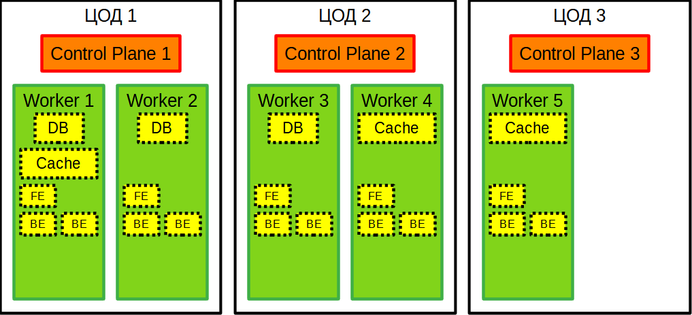
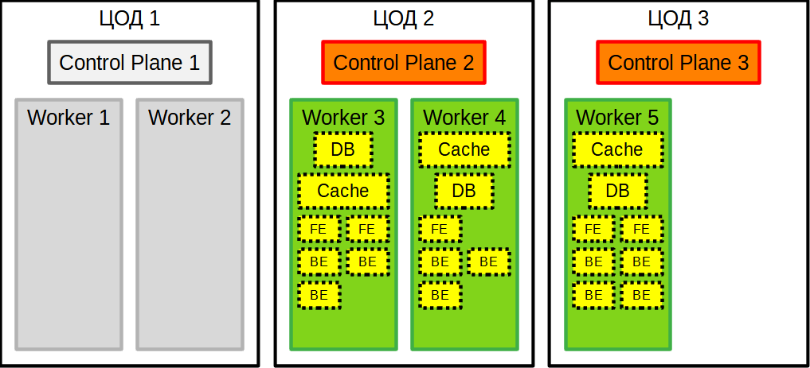

# Домашнее задание по лекции "12.3 Развертывание кластера на собственных серверах, лекция 1"

> Поработав с персональным кластером, можно заняться проектами.
> Вам пришла задача подготовить кластер под новый проект.

## Задание 1: Описать требования к кластеру

> Сначала проекту необходимо определить требуемые ресурсы.
> Известно, что проекту нужны база данных, система кеширования, а само приложение состоит из бекенда и фронтенда.
> Опишите, какие ресурсы нужны, если известно:
> * База данных должна быть отказоустойчивой. Потребляет 4 ГБ ОЗУ в работе, 1 ядро. 3 копии.
> * Кэш должен быть отказоустойчивый. Потребляет 4 ГБ ОЗУ в работе, 1 ядро. 3 копии.
> * Фронтенд обрабатывает внешние запросы быстро, отдавая статику. Потребляет не более 50 МБ ОЗУ на каждый экземпляр, 0.2 ядра. 5 копий.
> * Бекенд потребляет 600 МБ ОЗУ и по 1 ядру на копию. 10 копий.
>
> План расчета
> 1. Сначала сделайте расчет всех необходимых ресурсов.
> 2. Затем прикиньте количество рабочих нод, которые справятся с такой нагрузкой.
> 3. Добавьте к полученным цифрам запас, который учитывает выход из строя как минимум одной ноды.
> 4. Добавьте служебные ресурсы к нодам. Помните, что для разных типов нод требовния к ресурсам разные.
> 5. Рассчитайте итоговые цифры.
> 6. В результате должно быть указано количество нод и их параметры.

### Известные требования к кластеру

Элемент | Процессор | Оперативная память | Накопитель | Число реплик
--- | --- | --- | --- | ---
Kubernetes Control plane | 2 ядра | 2 Gb | 50 Gb | ?
Kubernetes Worker plane | 1 ядро | 1 Gb | 100 Gb | ?
База данных | 1 ядро | 4 Gb | ? | 3
Кэш | 1 ядро | 4 Gb | ? | 3
Frontend | 0.2 ядра | 50 Mb | ? | 5
Backend | 1 ядро | 600 Mb | ? | 10

Для обеспечения отказоустойчивости кластера **Kubernetes** число **Control plane** должно быть **нечётным** и не менее `3`.
> Предполагается, что копия **etcd** находится на каждом **control plane**

Если располагать **Control plane** вместе с **worker** на одной "машинке", то при её "потере" кластеру придётся переносить "потерянные" **pod** на другие **worker**, поэтому **Control plane** будут на отдельных машинках.
Для обеспечения максимальной отказоустойчивости расположим их в разных ЦОД[^1].

Предположим, что база данных потребует `100 Gb`.
Для кэша требования к объёму накопителя должны сводиться к размеру используемого ПО.
Допустим, что для **frontend** и **backend**, включая файлы операционной системы будет достаточно `50 Gb`.

За отправную точку возъмём минимальное число **worker** равное числу реплик баз данных и/или кэша, то есть `три`.
При этом потребление памяти составит:
```
1 (worker plane) + 4 (база данных) + 4 (кэш) + 0.1 (два frontend) + 2.4 (четыре backend) = 11.5 Gb
```
Для операционной системы ещё `1.5 Gb`, итого `13 Gb`.

Однако, в данном случае при потере любого **worker** кластер "рассыпется", так как невозможно будет разместить потерянные **pod** из-за нехватки памяти.
Поэтому минимальное число **worker** нужно увеличить до `4 единиц` с объёмом памяти в `13Gb` и `7 ядер`.
Расчёт числа ядер:
```
1 (worker plane) + 1 (база данных) + 1 (кэш) + 0.4 (два frontend) + 3 (три backend) = 6.4
Итого: 7 ядер
```
> Гипотетически, нагрузку **frontend** можно вписать в расходы **worker plane** и вместо 7 ядер использовать 6.

Но, всегда есть небольшая вероятность, что весь ЦОД окажется недоступным и мы можем потерять до двух **worker**, то есть половину кластера.
В этом случае кластер тоже "рассыпется" из-за нехватки помяти на оставшихся машинках.

### Итоговый вариант с учётом выхода из строя до двух **worker** или всего ЦОД.

Распределение **worker** и **control plane** по ЦОД и возможный вариант заполнения **pod** сервисами:


* `ЦОД` - Центр обработки данных
* `Control plane` - Управляющая нода Kubernetes
* `Worker` - Рабочая нода Kubernetes
* `DB` - Сервис базы данных
* `Cache` - Сервис кэша
* `FE` - Сервис **frontend**
* `BE` - Сервис **backend**

Распределение сервисов для худшего сценария, при котором "пропадают" два **worker** или весь ЦОД целиком:


Расчёт числа ядер для худшего случая (три рабочих **worker**):
```
1 (worker plane) + 1 (база данных) + 1 (кэш) + 0.4 (два frontend) + 4 (четыре backend) = 7.4
Итого: 8 ядер
```

> Получается, что расчёты ядер процессора приведены для высоконагруженной системы, когда все её компоненты потребляют все доступные вычислительные мощности. В теории, реально используемое число ядер можно сократить, например, до 6, если проект только развивается, иначе процессор будет работать вхолостую.

### Характеристики "машинок"

Запланировано использование `3 ЦОД`, на каждом из которых расположено по одной **master** ноды для **Kubernetes control plane** с:
```
Три "машинки":
2 ядрами CPU, 2 Gb оперативной памяти и 50 Gb накопителем
```

Среди всех ЦОД распределены `5 рабочих` нод с **Kubernetes worker plane** с одинаковыми характеристиками:
```
Пять "машинок":
8 ядер CPU, 13 Gb оперативной памяти, 250 Gb накопителя.
```

[^1]: ЦОД - Центр обработки данных (Дата-центр)
