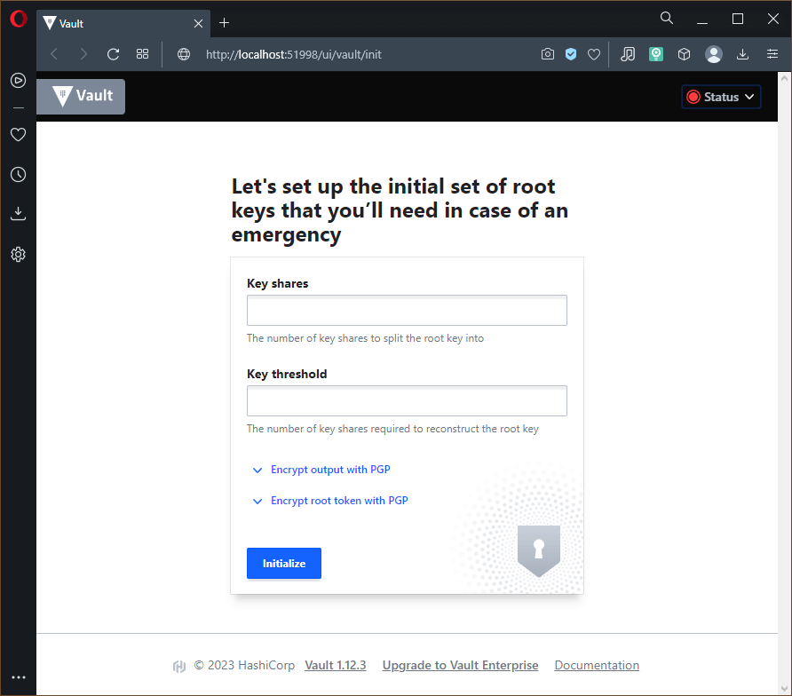

# Домашнее задание по лекции "14.3 Карты конфигураций"

## Основная задача 1: Работа с картами конфигураций через утилиту kubectl в установленном minikube

> Выполните приведённые команды в консоли. Получите вывод команд.
> Сохраните задачу 1 как справочный материал.

### Дополнительно: применение шаблонизатора на основе **jinja2** в **Python**

Пример шаблона [templates/nginx.vhosts.jinja](./src-simple/templates/nginx.vhosts.jinja)

```jinja
server {
  listen        80;
  server_name   {{ domain }} www.{{ domain }};
  access_log    /var/log/nginx/domains/{{ domain }}-access.log  main;
  error_log     /var/log/nginx/domains/{{ domain }}-error.log info;
  location / {
    include proxy_params;
    proxy_pass  http://{{ ip }}:8080/;
  }
}
```

Пример скрипта **render** конфигурации [render.py](./src-simple/render.py)

```python
#!/usr/bin/env python
from jinja2 import Environment, FileSystemLoader

env = Environment(
  loader = FileSystemLoader('templates')
)
template = env.get_template('nginx.vhosts.jinja')

domains = [{'domain':'netology.ru', 'ip':'10.10.10.10'}]
for item in domains:
  config = template.render(
    domain = item['domain'], ip=item['ip']
  )

with open('nginx.conf', 'w') as f:
  f.write(config)
```

**Render** осуществляется простым запуском скрипта.
При необзодимости изменения параметров, они меняются непосредственно в файле скрипта.
В данном примере изменяемые величины - список `domains`, состоящий из одного словаря, задающего **IP** адрес `10.10.10.10` для домена `netology.ru`.

Пример готового конфигурационного файла (Будет использоваться в картах конфигураций)

```config
server {
  listen        80;
  server_name   netology.ru www.netology.ru;
  access_log    /var/log/nginx/domains/netology.ru-access.log  main;
  error_log     /var/log/nginx/domains/netology.ru-error.log info;
  location / {
    include proxy_params;
    proxy_pass  http://10.10.10.10:8080/;
  }
}
```

### Определение

Карта конфигурации - сущность **Kubernetes**, предназначенная для хранения любых параметров или
конфигурационных файлов, используемых для настройки приложений в кластере.

Сущность обозначается синонимами `configmaps` или `configmap`, а также сокращением `cm`

### Как создать карту конфигурации?

Создание карты конфигурации из командной строки через параметры: `kubectl create configmap <name> --from-literal=<param>=<value>`, где `<value>` - значение параметра `<param>` в карте конфигурации с именем `<name>`

Создание карты конфигурации из командной строки на основе файла: `kubectl create configmap <name> --from-file=<file>`, где `<name>` - имя карты конфигурации на основе файла `<file>`

Пример Файла манифеста карты конфигурации

```yaml
apiVersion: v1
kind: ConfigMap
metadata:
  name: schema
data:
  nginx-conf: |
    server {
      listen    80;
      server_name       netology.ru www.netology.ru;
      access_log        /var/log/nginx/domains/netology.ru-access.log   main;
      error_log /var/log/nginx/domains/netology.ru-error.log    info;
      location / {
        include proxy_params;
        proxy_pass      http://10.10.10.10:8080/;
      }
    }
  domain: "netology.ru"
```

Применение:

```console
root@debian11:~/14.3# kubectl create configmap nginx-config --from-file=nginx.conf
configmap/nginx-config created
root@debian11:~/14.3# kubectl create configmap domain --from-literal=name=netology.ru
configmap/domain created
root@debian11:~/14.3# kubectl apply -f schema.yml
configmap/schema created
root@debian11:~/14.3#
```

### Как просмотреть список карт конфигураций?

Просмотр списка карт конфигураций осуществляется командой `kubectl get configmaps`

```console
root@debian11:~/14.3# kubectl get cm
NAME               DATA   AGE
domain             1      21m
kube-root-ca.crt   1      8h
nginx-config       1      21m
schema             2      4m9s
root@debian11:~/14.3#
```

### Как просмотреть карту конфигурации?

Для просмотра карт конфигураций предусмотрены команды: `kubectl get configmap <name>` и `kubectl describe configmap <name>`, где `<name>` - имя карты конфигурации

> Как правило команда `get` используется для вывода карт конфигураций в нужном формате (описано в следйющих пунктах)

```console
root@debian11:~/14.3# kubectl get configmap nginx-config
NAME           DATA   AGE
nginx-config   1      26m
root@debian11:~/14.3# kubectl describe configmap domain
Name:         domain
Namespace:    default
Labels:       <none>
Annotations:  <none>

Data
====
name:
----
netology.ru

BinaryData
====

Events:  <none>
root@debian11:~/14.3# kubectl describe cm schema
Name:         schema
Namespace:    default
Labels:       <none>
Annotations:  <none>

Data
====
domain:
----
netology.ru
nginx-conf:
----
server {
  listen       80;
  server_name  netology.ru www.netology.ru;
  access_log   /var/log/nginx/domains/netology.ru-access.log  main;
  error_log    /var/log/nginx/domains/netology.ru-error.log   info;
  location / {
    include proxy_params;
    proxy_pass  http://10.10.10.10:8080/;
  }
}


BinaryData
====

Events:  <none>
root@debian11:~/14.3#
```

### Как получить информацию в формате YAML и/или JSON?

Для получения карты конфигурации в форматах **JSON/YAML** используется команда `kubectl get configmap <name> -o <format>`, где `<name>` - имя карты конфигураций, которрую нужно вывести в формате `<format>` (**json**, **yaml**)

> Вывод в формате YAML/JSON можно использовать как файл манифеста для применения в кластере **Kubernetes**

```console
root@debian11:~/14.3# kubectl get configmap nginx-config -o yaml
apiVersion: v1
data:
  nginx.conf: "server {\n  listen\t80;\n  server_name\tnetology.ru www.netology.ru;\n
    \ access_log\t/var/log/nginx/domains/netology.ru-access.log  main;\n  error_log\t/var/log/nginx/domains/netology.ru-error.log
    info;\n  location / {\n    include proxy_params;\n    proxy_pass\thttp://10.10.10.10:8080/;\n
    \ }\n}"
kind: ConfigMap
metadata:
  creationTimestamp: "2023-02-12T19:47:20Z"
  name: nginx-config
  namespace: default
  resourceVersion: "50913"
  uid: 3ccde9db-b7c4-4180-a4fa-3b0531affd58
root@debian11:~/14.3# kubectl get configmap domain -o json
{
    "apiVersion": "v1",
    "data": {
        "name": "netology.ru"
    },
    "kind": "ConfigMap",
    "metadata": {
        "creationTimestamp": "2023-02-12T19:47:30Z",
        "name": "domain",
        "namespace": "default",
        "resourceVersion": "50932",
        "uid": "ca420b6d-f3a3-4998-bce8-05733fd15138"
    }
}
root@debian11:~/14.3# kubectl get cm schema -o yaml
apiVersion: v1
data:
  domain: netology.ru
  nginx-conf: "server {\n  listen\t80;\n  server_name\tnetology.ru www.netology.ru;\n
    \ access_log\t/var/log/nginx/domains/netology.ru-access.log\tmain;\n  error_log\t/var/log/nginx/domains/netology.ru-error.log\tinfo;\n
    \ location / {\n    include proxy_params;\n    proxy_pass\thttp://10.10.10.10:8080/;\n
    \ }\n}\n"
kind: ConfigMap
metadata:
  annotations:
    kubectl.kubernetes.io/last-applied-configuration: |
      {"apiVersion":"v1","data":{"domain":"netology.ru","nginx-conf":"server {\n  listen\t80;\n  server_name\tnetology.ru www.netology.ru;\n  access_log\t/var/log/nginx/domains/netology.ru-access.log\tmain;\n  error_log\t/var/log/nginx/domains/netology.ru-error.log\tinfo;\n  location / {\n    include proxy_params;\n    proxy_pass\thttp://10.10.10.10:8080/;\n  }\n}\n"},"kind":"ConfigMap","metadata":{"annotations":{},"name":"schema","namespace":"default"}}
  creationTimestamp: "2023-02-12T20:04:23Z"
  name: schema
  namespace: default
  resourceVersion: "52740"
  uid: 798007e4-cf7f-410d-b5c7-a2f5be38030a
root@debian11:~/14.3#
```

### Как выгрузить карту конфигурации и сохранить его в файл?

Для выгрузки карты конфигурации в файл достаточно перенаправить вывод **stdout** команды получения карты конфигурации `kubectl get cm ... -o ...`

```console
root@debian11:~/14.3# kubectl get configmaps -o json > configmaps.json
root@debian11:~/14.3# kubectl get configmap nginx-config -o yaml > nginx-config.yml
root@debian11:~/14.3# ls
configmaps.json  nginx.conf  nginx-config.yml  render.py  schema.yml  templates
root@debian11:~/14.3#
```

### Как удалить карту конфигурации?

Удаление карты конфигурации выполняется командой `kubectl delete configmap <name>`, где `<name>` - имя удаляемой карты конфигурации

```console
root@debian11:~/14.3# kubectl delete configmap nginx-config
configmap "nginx-config" deleted
root@debian11:~/14.3#
```

### Как загрузить карту конфигурации из файла?

Применение в кластере манифеста карты конфигурации выполняется стандартной командой `kubectl apply -f <file>`, где `<file>` - имя применяемого файла манифеста

```console
root@debian11:~/14.3# kubectl apply -f nginx-config.yml
configmap/nginx-config created
root@debian11:~/14.3#
```

---

## Дополнительная задача 2 (*): Работа с картами конфигураций внутри модуля

> Выбрать любимый образ контейнера, подключить карты конфигураций и проверить
> их доступность как в виде переменных окружения, так и в виде примонтированного тома

Для решения написан **Helm Chart**, разворачивающий **StatefulSet Vault**.
Благодаря параметризации **Vault** может быть развёрнут в двух режимах: `DEV` и `PRODUCTION`.

В **DEV** режиме для **Vault** не требуется инициализация,
вместо этого ему передаётся **root token** через переменную среды.
> Успешный запуск **Vault** без инициализации говорит об успешной передачи в качестве переменной окружения параметра из карты конфигураций.

В **PRODUCTION** режиме перед началом работы **Vault** нужно инициализировать,
при этом никакие переменные среды не используются,
а вместо этого передаётся конфигурационный файл.
> Успешный запуск **Vault** с инициализацией и доступность с любого адреса и выбранного порта говорит об успешной передачи в качестве точки монтирования конфигурационного файлы из карты конфигураций.

Исходный код **Chart** представлен в каталоге [src/vault-chart](./src/vault-chart)

### Проверка решения - запуск в **DEV** режиме

Используются следующие настройки **Chart**

```yaml
port: 8201
namespace: "dz-vault"
use_sc: "nfs"
disk: "1Gi"
resources:
  requests:
    cpu: "500m"
    memory: "1Gi"
root_token: "simple_root_token"
role_id: "304d18cc-cb56-8641-254a-a1eac3b6fe34"
```

Предполагаемый **template**: `helm template r1 vault-chart`

```yaml
---
# Source: vault/templates/vault.yml
apiVersion: v1
kind: ConfigMap
metadata:
  name: r1-config
  namespace: dz-vault
data:
  vault.root_token: "simple_root_token"
---
# Source: vault/templates/vault.yml
---
apiVersion: v1
kind: Service
metadata:
  name: r1-svc
  namespace: dz-vault
spec:
  clusterIP: None
  ports:
    - name: http-port
      port: 8201
  selector:
    app: r1
...
---
# Source: vault/templates/vault.yml
apiVersion: apps/v1
kind: StatefulSet
metadata:
  name: r1
  namespace: dz-vault
  labels:
    app: r1
spec:
  serviceName: "r1-svc"
  selector:
    matchLabels:
      app: r1
  replicas: 1
  template:
    metadata:
      labels:
        app: r1
    spec:
      containers:
        - name: vault
          image: "vault:1.12.3"
          imagePullPolicy: IfNotPresent
          ports:
            - name: http
              containerPort: 8201
              protocol: "TCP"
          env:
          - name: VAULT_DEV_ROOT_TOKEN_ID
            valueFrom:
              configMapKeyRef:
                name: r1-config
                key: vault.root_token
          - name: VAULT_DEV_LISTEN_ADDRESS
            value: 0.0.0.0:8201
          resources:
            requests:
              cpu: 500m
              memory: 1Gi
          securityContext:
            capabilities:
              add:
                - IPC_LOCK # разрешает делать системный вызов mlock без повышения привилегий контейнера, выделение памяти большими страницами
                - CAP_SETFCAP # нужно для мапинга юзер ид0 в нового пользака в неймпейсе ядра, вызов setcap
          volumeMounts:
            - name: r1-data
              mountPath: /vault/data
  volumeClaimTemplates:
    - metadata:
        name: r1-data
      spec:
        accessModes: [ "ReadWriteOnce" ]
        storageClassName: nfs
        resources:
          requests:
            storage: 1Gi
...
```

Установка **Chart**

```console
root@debian11:~/14.3# helm install r1 vault-chart
NAME: r1
LAST DEPLOYED: Fri Feb 17 17:06:43 2023
NAMESPACE: dz-vault
STATUS: deployed
REVISION: 1
NOTES:
------------------------------------------------------------

  Current chart version: 0.2.0
  Vault image tag: 1.12.3
  Vault Port: 8201
  Used storage class: nfs
  DEV mode with root token: simple_root_token

------------------------------------------------------------
root@debian11:~/14.3# kubectl get pod,sts,svc -o wide
NAME       READY   STATUS    RESTARTS   AGE   IP             NODE    NOMINATED NODE   READINESS GATES
pod/r1-0   1/1     Running   0          35s   10.233.75.14   node2   <none>           <none>

NAME                  READY   AGE   CONTAINERS   IMAGES
statefulset.apps/r1   1/1     35s   vault        vault:1.12.3

NAME             TYPE        CLUSTER-IP   EXTERNAL-IP   PORT(S)    AGE   SELECTOR
service/r1-svc   ClusterIP   None         <none>        8201/TCP   35s   app=r1
root@debian11:~/14.3#
```


Запрос **Port-Forward** командой **kubectl** в отдельном терминале

```console
PS C:\Users\h> kubectl port-forward service/r1-svc 8000:8201 -n dz-vault
Forwarding from 127.0.0.1:8000 -> 8201
Forwarding from [::1]:8000 -> 8201
Handling connection for 8000
Handling connection for 8000
Handling connection for 8000
Handling connection for 8000
Handling connection for 8000
Handling connection for 8000
```


### Проверка решения - запуск в **PRODUCTION** режиме

Используются следующие настройки **Chart**

```yaml
port: 8202
namespace: "dz-vault"
use_sc: "nfs"
disk: "1Gi"
resources:
  requests:
    cpu: "500m"
    memory: "1Gi"
root_token: ""
role_id: "304d18cc-cb56-8641-254a-a1eac3b6fe34"
```

Предполагаемый **template**: `helm template r3 vault-chart`

```yaml
---
# Source: vault/templates/vault.yml
apiVersion: v1
kind: ConfigMap
metadata:
  name: r3-config
  namespace: dz-vault
data:
  vault.hcl: |
    disable_mlock = true
    ui = true
    api_addr = "http://r3-svc:8202"

    listener "tcp" {
      address = "[::]:8202"
      tls_disable = 1
    }
    storage "file" {
      path = "/vault/data"
    }
---
# Source: vault/templates/vault.yml
---
apiVersion: v1
kind: Service
metadata:
  name: r3-svc
  namespace: dz-vault
spec:
  clusterIP: None
  ports:
    - name: http-port
      port: 8202
  selector:
    app: r3
...
---
# Source: vault/templates/vault.yml
apiVersion: apps/v1
kind: StatefulSet
metadata:
  name: r3
  namespace: dz-vault
  labels:
    app: r3
spec:
  serviceName: "r3-svc"
  selector:
    matchLabels:
      app: r3
  replicas: 1
  template:
    metadata:
      labels:
        app: r3
    spec:
      containers:
        - name: vault
          image: "vault:1.12.3"
          imagePullPolicy: IfNotPresent
          ports:
            - name: http
              containerPort: 8202
              protocol: "TCP"
          args:
            - "server"
            - "-config=/etc/vault/config/vault.hcl"
          resources:
            requests:
              cpu: 500m
              memory: 1Gi
          securityContext:
            capabilities:
              add:
                - IPC_LOCK # разрешает делать системный вызов mlock без повышения привилегий контейнера, выделение памяти большими страницами
                - CAP_SETFCAP # нужно для мапинга юзер ид0 в нового пользака в неймпейсе ядра, вызов setcap
          volumeMounts:
            - name: config
              mountPath: /etc/vault/config
            - name: r3-data
              mountPath: /vault/data
      volumes:
        - name: config
          configMap:
            name: r3-config
  volumeClaimTemplates:
    - metadata:
        name: r3-data
      spec:
        accessModes: [ "ReadWriteOnce" ]
        storageClassName: nfs
        resources:
          requests:
            storage: 1Gi
...
```

Установка **Chart**

```console
root@debian11:~/14.3# helm install r3 vault-chart
NAME: r3
LAST DEPLOYED: Fri Feb 17 17:48:26 2023
NAMESPACE: dz-vault
STATUS: deployed
REVISION: 1
NOTES:
------------------------------------------------------------

  Current chart version: 0.2.0
  Vault image tag: 1.12.3
  Vault Port: 8202
  Used storage class: nfs
  PROD mode with vault initialization

------------------------------------------------------------
root@debian11:~/14.3# kubectl get pod,sts,svc -o wide
NAME       READY   STATUS    RESTARTS   AGE   IP             NODE    NOMINATED NODE   READINESS GATES
pod/r3-0   1/1     Running   0          58s   10.233.75.15   node2   <none>           <none>

NAME                  READY   AGE   CONTAINERS   IMAGES
statefulset.apps/r3   1/1     58s   vault        vault:1.12.3

NAME             TYPE        CLUSTER-IP   EXTERNAL-IP   PORT(S)    AGE   SELECTOR
service/r3-svc   ClusterIP   None         <none>        8202/TCP   58s   app=r3
root@debian11:~/14.3#
```


Запрос **Port-Forward** выполнен из интерфейса `OpenLens`


