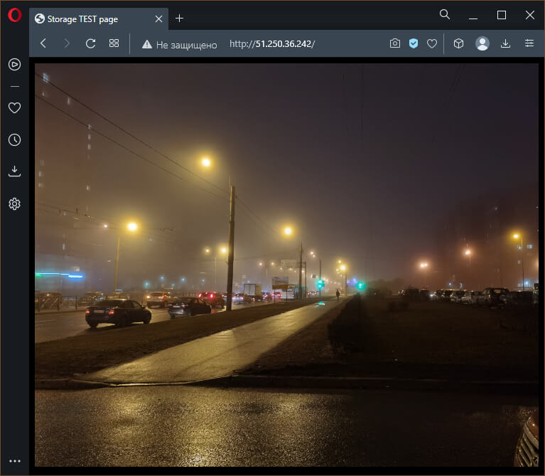

# Домашнее задание по лекции 15.2 "Вычислительные мощности. Балансировщики нагрузки".

> Домашнее задание будет состоять из обязательной части, которую необходимо выполнить на провайдере
> Яндекс.Облако, и дополнительной части в AWS (можно выполнить по желанию). Все домашние задания
> в 15 блоке связаны друг с другом и в конце представляют пример законченной инфраструктуры.
> Все задания требуется выполнить с помощью Terraform, результатом выполненного домашнего задания
> будет код в репозитории.

## Обязательное задание. Яндекс.Облако

> 1. Создать bucket Object Storage и разместить там файл с картинкой:
> - Создать bucket в Object Storage с произвольным именем (например, _имя_студента_дата_);
> - Положить в bucket файл с картинкой;
> - Сделать файл доступным из Интернет.
> 2. Создать группу ВМ в public подсети фиксированного размера с шаблоном LAMP и web-страничкой, содержащей ссылку на картинку из bucket:
> - Создать Instance Group с 3 ВМ и шаблоном LAMP. Для LAMP рекомендуется использовать `image_id = fd827b91d99psvq5fjit`;
> - Для создания стартовой веб-страницы рекомендуется использовать раздел `user_data` в [meta_data](https://cloud.yandex.ru/docs/compute/concepts/vm-metadata);
> - Разместить в стартовой веб-странице шаблонной ВМ ссылку на картинку из bucket;
> - Настроить проверку состояния ВМ.
> 3. Подключить группу к сетевому балансировщику:
> - Создать сетевой балансировщик;
> - Проверить работоспособность, удалив одну или несколько ВМ.
> 4. *Создать Application Load Balancer с использованием Instance group и проверкой состояния.

---

### 1. Создание бакета, настройка доступа и загрузка картинки

До создания бакета нужно подготовить сервисный аккаунт, который будет работать с хранилищем.
> Использовалась инструкция: [Создание сервисного аккаунта](https://cloud.yandex.ru/docs/iam/operations/sa/create)

```terraform
# Создание сервисного аккаунта
resource "yandex_iam_service_account" "sa" {
  name        = "sa-test"
  folder_id   = var.YC_FOLDER_ID
}
```

Чтобы сервисный аккаунт мог создать бакет ему нужно назначить как минимум роль `storage.editor`.
> Использовалась инструкция: [Назначение роли сервисному аккаунту](https://cloud.yandex.ru/docs/iam/operations/sa/assign-role-for-sa)
>
> Посмотреть все имеющиеся в Яндекс.Облаке роли можно командой `yc iam role list`

```terraform
# Назначение роли сервисному аккаунту - редактирование хранилища
resource "yandex_resourcemanager_folder_iam_member" "sa-editor" {
  folder_id = var.YC_FOLDER_ID
  role      = "storage.editor"
  member    = "serviceAccount:${yandex_iam_service_account.sa.id}"
}
```

Также для использования сервисного аккаунта ему нужно сгенерировать пару статических ключей,
по которым будет создаваться бакет.
> Использовась инструкция: [Создание статических ключей доступа](https://cloud.yandex.ru/docs/iam/operations/sa/create-access-key)

```terraform
# Создание статического ключа доступа
resource "yandex_iam_service_account_static_access_key" "sa-static-key" {
  service_account_id = yandex_iam_service_account.sa.id
}
```

---

Создание бакета и его настройка выполняется в одном объекте, при этом нужно правильно указать
имя бакета, так как оно должно быть уникальным для всей инфраструктуры Яндекс.Облака, а не только
в рамках аккаунта пользователя. Это было сделано для того, чтобы не бюло конфликтов при создании
статического хостинга, позволяющего получить доступ к содержимому бакета из Web интерфейста.
Стандартный адрес хостинга строится по шаблону: `https://<backet>.website.yandexcloud.net/`, где `<backet>` - имя бакета

Использовались следующие инструкции:
  - [Создание бакета](https://cloud.yandex.ru/docs/storage/operations/buckets/create)
  - [Настройка хостинга](https://cloud.yandex.ru/docs/storage/operations/hosting/setup)
  - [Открытие публичного доступа к операциям с бакетом](https://cloud.yandex.ru/docs/storage/operations/buckets/bucket-availability)
  - [Загрузка объекта](https://cloud.yandex.ru/docs/storage/operations/objects/upload)

Манифест бакета, включающий загрузку картинки

```terraform
# Создание бакета с использованием ключа сервисного аккаунта
resource "yandex_storage_bucket" "storage" {
  access_key = yandex_iam_service_account_static_access_key.sa-static-key.access_key
  secret_key = yandex_iam_service_account_static_access_key.sa-static-key.secret_key
  bucket     = "artem-shtepa-2023-02"

  website {
    index_document = "my-photo"
    error_document = "error.html"
  }
  anonymous_access_flags {
    read = true
    list = false
  }
}

# Добавление объекта в хранилище - картинки
resource "yandex_storage_object" "photo" {
  access_key = yandex_iam_service_account_static_access_key.sa-static-key.access_key
  secret_key = yandex_iam_service_account_static_access_key.sa-static-key.secret_key
  bucket = yandex_storage_bucket.storage.bucket

  key    = "my-photo"
  acl    = "public-read"
  content_type = "image/jpg"
  source = "./../image/IMG_20210330_2219.jpg"
}
```

Доступ к картинке можно получить по ссылке: `https://<backet>.storage.yandexcloud.net/<key>` или со встроенного **web** сервера: `https://<backet>.website.yandexcloud.net/<key>`, где `<backet>` - имя бакета, а `<key>` - идентификатор объекта (параметр **key**)

Например, для приведённых манифестов ссылки будут следующие:
  - `https://artem-shtepa-2023-02.storage.yandexcloud.net/my-photo`
  - `https://artem-shtepa-2023-02.website.yandexcloud.net/my-photo`

---

### 2. Создание и настройка группы ВМ по шаблону LAMP

`LAMP` - Аббревиатура от **Linux**, **Apache**, **MySQL**, **PHP**.
Набор предустановленных программных компонентов для создания сайтов и веб-приложений.
Обеспечивает высокую скорость разработки, возможность быстро менять конфигурацию и масштабировать сервис.

На момент подготовки решения на странице [LAMP](https://cloud.yandex.ru/marketplace/products/yc/lamp) образа идентификатор диска изменился на `fd8i0dacbfhkd73r1dhq` - обновление 20 февраля 2023 года.
Образ основан на следующем ПО:
ПО | Версия
--- | ---
Ubuntu | 18.04
Apache | 2.4.29-1ubuntu4.26
MySQL | 5.7.41-0ubuntu0.18.04.1
PHP | 7.2.24-0ubuntu0.18.04.16
Python | 3.6.7-1~18.04

---

Работа с группами виртуальных машин также осуществляется от сервисного аккаунта, но
обладающего ролью `editor`, поэтому в соответствующий манифест добавлены следующие строчки

```terraform
//Назначение роли сервисному аккаунту - редактор (ВМ, групп)
resource "yandex_resourcemanager_folder_iam_binding" "sa-editor" {
  folder_id  = var.YC_FOLDER_ID
  role       = "editor"
  members    = ["serviceAccount:${yandex_iam_service_account.sa.id}"]
  depends_on = [yandex_iam_service_account.sa]
}
```

Основной ресурс группы создан по инструкции: [Создать группу виртуальных машин фиксированного размера](https://cloud.yandex.ru/docs/compute/operations/instance-groups/create-fixed-group)

```terraform
# Создание группы ВМ фиксированного размера
resource "yandex_compute_instance_group" "vm-group" {
  name               = "fixed-ig"
  folder_id          = var.YC_FOLDER_ID
  service_account_id = yandex_iam_service_account.sa.id
  depends_on         = [yandex_resourcemanager_folder_iam_binding.sa-editor]

  # Шаблон ВМ
  instance_template {
    platform_id = "standard-v1"
    name = "vm-instance-{instance.index}"

    resources {
      memory = 2
      cores  = 2
    }

    boot_disk {
      mode = "READ_WRITE"
      initialize_params {
        image_id = "fd8i0dacbfhkd73r1dhq"
      }
    }

    network_interface {
      network_id = "${yandex_vpc_network.my-net.id}"
      subnet_ids = ["${yandex_vpc_subnet.public-subnet.id}"]
    }

    metadata = {
      ssh-keys = "ubuntu:${file("~/.ssh/id_ed25519.pub")}"
      user-data = file("./../files/cloud-init.yaml")
    }
  }

  # Политика масштабирования
  scale_policy {
    fixed_scale {
      size = 3
    }
  }

  # Политики распределения
  allocation_policy {
    zones = [var.YC_ZONE]
  }

  # Политика развёртывания
  deploy_policy {
    max_unavailable = 1
    max_expansion = 0
  }
}
```

В метаданных добавляется **SSH** ключ доступа к машине и файл настройки агента **cloud-init**.
Агент **cloud-init** поддерживает различные форматы передачи метаданных. В решении используется формат [cloud-config](https://cloudinit.readthedocs.io/en/latest/reference/examples.html), а именно:

```yaml
#cloud-config
write_files:
- path: /var/www/html/index.html
  owner: root:root
  permissions: "0644"
  content: |
    <html>
      <head><title>Storage TEST page</title></head>
      <body bgcolor="black"></body>
    </html>
- path: /var/www/html/index.php
  owner: root:root
  permission: "0644"
  content: |
    <html>
      <head><title>Server HOST page</title></head>
      <body>Host address is <?php echo $_SERVER['SERVER_ADDR']; ?></body>
    </html>
```

Данный манифест содержит команду записи двух файлов `write_files` с одинаковыми параметрами
владельца `root:root`, правами доступа `0644`, но разным содержимым (`content`):
  - Файл `/var/www/html/index.html` представляет простейшую **HTML** страничку с объектом картинки из хранилища
  - Файл `/var/www/html/index.php` содерит **PHP** код вывода **IP** адреса сервера, то есть внутренний **IP** хоста из группы ВМ

Реализация проверки состояния машины выполнена по документация провайдера Яндекс.Облака: [yandex_compute_instance_group](https://registry.tfpla.net/providers/yandex-cloud/yandex/latest/docs/resources/compute_instance_group)

```terraform
  # Проверка состояния
  health_check {
    interval = 20
    timeout = 1
    healthy_threshold = 2
    unhealthy_threshold = 3
    http_options {
      path = "/index.html"
      port = 80
    }
  }
```

Данный блок настраивает проверку состояния ВМ каждые `20` секунд с
максимальным временем ожидания ответа команды проверки состояния в `1` секунду.
Команда проверки состояния представлена запросом **HTTP** страницы `/index.html` с порта `80`.
При последовательном успешном выполнении двух запросов состояния машины её статус переводится в `HEALTHY`.
При обнаружении серии из трёх последовательных ошибках проверки состояния статус машины переводится в `UNHEALTHY`.

---

### 3. Подключение группы ВМ к сетевому балансировщику

Для работы сетевого балансировщика нужно сначала добавить целевую группу хостов, среди которых будет производиться балансировка.

Целевую группу можно создать вручную, конструируя объект `yandex_lb_target_group` и добавляя туда все хосты по одному, например:

```terraform
resource "yandex_lb_target_group" "lamp-nl-balancer-group" {
  name      = "lamp-nlb-group"
  region_id = "ru-central1"

  dynamic "target" {
    for_each = yandex_compute_instance_group.vm-group.instances
    content {
      subnet_id = yandex_vpc_subnet.public-subnet.id
      address   = target.value.network_interface[0].ip_address
    }
  }
}
```

Далее группу нужно добавить в ресурс сетевого балансировщика как элемент `attached_target_group.target_group_id = yandex_lb_target_group.lamp-nl-balancer-group.id`

Однако, такой способ лучше не использовать, так как при пересоздании какой-либо машины из группы
её **IP** адрес скорее всего изменится, а состав целевой группы останется прежним, что фактически
выведет пересозданную машину из целевой группы балансировщика. Дальнейшее пересоздание машин
группы без актуализации целевой группы приведёт к такому состоянию, что балансировщик получит
фактически пустой список рабочих хостов, так как все машины сменят свои IP адреса и ему некуда
будет перенаправлять запросы.

Чтобы такого не происходило нужно либо также вручную обновлять целевую группу (например, через **YC CLI**),
либо предоставить это **Яндекс.Облаку**, добавив в ресурсе группы ВМ блок `load_balancer {}`,
содержащий только опциональные элементы, например:

```terraform
  # Автоматическое создание целевой группы сетевого балансировщика
  load_balancer {
    target_group_name = "load-balancer-group"
  }
```

> Использовалась инструкция: [Создать группу виртуальных машин фиксированного размера с сетевым балансировщиком](https://cloud.yandex.ru/docs/compute/operations/instance-groups/create-with-balancer) и [yandex_compute_instance_group](https://registry.tfpla.net/providers/yandex-cloud/yandex/latest/docs/resources/compute_instance_group)

Далее при непосредственном создании сетевого балансировщика указать **ID** группы,
настроить "слушателя" и проверку состояния:

```terraform
resource "yandex_lb_network_load_balancer" "lamp-nl-balancer" {
  name = "lamp-nlb"

  listener {
    name = "lamp-nlb-listener"
    port = 80
    external_address_spec {
      ip_version = "ipv4"
    }
  }

  attached_target_group {
    target_group_id = yandex_compute_instance_group.vm-group.load_balancer[0].target_group_id
    healthcheck {
      name = "lamp-nlb-healthcheck"
      http_options {
        port = 80
        path = "/index.php"
      }
    }
  }
}
```
> Использовалась инструкция: [yandex_lb_network_load_balancer](https://registry.tfpla.net/providers/yandex-cloud/yandex/latest/docs/resources/lb_network_load_balancer)

---

#### Проверка функционирования для сетевого балансировщика

<details>
<summary>Разворачивание инфраструктуры</summary>

:exclamation: Логи проверки пересняты после модернизации исходных кодов проекта, после добавления возможности использования **L7** балансировщика

```console
root@debian11:~/15.2# ./go.sh up

Terraform used the selected providers to generate the following execution plan. Resource actions are indicated with the
following symbols:
  + create

Terraform will perform the following actions:

  # yandex_compute_instance_group.vm-group will be created
  + resource "yandex_compute_instance_group" "vm-group" {
      + created_at          = (known after apply)
      + deletion_protection = false
      + folder_id           = "b1g3ol70h1opu6hr9kie"
      + id                  = (known after apply)
      + instances           = (known after apply)
      + name                = "fixed-ig"
      + service_account_id  = (known after apply)
      + status              = (known after apply)

      + allocation_policy {
          + zones = [
              + "ru-central1-a",
            ]
        }

      + deploy_policy {
          + max_creating     = 0
          + max_deleting     = 0
          + max_expansion    = 0
          + max_unavailable  = 1
          + startup_duration = 0
          + strategy         = (known after apply)
        }

      + health_check {
          + healthy_threshold   = 2
          + interval            = 20
          + timeout             = 1
          + unhealthy_threshold = 3

          + http_options {
              + path = "/index.html"
              + port = 80
            }

          + tcp_options {
              + port = (known after apply)
            }
        }

      + instance_template {
          + labels      = (known after apply)
          + metadata    = {
              + "ssh-keys"  = <<-EOT
                    ubuntu:ssh-ed25519 AAAAC3NzaC1lZDI1NTE5AAAAIGL4/7B+iUs1V4KPwdkyuz8L+O4UKiihDk60moD41SS2 root@debian11
                EOT
              + "user-data" = <<-EOT
                    #cloud-config
                    write_files:
                    - path: /var/www/html/index.html
                      owner: root:root
                      permissions: "0644"
                      content: |
                        <html>
                          <head><title>Storage TEST page</title></head>
                          <body bgcolor="black"></body>
                        </html>
                    - path: /var/www/html/index.php
                      owner: root:root
                      permission: "0644"
                      content: |
                        <html>
                          <head><title>Server HOST page</title></head>
                          <body>Host address is <?php echo $_SERVER['SERVER_ADDR']; ?></body>
                        </html>
                EOT
            }
          + name        = "vm-instance-{instance.index}"
          + platform_id = "standard-v1"

          + boot_disk {
              + device_name = (known after apply)
              + mode        = "READ_WRITE"

              + initialize_params {
                  + image_id    = "fd8i0dacbfhkd73r1dhq"
                  + size        = (known after apply)
                  + snapshot_id = (known after apply)
                  + type        = "network-hdd"
                }
            }

          + network_interface {
              + ip_address   = (known after apply)
              + ipv4         = true
              + ipv6         = (known after apply)
              + ipv6_address = (known after apply)
              + nat          = (known after apply)
              + network_id   = (known after apply)
              + subnet_ids   = (known after apply)
            }

          + resources {
              + core_fraction = 100
              + cores         = 2
              + memory        = 2
            }

          + scheduling_policy {
              + preemptible = (known after apply)
            }
        }

      + load_balancer {
          + status_message    = (known after apply)
          + target_group_id   = (known after apply)
          + target_group_name = "load-balancer-group"
        }

      + scale_policy {

          + fixed_scale {
              + size = 3
            }
        }
    }

  # yandex_iam_service_account.sa will be created
  + resource "yandex_iam_service_account" "sa" {
      + created_at = (known after apply)
      + folder_id  = "b1g3ol70h1opu6hr9kie"
      + id         = (known after apply)
      + name       = "sa-test"
    }

  # yandex_iam_service_account_static_access_key.sa-static-key will be created
  + resource "yandex_iam_service_account_static_access_key" "sa-static-key" {
      + access_key           = (known after apply)
      + created_at           = (known after apply)
      + encrypted_secret_key = (known after apply)
      + id                   = (known after apply)
      + key_fingerprint      = (known after apply)
      + secret_key           = (sensitive value)
      + service_account_id   = (known after apply)
    }

  # yandex_resourcemanager_folder_iam_binding.sa-editor will be created
  + resource "yandex_resourcemanager_folder_iam_binding" "sa-editor" {
      + folder_id = "b1g3ol70h1opu6hr9kie"
      + id        = (known after apply)
      + members   = (known after apply)
      + role      = "editor"
    }

  # yandex_resourcemanager_folder_iam_member.sa-storage-editor will be created
  + resource "yandex_resourcemanager_folder_iam_member" "sa-storage-editor" {
      + folder_id = "b1g3ol70h1opu6hr9kie"
      + id        = (known after apply)
      + member    = (known after apply)
      + role      = "storage.editor"
    }

  # yandex_storage_bucket.storage will be created
  + resource "yandex_storage_bucket" "storage" {
      + access_key            = (known after apply)
      + acl                   = (known after apply)
      + bucket                = "artem-shtepa-2023-02"
      + bucket_domain_name    = (known after apply)
      + default_storage_class = (known after apply)
      + folder_id             = (known after apply)
      + force_destroy         = false
      + id                    = (known after apply)
      + secret_key            = (sensitive value)
      + website_domain        = (known after apply)
      + website_endpoint      = (known after apply)

      + anonymous_access_flags {
          + list = false
          + read = true
        }

      + grant {
          + id          = (known after apply)
          + permissions = (known after apply)
          + type        = (known after apply)
          + uri         = (known after apply)
        }

      + versioning {
          + enabled = (known after apply)
        }

      + website {
          + error_document = "error.html"
          + index_document = "my-photo"
        }
    }

  # yandex_storage_object.photo will be created
  + resource "yandex_storage_object" "photo" {
      + access_key                    = (known after apply)
      + acl                           = "public-read"
      + bucket                        = "artem-shtepa-2023-02"
      + content_type                  = "image/jpg"
      + id                            = (known after apply)
      + key                           = "my-photo"
      + object_lock_legal_hold_status = "OFF"
      + secret_key                    = (sensitive value)
      + source                        = "./../image/IMG_20210330_2219.jpg"
    }

  # yandex_vpc_network.my-net will be created
  + resource "yandex_vpc_network" "my-net" {
      + created_at                = (known after apply)
      + default_security_group_id = (known after apply)
      + folder_id                 = (known after apply)
      + id                        = (known after apply)
      + labels                    = (known after apply)
      + name                      = "master-network"
      + subnet_ids                = (known after apply)
    }

  # yandex_vpc_subnet.public-subnet will be created
  + resource "yandex_vpc_subnet" "public-subnet" {
      + created_at     = (known after apply)
      + folder_id      = (known after apply)
      + id             = (known after apply)
      + labels         = (known after apply)
      + name           = "public"
      + network_id     = (known after apply)
      + v4_cidr_blocks = [
          + "192.168.10.0/24",
        ]
      + v6_cidr_blocks = (known after apply)
      + zone           = "ru-central1-a"
    }

  # module.nlb[0].yandex_lb_network_load_balancer.lamp-nl-balancer will be created
  + resource "yandex_lb_network_load_balancer" "lamp-nl-balancer" {
      + created_at = (known after apply)
      + folder_id  = (known after apply)
      + id         = (known after apply)
      + name       = "lamp-nlb"
      + type       = "external"

      + attached_target_group {
          + target_group_id = (known after apply)

          + healthcheck {
              + healthy_threshold   = 2
              + interval            = 2
              + name                = "lamp-nlb-healthcheck"
              + timeout             = 1
              + unhealthy_threshold = 2

              + http_options {
                  + path = "/index.php"
                  + port = 80
                }
            }
        }

      + listener {
          + name        = "lamp-nlb-listener"
          + port        = 80
          + protocol    = (known after apply)
          + target_port = (known after apply)

          + external_address_spec {
              + address    = (known after apply)
              + ip_version = "ipv4"
            }
        }
    }

Plan: 10 to add, 0 to change, 0 to destroy.

Changes to Outputs:
  + balancer-ip = [
      + (known after apply),
    ]
  + storage-url = "https://artem-shtepa-2023-02.storage.yandexcloud.net/my-photo"
  + vm-group-ip = (known after apply)
yandex_vpc_network.my-net: Creating...
yandex_iam_service_account.sa: Creating...
yandex_vpc_network.my-net: Creation complete after 1s [id=enp1hgd528i01i8q0ef4]
yandex_vpc_subnet.public-subnet: Creating...
yandex_iam_service_account.sa: Creation complete after 2s [id=ajet7vvd98l0nhrk5nkf]
yandex_resourcemanager_folder_iam_member.sa-storage-editor: Creating...
yandex_resourcemanager_folder_iam_binding.sa-editor: Creating...
yandex_iam_service_account_static_access_key.sa-static-key: Creating...
yandex_iam_service_account_static_access_key.sa-static-key: Creation complete after 0s [id=ajepl6l9vufnvm6vpkih]
yandex_storage_bucket.storage: Creating...
yandex_vpc_subnet.public-subnet: Creation complete after 1s [id=e9bnagcd19flmkjg2a1b]
yandex_resourcemanager_folder_iam_member.sa-storage-editor: Creation complete after 2s [id=b1g3ol70h1opu6hr9kie/storage.editor/serviceAccount:ajet7vvd98l0nhrk5nkf]
yandex_resourcemanager_folder_iam_binding.sa-editor: Creation complete after 3s [id=b1g3ol70h1opu6hr9kie/editor]
yandex_compute_instance_group.vm-group: Creating...
yandex_storage_bucket.storage: Still creating... [10s elapsed]
yandex_compute_instance_group.vm-group: Still creating... [10s elapsed]
yandex_storage_bucket.storage: Still creating... [20s elapsed]
yandex_compute_instance_group.vm-group: Still creating... [20s elapsed]
yandex_storage_bucket.storage: Still creating... [30s elapsed]
yandex_compute_instance_group.vm-group: Still creating... [30s elapsed]
yandex_storage_bucket.storage: Still creating... [40s elapsed]
yandex_compute_instance_group.vm-group: Still creating... [40s elapsed]
yandex_storage_bucket.storage: Still creating... [50s elapsed]
yandex_compute_instance_group.vm-group: Still creating... [50s elapsed]
yandex_storage_bucket.storage: Still creating... [1m0s elapsed]
yandex_compute_instance_group.vm-group: Still creating... [1m0s elapsed]
yandex_storage_bucket.storage: Still creating... [1m10s elapsed]
yandex_compute_instance_group.vm-group: Still creating... [1m10s elapsed]
yandex_storage_bucket.storage: Still creating... [1m20s elapsed]
yandex_compute_instance_group.vm-group: Still creating... [1m20s elapsed]
yandex_storage_bucket.storage: Still creating... [1m30s elapsed]
yandex_compute_instance_group.vm-group: Still creating... [1m30s elapsed]
yandex_storage_bucket.storage: Still creating... [1m40s elapsed]
yandex_compute_instance_group.vm-group: Still creating... [1m40s elapsed]
yandex_storage_bucket.storage: Still creating... [1m50s elapsed]
yandex_compute_instance_group.vm-group: Still creating... [1m50s elapsed]
yandex_storage_bucket.storage: Still creating... [2m0s elapsed]
yandex_compute_instance_group.vm-group: Still creating... [2m0s elapsed]
yandex_compute_instance_group.vm-group: Creation complete after 2m2s [id=cl1ii8l1ub5esr9o95a8]
module.nlb[0].yandex_lb_network_load_balancer.lamp-nl-balancer: Creating...
module.nlb[0].yandex_lb_network_load_balancer.lamp-nl-balancer: Creation complete after 4s [id=enpuvt70nkpq45mqu9pf]
yandex_storage_bucket.storage: Still creating... [2m10s elapsed]
yandex_storage_bucket.storage: Creation complete after 2m13s [id=artem-shtepa-2023-02]
yandex_storage_object.photo: Creating...
yandex_storage_object.photo: Creation complete after 0s [id=my-photo]

Apply complete! Resources: 10 added, 0 changed, 0 destroyed.

Outputs:

balancer-ip = tolist([
  "51.250.36.242",
])
storage-url = "https://artem-shtepa-2023-02.storage.yandexcloud.net/my-photo"
vm-group-ip = tolist([
  "192.168.10.6",
  "192.168.10.3",
  "192.168.10.31",
])
root@debian11:~/15.2#
```

</details>

Из лога получен список хостов группы и **IP** адрес сетевого балансировщика: `51.250.36.242`

Получение основной страницы с картинкой:

```console
root@debian11:~/15.2# curl 51.250.36.242
<html>
  <head><title>Storage TEST page</title></head>
  <body bgcolor="black"></body>
</html>
root@debian11:~/15.2#
```



Серия запросов на проверку функионирования сетевого балансировщика и текущее состояние целевой группы:

```console
root@debian11:~/15.2# curl 51.250.36.242/index.php
<html>
  <head><title>Server HOST page</title></head>
  <body>Host address is 192.168.10.6</body>
</html>
root@debian11:~/15.2# curl 51.250.36.242/index.php
<html>
  <head><title>Server HOST page</title></head>
  <body>Host address is 192.168.10.31</body>
</html>
root@debian11:~/15.2# curl 51.250.36.242/index.php
<html>
  <head><title>Server HOST page</title></head>
  <body>Host address is 192.168.10.3</body>
</html>
root@debian11:~/15.2# yc lb tg list
+----------------------+---------------------+---------------------+-------------+--------------+
|          ID          |        NAME         |       CREATED       |  REGION ID  | TARGET COUNT |
+----------------------+---------------------+---------------------+-------------+--------------+
| enpr3pm088jteoe83dgb | load-balancer-group | 2023-02-25 18:18:06 | ru-central1 |            3 |
+----------------------+---------------------+---------------------+-------------+--------------+

root@debian11:~/15.2# yc lb tg get load-balancer-group
id: enpr3pm088jteoe83dgb
folder_id: b1g3ol70h1opu6hr9kie
created_at: "2023-02-25T18:18:06Z"
name: load-balancer-group
region_id: ru-central1
targets:
  - subnet_id: e9bnagcd19flmkjg2a1b
    address: 192.168.10.3
  - subnet_id: e9bnagcd19flmkjg2a1b
    address: 192.168.10.31
  - subnet_id: e9bnagcd19flmkjg2a1b
    address: 192.168.10.6

root@debian11:~/15.2#
```

Удалние одной из машин группы ВМ

```console
root@debian11:~/15.2# yc compute instance delete vm-instance-1
done (24s)
root@debian11:~/15.2# yc compute instance list
+----------------------+---------------+---------------+---------+-------------+---------------+
|          ID          |     NAME      |    ZONE ID    | STATUS  | EXTERNAL IP |  INTERNAL IP  |
+----------------------+---------------+---------------+---------+-------------+---------------+
| fhmdkj6b9cjj4ai2glfe | vm-instance-2 | ru-central1-a | RUNNING |             | 192.168.10.3  |
| fhmisqtdb1n32is70db7 | vm-instance-3 | ru-central1-a | RUNNING |             | 192.168.10.31 |
+----------------------+---------------+---------------+---------+-------------+---------------+

root@debian11:~/15.2#
```

Через некоторое время автоматика удалит выбывший хост из целевой группы и начнёт разворачивать новую машину в группе ВМ

```console
root@debian11:~/15.2# yc lb tg get load-balancer-group
id: enpr3pm088jteoe83dgb
folder_id: b1g3ol70h1opu6hr9kie
created_at: "2023-02-25T18:18:06Z"
name: load-balancer-group
region_id: ru-central1
targets:
  - subnet_id: e9bnagcd19flmkjg2a1b
    address: 192.168.10.3
  - subnet_id: e9bnagcd19flmkjg2a1b
    address: 192.168.10.31

root@debian11:~/15.2# yc compute instance list
+----------------------+---------------+---------------+--------------+-------------+---------------+
|          ID          |     NAME      |    ZONE ID    |    STATUS    | EXTERNAL IP |  INTERNAL IP  |
+----------------------+---------------+---------------+--------------+-------------+---------------+
| fhm9rs90lipo904sc907 | vm-instance-1 | ru-central1-a | PROVISIONING |             |               |
| fhmdkj6b9cjj4ai2glfe | vm-instance-2 | ru-central1-a | RUNNING      |             | 192.168.10.3  |
| fhmisqtdb1n32is70db7 | vm-instance-3 | ru-central1-a | RUNNING      |             | 192.168.10.31 |
+----------------------+---------------+---------------+--------------+-------------+---------------+

root@debian11:~/15.2# yc compute instance list
+----------------------+---------------+---------------+---------+-------------+---------------+
|          ID          |     NAME      |    ZONE ID    | STATUS  | EXTERNAL IP |  INTERNAL IP  |
+----------------------+---------------+---------------+---------+-------------+---------------+
| fhm9rs90lipo904sc907 | vm-instance-1 | ru-central1-a | RUNNING |             | 192.168.10.36 |
| fhmdkj6b9cjj4ai2glfe | vm-instance-2 | ru-central1-a | RUNNING |             | 192.168.10.3  |
| fhmisqtdb1n32is70db7 | vm-instance-3 | ru-central1-a | RUNNING |             | 192.168.10.31 |
+----------------------+---------------+---------------+---------+-------------+---------------+

root@debian11:~/15.2# yc lb tg get load-balancer-group
id: enpr3pm088jteoe83dgb
folder_id: b1g3ol70h1opu6hr9kie
created_at: "2023-02-25T18:18:06Z"
name: load-balancer-group
region_id: ru-central1
targets:
  - subnet_id: e9bnagcd19flmkjg2a1b
    address: 192.168.10.3
  - subnet_id: e9bnagcd19flmkjg2a1b
    address: 192.168.10.31
  - subnet_id: e9bnagcd19flmkjg2a1b
    address: 192.168.10.36

root@debian11:~/15.2#
```

> Как и ожидалось, **IP** адрес пересозданной машины сменился.
> Интересно, что имя у пересозданной машины осталось преждим, так как задавалось по шаблону.

Проверка балансировщика серией запросов:

```console
root@debian11:~/15.2# curl 51.250.36.242/index.php
<html>
  <head><title>Server HOST page</title></head>
  <body>Host address is 192.168.10.36</body>
</html>
root@debian11:~/15.2# curl 51.250.36.242/index.php
<html>
  <head><title>Server HOST page</title></head>
  <body>Host address is 192.168.10.36</body>
</html>
root@debian11:~/15.2# curl 51.250.36.242/index.php
<html>
  <head><title>Server HOST page</title></head>
  <body>Host address is 192.168.10.3</body>
</html>
root@debian11:~/15.2# curl 51.250.36.242/index.php
<html>
  <head><title>Server HOST page</title></head>
  <body>Host address is 192.168.10.3</body>
</html>
root@debian11:~/15.2# curl 51.250.36.242/index.php
<html>
  <head><title>Server HOST page</title></head>
  <body>Host address is 192.168.10.31</body>
</html>
root@debian11:~/15.2#
```

После выполнения последнего задания, код подключения сетевого балансировщика выделен в отдельный модуль [src/terraform/lb-net](./src/terraform/lb-net/main.tf)

---

### 4. (* дополнительно) Создать Application Load Balancer с использованием Instance group и проверкой состояния

Чтобы не дублировать исходный код под разные балансировщики было принято решение
вынести часть кода, связаннного с балансировщиками, в модули и подключать их в зависимости от
настройки проекта, а именно переменной `LB_TYPE`, принимающей значение `net` для сетевого балансировщика
и `app` для **L7** балансировщика (**application_load_balancer**)

Подключение модулей в зависимости от значения переменной будет выглядить следующим образом

```terraform
module nlb {
  count = var.LB_TYPE == "net" ? 1 : 0
  source = "./lb-net"

  target_group_id = yandex_compute_instance_group.vm-group.load_balancer[0].target_group_id
}

module alb {
  count = var.LB_TYPE == "app" ? 1 : 0
  source = "./lb-app"

  target_group_id = yandex_compute_instance_group.vm-group.application_load_balancer[0].target_group_id
  net_id = yandex_vpc_network.my-net.id
  subnet_id = yandex_vpc_subnet.public-subnet.id
}
```

Итоговый основной манифест представлен в файле [src/terraform/main.tf](./src/terraform/main.tf)

В соответствии с инструкцией [Создать группу виртуальных машин фиксированного размера с L7-балансировщиком](https://cloud.yandex.ru/docs/compute/operations/instance-groups/create-with-load-balancer)
для автоматического создания целевой группы достаточно добавить блок `application_load_balancer` в ресурс группы ВМ.

Таким образом код создания группы ВМ в зависимости от типа балансировщика дополнится блоками

```terraform
  # Создание целевой группы для L7 балансировщика
  dynamic "application_load_balancer" {
    for_each = var.LB_TYPE == "app" ? toset([1]) : toset([]) 
    content {
      target_group_name = "load-balancer-group"
    }
  }
  # Создание целевой группы для сетевого балансировщика
  dynamic "load_balancer" {
    for_each = var.LB_TYPE == "net" ? toset([1]) : toset([])
    content {
      target_group_name = "load-balancer-group"
    }
  }
```

Итоговый вариант манифеста создания группы ВМ представлен в файле [src/terraform/vm-group.tf](./src/terraform/vm-group.tf)

Для создания **L7** балансировщика потребуется создать следующие ресурсы:
  - [HTTP роутер](https://registry.tfpla.net/providers/yandex-cloud/yandex/latest/docs/resources/alb_http_router) для определения правил маршрутизация **HTTP** заголовков в группах **backend** - каких-либо настроек не содержит.
  - [Группа backend](https://registry.tfpla.net/providers/yandex-cloud/yandex/latest/docs/resources/alb_backend_group) определяет настройки, на основании которых **L7** балансировщик будет подавать трафик на эндпоинты бэкендов (целевую группу группы ВМ). Создаётся только один элемент с весом **1**, к которому подключается целевая группа **LAMP** шаблона. Здесь же настраивается проверка состояния хостов группы ВМ.
  - [Виртуальный хост](https://registry.tfpla.net/providers/yandex-cloud/yandex/latest/docs/resources/alb_virtual_host) определяющий маршруты, относящиеся к одному набору доменов. Создаётся только один маршрут для всех возможных ссылок (`/`).
  - Непосредственно сам [L7 балансировщик](https://registry.tfpla.net/providers/yandex-cloud/yandex/latest/docs/resources/alb_load_balancer) с определением внешнего IP адреса и порта.

Итоговый манифест подключения **L7** балансировщика выделен в отдельный модуль [src/terraform/lb-app](./src/terraform/lb-app/main.tf)

---

#### Проверка функционирования для **L7** балансировщика

<details>
<summary>Разворачивание инфраструктуры</summary>

```console
root@debian11:~/15.2# ./go.sh up

Terraform used the selected providers to generate the following execution plan. Resource actions are indicated with the
following symbols:
  + create

Terraform will perform the following actions:

  # yandex_compute_instance_group.vm-group will be created
  + resource "yandex_compute_instance_group" "vm-group" {
      + created_at          = (known after apply)
      + deletion_protection = false
      + folder_id           = "b1g3ol70h1opu6hr9kie"
      + id                  = (known after apply)
      + instances           = (known after apply)
      + name                = "fixed-ig"
      + service_account_id  = (known after apply)
      + status              = (known after apply)

      + allocation_policy {
          + zones = [
              + "ru-central1-a",
            ]
        }

      + application_load_balancer {
          + status_message    = (known after apply)
          + target_group_id   = (known after apply)
          + target_group_name = "load-balancer-group"
        }

      + deploy_policy {
          + max_creating     = 0
          + max_deleting     = 0
          + max_expansion    = 0
          + max_unavailable  = 1
          + startup_duration = 0
          + strategy         = (known after apply)
        }

      + health_check {
          + healthy_threshold   = 2
          + interval            = 20
          + timeout             = 1
          + unhealthy_threshold = 3

          + http_options {
              + path = "/index.html"
              + port = 80
            }

          + tcp_options {
              + port = (known after apply)
            }
        }

      + instance_template {
          + labels      = (known after apply)
          + metadata    = {
              + "ssh-keys"  = <<-EOT
                    ubuntu:ssh-ed25519 AAAAC3NzaC1lZDI1NTE5AAAAIGL4/7B+iUs1V4KPwdkyuz8L+O4UKiihDk60moD41SS2 root@debian11
                EOT
              + "user-data" = <<-EOT
                    #cloud-config
                    write_files:
                    - path: /var/www/html/index.html
                      owner: root:root
                      permissions: "0644"
                      content: |
                        <html>
                          <head><title>Storage TEST page</title></head>
                          <body bgcolor="black"></body>
                        </html>
                    - path: /var/www/html/index.php
                      owner: root:root
                      permission: "0644"
                      content: |
                        <html>
                          <head><title>Server HOST page</title></head>
                          <body>Host address is <?php echo $_SERVER['SERVER_ADDR']; ?></body>
                        </html>
                EOT
            }
          + name        = "vm-instance-{instance.index}"
          + platform_id = "standard-v1"

          + boot_disk {
              + device_name = (known after apply)
              + mode        = "READ_WRITE"

              + initialize_params {
                  + image_id    = "fd8i0dacbfhkd73r1dhq"
                  + size        = (known after apply)
                  + snapshot_id = (known after apply)
                  + type        = "network-hdd"
                }
            }

          + network_interface {
              + ip_address   = (known after apply)
              + ipv4         = true
              + ipv6         = (known after apply)
              + ipv6_address = (known after apply)
              + nat          = (known after apply)
              + network_id   = (known after apply)
              + subnet_ids   = (known after apply)
            }

          + resources {
              + core_fraction = 100
              + cores         = 2
              + memory        = 2
            }

          + scheduling_policy {
              + preemptible = (known after apply)
            }
        }

      + scale_policy {

          + fixed_scale {
              + size = 3
            }
        }
    }

  # yandex_iam_service_account.sa will be created
  + resource "yandex_iam_service_account" "sa" {
      + created_at = (known after apply)
      + folder_id  = "b1g3ol70h1opu6hr9kie"
      + id         = (known after apply)
      + name       = "sa-test"
    }

  # yandex_iam_service_account_static_access_key.sa-static-key will be created
  + resource "yandex_iam_service_account_static_access_key" "sa-static-key" {
      + access_key           = (known after apply)
      + created_at           = (known after apply)
      + encrypted_secret_key = (known after apply)
      + id                   = (known after apply)
      + key_fingerprint      = (known after apply)
      + secret_key           = (sensitive value)
      + service_account_id   = (known after apply)
    }

  # yandex_resourcemanager_folder_iam_binding.sa-editor will be created
  + resource "yandex_resourcemanager_folder_iam_binding" "sa-editor" {
      + folder_id = "b1g3ol70h1opu6hr9kie"
      + id        = (known after apply)
      + members   = (known after apply)
      + role      = "editor"
    }

  # yandex_resourcemanager_folder_iam_member.sa-storage-editor will be created
  + resource "yandex_resourcemanager_folder_iam_member" "sa-storage-editor" {
      + folder_id = "b1g3ol70h1opu6hr9kie"
      + id        = (known after apply)
      + member    = (known after apply)
      + role      = "storage.editor"
    }

  # yandex_storage_bucket.storage will be created
  + resource "yandex_storage_bucket" "storage" {
      + access_key            = (known after apply)
      + acl                   = (known after apply)
      + bucket                = "artem-shtepa-2023-02"
      + bucket_domain_name    = (known after apply)
      + default_storage_class = (known after apply)
      + folder_id             = (known after apply)
      + force_destroy         = false
      + id                    = (known after apply)
      + secret_key            = (sensitive value)
      + website_domain        = (known after apply)
      + website_endpoint      = (known after apply)

      + anonymous_access_flags {
          + list = false
          + read = true
        }

      + grant {
          + id          = (known after apply)
          + permissions = (known after apply)
          + type        = (known after apply)
          + uri         = (known after apply)
        }

      + versioning {
          + enabled = (known after apply)
        }

      + website {
          + error_document = "error.html"
          + index_document = "my-photo"
        }
    }

  # yandex_storage_object.photo will be created
  + resource "yandex_storage_object" "photo" {
      + access_key                    = (known after apply)
      + acl                           = "public-read"
      + bucket                        = "artem-shtepa-2023-02"
      + content_type                  = "image/jpg"
      + id                            = (known after apply)
      + key                           = "my-photo"
      + object_lock_legal_hold_status = "OFF"
      + secret_key                    = (sensitive value)
      + source                        = "./../image/IMG_20210330_2219.jpg"
    }

  # yandex_vpc_network.my-net will be created
  + resource "yandex_vpc_network" "my-net" {
      + created_at                = (known after apply)
      + default_security_group_id = (known after apply)
      + folder_id                 = (known after apply)
      + id                        = (known after apply)
      + labels                    = (known after apply)
      + name                      = "master-network"
      + subnet_ids                = (known after apply)
    }

  # yandex_vpc_subnet.public-subnet will be created
  + resource "yandex_vpc_subnet" "public-subnet" {
      + created_at     = (known after apply)
      + folder_id      = (known after apply)
      + id             = (known after apply)
      + labels         = (known after apply)
      + name           = "public"
      + network_id     = (known after apply)
      + v4_cidr_blocks = [
          + "192.168.10.0/24",
        ]
      + v6_cidr_blocks = (known after apply)
      + zone           = "ru-central1-a"
    }

  # module.alb[0].yandex_alb_backend_group.alb-backend-group will be created
  + resource "yandex_alb_backend_group" "alb-backend-group" {
      + created_at = (known after apply)
      + folder_id  = (known after apply)
      + id         = (known after apply)
      + name       = "alb-group"

      + http_backend {
          + http2            = false
          + name             = "alb-backend"
          + port             = 80
          + target_group_ids = (known after apply)
          + weight           = 1

          + healthcheck {
              + interval = "10s"
              + timeout  = "1s"

              + http_healthcheck {
                  + path = "/"
                }
            }

          + load_balancing_config {
              + mode            = "ROUND_ROBIN"
              + panic_threshold = 50
            }
        }
    }

  # module.alb[0].yandex_alb_http_router.alb-router will be created
  + resource "yandex_alb_http_router" "alb-router" {
      + created_at = (known after apply)
      + folder_id  = (known after apply)
      + id         = (known after apply)
      + name       = "alb-http-router"
    }

  # module.alb[0].yandex_alb_load_balancer.lamp-al-balancer will be created
  + resource "yandex_alb_load_balancer" "lamp-al-balancer" {
      + created_at   = (known after apply)
      + folder_id    = (known after apply)
      + id           = (known after apply)
      + log_group_id = (known after apply)
      + name         = "lamp-alb"
      + network_id   = (known after apply)
      + status       = (known after apply)

      + allocation_policy {
          + location {
              + disable_traffic = false
              + subnet_id       = (known after apply)
              + zone_id         = "ru-central1-a"
            }
        }

      + listener {
          + name = "lamp-alb-listener"

          + endpoint {
              + ports = [
                  + 80,
                ]

              + address {
                  + external_ipv4_address {
                      + address = (known after apply)
                    }
                }
            }

          + http {
              + handler {
                  + allow_http10   = false
                  + http_router_id = (known after apply)
                }
            }
        }
    }

  # module.alb[0].yandex_alb_virtual_host.alb-virtual-host will be created
  + resource "yandex_alb_virtual_host" "alb-virtual-host" {
      + http_router_id = (known after apply)
      + id             = (known after apply)
      + name           = "alb-virtual-host"

      + route {
          + name = "alb-route"

          + http_route {

              + http_route_action {
                  + backend_group_id = (known after apply)
                  + timeout          = "3s"
                }
            }
        }
    }

Plan: 13 to add, 0 to change, 0 to destroy.

Changes to Outputs:
  + balancer-ip = [
      + (known after apply),
    ]
  + storage-url = "https://artem-shtepa-2023-02.storage.yandexcloud.net/my-photo"
  + vm-group-ip = (known after apply)
module.alb[0].yandex_alb_http_router.alb-router: Creating...
yandex_vpc_network.my-net: Creating...
yandex_iam_service_account.sa: Creating...
module.alb[0].yandex_alb_http_router.alb-router: Creation complete after 3s [id=ds7e5pjegmuv6m1p0qua]
yandex_vpc_network.my-net: Creation complete after 4s [id=enpbqsiam2rfeoqrgpmn]
yandex_vpc_subnet.public-subnet: Creating...
yandex_iam_service_account.sa: Creation complete after 4s [id=aje0dldp5jreskqmtqgo]
yandex_resourcemanager_folder_iam_member.sa-storage-editor: Creating...
yandex_resourcemanager_folder_iam_binding.sa-editor: Creating...
yandex_iam_service_account_static_access_key.sa-static-key: Creating...
yandex_iam_service_account_static_access_key.sa-static-key: Creation complete after 1s [id=ajea9okekop8v6839260]
yandex_storage_bucket.storage: Creating...
yandex_vpc_subnet.public-subnet: Creation complete after 1s [id=e9bobef2941j7n5qcaej]
module.alb[0].yandex_alb_load_balancer.lamp-al-balancer: Creating...
yandex_resourcemanager_folder_iam_binding.sa-editor: Creation complete after 2s [id=b1g3ol70h1opu6hr9kie/editor]
yandex_compute_instance_group.vm-group: Creating...
yandex_resourcemanager_folder_iam_member.sa-storage-editor: Creation complete after 5s [id=b1g3ol70h1opu6hr9kie/storage.editor/serviceAccount:aje0dldp5jreskqmtqgo]
yandex_storage_bucket.storage: Still creating... [10s elapsed]
module.alb[0].yandex_alb_load_balancer.lamp-al-balancer: Still creating... [10s elapsed]
yandex_compute_instance_group.vm-group: Still creating... [10s elapsed]
yandex_storage_bucket.storage: Still creating... [20s elapsed]
module.alb[0].yandex_alb_load_balancer.lamp-al-balancer: Still creating... [20s elapsed]
yandex_compute_instance_group.vm-group: Still creating... [20s elapsed]
yandex_storage_bucket.storage: Still creating... [30s elapsed]
module.alb[0].yandex_alb_load_balancer.lamp-al-balancer: Still creating... [30s elapsed]
yandex_compute_instance_group.vm-group: Still creating... [30s elapsed]
yandex_storage_bucket.storage: Still creating... [40s elapsed]
module.alb[0].yandex_alb_load_balancer.lamp-al-balancer: Still creating... [40s elapsed]
yandex_compute_instance_group.vm-group: Still creating... [40s elapsed]
module.alb[0].yandex_alb_load_balancer.lamp-al-balancer: Still creating... [50s elapsed]
yandex_storage_bucket.storage: Still creating... [50s elapsed]
yandex_compute_instance_group.vm-group: Still creating... [50s elapsed]
yandex_storage_bucket.storage: Still creating... [1m0s elapsed]
module.alb[0].yandex_alb_load_balancer.lamp-al-balancer: Still creating... [1m0s elapsed]
yandex_compute_instance_group.vm-group: Still creating... [1m0s elapsed]
yandex_storage_bucket.storage: Still creating... [1m10s elapsed]
module.alb[0].yandex_alb_load_balancer.lamp-al-balancer: Still creating... [1m10s elapsed]
yandex_compute_instance_group.vm-group: Still creating... [1m10s elapsed]
yandex_storage_bucket.storage: Still creating... [1m20s elapsed]
module.alb[0].yandex_alb_load_balancer.lamp-al-balancer: Still creating... [1m20s elapsed]
yandex_compute_instance_group.vm-group: Still creating... [1m20s elapsed]
module.alb[0].yandex_alb_load_balancer.lamp-al-balancer: Still creating... [1m30s elapsed]
yandex_storage_bucket.storage: Still creating... [1m30s elapsed]
yandex_compute_instance_group.vm-group: Still creating... [1m30s elapsed]
module.alb[0].yandex_alb_load_balancer.lamp-al-balancer: Still creating... [1m40s elapsed]
yandex_storage_bucket.storage: Still creating... [1m40s elapsed]
yandex_compute_instance_group.vm-group: Still creating... [1m40s elapsed]
yandex_storage_bucket.storage: Still creating... [1m50s elapsed]
module.alb[0].yandex_alb_load_balancer.lamp-al-balancer: Still creating... [1m50s elapsed]
yandex_compute_instance_group.vm-group: Still creating... [1m50s elapsed]
yandex_compute_instance_group.vm-group: Creation complete after 1m57s [id=cl10g4vcdmphkv7162t5]
module.alb[0].yandex_alb_backend_group.alb-backend-group: Creating...
module.alb[0].yandex_alb_backend_group.alb-backend-group: Creation complete after 0s [id=ds7i0ecnvirgsbucpbd0]
module.alb[0].yandex_alb_virtual_host.alb-virtual-host: Creating...
module.alb[0].yandex_alb_load_balancer.lamp-al-balancer: Still creating... [2m0s elapsed]
yandex_storage_bucket.storage: Still creating... [2m0s elapsed]
module.alb[0].yandex_alb_virtual_host.alb-virtual-host: Creation complete after 1s [id=ds7e5pjegmuv6m1p0qua/alb-virtual-host]
yandex_storage_bucket.storage: Still creating... [2m10s elapsed]
module.alb[0].yandex_alb_load_balancer.lamp-al-balancer: Still creating... [2m10s elapsed]
yandex_storage_bucket.storage: Creation complete after 2m18s [id=artem-shtepa-2023-02]
yandex_storage_object.photo: Creating...
yandex_storage_object.photo: Creation complete after 2s [id=my-photo]
module.alb[0].yandex_alb_load_balancer.lamp-al-balancer: Still creating... [2m20s elapsed]
module.alb[0].yandex_alb_load_balancer.lamp-al-balancer: Still creating... [2m30s elapsed]
module.alb[0].yandex_alb_load_balancer.lamp-al-balancer: Still creating... [2m40s elapsed]
module.alb[0].yandex_alb_load_balancer.lamp-al-balancer: Still creating... [2m50s elapsed]
module.alb[0].yandex_alb_load_balancer.lamp-al-balancer: Still creating... [3m0s elapsed]
module.alb[0].yandex_alb_load_balancer.lamp-al-balancer: Still creating... [3m10s elapsed]
module.alb[0].yandex_alb_load_balancer.lamp-al-balancer: Still creating... [3m20s elapsed]
module.alb[0].yandex_alb_load_balancer.lamp-al-balancer: Still creating... [3m30s elapsed]
module.alb[0].yandex_alb_load_balancer.lamp-al-balancer: Still creating... [3m40s elapsed]
module.alb[0].yandex_alb_load_balancer.lamp-al-balancer: Still creating... [3m50s elapsed]
module.alb[0].yandex_alb_load_balancer.lamp-al-balancer: Creation complete after 4m0s [id=ds7a5gs4ug41330c393n]

Apply complete! Resources: 13 added, 0 changed, 0 destroyed.

Outputs:

balancer-ip = tolist([
  "51.250.11.72",
])
storage-url = "https://artem-shtepa-2023-02.storage.yandexcloud.net/my-photo"
vm-group-ip = tolist([
  "192.168.10.16",
  "192.168.10.11",
  "192.168.10.29",
])
root@debian11:~/15.2#
```

</details>

Из лога получен список хостов группы и **IP** адрес сетевого балансировщика: `51.250.11.72`

Получение основной страницы с картинкой:

```console
root@debian11:~/15.2# curl 51.250.11.72
<html>
  <head><title>Storage TEST page</title></head>
  <body bgcolor="black"></body>
</html>
root@debian11:~/15.2#
```

Серия запросов на проверку функионирования сетевого балансировщика и текущее состояние целевой группы:

```console
root@debian11:~/15.2# curl 51.250.11.72/index.php
<html>
  <head><title>Server HOST page</title></head>
  <body>Host address is 192.168.10.29</body>
</html>
root@debian11:~/15.2# curl 51.250.11.72/index.php
<html>
  <head><title>Server HOST page</title></head>
  <body>Host address is 192.168.10.11</body>
</html>
root@debian11:~/15.2# curl 51.250.11.72/index.php
<html>
  <head><title>Server HOST page</title></head>
  <body>Host address is 192.168.10.29</body>
</html>
root@debian11:~/15.2# curl 51.250.11.72/index.php
<html>
  <head><title>Server HOST page</title></head>
  <body>Host address is 192.168.10.16</body>
</html>
root@debian11:~/15.2# yc alb tg list
+----------------------+---------------------+--------------+
|          ID          |        NAME         | TARGET COUNT |
+----------------------+---------------------+--------------+
| ds775eh3eg2l3o3cjrdb | load-balancer-group |            3 |
+----------------------+---------------------+--------------+

root@debian11:~/15.2# yc alb tg get load-balancer-group
id: ds775eh3eg2l3o3cjrdb
name: load-balancer-group
folder_id: b1g3ol70h1opu6hr9kie
targets:
  - ip_address: 192.168.10.29
    subnet_id: e9bobef2941j7n5qcaej
  - ip_address: 192.168.10.16
    subnet_id: e9bobef2941j7n5qcaej
  - ip_address: 192.168.10.11
    subnet_id: e9bobef2941j7n5qcaej
created_at: "2023-02-25T22:16:28.703448523Z"

root@debian11:~/15.2#
```

Удалние одной из машин группы ВМ

```console
root@debian11:~/15.2# yc compute instance delete vm-instance-1
done (24s)
root@debian11:~/15.2# yc compute instance list
+----------------------+---------------+---------------+---------+-------------+---------------+
|          ID          |     NAME      |    ZONE ID    | STATUS  | EXTERNAL IP |  INTERNAL IP  |
+----------------------+---------------+---------------+---------+-------------+---------------+
| fhmdkj6b9cjj4ai2glfe | vm-instance-2 | ru-central1-a | RUNNING |             | 192.168.10.3  |
| fhmisqtdb1n32is70db7 | vm-instance-3 | ru-central1-a | RUNNING |             | 192.168.10.31 |
+----------------------+---------------+---------------+---------+-------------+---------------+

root@debian11:~/15.2#
```

Через некоторое время автоматика удалит выбывший хост из целевой группы и начнёт разворачивать новую машину в группе ВМ

```console
root@debian11:~/15.2# yc alb tg get load-balancer-group
id: ds775eh3eg2l3o3cjrdb
name: load-balancer-group
folder_id: b1g3ol70h1opu6hr9kie
targets:
  - ip_address: 192.168.10.29
    subnet_id: e9bobef2941j7n5qcaej
  - ip_address: 192.168.10.11
    subnet_id: e9bobef2941j7n5qcaej
created_at: "2023-02-25T22:16:28.703448523Z"

root@debian11:~/15.2# yc compute instance list
+----------------------+---------------+---------------+--------------+-------------+---------------+
|          ID          |     NAME      |    ZONE ID    |    STATUS    | EXTERNAL IP |  INTERNAL IP  |
+----------------------+---------------+---------------+--------------+-------------+---------------+
| fhmd2hefp11naqopn9p2 | vm-instance-3 | ru-central1-a | RUNNING      |             | 192.168.10.29 |
| fhmkf9ahtu31h4eu5dtj | vm-instance-1 | ru-central1-a | PROVISIONING |             |               |
| fhmncb82ntb1kvr8c216 | vm-instance-2 | ru-central1-a | RUNNING      |             | 192.168.10.11 |
+----------------------+---------------+---------------+--------------+-------------+---------------+

root@debian11:~/15.2# yc compute instance list
+----------------------+---------------+---------------+---------+-------------+---------------+
|          ID          |     NAME      |    ZONE ID    | STATUS  | EXTERNAL IP |  INTERNAL IP  |
+----------------------+---------------+---------------+---------+-------------+---------------+
| fhmd2hefp11naqopn9p2 | vm-instance-3 | ru-central1-a | RUNNING |             | 192.168.10.29 |
| fhmkf9ahtu31h4eu5dtj | vm-instance-1 | ru-central1-a | RUNNING |             | 192.168.10.34 |
| fhmncb82ntb1kvr8c216 | vm-instance-2 | ru-central1-a | RUNNING |             | 192.168.10.11 |
+----------------------+---------------+---------------+---------+-------------+---------------+

root@debian11:~/15.2# yc alb tg get load-balancer-group
id: ds775eh3eg2l3o3cjrdb
name: load-balancer-group
folder_id: b1g3ol70h1opu6hr9kie
targets:
  - ip_address: 192.168.10.29
    subnet_id: e9bobef2941j7n5qcaej
  - ip_address: 192.168.10.11
    subnet_id: e9bobef2941j7n5qcaej
  - ip_address: 192.168.10.34
    subnet_id: e9bobef2941j7n5qcaej
created_at: "2023-02-25T22:16:28.703448523Z"

root@debian11:~/15.2#
```

Проверка балансировщика серией запросов:

```console
root@debian11:~/15.2# curl 51.250.11.72/index.php
<html>
  <head><title>Server HOST page</title></head>
  <body>Host address is 192.168.10.11</body>
</html>
root@debian11:~/15.2# curl 51.250.11.72/index.php
<html>
  <head><title>Server HOST page</title></head>
  <body>Host address is 192.168.10.34</body>
</html>
root@debian11:~/15.2# curl 51.250.11.72/index.php
<html>
  <head><title>Server HOST page</title></head>
  <body>Host address is 192.168.10.29</body>
</html>
root@debian11:~/15.2#
```

---

Все исходные файлы решения представлены в каталоге [src](./src/)

---

<details>
<summary><strike>Задание 2*. AWS (необязательное к выполнению)</strike></summary>

Используя конфигурации, выполненные в рамках ДЗ на предыдущем занятии, добавить к Production like сети Autoscaling group из 3 EC2-инстансов с  автоматической установкой web-сервера в private домен.

1. Создать bucket S3 и разместить там файл с картинкой:
- Создать bucket в S3 с произвольным именем (например, _имя_студента_дата_);
- Положить в bucket файл с картинкой;
- Сделать доступным из Интернета.
2. Сделать Launch configurations с использованием bootstrap скрипта с созданием веб-странички на которой будет ссылка на картинку в S3. 
3. Загрузить 3 ЕС2-инстанса и настроить LB с помощью Autoscaling Group.

Resource terraform
- [S3 bucket](https://registry.terraform.io/providers/hashicorp/aws/latest/docs/resources/s3_bucket)
- [Launch Template](https://registry.terraform.io/providers/hashicorp/aws/latest/docs/resources/launch_template)
- [Autoscaling group](https://registry.terraform.io/providers/hashicorp/aws/latest/docs/resources/autoscaling_group)
- [Launch configuration](https://registry.terraform.io/providers/hashicorp/aws/latest/docs/resources/launch_configuration)

Пример bootstrap-скрипта:
```
#!/bin/bash
yum install httpd -y
service httpd start
chkconfig httpd on
cd /var/www/html
echo "<html><h1>My cool web-server</h1></html>" > index.html
```

</details>

---

Документация
- Общая документация по [Yandex Object Storage](https://cloud.yandex.ru/docs/storage/quickstart)
- Документация: [Как начать работать с Network Load Balancer](https://cloud.yandex.ru/docs/network-load-balancer/quickstart)
- Документация: [Как начать работать с Yandex Application Load Balancer](https://cloud.yandex.ru/docs/application-load-balancer/quickstart)
