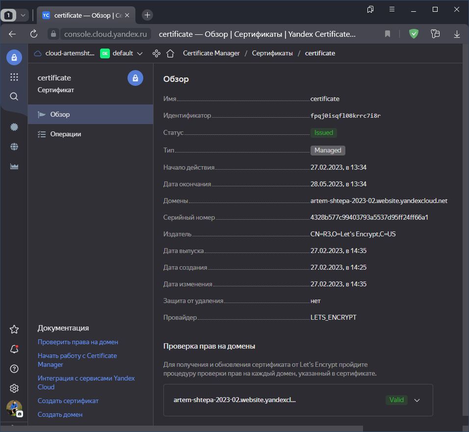
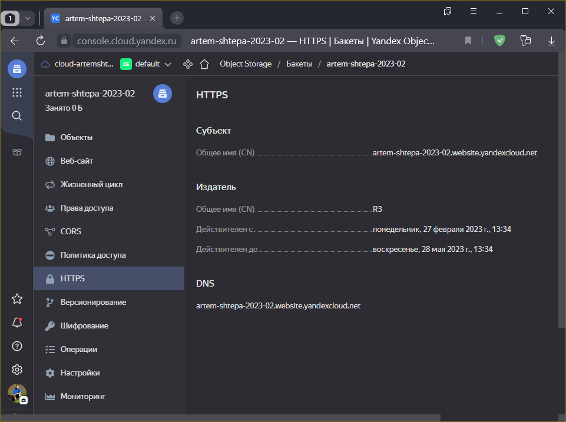
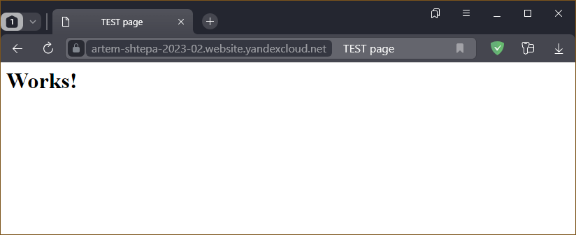
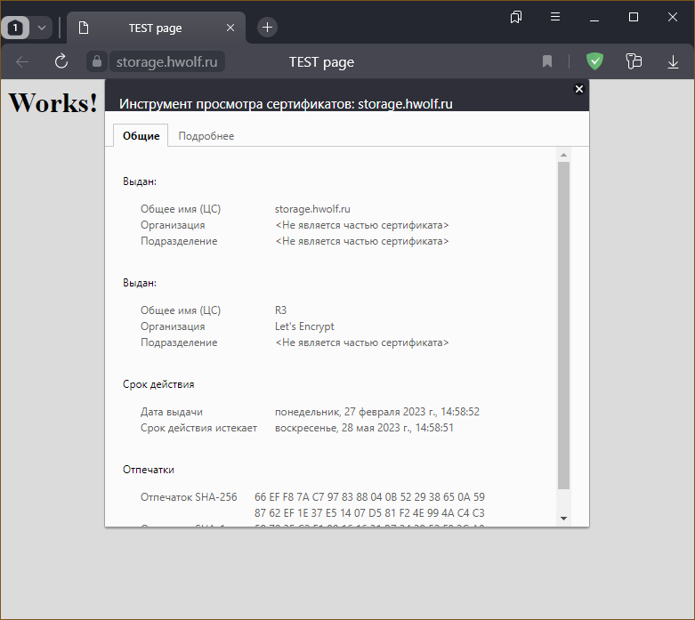

# Домашнее задание по лекции 15.3 "Безопасность в облачных провайдерах"

> Используя конфигурации, выполненные в рамках предыдущих домашних заданиях, нужно добавить возможность шифрования бакета.

## Обязательное задание. Яндекс.Облако

> 1. С помощью ключа в KMS необходимо зашифровать содержимое бакета:
> - Создать ключ в KMS,
> - С помощью ключа зашифровать содержимое бакета, созданного ранее.
> 2. (Выполняется НЕ в terraform) *Создать статический сайт в Object Storage c собственным публичным адресом и сделать доступным по **HTTPS**
> - Создать сертификат,
> - Создать статическую страницу в Object Storage и применить сертификат **HTTPS**,
> - В качестве результата предоставить скриншот на страницу с сертификатом в заголовке ("замочек").
> 
> Документация
> - [Настройка HTTPS статичного сайта](https://cloud.yandex.ru/docs/storage/operations/hosting/certificate)
> - [Object storage bucket](https://registry.terraform.io/providers/yandex-cloud/yandex/latest/docs/resources/storage_bucket)
> - [KMS key](https://registry.terraform.io/providers/yandex-cloud/yandex/latest/docs/resources/kms_symmetric_key)

### 1. Шифроание содержимого бакета

Перед шифрование бакета нужно создать ключ шифрования.
Ключи генерируются специальным сервисом - **KMS** - [Key Management Service](https://cloud.yandex.ru/docs/kms/)

Код формирования ключа

```terraform
resource "yandex_kms_symmetric_key" "key-a" {
  name              = "storage-key"
  default_algorithm = "AES_256"
  rotation_period   = "720h"
  lifecycle {
    prevent_destroy = false
  }
}
```

Возможные алгоритмы шифрования **default_algorithm**: `AES_128`, `AES_192` и `AES_256`

Парамтер `rotation_period` означает необходимую частоту смены версии ключа.
При указании параметра ключ будет автоматически обновляться по истечении заданного периода.
Удаление параметра отключит автоматическое обновление ключа.

Блок `lifecycle` необходим, чтобы обезопасить ключ от удаления. Например, командой `terraform destroy`.

Для шифрования бакета нужно в ресурс его создания добавить следующий блок

```terraform
  server_side_encryption_configuration {
    rule {
      apply_server_side_encryption_by_default {
        kms_master_key_id = yandex_kms_symmetric_key.key-a.id
        sse_algorithm     = "aws:kms"
      }
    }
  }
```
> Использовалась инструкция: [yandex_storage_bucket](https://registry.tfpla.net/providers/yandex-cloud/yandex/latest/docs/resources/storage_bucket#using-sse)

:exclamation: При шифровании содержимого бакета открыть файлы через Web интерфейст хранилища
становится невозможно из-за ошибки доступа, не смотря на разрешённый анонимный доступ и
добавление максимальных прав (`admin`) всем пользователям `allUsers`, как на ключ шифрования,
так и на бакет. В документации про [выгрузку файлов](https://cloud.yandex.ru/docs/storage/operations/objects/download) упоминается только **Консоль управления**
(Этот способ приводит к аналогичной ошибке).
Однако, из инструкции к API запросу [get](https://cloud.yandex.ru/docs/storage/s3/api-ref/object/get) следует, что объект
возвращается как есть, то есть в зашифрованном виде, только при этом добавляются дополнительные
заголовки с указанием метода шифрования и идентификатор **KMS** ключа с которым было произведено
шифрование. Как выполняется расшифровка и кто её должен делать - тайна.

---

### 2. Создание статического сайта и применение сертификата

Для создания статического сайта достаточно в блок создания бакета добавить блок 

```terraform
  website {
    index_document = "index.html"
    error_document = "error.html"
  }
```

В блоке указывается начальная страница **index_document** и страница ошибки **error_document**,
и для функционирования статического сайта эти файлы нужно загурзить в бакет с соответствующими
ключами.

Для сайта можно загрузить свой сертификат, либо воспользоваться специальным сервисом Яндекса,
который сгенерирует сертификат и поставит его в очередь на валидацию (подтверждение подлинности).
Валидация может быть произведена [несколькими способами](https://cloud.yandex.ru/docs/certificate-manager/concepts/challenges).
Для решения выбрана **HTTP** проверка, заключающаяся в валидации содержимого файла,
расположенного на сайте домена по определённому пути. Другими словами достаточно записать в
хранилище файл с нужным идентификатором и нужным содержимым - это параметры получаются
при создании ресурса `yandex_cm_certificate`

Готовый блок создания подобного ресурса:

```terraform
resource "yandex_cm_certificate" "cert" {
  name    = "certificate"
  domains = var.DOMAINS

  managed {
    challenge_type = "HTTP"
  }
}
```

где в переменной `var.DOMAINS` передаётся список или один домен,
права на который нужно подтвердить, а `challenge_type` - выбранный тип проверки.

При создании данного ресурса провайдером заполняются поля, используемые при создании проверочного файла в бакете

```terraform
output "cert_id" {
  value = "${yandex_cm_certificate.cert.id}"
}

output "challenge_url" {
  value = "${yandex_cm_certificate.cert.challenges[0].http_url}"
}

output "challenge_value" {
  value = "${yandex_cm_certificate.cert.challenges[0].http_content}"
}
```
где `challenge_url` - URL проверочного файла, а `challenge_value` - его содержимое

В консоли управления для статического сайта можно выбрать только такой сертификат, в списке
доменов которого есть имя, в точности совпадающее с именем бакета. То есть для корректной работы
нужен действующий собственный домен, который можно перенаправить на созданное в **Яндекс.Облаке** хранилище.

Однако, данное ограничение можно обойти, присвоив статическому сайту идентификатор сертификата,
напрмиер, через **Terraform**, для чего в коде создания бакета нужно добавить блок

```terraform
  https {
    certificate_id = module.cert[0].cert_id
  }
```

Не имея своего доменного имени можно в качестве домена использовать адресацию бакета или
статического сайта в **Яндекс.Облаке**, то есть `<bucket>.storage.yandexcloud.net` или
`<bucket>.website.yandexcloud.net`, где `<bucket>` - имя бакета.

Исходный код представлен в каталоге [src/terraform](./src/terraform/)

В основном файле [main.tf](./src/terraform/main.tf) есть переменная `DOMAIN`.
При её использовании сертификат будет генерироваться на указанный подконтрольный домен,
иначе на адрес статического сайта бакета в **Яндекс.Облаке**.

Результат разворачивания инфраструктуры без собственного доменного имени:



Сертификат успешно прошел проверку



Статический сайт, вроде, должен его использовать. По меньшей мери он подключен.



Соединение защищено. Однако, при детальном изучении окажется, что используемый сертификат не наш, а более высокоуровневый **Яндекс.Облака**.
То есть, даже если не включать **HTTPS** для статического сайта при использовании адресации **Яндекс.Облака**, по умолчанию, **HTTPS** используется.

Однако, при использовании своего домена сертификат Яндекса уже не подойдёт.

Результат разворачивания инфраструктцры с собственным доменом:



Детализация используемого сертификата подтверждает, что он наш.

---

Исходный код всех файлов и скриптов представлен в каталоге [src](./src)

---

<details>
<summary><strike>Задание 2*. AWS (необязательное к выполнению)</strike></summary>

1. С помощью роли IAM записать файлы ЕС2 в S3-бакет:
- Создать роль в IAM для возможности записи в S3 бакет;
- Применить роль к ЕС2-инстансу;
- С помощью бутстрап скрипта записать в бакет файл web-страницы.
2. Организация шифрования содержимого S3-бакета:
- Используя конфигурации, выполненные в рамках ДЗ на предыдущем занятии, добавить к созданному ранее bucket S3 возможность шифрования Server-Side, используя общий ключ;
- Включить шифрование SSE-S3 bucket S3 для шифрования всех вновь добавляемых объектов в данный bucket.
3. *Создание сертификата SSL и применение его к ALB:
- Создать сертификат с подтверждением по email;
- Сделать запись в Route53 на собственный поддомен, указав адрес LB;
- Применить к HTTPS запросам на LB созданный ранее сертификат.

Resource terraform
- [IAM Role](https://registry.terraform.io/providers/hashicorp/aws/latest/docs/resources/iam_role)
- [AWS KMS](https://registry.terraform.io/providers/hashicorp/aws/latest/docs/resources/kms_key)
- [S3 encrypt with KMS key](https://registry.terraform.io/providers/hashicorp/aws/latest/docs/resources/s3_bucket_object#encrypting-with-kms-key)

Пример bootstrap-скрипта:
```
#!/bin/bash
yum install httpd -y
service httpd start
chkconfig httpd on
cd /var/www/html
echo "<html><h1>My cool web-server</h1></html>" > index.html
aws s3 mb s3://mysuperbacketname2021
aws s3 cp index.html s3://mysuperbacketname2021
```

</details>