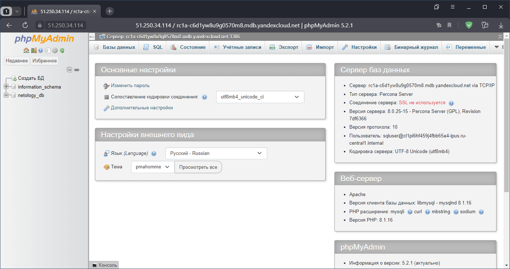

# Домашнее задание по лекции 15.4 "Кластеры. Ресурсы под управлением облачных провайдеров"

> Организация кластера Kubernetes и кластера баз данных MySQL в отказоустойчивой архитектуре.
> Размещение в private подсетях кластера БД, а в public - кластера Kubernetes.

---

## Обязательное задание 1. Яндекс.Облако

> 1. Настроить с помощью Terraform кластер баз данных MySQL:
> - Используя настройки VPC с предыдущих ДЗ, добавить дополнительно подсеть private в разных зонах, чтобы обеспечить отказоустойчивость 
> - Разместить ноды кластера MySQL в разных подсетях
> - Необходимо предусмотреть репликацию с произвольным временем технического обслуживания
> - Использовать окружение PRESTABLE, платформу Intel Broadwell с производительностью 50% CPU и размером диска 20 Гб
> - Задать время начала резервного копирования - 23:59
> - Включить защиту кластера от непреднамеренного удаления
> - Создать БД с именем `netology_db` c логином и паролем
> 
> 2. Настроить с помощью Terraform кластер Kubernetes
> - Используя настройки VPC с предыдущих ДЗ, добавить дополнительно 2 подсети public в разных зонах, чтобы обеспечить отказоустойчивость
> - Создать отдельный сервис-аккаунт с необходимыми правами 
> - Создать региональный мастер kubernetes с размещением нод в разных 3 подсетях
> - Добавить возможность шифрования ключом из KMS, созданного в предыдущем ДЗ
> - Создать группу узлов состояющую из 3 машин с автомасштабированием до 6
> - Подключиться к кластеру с помощью `kubectl`
> - *Запустить микросервис phpmyadmin и подключиться к БД, созданной ранее
> - *Создать сервис типы Load Balancer и подключиться к phpmyadmin. Предоставить скриншот с публичным адресом и подключением к БД
>
> Документация
> - [MySQL cluster](https://registry.terraform.io/providers/yandex-cloud/yandex/latest/docs/resources/mdb_mysql_cluster)
> - [Создание кластера kubernetes](https://cloud.yandex.ru/docs/managed-kubernetes/operations/kubernetes-cluster/kubernetes-cluster-create)
> - [K8S Cluster](https://registry.terraform.io/providers/yandex-cloud/yandex/latest/docs/resources/kubernetes_cluster)
> - [K8S node group](https://registry.terraform.io/providers/yandex-cloud/yandex/latest/docs/resources/kubernetes_node_group)

### Подготовка

Создание сетевой инфраструктуры выделено в файл манифеста [network.tf](./src/terraform/network.tf)

Манифест создаёт основную сеть и следующие подсети:
  - `192.168.21.0/24` с именем `mysql-subnet-a` в зоне доступности `ru-central1-a` для кластера **MySQL**
  - `192.168.22.0/24` с именем `mysql-subnet-b` в зоне доступности `ru-central1-b` для кластера **MySQL**
  - `192.168.11.0/24` с именем `kube-subnet-a` в зоне доступности `ru-central1-a` для кластера **Kubernetes**
  - `192.168.12.0/24` с именем `kube-subnet-b` в зоне доступности `ru-central1-b` для кластера **Kubernetes**
  - `192.168.13.0/24` с именем `kube-subnet-c` в зоне доступности `ru-central1-c` для кластера **Kubernetes**

Создание сервисного аккаунта и назначение ему необходимых прав выделено в файл манифеста [service-account.tf](./src/terraform/network.tf)

### 1. Настройка с помощью **Terraform** кластера базы данных **MySQL**

Для написания манифеста создания кластера **MySQL** использовались следующие инструкции:
  - [Создание MySQL-кластера](https://cloud.yandex.ru/docs/managed-mysql/operations/cluster-create)
  - [Классы хостов MySQL](https://cloud.yandex.ru/docs/managed-mysql/concepts/instance-types)
  - [yandex_mdb_mysql_cluster](https://registry.tfpla.net/providers/yandex-cloud/yandex/latest/docs/resources/mdb_mysql_cluster)
  - [yandex_mdb_mysql_database](https://registry.tfpla.net/providers/yandex-cloud/yandex/latest/docs/resources/mdb_mysql_database)
  - [yandex_mdb_mysql_user](https://registry.tfpla.net/providers/yandex-cloud/yandex/latest/docs/resources/mdb_mysql_user)

Сам кластер создаётся ресурсом [yandex_mdb_mysql_cluster](https://registry.tfpla.net/providers/yandex-cloud/yandex/latest/docs/resources/mdb_mysql_cluster), который включает:
  - Настройку производительности хостов - доступен только выбор класса, полный список которых перечислен в инструкции [Классы хостов MySQL](https://cloud.yandex.ru/docs/managed-mysql/concepts/instance-types). Соответствующим условию задачи является класс `b1.medium`
  - Параметр `deletion_protection`, регулирующий защиту от преднамеренного удаления (в решении для простоты защита отключена)
  - Параметр `environment` устанавливающий используемое окружение
  - Настройку репликации в блоке `maintenance_window`, где задано произвольное окно обслуживания: `type = "ANYTIME"`, иначе нужно установить тип `type = "WEEKLY"` и задать день недели `day` и час `hour`
  - Настройку резервного копирования в блоке `backup_window_start`
  - Задание хостов СУБД в серии блоков `host`, где нужно указать регион `zone` и идентификатор подсети `subnet_id` в этом регионе

Дополнительно к кластеру необходимо создать ресурс непосредственно базы данных [yandex_mdb_mysql_database](https://registry.tfpla.net/providers/yandex-cloud/yandex/latest/docs/resources/mdb_mysql_database) и пользователя [yandex_mdb_mysql_user](https://registry.tfpla.net/providers/yandex-cloud/yandex/latest/docs/resources/mdb_mysql_user)
Так как **Terraform** старается выполнять задачи параллельно, то может возникнуть ситуация,
когда пользователь СУБД начнёт создаваться в условиях отсутствия базы данных, что приведёт к ошибке.
Чтобы этого избежать для ресурса базы данных добавлена зависимость от ресурса кластера,
а для ресурса пользователя - зависимость от ресурса базы данных.

При создании ресурса пользователя указывается желаемый логин `name`, пароль `password`, используемый **plugin** аутентификации `authentication_plugin` и блок прав доступа `permission`, где указано имя базы `database_name` и используемые роли `roles`

Дополнительный блок `access` активирует возможность исполнения **SQL** команд непосредственно через консоль управления **Яндекс.Облаком** (**web** интерфейс)

Итоговый манифест создания кластера базы данных MySQL представлен в файле манифеста [mysql.tf](./src/terraform/mysql.tf)

---

### 2. Настройка с помощью **Terraform** кластера **Kubernetes**

Для написания манифеста создания кластера **Kubernetes** использовались следующие инструкции:
  - [Создание кластера Kubernetes](https://cloud.yandex.ru/docs/managed-kubernetes/operations/kubernetes-cluster/kubernetes-cluster-create)
  - [yandex_kubernetes_cluster](https://registry.tfpla.net/providers/yandex-cloud/yandex/latest/docs/resources/kubernetes_cluster)
  - [yandex_kubernetes_node_group](https://registry.tfpla.net/providers/yandex-cloud/yandex/latest/docs/resources/kubernetes_node_group)

Для реализации шифрования ключом из **KMS** нужно:
1. Создать сам ключ шифрования - ресурс `yandex_kms_symmetric_key`
2. Добавить в ресурс кластера блок `kms_provider` с идентификатором созданного ключа

Создать одну группу узлов, состоящую из нескольких зон невозможно (не позволяет сам провайдер),
поэтому для реализации задачи было создано три группы узлов, по **1** ноде в каждой (всего **3**)
с автомасштабированием до **2**, что в сумме даст **6** машин.
Чтобы не копировать практически одинаковый и достаточно объёмный код создания группы узлов выделен в отдельный модуль, расположеный в подкаталоге [node-group](./src/terraform/node-group/main.tf)

Итоговый манифест создания кластера **Kubernetes** представлен в файле манифеста [kube.tf](./src/terraform/kube.tf)

---

### Проверка функционирования кластера **Kubernetes**

<details>
<summary>Разворачивание инфраструктуры управляемых Яндекс.Облаком кластеров <b>MySQL</b> и <b>Kubernetes</b></summary>

```console
root@debian11:~/15.4# ./go.sh init
Initializing modules...
- kube-node-group-a in node-group
- kube-node-group-b in node-group
- kube-node-group-c in node-group

Initializing the backend...

Initializing provider plugins...
- Finding yandex-cloud/yandex versions matching ">= 0.70.0"...
- Installing yandex-cloud/yandex v0.85.0...
- Installed yandex-cloud/yandex v0.85.0 (unauthenticated)

Terraform has created a lock file .terraform.lock.hcl to record the provider
selections it made above. Include this file in your version control repository
so that Terraform can guarantee to make the same selections by default when
you run "terraform init" in the future.

╷
│ Warning: Incomplete lock file information for providers
│
│ Due to your customized provider installation methods, Terraform was forced to calculate lock file checksums locally
│ for the following providers:
│   - yandex-cloud/yandex
│
│ The current .terraform.lock.hcl file only includes checksums for linux_amd64, so Terraform running on another
│ platform will fail to install these providers.
│
│ To calculate additional checksums for another platform, run:
│   terraform providers lock -platform=linux_amd64
│ (where linux_amd64 is the platform to generate)
╵

Terraform has been successfully initialized!

You may now begin working with Terraform. Try running "terraform plan" to see
any changes that are required for your infrastructure. All Terraform commands
should now work.

If you ever set or change modules or backend configuration for Terraform,
rerun this command to reinitialize your working directory. If you forget, other
commands will detect it and remind you to do so if necessary.
root@debian11:~/15.4# ./go.sh up

Terraform used the selected providers to generate the following execution plan. Resource actions are indicated with the
following symbols:
  + create

Terraform will perform the following actions:

  # yandex_iam_service_account.sa will be created
  + resource "yandex_iam_service_account" "sa" {
      + created_at = (known after apply)
      + folder_id  = "b1g3ol70h1opu6hr9kie"
      + id         = (known after apply)
      + name       = "sa-test"
    }

  # yandex_kms_symmetric_key.kube-key will be created
  + resource "yandex_kms_symmetric_key" "kube-key" {
      + created_at        = (known after apply)
      + default_algorithm = "AES_256"
      + folder_id         = (known after apply)
      + id                = (known after apply)
      + name              = "kube-kms-key"
      + rotated_at        = (known after apply)
      + rotation_period   = "720h"
      + status            = (known after apply)
    }

  # yandex_kubernetes_cluster.kube-cluster will be created
  + resource "yandex_kubernetes_cluster" "kube-cluster" {
      + cluster_ipv4_range       = (known after apply)
      + cluster_ipv6_range       = (known after apply)
      + created_at               = (known after apply)
      + description              = "Kubernetes Test Cluster"
      + folder_id                = (known after apply)
      + health                   = (known after apply)
      + id                       = (known after apply)
      + labels                   = (known after apply)
      + log_group_id             = (known after apply)
      + name                     = "kube-cluster"
      + network_id               = (known after apply)
      + node_ipv4_cidr_mask_size = 24
      + node_service_account_id  = (known after apply)
      + release_channel          = "STABLE"
      + service_account_id       = (known after apply)
      + service_ipv4_range       = (known after apply)
      + service_ipv6_range       = (known after apply)
      + status                   = (known after apply)

      + kms_provider {
          + key_id = (known after apply)
        }

      + master {
          + cluster_ca_certificate = (known after apply)
          + external_v4_address    = (known after apply)
          + external_v4_endpoint   = (known after apply)
          + external_v6_endpoint   = (known after apply)
          + internal_v4_address    = (known after apply)
          + internal_v4_endpoint   = (known after apply)
          + public_ip              = true
          + version                = "1.23"
          + version_info           = (known after apply)

          + maintenance_policy {
              + auto_upgrade = false
            }

          + regional {
              + region = "ru-central1"

              + location {
                  + subnet_id = (known after apply)
                  + zone      = "ru-central1-a"
                }
              + location {
                  + subnet_id = (known after apply)
                  + zone      = "ru-central1-b"
                }
              + location {
                  + subnet_id = (known after apply)
                  + zone      = "ru-central1-c"
                }
            }

          + zonal {
              + subnet_id = (known after apply)
              + zone      = (known after apply)
            }
        }
    }

  # yandex_mdb_mysql_cluster.mysql-cluster will be created
  + resource "yandex_mdb_mysql_cluster" "mysql-cluster" {
      + allow_regeneration_host   = false
      + backup_retain_period_days = 7
      + created_at                = (known after apply)
      + deletion_protection       = false
      + environment               = "PRESTABLE"
      + folder_id                 = (known after apply)
      + health                    = (known after apply)
      + host_group_ids            = (known after apply)
      + id                        = (known after apply)
      + mysql_config              = (known after apply)
      + name                      = "mysql-cluster"
      + network_id                = (known after apply)
      + status                    = (known after apply)
      + version                   = "8.0"

      + access {
          + data_lens     = false
          + data_transfer = false
          + web_sql       = true
        }

      + backup_window_start {
          + hours   = 23
          + minutes = 59
        }

      + host {
          + assign_public_ip   = false
          + fqdn               = (known after apply)
          + replication_source = (known after apply)
          + subnet_id          = (known after apply)
          + zone               = "ru-central1-a"
        }
      + host {
          + assign_public_ip   = false
          + fqdn               = (known after apply)
          + replication_source = (known after apply)
          + subnet_id          = (known after apply)
          + zone               = "ru-central1-b"
        }

      + maintenance_window {
          + type = "ANYTIME"
        }

      + performance_diagnostics {
          + enabled                      = (known after apply)
          + sessions_sampling_interval   = (known after apply)
          + statements_sampling_interval = (known after apply)
        }

      + resources {
          + disk_size          = 20
          + disk_type_id       = "network-ssd"
          + resource_preset_id = "b1.medium"
        }
    }

  # yandex_mdb_mysql_database.mysql-db will be created
  + resource "yandex_mdb_mysql_database" "mysql-db" {
      + cluster_id = (known after apply)
      + id         = (known after apply)
      + name       = "netology_db"
    }

  # yandex_mdb_mysql_user.mysql-user will be created
  + resource "yandex_mdb_mysql_user" "mysql-user" {
      + authentication_plugin = "SHA256_PASSWORD"
      + cluster_id            = (known after apply)
      + global_permissions    = (known after apply)
      + id                    = (known after apply)
      + name                  = "sqluser"
      + password              = (sensitive value)

      + connection_limits {
          + max_connections_per_hour = (known after apply)
          + max_questions_per_hour   = (known after apply)
          + max_updates_per_hour     = (known after apply)
          + max_user_connections     = (known after apply)
        }

      + permission {
          + database_name = "netology_db"
          + roles         = [
              + "ALL",
            ]
        }
    }

  # yandex_resourcemanager_folder_iam_binding.sa-editor will be created
  + resource "yandex_resourcemanager_folder_iam_binding" "sa-editor" {
      + folder_id = "b1g3ol70h1opu6hr9kie"
      + id        = (known after apply)
      + members   = (known after apply)
      + role      = "editor"
    }

  # yandex_vpc_network.my-net will be created
  + resource "yandex_vpc_network" "my-net" {
      + created_at                = (known after apply)
      + default_security_group_id = (known after apply)
      + folder_id                 = (known after apply)
      + id                        = (known after apply)
      + labels                    = (known after apply)
      + name                      = "master-network"
      + subnet_ids                = (known after apply)
    }

  # yandex_vpc_subnet.kube-sn-a will be created
  + resource "yandex_vpc_subnet" "kube-sn-a" {
      + created_at     = (known after apply)
      + folder_id      = (known after apply)
      + id             = (known after apply)
      + labels         = (known after apply)
      + name           = "kube-subnet-a"
      + network_id     = (known after apply)
      + v4_cidr_blocks = [
          + "192.168.11.0/24",
        ]
      + v6_cidr_blocks = (known after apply)
      + zone           = "ru-central1-a"
    }

  # yandex_vpc_subnet.kube-sn-b will be created
  + resource "yandex_vpc_subnet" "kube-sn-b" {
      + created_at     = (known after apply)
      + folder_id      = (known after apply)
      + id             = (known after apply)
      + labels         = (known after apply)
      + name           = "kube-subnet-b"
      + network_id     = (known after apply)
      + v4_cidr_blocks = [
          + "192.168.12.0/24",
        ]
      + v6_cidr_blocks = (known after apply)
      + zone           = "ru-central1-b"
    }

  # yandex_vpc_subnet.kube-sn-c will be created
  + resource "yandex_vpc_subnet" "kube-sn-c" {
      + created_at     = (known after apply)
      + folder_id      = (known after apply)
      + id             = (known after apply)
      + labels         = (known after apply)
      + name           = "kube-subnet-c"
      + network_id     = (known after apply)
      + v4_cidr_blocks = [
          + "192.168.13.0/24",
        ]
      + v6_cidr_blocks = (known after apply)
      + zone           = "ru-central1-c"
    }

  # yandex_vpc_subnet.mysql-sn-a will be created
  + resource "yandex_vpc_subnet" "mysql-sn-a" {
      + created_at     = (known after apply)
      + folder_id      = (known after apply)
      + id             = (known after apply)
      + labels         = (known after apply)
      + name           = "mysql-subnet-a"
      + network_id     = (known after apply)
      + v4_cidr_blocks = [
          + "192.168.21.0/24",
        ]
      + v6_cidr_blocks = (known after apply)
      + zone           = "ru-central1-a"
    }

  # yandex_vpc_subnet.mysql-sn-b will be created
  + resource "yandex_vpc_subnet" "mysql-sn-b" {
      + created_at     = (known after apply)
      + folder_id      = (known after apply)
      + id             = (known after apply)
      + labels         = (known after apply)
      + name           = "mysql-subnet-b"
      + network_id     = (known after apply)
      + v4_cidr_blocks = [
          + "192.168.22.0/24",
        ]
      + v6_cidr_blocks = (known after apply)
      + zone           = "ru-central1-b"
    }

  # module.kube-node-group-a.yandex_kubernetes_node_group.kube-node-group will be created
  + resource "yandex_kubernetes_node_group" "kube-node-group" {
      + cluster_id        = (known after apply)
      + created_at        = (known after apply)
      + description       = "Kubernetes Node Group A"
      + id                = (known after apply)
      + instance_group_id = (known after apply)
      + labels            = (known after apply)
      + name              = "kube-node-group-a"
      + status            = (known after apply)
      + version           = "1.23"
      + version_info      = (known after apply)

      + allocation_policy {
          + location {
              + subnet_id = (known after apply)
              + zone      = "ru-central1-a"
            }
        }

      + deploy_policy {
          + max_expansion   = (known after apply)
          + max_unavailable = (known after apply)
        }

      + instance_template {
          + metadata                  = (known after apply)
          + nat                       = (known after apply)
          + network_acceleration_type = (known after apply)
          + platform_id               = "standard-v1"

          + boot_disk {
              + size = 50
              + type = "network-hdd"
            }

          + container_runtime {
              + type = "containerd"
            }

          + network_interface {
              + ipv4       = true
              + ipv6       = (known after apply)
              + nat        = true
              + subnet_ids = (known after apply)
            }

          + resources {
              + core_fraction = (known after apply)
              + cores         = 2
              + gpus          = 0
              + memory        = 2
            }

          + scheduling_policy {
              + preemptible = false
            }
        }

      + maintenance_policy {
          + auto_repair  = true
          + auto_upgrade = false

          + maintenance_window {
              + day        = "monday"
              + duration   = "3h"
              + start_time = "15:00"
            }
        }

      + scale_policy {
          + auto_scale {
              + initial = 1
              + max     = 2
              + min     = 1
            }
        }
    }

  # module.kube-node-group-b.yandex_kubernetes_node_group.kube-node-group will be created
  + resource "yandex_kubernetes_node_group" "kube-node-group" {
      + cluster_id        = (known after apply)
      + created_at        = (known after apply)
      + description       = "Kubernetes Node Group B"
      + id                = (known after apply)
      + instance_group_id = (known after apply)
      + labels            = (known after apply)
      + name              = "kube-node-group-b"
      + status            = (known after apply)
      + version           = "1.23"
      + version_info      = (known after apply)

      + allocation_policy {
          + location {
              + subnet_id = (known after apply)
              + zone      = "ru-central1-b"
            }
        }

      + deploy_policy {
          + max_expansion   = (known after apply)
          + max_unavailable = (known after apply)
        }

      + instance_template {
          + metadata                  = (known after apply)
          + nat                       = (known after apply)
          + network_acceleration_type = (known after apply)
          + platform_id               = "standard-v1"

          + boot_disk {
              + size = 50
              + type = "network-hdd"
            }

          + container_runtime {
              + type = "containerd"
            }

          + network_interface {
              + ipv4       = true
              + ipv6       = (known after apply)
              + nat        = true
              + subnet_ids = (known after apply)
            }

          + resources {
              + core_fraction = (known after apply)
              + cores         = 2
              + gpus          = 0
              + memory        = 2
            }

          + scheduling_policy {
              + preemptible = false
            }
        }

      + maintenance_policy {
          + auto_repair  = true
          + auto_upgrade = false

          + maintenance_window {
              + day        = "monday"
              + duration   = "3h"
              + start_time = "15:00"
            }
        }

      + scale_policy {
          + auto_scale {
              + initial = 1
              + max     = 2
              + min     = 1
            }
        }
    }

  # module.kube-node-group-c.yandex_kubernetes_node_group.kube-node-group will be created
  + resource "yandex_kubernetes_node_group" "kube-node-group" {
      + cluster_id        = (known after apply)
      + created_at        = (known after apply)
      + description       = "Kubernetes Node Group C"
      + id                = (known after apply)
      + instance_group_id = (known after apply)
      + labels            = (known after apply)
      + name              = "kube-node-group-c"
      + status            = (known after apply)
      + version           = "1.23"
      + version_info      = (known after apply)

      + allocation_policy {
          + location {
              + subnet_id = (known after apply)
              + zone      = "ru-central1-c"
            }
        }

      + deploy_policy {
          + max_expansion   = (known after apply)
          + max_unavailable = (known after apply)
        }

      + instance_template {
          + metadata                  = (known after apply)
          + nat                       = (known after apply)
          + network_acceleration_type = (known after apply)
          + platform_id               = "standard-v1"

          + boot_disk {
              + size = 50
              + type = "network-hdd"
            }

          + container_runtime {
              + type = "containerd"
            }

          + network_interface {
              + ipv4       = true
              + ipv6       = (known after apply)
              + nat        = true
              + subnet_ids = (known after apply)
            }

          + resources {
              + core_fraction = (known after apply)
              + cores         = 2
              + gpus          = 0
              + memory        = 2
            }

          + scheduling_policy {
              + preemptible = false
            }
        }

      + maintenance_policy {
          + auto_repair  = true
          + auto_upgrade = false

          + maintenance_window {
              + day        = "monday"
              + duration   = "3h"
              + start_time = "15:00"
            }
        }

      + scale_policy {
          + auto_scale {
              + initial = 1
              + max     = 2
              + min     = 1
            }
        }
    }

Plan: 16 to add, 0 to change, 0 to destroy.
yandex_iam_service_account.sa: Creating...
yandex_vpc_network.my-net: Creating...
yandex_kms_symmetric_key.kube-key: Creating...
yandex_kms_symmetric_key.kube-key: Creation complete after 1s [id=abjbekq38n4ac6g9r1mu]
yandex_vpc_network.my-net: Creation complete after 1s [id=enpcctp8a3n9c5np3jr1]
yandex_vpc_subnet.kube-sn-c: Creating...
yandex_vpc_subnet.mysql-sn-b: Creating...
yandex_vpc_subnet.mysql-sn-a: Creating...
yandex_vpc_subnet.kube-sn-b: Creating...
yandex_vpc_subnet.kube-sn-a: Creating...
yandex_iam_service_account.sa: Creation complete after 1s [id=ajeluhmhs0eps9bd1go9]
yandex_resourcemanager_folder_iam_binding.sa-editor: Creating...
yandex_vpc_subnet.kube-sn-b: Creation complete after 1s [id=e2ll1gmtold0nru80gqv]
yandex_vpc_subnet.kube-sn-c: Creation complete after 1s [id=b0cds2ja8lcgqgjerdt9]
yandex_vpc_subnet.mysql-sn-b: Creation complete after 2s [id=e2le77g65m262l9fvvjk]
yandex_resourcemanager_folder_iam_binding.sa-editor: Creation complete after 2s [id=b1g3ol70h1opu6hr9kie/editor]
yandex_vpc_subnet.mysql-sn-a: Creation complete after 3s [id=e9bdrl5b1e98s69d7q92]
yandex_mdb_mysql_cluster.mysql-cluster: Creating...
yandex_vpc_subnet.kube-sn-a: Creation complete after 3s [id=e9b1hqlpdv11pd3qddob]
yandex_kubernetes_cluster.kube-cluster: Creating...
yandex_mdb_mysql_cluster.mysql-cluster: Still creating... [10s elapsed]
yandex_kubernetes_cluster.kube-cluster: Still creating... [10s elapsed]
yandex_mdb_mysql_cluster.mysql-cluster: Still creating... [20s elapsed]
yandex_kubernetes_cluster.kube-cluster: Still creating... [20s elapsed]
yandex_mdb_mysql_cluster.mysql-cluster: Still creating... [30s elapsed]
yandex_kubernetes_cluster.kube-cluster: Still creating... [30s elapsed]
yandex_mdb_mysql_cluster.mysql-cluster: Still creating... [40s elapsed]
yandex_kubernetes_cluster.kube-cluster: Still creating... [40s elapsed]
yandex_mdb_mysql_cluster.mysql-cluster: Still creating... [50s elapsed]
yandex_kubernetes_cluster.kube-cluster: Still creating... [50s elapsed]
yandex_mdb_mysql_cluster.mysql-cluster: Still creating... [1m0s elapsed]
yandex_kubernetes_cluster.kube-cluster: Still creating... [1m0s elapsed]
yandex_mdb_mysql_cluster.mysql-cluster: Still creating... [1m10s elapsed]
yandex_kubernetes_cluster.kube-cluster: Still creating... [1m10s elapsed]
yandex_mdb_mysql_cluster.mysql-cluster: Still creating... [1m20s elapsed]
yandex_kubernetes_cluster.kube-cluster: Still creating... [1m20s elapsed]
yandex_mdb_mysql_cluster.mysql-cluster: Still creating... [1m30s elapsed]
yandex_kubernetes_cluster.kube-cluster: Still creating... [1m30s elapsed]
yandex_mdb_mysql_cluster.mysql-cluster: Still creating... [1m40s elapsed]
yandex_kubernetes_cluster.kube-cluster: Still creating... [1m40s elapsed]
yandex_mdb_mysql_cluster.mysql-cluster: Still creating... [1m50s elapsed]
yandex_kubernetes_cluster.kube-cluster: Still creating... [1m50s elapsed]
yandex_mdb_mysql_cluster.mysql-cluster: Still creating... [2m0s elapsed]
yandex_kubernetes_cluster.kube-cluster: Still creating... [2m0s elapsed]
yandex_mdb_mysql_cluster.mysql-cluster: Still creating... [2m10s elapsed]
yandex_kubernetes_cluster.kube-cluster: Still creating... [2m10s elapsed]
yandex_mdb_mysql_cluster.mysql-cluster: Still creating... [2m20s elapsed]
yandex_kubernetes_cluster.kube-cluster: Still creating... [2m20s elapsed]
yandex_mdb_mysql_cluster.mysql-cluster: Still creating... [2m30s elapsed]
yandex_kubernetes_cluster.kube-cluster: Still creating... [2m30s elapsed]
yandex_mdb_mysql_cluster.mysql-cluster: Still creating... [2m40s elapsed]
yandex_kubernetes_cluster.kube-cluster: Still creating... [2m40s elapsed]
yandex_mdb_mysql_cluster.mysql-cluster: Still creating... [2m50s elapsed]
yandex_kubernetes_cluster.kube-cluster: Still creating... [2m50s elapsed]
yandex_mdb_mysql_cluster.mysql-cluster: Still creating... [3m0s elapsed]
yandex_kubernetes_cluster.kube-cluster: Still creating... [3m0s elapsed]
yandex_mdb_mysql_cluster.mysql-cluster: Still creating... [3m10s elapsed]
yandex_kubernetes_cluster.kube-cluster: Still creating... [3m10s elapsed]
yandex_mdb_mysql_cluster.mysql-cluster: Still creating... [3m20s elapsed]
yandex_kubernetes_cluster.kube-cluster: Still creating... [3m20s elapsed]
yandex_mdb_mysql_cluster.mysql-cluster: Still creating... [3m30s elapsed]
yandex_kubernetes_cluster.kube-cluster: Still creating... [3m30s elapsed]
yandex_mdb_mysql_cluster.mysql-cluster: Still creating... [3m40s elapsed]
yandex_kubernetes_cluster.kube-cluster: Still creating... [3m40s elapsed]
yandex_mdb_mysql_cluster.mysql-cluster: Still creating... [3m50s elapsed]
yandex_kubernetes_cluster.kube-cluster: Still creating... [3m50s elapsed]
yandex_mdb_mysql_cluster.mysql-cluster: Still creating... [4m0s elapsed]
yandex_kubernetes_cluster.kube-cluster: Still creating... [4m0s elapsed]
yandex_mdb_mysql_cluster.mysql-cluster: Still creating... [4m10s elapsed]
yandex_kubernetes_cluster.kube-cluster: Still creating... [4m10s elapsed]
yandex_mdb_mysql_cluster.mysql-cluster: Still creating... [4m20s elapsed]
yandex_kubernetes_cluster.kube-cluster: Still creating... [4m20s elapsed]
yandex_mdb_mysql_cluster.mysql-cluster: Still creating... [4m30s elapsed]
yandex_kubernetes_cluster.kube-cluster: Still creating... [4m30s elapsed]
yandex_mdb_mysql_cluster.mysql-cluster: Still creating... [4m40s elapsed]
yandex_kubernetes_cluster.kube-cluster: Still creating... [4m40s elapsed]
yandex_mdb_mysql_cluster.mysql-cluster: Still creating... [4m50s elapsed]
yandex_kubernetes_cluster.kube-cluster: Still creating... [4m50s elapsed]
yandex_mdb_mysql_cluster.mysql-cluster: Still creating... [5m0s elapsed]
yandex_kubernetes_cluster.kube-cluster: Still creating... [5m0s elapsed]
yandex_kubernetes_cluster.kube-cluster: Creation complete after 5m7s [id=cat54284dtkoq0nebjfn]
module.kube-node-group-c.yandex_kubernetes_node_group.kube-node-group: Creating...
module.kube-node-group-a.yandex_kubernetes_node_group.kube-node-group: Creating...
module.kube-node-group-b.yandex_kubernetes_node_group.kube-node-group: Creating...
yandex_mdb_mysql_cluster.mysql-cluster: Still creating... [5m10s elapsed]
module.kube-node-group-a.yandex_kubernetes_node_group.kube-node-group: Still creating... [10s elapsed]
module.kube-node-group-c.yandex_kubernetes_node_group.kube-node-group: Still creating... [10s elapsed]
module.kube-node-group-b.yandex_kubernetes_node_group.kube-node-group: Still creating... [10s elapsed]
yandex_mdb_mysql_cluster.mysql-cluster: Still creating... [5m20s elapsed]
module.kube-node-group-b.yandex_kubernetes_node_group.kube-node-group: Still creating... [20s elapsed]
module.kube-node-group-c.yandex_kubernetes_node_group.kube-node-group: Still creating... [20s elapsed]
module.kube-node-group-a.yandex_kubernetes_node_group.kube-node-group: Still creating... [20s elapsed]
yandex_mdb_mysql_cluster.mysql-cluster: Still creating... [5m30s elapsed]
module.kube-node-group-b.yandex_kubernetes_node_group.kube-node-group: Still creating... [30s elapsed]
module.kube-node-group-c.yandex_kubernetes_node_group.kube-node-group: Still creating... [30s elapsed]
module.kube-node-group-a.yandex_kubernetes_node_group.kube-node-group: Still creating... [30s elapsed]
yandex_mdb_mysql_cluster.mysql-cluster: Still creating... [5m41s elapsed]
module.kube-node-group-a.yandex_kubernetes_node_group.kube-node-group: Still creating... [40s elapsed]
module.kube-node-group-c.yandex_kubernetes_node_group.kube-node-group: Still creating... [40s elapsed]
module.kube-node-group-b.yandex_kubernetes_node_group.kube-node-group: Still creating... [40s elapsed]
yandex_mdb_mysql_cluster.mysql-cluster: Still creating... [5m51s elapsed]
module.kube-node-group-b.yandex_kubernetes_node_group.kube-node-group: Still creating... [51s elapsed]
module.kube-node-group-a.yandex_kubernetes_node_group.kube-node-group: Still creating... [51s elapsed]
module.kube-node-group-c.yandex_kubernetes_node_group.kube-node-group: Still creating... [51s elapsed]
yandex_mdb_mysql_cluster.mysql-cluster: Still creating... [6m1s elapsed]
module.kube-node-group-c.yandex_kubernetes_node_group.kube-node-group: Still creating... [1m1s elapsed]
module.kube-node-group-b.yandex_kubernetes_node_group.kube-node-group: Still creating... [1m1s elapsed]
module.kube-node-group-a.yandex_kubernetes_node_group.kube-node-group: Still creating... [1m1s elapsed]
yandex_mdb_mysql_cluster.mysql-cluster: Still creating... [6m11s elapsed]
module.kube-node-group-a.yandex_kubernetes_node_group.kube-node-group: Still creating... [1m11s elapsed]
module.kube-node-group-b.yandex_kubernetes_node_group.kube-node-group: Still creating... [1m11s elapsed]
module.kube-node-group-c.yandex_kubernetes_node_group.kube-node-group: Still creating... [1m11s elapsed]
yandex_mdb_mysql_cluster.mysql-cluster: Still creating... [6m21s elapsed]
module.kube-node-group-c.yandex_kubernetes_node_group.kube-node-group: Still creating... [1m21s elapsed]
module.kube-node-group-b.yandex_kubernetes_node_group.kube-node-group: Still creating... [1m21s elapsed]
module.kube-node-group-a.yandex_kubernetes_node_group.kube-node-group: Still creating... [1m21s elapsed]
yandex_mdb_mysql_cluster.mysql-cluster: Still creating... [6m31s elapsed]
module.kube-node-group-a.yandex_kubernetes_node_group.kube-node-group: Still creating... [1m31s elapsed]
module.kube-node-group-b.yandex_kubernetes_node_group.kube-node-group: Still creating... [1m31s elapsed]
module.kube-node-group-c.yandex_kubernetes_node_group.kube-node-group: Still creating... [1m31s elapsed]
yandex_mdb_mysql_cluster.mysql-cluster: Still creating... [6m41s elapsed]
module.kube-node-group-c.yandex_kubernetes_node_group.kube-node-group: Still creating... [1m41s elapsed]
module.kube-node-group-a.yandex_kubernetes_node_group.kube-node-group: Still creating... [1m41s elapsed]
module.kube-node-group-b.yandex_kubernetes_node_group.kube-node-group: Still creating... [1m41s elapsed]
yandex_mdb_mysql_cluster.mysql-cluster: Still creating... [6m51s elapsed]
module.kube-node-group-a.yandex_kubernetes_node_group.kube-node-group: Still creating... [1m51s elapsed]
module.kube-node-group-c.yandex_kubernetes_node_group.kube-node-group: Still creating... [1m51s elapsed]
module.kube-node-group-b.yandex_kubernetes_node_group.kube-node-group: Still creating... [1m51s elapsed]
yandex_mdb_mysql_cluster.mysql-cluster: Still creating... [7m1s elapsed]
module.kube-node-group-b.yandex_kubernetes_node_group.kube-node-group: Creation complete after 1m54s [id=cat8u55op02svov63cd2]
module.kube-node-group-c.yandex_kubernetes_node_group.kube-node-group: Creation complete after 1m56s [id=catc601c57efn6av9ksj]
module.kube-node-group-a.yandex_kubernetes_node_group.kube-node-group: Still creating... [2m1s elapsed]
yandex_mdb_mysql_cluster.mysql-cluster: Still creating... [7m11s elapsed]
module.kube-node-group-a.yandex_kubernetes_node_group.kube-node-group: Creation complete after 2m6s [id=catoktsbudtk4kk51b4f]
yandex_mdb_mysql_cluster.mysql-cluster: Still creating... [7m21s elapsed]
yandex_mdb_mysql_cluster.mysql-cluster: Still creating... [7m31s elapsed]
yandex_mdb_mysql_cluster.mysql-cluster: Still creating... [7m41s elapsed]
yandex_mdb_mysql_cluster.mysql-cluster: Still creating... [7m51s elapsed]
yandex_mdb_mysql_cluster.mysql-cluster: Still creating... [8m1s elapsed]
yandex_mdb_mysql_cluster.mysql-cluster: Still creating... [8m11s elapsed]
yandex_mdb_mysql_cluster.mysql-cluster: Still creating... [8m21s elapsed]
yandex_mdb_mysql_cluster.mysql-cluster: Creation complete after 8m24s [id=c9q6lc8q5vo079o35ld3]
yandex_mdb_mysql_database.mysql-db: Creating...
yandex_mdb_mysql_database.mysql-db: Still creating... [10s elapsed]
yandex_mdb_mysql_database.mysql-db: Still creating... [20s elapsed]
yandex_mdb_mysql_database.mysql-db: Still creating... [30s elapsed]
yandex_mdb_mysql_database.mysql-db: Still creating... [40s elapsed]
yandex_mdb_mysql_database.mysql-db: Still creating... [50s elapsed]
yandex_mdb_mysql_database.mysql-db: Still creating... [1m1s elapsed]
yandex_mdb_mysql_database.mysql-db: Creation complete after 1m2s [id=c9q6lc8q5vo079o35ld3:netology_db]
yandex_mdb_mysql_user.mysql-user: Creating...
yandex_mdb_mysql_user.mysql-user: Still creating... [10s elapsed]
yandex_mdb_mysql_user.mysql-user: Still creating... [20s elapsed]
yandex_mdb_mysql_user.mysql-user: Creation complete after 23s [id=c9q6lc8q5vo079o35ld3:sqluser]

Apply complete! Resources: 16 added, 0 changed, 0 destroyed.
root@debian11:~/15.4#
```

</details>

Для управления кластером **Kubernetes** нужно настроить `~/.kube/config`.
Утилита **Yandex Cloud CLI** позволяет получить нужные данные для настройки доступа к
управлению кластером и даже больше - сама внесён необходимые изменения в существующий файл.
Достуточно её запустить со следующими параметрами: `yc k8s cluster get-credentials --external --name <cluster>`, где `<cluster>` - имя управляемого **Яндекс.Облаком** кластера **Kubernetes**

```console
root@debian11:~/15.4# yc k8s cluster get-credentials --external --name kube-cluster

Context 'yc-kube-cluster' was added as default to kubeconfig '/root/.kube/config'.
Check connection to cluster using 'kubectl cluster-info --kubeconfig /root/.kube/config'.

Note, that authentication depends on 'yc' and its config profile 'default'.
To access clusters using the Kubernetes API, please use Kubernetes Service Account.
root@debian11:~/15.4# kubectl get nodes -o wide
NAME                        STATUS   ROLES    AGE   VERSION   INTERNAL-IP     EXTERNAL-IP      OS-IMAGE             KERNEL-VERSION      CONTAINER-RUNTIME
cl12cv524dci1jm6f5kn-oteg   Ready    <none>   81m   v1.23.6   192.168.12.18   51.250.31.45     Ubuntu 20.04.4 LTS   5.4.0-124-generic   containerd://1.6.7
cl12g95q8rnke6i3cm5n-ofex   Ready    <none>   81m   v1.23.6   192.168.11.22   84.201.134.175   Ubuntu 20.04.4 LTS   5.4.0-124-generic   containerd://1.6.7
cl1pi6hf459j4fbb65a4-ipus   Ready    <none>   81m   v1.23.6   192.168.13.7    51.250.35.63     Ubuntu 20.04.4 LTS   5.4.0-124-generic   containerd://1.6.7
root@debian11:~/15.4#
```

### Запустить микросервис **phpmyadmin**

Среди результата поиска образа **phpmyadmin** на [Docker Hub](https://hub.docker.com/search?q=phpmyadmin)
выделяются два образа - [phpmyadmin](https://hub.docker.com/_/phpmyadmin) и [bitnami/phpmyadmin](https://hub.docker.com/r/bitnami/phpmyadmin)

Выбор пал на второй, от **bitnami** по следующим соображениям:
  - Оба образа созданы на основе **Debian11**, но образ **bitnami** меньшего размера
  - При исследовании обоих образов, по **HTTPS** у меня заработал только образ **bitnami**
  - В описании образа **bitnami** есть готовая инструкция по разворачиванию **pod** **Kubernetes** (реализовано через **Helm chart**)

Разворачивание **phpmyadmin** в соответствии с [инструкцией](https://github.com/bitnami/charts/tree/main/bitnami/phpmyadmin)

```console
root@debian11:~/15.4# helm repo add bitnami https://charts.bitnami.com/bitnami
"bitnami" has been added to your repositories
root@debian11:~/15.4# helm install phpmyadmin bitnami/phpmyadmin
NAME: phpmyadmin
LAST DEPLOYED: Wed Mar  1 17:53:25 2023
NAMESPACE: default
STATUS: deployed
REVISION: 1
TEST SUITE: None
NOTES:
CHART NAME: phpmyadmin
CHART VERSION: 10.4.4
APP VERSION: 5.2.1

** Please be patient while the chart is being deployed **

1. Get the application URL by running these commands:

  echo "phpMyAdmin URL: http://127.0.0.1:80"
  kubectl port-forward --namespace default svc/phpmyadmin 80:80

2. How to log in
phpMyAdmin has not been configure to point to a specific database. Please provide the db host,
username and password at log in or upgrade the release with a specific database:

$ helm upgrade phpmyadmin my-repo/phpmyadmin --set db.host=mydb
root@debian11:~/15.4#
```

Вывод **NOTES.txt** говорит о том, что **phpmyadmin** сконфигурирован на определённую базу данных.
В общем, нужно обновить(переустановить) **pod** с параметром `db.host` (что, кстати, также указано в инструкции),
в котором указать хост СУБД.

Чтобы узнать хост СУБД воспользуемся командами **Yandex CLoud CLI**, а именно: `yc mysql host list --cluster-name <cluster>`, где `<cluster>` - имя кластера **MySQL**

```console
root@debian11:~/15.4# yc mysql host list --cluster-name mysql-cluster
+-------------------------------------------+----------------------+---------+--------+---------------+-----------+--------------------+----------+-----------------+
|                   NAME                    |      CLUSTER ID      |  ROLE   | HEALTH |    ZONE ID    | PUBLIC IP | REPLICATION SOURCE | PRIORITY | BACKUP PRIORITY |
+-------------------------------------------+----------------------+---------+--------+---------------+-----------+--------------------+----------+-----------------+
| rc1a-c6d1yw8u9g0570m8.mdb.yandexcloud.net | c9q6lc8q5vo079o35ld3 | MASTER  | ALIVE  | ru-central1-a | false     |                    |        0 |               0 |
| rc1b-mrm1r58b5tkcki8t.mdb.yandexcloud.net | c9q6lc8q5vo079o35ld3 | REPLICA | ALIVE  | ru-central1-b | false     |                    |        0 |               0 |
+-------------------------------------------+----------------------+---------+--------+---------------+-----------+--------------------+----------+-----------------+

root@debian11:~/15.4#
```

Обновление **pod**

```console
root@debian11:~/15.4# helm upgrade phpmyadmin bitnami/phpmyadmin --set db.host=rc1a-c6d1yw8u9g0570m8.mdb.yandexcloud.net
Release "phpmyadmin" has been upgraded. Happy Helming!
NAME: phpmyadmin
LAST DEPLOYED: Wed Mar  1 18:02:53 2023
NAMESPACE: default
STATUS: deployed
REVISION: 2
TEST SUITE: None
NOTES:
CHART NAME: phpmyadmin
CHART VERSION: 10.4.4
APP VERSION: 5.2.1

** Please be patient while the chart is being deployed **

1. Get the application URL by running these commands:

  echo "phpMyAdmin URL: http://127.0.0.1:80"
  kubectl port-forward --namespace default svc/phpmyadmin 80:80

2. How to log in

phpMyAdmin has been configured to connect to a database in rc1a-c6d1yw8u9g0570m8.mdb.yandexcloud.netwith port 3306
Please login using a database username and password.
root@debian11:~/15.4#
```

### Подключение **Load  Balancer**

Перед созданием балансировщика нужно узнать к каким **pod** его подключать и на какие порты.
Для этого можно посмотреть **deploy** созданного **Helm** **pod**

```console
root@debian11:~/15.4# kubectl get deploy phpmyadmin -o yaml
apiVersion: apps/v1
kind: Deployment
metadata:
  annotations:
    deployment.kubernetes.io/revision: "2"
    meta.helm.sh/release-name: phpmyadmin
    meta.helm.sh/release-namespace: default
  creationTimestamp: "2023-03-01T14:53:27Z"
  generation: 2
  labels:
    app.kubernetes.io/instance: phpmyadmin
    app.kubernetes.io/managed-by: Helm
    app.kubernetes.io/name: phpmyadmin
    helm.sh/chart: phpmyadmin-10.4.4
  name: phpmyadmin
  namespace: default
  resourceVersion: "34467"
  uid: 13171513-02e5-4985-9f5a-16702ecabd67
spec:
  progressDeadlineSeconds: 600
  replicas: 1
  revisionHistoryLimit: 10
  selector:
    matchLabels:
      app.kubernetes.io/instance: phpmyadmin
      app.kubernetes.io/name: phpmyadmin
  strategy:
    rollingUpdate:
      maxSurge: 25%
      maxUnavailable: 25%
    type: RollingUpdate
  template:
    metadata:
      creationTimestamp: null
      labels:
        app.kubernetes.io/instance: phpmyadmin
        app.kubernetes.io/managed-by: Helm
        app.kubernetes.io/name: phpmyadmin
        helm.sh/chart: phpmyadmin-10.4.4
    spec:
      affinity:
        podAntiAffinity:
          preferredDuringSchedulingIgnoredDuringExecution:
          - podAffinityTerm:
              labelSelector:
                matchLabels:
                  app.kubernetes.io/instance: phpmyadmin
                  app.kubernetes.io/name: phpmyadmin
              topologyKey: kubernetes.io/hostname
            weight: 1
      containers:
      - env:
        - name: BITNAMI_DEBUG
          value: "false"
        - name: DATABASE_PORT_NUMBER
          value: "3306"
        - name: DATABASE_HOST
          value: rc1a-c6d1yw8u9g0570m8.mdb.yandexcloud.net
        - name: PHPMYADMIN_ALLOW_NO_PASSWORD
          value: "false"
        - name: DATABASE_ENABLE_SSL
          value: "no"
        image: docker.io/bitnami/phpmyadmin:5.2.1-debian-11-r6
        imagePullPolicy: IfNotPresent
        livenessProbe:
          failureThreshold: 6
          httpGet:
            path: /
            port: http
            scheme: HTTP
          initialDelaySeconds: 30
          periodSeconds: 10
          successThreshold: 1
          timeoutSeconds: 30
        name: phpmyadmin
        ports:
        - containerPort: 8080
          name: http
          protocol: TCP
        - containerPort: 8443
          name: https
          protocol: TCP
        readinessProbe:
          failureThreshold: 6
          httpGet:
            path: /
            port: http
            scheme: HTTP
          initialDelaySeconds: 30
          periodSeconds: 10
          successThreshold: 1
          timeoutSeconds: 30
        resources: {}
        securityContext:
          runAsNonRoot: true
          runAsUser: 1001
        terminationMessagePath: /dev/termination-log
        terminationMessagePolicy: File
      dnsPolicy: ClusterFirst
      hostAliases:
      - hostnames:
        - status.localhost
        ip: 127.0.0.1
      restartPolicy: Always
      schedulerName: default-scheduler
      securityContext:
        fsGroup: 1001
      terminationGracePeriodSeconds: 30
status:
  availableReplicas: 1
  conditions:
  - lastTransitionTime: "2023-03-01T14:54:17Z"
    lastUpdateTime: "2023-03-01T14:54:17Z"
    message: Deployment has minimum availability.
    reason: MinimumReplicasAvailable
    status: "True"
    type: Available
  - lastTransitionTime: "2023-03-01T14:53:27Z"
    lastUpdateTime: "2023-03-01T15:03:46Z"
    message: ReplicaSet "phpmyadmin-74d7888f58" has successfully progressed.
    reason: NewReplicaSetAvailable
    status: "True"
    type: Progressing
  observedGeneration: 2
  readyReplicas: 1
  replicas: 1
  updatedReplicas: 1
root@debian11:~/15.4#
```

Таким образом для балансировщика будет использован следующий манифест: файл [lb.yml](./src/lb.yml)

```yaml
apiVersion: v1
kind: Service
metadata:
  name: phpmyadmin
spec:
  selector:
    app.kubernetes.io/instance: phpmyadmin
    app.kubernetes.io/name: phpmyadmin
  type: LoadBalancer
  ports:
  - port: 80
    targetPort: 8080
  - port: 443
    targetPort: 8443
```

Созданные в результате применения манифеста сервисы:

```console
root@debian11:~/15.4# kubectl get svc -o wide
NAME         TYPE           CLUSTER-IP     EXTERNAL-IP     PORT(S)                      AGE    SELECTOR
kubernetes   ClusterIP      10.96.128.1    <none>          443/TCP                      115m   <none>
phpmyadmin   LoadBalancer   10.96.228.84   51.250.34.114   80:31656/TCP,443:32244/TCP   16m    app.kubernetes.io/instance=phpmyadmin,app.kubernetes.io/name=phpmyadmin
root@debian11:~/15.4#
```

Из сообщений видно, что балансировщику присвоен внешний IP адрес: `51.250.34.114`



---

Исходный код всех файлов и скриптов представлен в каталоге [src](./src)

---

<details>
<summary><strike>Задание 2. Вариант с AWS (необязательное к выполнению)</strike></summary>

1. Настроить с помощью terraform кластер EKS в 3 AZ региона, а также RDS на базе MySQL с поддержкой MultiAZ для репликации и создать 2 readreplica для работы:
- Создать кластер RDS на базе MySQL
- Разместить в Private subnet и обеспечить доступ из public-сети c помощью security-group
- Настроить backup в 7 дней и MultiAZ для обеспечения отказоустойчивости
- Настроить Read prelica в кол-ве 2 шт на 2 AZ.

2. Создать кластер EKS на базе EC2:
- С помощью terraform установить кластер EKS на 3 EC2-инстансах в VPC в public-сети
- Обеспечить доступ до БД RDS в private-сети
- С помощью kubectl установить и запустить контейнер с phpmyadmin (образ взять из docker hub) и проверить подключение к БД RDS
- Подключить ELB (на выбор) к приложению, предоставить скрин

Документация
- [Модуль EKS](https://learn.hashicorp.com/tutorials/terraform/eks)

</details>