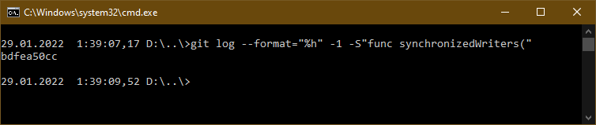

## Найдите полный хеш и комментарий коммита, хеш которого начинается на `aefea`.

Команда: `git show aefea`

Отдельно полный хэш можно вывести командой: `git rev-parse aefea`

Ответ:

- Полный хэш `aefead2207ef7e2aa5dc81a34aedf0cad4c32545`

- Коммантарий: `Update CHANGELOG.md`

---

## Какому тегу соответствует коммит `85024d3`?

Команда: `git show --quiet 85024d3`

Ответ: **Тег: v0.12.23**

---

## Сколько родителей у коммита `b8d720`? Напишите их хеши.

Команда: `git rev-list --parents -1 b8d720`

Первый в списке - собственный хэш коммита

Команда: `git show --pretty=raw b8d720`

Ответ: Два родителя со следующими хэшами

- `56cd7859e05c36c06b56d013b55a252d0bb7e158`

- `9ea88f22fc6269854151c571162c5bcf958bee2b`

---

## Перечислите хеши и комментарии всех коммитов которые были сделаны между тегами `v0.12.23` и `v0.12.24`.

Команда: `git log --pretty=format:"%h => %s" "v0.12.23^"..."v0.12.24"`

Вывод в произвольном формате c полными хэшами

Команда: `git log --oneline "v0.12.23^"..."v0.12.24"`

Вывод с подсветкой и сокращёнными хэшами

Ответ: коммиты между тэгами (не включая коммиты с самими тегами) и их комментарии

- `b14b74c4939dcab573326f4e3ee2a62e23e12f89` *[Website] vmc provider links*

- `3f235065b9347a758efadc92295b540ee0a5e26e` *Update CHANGELOG.md*

- `6ae64e247b332925b872447e9ce869657281c2bf` *registry: Fix panic when server is unreachable*

- `5c619ca1baf2e21a155fcdb4c264cc9e24a2a353` *website: Remove links to the getting started guide's old location*

- `06275647e2b53d97d4f0a19a0fec11f6d69820b5` *Update CHANGELOG.md*

- `d5f9411f5108260320064349b757f55c09bc4b80` *command: Fix bug when using terraform login on Windows*

- `4b6d06cc5dcb78af637bbb19c198faff37a066ed` *Update CHANGELOG.md*

- `dd01a35078f040ca984cdd349f18d0b67e486c35` *Update CHANGELOG.md*

- `225466bc3e5f35baa5d07197bbc079345b77525e` *Cleanup after v0.12.23 release*

---

## Найдите коммит в котором была создана функция `func providerSource`.

Найдём файл в котором задаётся функция: `git grep --name-only "func providerSource("`

Выведем все коммиты, где функция изменялась: `git log --format="%H" -q -L :providerSource:provider_source.go`

По логике, добавление функции должно быть в самом старом коммите (последний в списке), поэтому для автоматизации можно использовать инверсирование порядок вывода коммитов (от самого старого), тогда искомый хэш коммита будет первым: `git log --format="%H" -q --reverse -L :providerSource:provider_source.go`

Для проверки можно посмотреть список изменений коммита: `git show 8c928e83589d90a031f811fae52a81be7153e82f`

Ответ: **8c928e83589d90a031f811fae52a81be7153e82f**

---

## Найдите все коммиты в которых была изменена функция `globalPluginDirs`.

Найдём файл в котором задаётся функция: `git grep --name-only "func globalPluginDirs("`

Выведем коммиты, где функция изменялась: `git log --format="%H" -q -L :globalPluginDirs:plugins.go`

Ответ: коммиты где изменялась функция globalPluginDirs (включая коммит, где она была добавлена)

- `78b12205587fe839f10d946ea3fdc06719decb05`

- `52dbf94834cb970b510f2fba853a5b49ad9b1a46`

- `41ab0aef7a0fe030e84018973a64135b11abcd70`

- `66ebff90cdfaa6938f26f908c7ebad8d547fea17`

- `8364383c359a6b738a436d1b7745ccdce178df47`

---

## Кто автор функции `synchronizedWriters`?

Автором функции наиболее вероятно является автор коммита, где соответствующая функция была добавлена.
Следовательно, нужно найти самый старый коммит в репозитории, где упоминается данная функция и узнать автора данного коммита.

Найдём коммиты, где встречается определение функции: `git log --format="%ai %an" -S"func synchronizedWriters("`

Для автоматизации можно использовать сокращённый инверсированный вывод: `git log --format="%an" --reverse -S"func synchronizedWriters("`

Ответ: **Martin Atkins**

---

## Дополнительные материалы

Решение поиска автора функции `synchronizedWriters` командой `blame`

Поиск функции в текущем дереве: `git grep "func synchronizedWriters("`

Результат ничего не даёт, значит искомая функция удалена из ветки.

Ищем в истории хэш коммита, где функция была удалена (последний): `git log --format="%h" -1 -S"func synchronizedWriters("`

Извлекаем родителя данного коммита, где функция ещё не удалена: `git checkout bdfea50cc~`

Ищем имя файла, где задана искомая функция: `git grep -n "func synchronizedWriters("`

Функция задана в 15 строке файла synchronized_writers.go

Выводим автора строки: `git blame -L 15,15 synchronized_writers.go`

### Бинарный поиск

*Может применяться для автоматического поиска "плохого" коммита*

Общая информация: `git bisect --help`

[Книга по Git. Обнаружение ошибок с помощью Git](https://git-scm.com/book/ru/v2/Инструменты-Git-Обнаружение-ошибок-с-помощью-Git#r_binary_search)

### Припрятывание

*Временное скрытие изменений во внутреннее хранилище локального репозитория Git*

Общая информация: `git stash --help`

[Книга по Git. Припрятывание и очистка](https://git-scm.com/book/ru/v2/Инструменты-Git-Припрятывание-и-очистка)

### Ручное слияние (MERGE_HEAD, в состоянии конфликта):

- `git show :1:<filename>` - общий, `git diff --base`

- `git show :2:<filename>` - версия в текущей ветки, `git diff --ours`

- `git show :3:<filename>` - версия в ветке которую сливаем, `git diff --theirs`

- `git checkout --conflict=merge <filename>` или `git checkout --conflict=diff3 <filename>` - восстановление файла

- `git ls-files --help` - хэши файлов

- `git merge-file --help` - слияние файлов

Отмена слияния: `git reset --help` и `git revert --help`

### Подмодули

Общая информация: `git submodule --help`

Дозагрузка подмодулей: `git submodule init`, после чего `git submodule update` в каждом отдельно, либо рекурсивное клонирование: `git clone --recursive`

[Книга по Git. Подмодули](https://git-scm.com/book/ru/v2/Инструменты-Git-Подмодули)

### Перезапись истории

*Может применяться для изменения всех коммитов в ветке*

Общая информация: `git filter-branch --help`

[Книга по Git. Перезапись истории](https://git-scm.com/book/ru/v2/Инструменты-Git-Перезапись-истории)

### Разделение истории. Замена (объединение)

Создание сиротского коммита (на основании дерева файлов другого коммита): `git commit-tree <источник>^{tree}`

Общая информация по замене: `git replace --help`

[Книга по Git. Замена](https://git-scm.com/book/ru/v2/Инструменты-Git-Замена)

### Подпись коммитов и тегов

[GNU Privacy Guard](https://www.gnupg.org/index.html)

[Загрузка дистрибутива для Windows: Pgp4win](https://gpg4win.org/download.html)

[Книга по Git. Подпись](https://git-scm.com/book/ru/v2/Инструменты-Git-Подпись)

1. Генерировать пару ключей: `gpg --full-gen-key`

1. Вывод информации по имеющимся ключам: `gpg --list-keys` или `gpg -k`, флаг `--keyid-format SHORT` выводит идентификатор

1. Экспорт публичного ключа: `gpg --armor --export <id_ключа>`

1. Настройка Git:

- Указание пути к программе: `git config --global gpg.program <путь_gpg>`, где `путь_gpg` для linux можно записать `$(which gpg)`, а для windows путь, полученный при выполнении команды `where gpg`

- Указание ключа подписи: `git config --local user.signingkey <id_ключа>

- Включение автоматической подписи всех коммитов: `git config --local commit.gpgsign true`

Создание подписанного тега: `git tag -s v0.9 -m 'my signed 0.9 tag'`

Создание подписанного коммита: `git commit -S ...`

Слияние/перебазирование с подписью: `git merge -S ...`, `git rebase -S ...`
