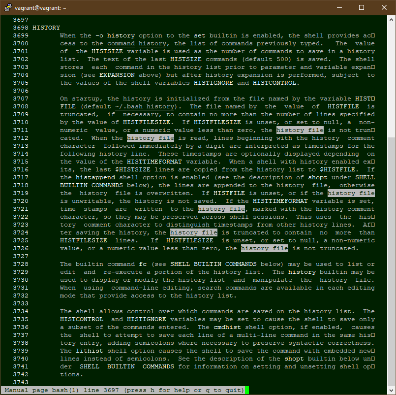
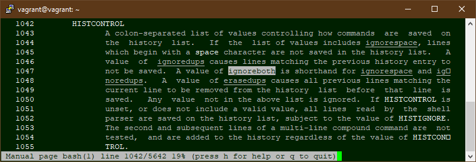
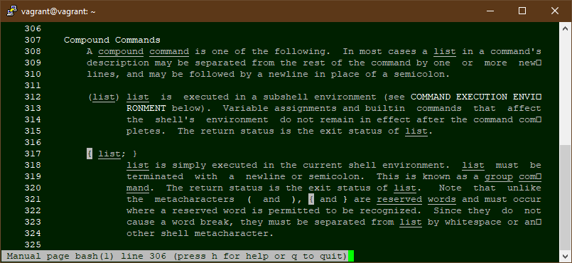
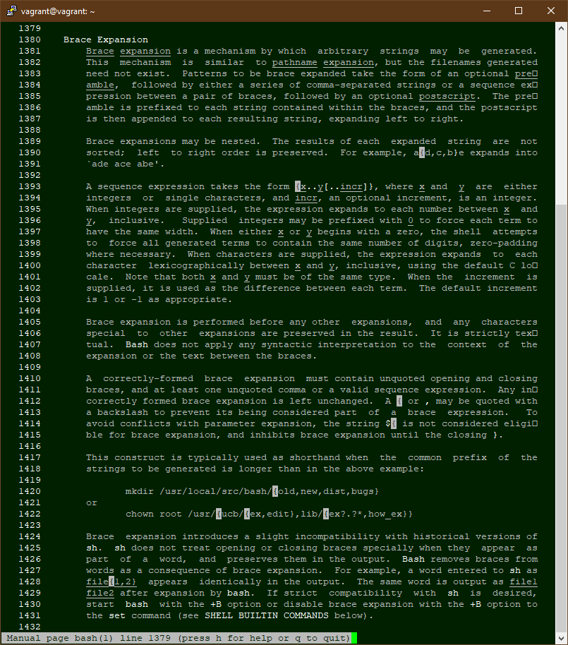
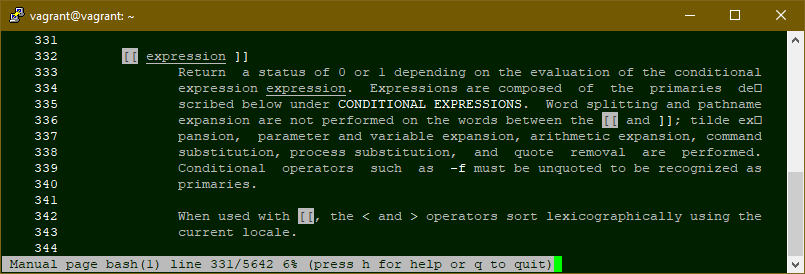
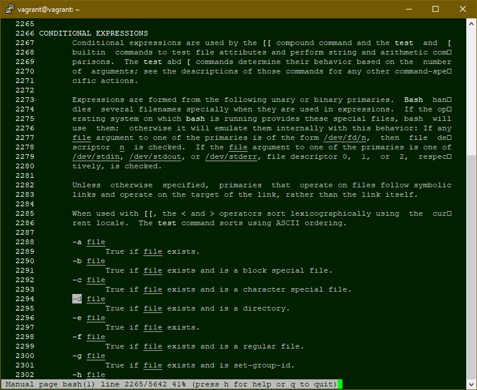
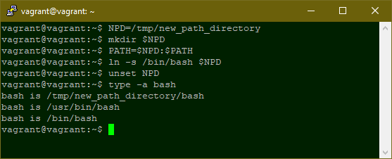
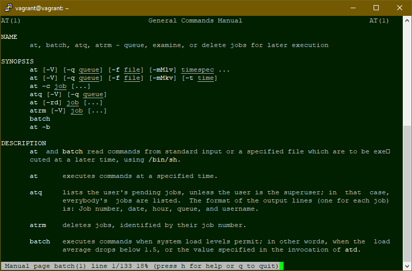

## Ресурсы выделенные виртуальной машине, созданной через Vagrant

- 1024 Mb оперативной памяти (1Gb)

- Двухядерный процессор с предельной загрузкой 100% (Предоставлен доступ к PAE/NX, включена функция NestedPaging)

- 4 Mb видеопамяти

- Подключен накопитель (жесткий диск) динамическим объёмом в 64 гигабайта, оптический привод

- Подключена сетевая карта в режиме NAT, с проброшенным портом SSH (2222 хоста -> 22 гостевой)

- Включен сервер удалённого доступа по порту 5902

- Подключена общая папка с именем vagrant (абсолютный путь совпадает с расположением файла Vagrantfile)

---

## Как добавить оперативной памяти или ресурсов процессора виртуальной машине?

В файле описания виртуальной машины `Vagrantfile` скорректировать или вписать если отсутствуют следующие строки:

- `v.memory = 1024` - Объём оперативной памяти в мегабайтах

- `v.cpus = 2` - Число логических ядер процессора, которое может использовать виртуальная машина

Пример части конфигурационного файла с `4 гигабайтами` оперативной памяти и `4` ядрами процессора

```
config.vm.provider "virtualbox" do |v|
  v.memory = 4096
  v.cpus = 4
end
```

---

## Какой переменной можно задать длину журнала history, и на какой строчке manual это описывается?

Размер журнала истории команд в строках задаётся переменной `HISTSIZE`.
Однако, если задана переменная `HISTFILESIZE`, то файл журнала будет дополнительно усекаться до заданного размера в байтах.



Как показали эксперименты, номера строк "плавают" в зависимости от настроек терминала, поэтому тут и далее вместо номеров строк будут скриншоты окна терминала с нужным фрагментом руководства.

---

## Что делает директива ignoreboth в bash?

Директива `IGNOREBOTH` эквивалентна набору директив `IGNORESPACE` и `IGNOREDUPS`:

- При указании директивы `IGNORESPACE` в журнал не записываются строки, начинающиеся на пробел (символ space)

- При указании директива `IGNOREDUPS` в журнал не записываются строки, которые уже есть в журнале (были добавлены ранее)



Таким образом директива `IGNOREBOTH` позволяет не записывать в журнал дубликаты строк и строки, начинающиеся на пробел.

---

## В каких сценариях использования применимы скобки {} и на какой строчке man bash это описано?

- Задание групповых команд. При этом скобки используются как зарезервированные слова и должны обязательно отделяться пробелом или другим метасимволом.

Пример:

```console
vagrant@vagrant:~$ {
> echo "A"; echo "B"
> }
A
B
vagrant@vagrant:~$
```



- Формирование строк с использованием списков и диапазонов.

Примеры:

- Использование списка

```console
vagrant@vagrant:~$ echo file_{one,two,three}.dat
file_one.dat file_two.dat file_three.dat
vagrant@vagrant:~$
```

- Использование диапазона

```console
vagrant@vagrant:~$ echo file_{1..3}.dat
file_1.dat file_2.dat file_3.dat
vagrant@vagrant:~$
```



Также используется для расширения параметров (явного указания, где заканчивается имя переменной).

Примеры:
```console
vagrant@vagrant:~$ echo BEGIN${PATH}END
BEGIN/usr/local/sbin:/usr/local/bin:/usr/sbin:/usr/bin:/sbin:/bin:/usr/games:/usr/local/games:/snap/binEND
vagrant@vagrant:~$
```
При указании элемента: `echo file${name[1]}to8.dat`

---

## Как создать однократным вызовом touch 100000 файлов? Получится ли создать 300000? Почему?

Создать несколько файлов однократным вызовом можно следующей строкой `touch <file_1> <file_2> .. <file_n>`, а подобный список можно сгенерировать при помощи конструкции `{ }` с указанием диапазона.

```console
vagrant@vagrant:~/test$ touch file{1..100000}.dat
bash: /usr/bin/touch: Argument list too long
vagrant@vagrant:~/test$ touch {1..100000}.dat
vagrant@vagrant:~/test$ touch {1..300000}
bash: /usr/bin/touch: Argument list too long
vagrant@vagrant:~/test$
```

Но существует ограничение операционной системы на размер командной строки:

```console
vagrant@vagrant:~/test$ getconf ARG_MAX
2097152
vagrant@vagrant:~/test$
```

Таким образом, однократным вызовом `touch` возможно создать 100000 файлов только с короткими именами, чтобы не превысить допустимый предел, а именно: `touch {1..100000}` (дополнительно можно указать до семи постоянных символов). 
Создать 300000 файлов не получится, так как в этом случае максимальный размер командной строки (ARG_MAX) будет превышен (`Argument list too long`).

---

## Что делает конструкция [[ -d /tmp ]] ?

Конструкция `[[ <выражение> ]]` возвращает 0 или 1 в зависимости от результата выполнения `<выражение>`, причём 0 если статус `успех` и 1 если нет (аналог кода ошибки).



Выражение `-d /tmp` означает проверку существования каталога `/tmp`



Таким образом, выражение `[[ -d /tmp ]]` проверяет существование каталога `tmp` в корне файловой системы.

---

## Добейтесь в выводе `type -a bash` в виртуальной машине наличия первым пунктом `bash is /tmp/new_path_directory/bash` в списке

Команда `type` с ключом `-a` выводит все расположения, содержащие указанное исполняемое имя.

Следовательно, нужно:

1. Создать требуемый каталог: `mkdir /tmp/new_path_directory`

1. Добавить каталог в переменную `PATH`, причём в начало списка: `PATH=/tmp/new_path_directory:$PATH`

1. Создать символьную ссылку `bash` для данного каталога: `ln -s /bin/bash /tmp/new_path_directory`

Для упрощения, повторяемый код можно заменить переменной: `NPD=/tmp/new_path_directory`, после чего её удалить: `unset NPD`



---

## Чем отличается планирование команд с помощью batch и at?

Команда `at` запланирует запуск задачи в указанное время.

Команда `batch` запланирует запуск задачи, когда позволит загрузка системы. Другими словами, задача запустится когда загрузка системы упадёт ниже определённого уровня.


