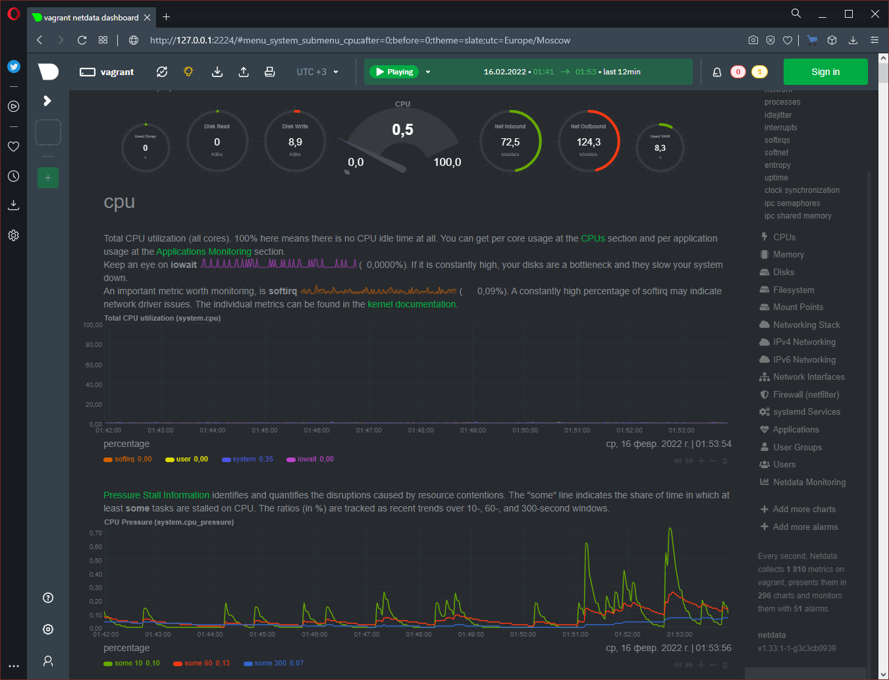
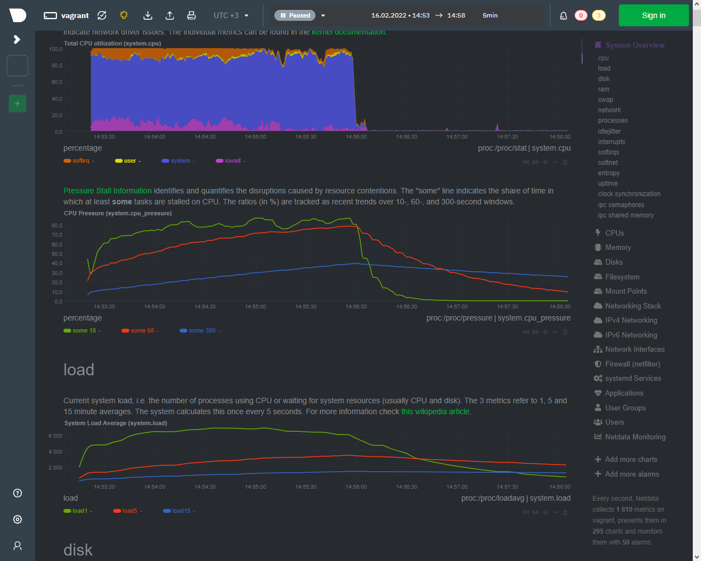

# Домашнее задание к занятию "3.4. Операционные системы, лекция 2"

## 1. Установка и настройка в качестве серсива Node Exporter

Страница [Node Exporter](https://github.com/prometheus/node_exporter) на GitHub

Установка [по шагам](https://prometheus.io/docs/guides/node-exporter/)

Последние версии программ: [Prometheus](https://prometheus.io/download/#node_exporter)

На данный момент актуальная версия (Февраль 2022): `1.3.1`

Установка осуществляется в ручном режиме:

- Загрузка дистрибутива из репозитория GitHub: `wget https://github.com/prometheus/node_exporter/releases/download/v<версия>/node_exporter-<версия>.<вариант>-amd64.tar.gz`, где `<версия>` - актуальная версия `Node Exporter`, a `<вариант>` - тип ОС: либо `darwin` либо `linux`

- Распаковка архива: `tar xvfz <файл>`, где `<файл>` - имя файла загруженного дистрибутива

   Запуск `Node Exporter` осуществляется обычным способом `./node_exporter`

   Настройка запуска `Node Exporter` в качестве сервиса:

- Создание Unit файла **SystemD**

   В директории `/lib/systemd/system/` необходимо создать файл с расширением `.service`. В качестве имени файла нужно использовать имя будущего сервиса, по которому будет осуществляться дальнейшее управление, например `my_ne`

   `sudo vim /lib/systemd/system/my_ne.service`

   В данном файле прописать следующие строки:

   ```console
   [Unit]
   Description=My Node Exporter Service
   
   [Service]
   Type=simple
   EnvironmentFile=/home/vagrant/node_exporter/node_exporter.env
   ExecStart=/home/vagrant/node_exporter/node_exporter $RUN_PARAM
   Restart=always
   
   [Install]
   WantedBy=multi-user.target
   ```

   где:

  - `EnvironmentFile` - не обязательный параметр, в котором можно указать имя файла с переменными окружения. Если переменные окружения не предполагается менять, то их можно указать прямо в `service` файле в строках `Environment=`

  - `ExecStart` - строка запуска программы, включающая полный путь к исполняемому файлу и все необходимые параметры аналогично запуску программы в shell (включая использование переменных окружения).
  
  Содержимое файла `node_exporter.env`

  ```console
  RUN_PARAM="--collector.disable-defaults --collector.cpu --collector.cpufreq --collector.meminfo --collector.diskstats --collector.filesystem --collector.netdev --collector.netstat"
  ```

  В приведённом примере подключается внешний файл `node_exporter.env` откуда считываются переменные окружения и одна из них (**RUN_PARAM**) используется как строка параметров запуска **Node Exporter**. В данном случае стандартные коллекторы заменяются на перечисленные в пункте 2.

- После изменения `service` файлов, для применения изменений в системе нужно перезагрузить менеджер конфигураций **systemd** выполнив команду: `sudo systemctl daemon-reload`

- Управление функционированием сервиса осуществляется командами по шаблону: `sudo systemctl <команда> <сервис>`, где `<сервис>` - имя созданного `service` файла без расширения, например `my_ne`.

   Некоторые `<команды>`:

   - `start` - запуск сервиса, например: `sudo systemctl start my_ne`

   - `stop` - остановка сервиса, например: `sudo systemctl stop my_ne`

   - `restart` - перезапуск сервиса, например: `sudo systemctl restart my_ne`

   - `enable` - включение автозагрузки, например: `sudo systemctl enable my_ne`

   - `disable` - отключение автозагрузки, например: `sudo systemctl disable my_ne`

### Альтернативный способ решения задачи

Реализовать пример выше без переменных окружения можно следующим образом:

Содержимое файла `/lib/systemd/system/my_ne.service`

```console
[Unit]
Description=My Node Exporter Service
   
[Service]
Type=simple
ExecStart=/home/vagrant/node_exporter/node_exporter $(cat /home/vagrant/node_exporter/node_exporter.conf)
Restart=always
   
[Install]
WantedBy=multi-user.target
```

Содержимое файла `/home/vagrant/node_exporter/node_exporter.conf`

```console
--collector.disable-defaults --collector.cpu --collector.cpufreq --collector.meminfo --collector.diskstats --collector.filesystem --collector.netdev --collector.netstat
```

### Использовались дополнительные материалы:

- [Руководство systemD](https://www.freedesktop.org/software/systemd/man/systemd.service.html)

- [Пишем systemd unit файл](https://linux-notes.org/pishem-systemd-unit-fajl)

---

## 2. Проверка функционирования `Node Exporter`

По умолчанию, `Node Exporter` запускает компактный web-сервер на порту **9100**, где можно посмотреть список собираемых метрик `http://127.0.0.1:9100/metrics`

Для базового мониторинга хоста можно выбрать следующие "сборщики" ([collectors](https://github.com/prometheus/node_exporter#collectors)):

- `cpu` - статистика CPU

- `cpufreq` - частотные характеристики CPU

- `meminfo` - статистика использования оперативной памяти

- `diskstats` - число операций ввода-вывода накопителей

- `filesystem` - статистика файловой системы, такая как занимаемое место

- `netdev` - статистика сетевых интерфейсов, такая как число переданных байт

- `netstat` - сетевая статистика из `/proc/net/netstat`

---

## 3. Установка и настройка Netdata

Страница [Netdata](https://github.com/netdata/netdata#get-netdata) на GitHub

Руководство по [установке](https://github.com/netdata/netdata#get-netdata)

В руководстве упоминается [универсальный скрипт установки](https://learn.netdata.cloud/docs/agent/packaging/installer/methods/kickstart) программы **Netdata**, который:

- Определяет платформу, на которой выполняется запуск

- Проверяет существующую установку, и если она определена пытается обновить, вместо создания новой (установки)

- Пытается установить **Netdata** используя официальные native пакеты

- Если нет официальных native пакетов для целевой системы, пытается установить статическую сборку **Netdata** если она доступна

- Если нет доступной статической сборки, устанавливает необходимые зависимости и пытается собрать **Netdata** локально компилируя из загруженных исходных кодов

- Настраивает ежедневный запуск обновления через **cron** `netdata-updater.sh`, если данная настройка не отключена параметром `--no-updates`

- Выводит сообщение об успешной установке или неудаче

Для установки использовался универсальный скрипт со следующими параметрами:

`wget -O /tmp/netdata-kickstart.sh https://my-netdata.io/kickstart.sh && sh /tmp/netdata-kickstart.sh --no-updates --stable-channel --disable-telemetry`

После установки произведена корректировка конфигурационного файла `/etc/netdata/netdata.conf`, а именно изменён адрес входящих подключений с `bind to = localhost` (только с локальной машины) на `bind to = 0.0.0.0` (с любого адреса)

Выполняем активацию автозапуска `Netdata` командой: `sudo systemctl enable netdata`. На данном этапе настройка гостевой машины завершена.

Для доступа к внутренним ресурсам гостевой машины с хоста необходимо "пробросить" соответствующие порты, а именно -  в конфигурационном файле `Vagrantfile` внесены строчки:

   ```console
     config.vm.network "forwarded_port", guest: 19999, host: 2224
     config.vm.network "forwarded_port", guest: 9100, host: 2223
   ```

Первая для доступа к `Netdata` с хоста по порту **2224**, вторая необязательная для доступа к данным `Node Exporter` с хоста по порту **2223**.

Для применения внесённых изменений необходимо перезагрузить виртуальную машину: `vagrant reload`



---

## 4. Можно ли по выводу dmesg понять, осознает ли ОС, что загружена не на настоящем оборудовании, а на системе виртуализации?

Исследуя полный вывод `dmesg` можно заметить много строк, характеризующих запуск на виртуальной машине:

```console
[    0.000000] Linux version 5.4.0-91-generic (buildd@lcy01-amd64-017) (gcc version 9.3.0 (Ubuntu 9.3.0-17ubuntu1~20.04)) #102-Ubuntu SMP Fri Nov 5 16:31:28 UTC 2021 (Ubuntu 5.4.0-91.102-generic 5.4.151)
[    0.000000] Command line: BOOT_IMAGE=/vmlinuz-5.4.0-91-generic root=/dev/mapper/ubuntu--vg-ubuntu--lv ro net.ifnames=0 biosdevname=0
...
[    0.000000] DMI: innotek GmbH VirtualBox/VirtualBox, BIOS VirtualBox 12/01/2006
...
[    0.001262] CPU MTRRs all blank - virtualized system.
...
[    0.087534] ACPI: RSDP 0x00000000000E0000 000024 (v02 VBOX  )
[    0.087539] ACPI: XSDT 0x00000000DFFF0030 00003C (v01 VBOX   VBOXXSDT 00000001 ASL  00000061)
[    0.087546] ACPI: FACP 0x00000000DFFF00F0 0000F4 (v04 VBOX   VBOXFACP 00000001 ASL  00000061)
[    0.087553] ACPI: DSDT 0x00000000DFFF0480 002325 (v02 VBOX   VBOXBIOS 00000002 INTL 20100528)
[    0.087557] ACPI: FACS 0x00000000DFFF0200 000040
[    0.087560] ACPI: FACS 0x00000000DFFF0200 000040
[    0.087564] ACPI: APIC 0x00000000DFFF0240 00006C (v02 VBOX   VBOXAPIC 00000001 ASL  00000061)
[    0.087568] ACPI: SSDT 0x00000000DFFF02B0 0001CC (v01 VBOX   VBOXCPUT 00000002 INTL 20100528)
...
[    0.101593] Booting paravirtualized kernel on bare hardware
...
[    1.402906] ata3.00: ATA-6: VBOX HARDDISK, 1.0, max UDMA/133
...
[    1.403480] scsi 2:0:0:0: Direct-Access     ATA      VBOX HARDDISK    1.0  PQ: 0 ANSI: 5
...
[    2.562488] systemd[1]: Detected virtualization oracle.
...
[    2.587546] systemd[1]: Set hostname to <vagrant>.
...
[    3.164902] vboxguest: loading out-of-tree module taints kernel.
[    3.171072] vboxguest: Successfully loaded version 6.1.30 r148432
[    3.171107] vboxguest: misc device minor 58, IRQ 20, I/O port d040, MMIO at 00000000f0400000 (size 0x400000)
[    3.171109] vboxguest: Successfully loaded version 6.1.30 r148432 (interface 0x00010004)
[    6.898957] vboxsf: Successfully loaded version 6.1.30 r148432
[    6.898985] vboxsf: Successfully loaded version 6.1.30 r148432 on 5.4.0-91-generic SMP mod_unload modversions  (LINUX_VERSION_CODE=0x50497)
[    6.901073] vboxsf: SHFL_FN_MAP_FOLDER failed for '/vagrant': share not found
...
[   13.043580] vboxvideo: loading version 6.1.30 r148432
[   13.076600] 23:01:35.720097 main     VBoxService 6.1.30 r148432 (verbosity: 0) linux.amd64 (Nov 22 2021 16:16:32) release log
               23:01:35.720100 main     Log opened 2022-02-15T23:01:35.720091000Z
[   13.076646] 23:01:35.720187 main     OS Product: Linux
[   13.076675] 23:01:35.720221 main     OS Release: 5.4.0-91-generic
[   13.076704] 23:01:35.720250 main     OS Version: #102-Ubuntu SMP Fri Nov 5 16:31:28 UTC 2021
[   13.076747] 23:01:35.720279 main     Executable: /opt/VBoxGuestAdditions-6.1.30/sbin/VBoxService
```

В сообщениях видно:

- Загружаемый образ `BOOT_IMAGE=/vmlinuz...`

- Прямое указание производителя из DMI `innotek GmbH VirtualBox/VirtualBox, BIOS VirtualBox 12/01/2006`

- Какие-то метки, связанные с процессором: `CPU MTRRs all blank - virtualized system.`

- Используемые драйвера: `ata3.00: ATA-6: VBOX HARDDISK, 1.0, max UDMA/133`, включая выводы `ACPI`

- Использование образов "обёртки" Vagrant: `systemd[1]: Set hostname to <vagrant>`

- Сообщения от установленого расширения гостовой системы: строчки от `vboxguest:` и `vboxsf` (функция общего каталога)

- Видна версия **VirtualBox**: `23:01:35.720097 main     VBoxService 6.1.30 r148432 (verbosity: 0) linux.amd64 (Nov 22 2021 16:16:32) release log`

- Явное сообщение от **SystemD** об обнаружении виртуализации: `systemd[1]: Detected virtualization oracle.`

В принципе, вполне достаточно воспользоваться фильтром **grep**:

```console
vagrant@vagrant:~$ dmesg | grep virtual
[    0.001262] CPU MTRRs all blank - virtualized system.
[    0.101593] Booting paravirtualized kernel on bare hardware
[    2.562488] systemd[1]: Detected virtualization oracle.
vagrant@vagrant:~$

```

Также есть другие способы определения виртуализации:

   1. Использование команды `hostnamectl`

      ```console
      vagrant@vagrant:~$ hostnamectl
         Static hostname: vagrant
               Icon name: computer-vm
                 Chassis: vm
              Machine ID: 41b57825be1c45cb9633b7943fa7d4a4
                 Boot ID: d107cfb441b74974914d7908a5b33474
          Virtualization: oracle
        Operating System: Ubuntu 20.04.3 LTS
                  Kernel: Linux 5.4.0-91-generic
            Architecture: x86-64
      vagrant@vagrant:~$
      ```

   1. Специальный вызов **SystemD**

      ```console
      vagrant@vagrant:~$ systemd-detect-virt
      oracle
      vagrant@vagrant:~$
      ```

   1. Команда `dmidecode -s system-product-name`

      ```console
      vagrant@vagrant:~$ sudo dmidecode -s system-product-name
      VirtualBox
      vagrant@vagrant:~$
      ```

   1. Вызов утилиты **lshw** с параметром вывода класса системы

      ```console
      vagrant@vagrant:~$ sudo lshw -class system
      vagrant
          description: Computer
          product: VirtualBox
          vendor: innotek GmbH
          version: 1.2
          serial: 0
          width: 64 bits
          capabilities: smbios-2.5 dmi-2.5 smp vsyscall32
          configuration: family=Virtual Machine uuid=353C7B6A-4CB6-C440-ABE3-2A6432F8C6DD
      vagrant@vagrant:~$
      ```

   1. По названию устройств жестких дисков

      ```console
      vagrant@vagrant:~$ ls -1 /dev/disk/by-id/
      ata-VBOX_HARDDISK_VB4ea6f229-ecb544fc
      ata-VBOX_HARDDISK_VB4ea6f229-ecb544fc-part1
      ata-VBOX_HARDDISK_VB4ea6f229-ecb544fc-part2
      ata-VBOX_HARDDISK_VB4ea6f229-ecb544fc-part3
      dm-name-ubuntu--vg-ubuntu--lv
      dm-uuid-LVM-aK7Bd1JPlei0h75jJaM60vWwMkPFByJ7ftN15m3lMLYH5xR5P2kLCdkzW332dlqO
      lvm-pv-uuid-sDUvKe-EtCc-gKuY-ZXTD-1B1d-eh9Q-XldxLf
      scsi-0ATA_VBOX_HARDDISK_VB4ea6f229-ecb544fc
      scsi-0ATA_VBOX_HARDDISK_VB4ea6f229-ecb544fc-part1
      scsi-0ATA_VBOX_HARDDISK_VB4ea6f229-ecb544fc-part2
      scsi-0ATA_VBOX_HARDDISK_VB4ea6f229-ecb544fc-part3
      scsi-1ATA_VBOX_HARDDISK_VB4ea6f229-ecb544fc
      scsi-1ATA_VBOX_HARDDISK_VB4ea6f229-ecb544fc-part1
      scsi-1ATA_VBOX_HARDDISK_VB4ea6f229-ecb544fc-part2
      scsi-1ATA_VBOX_HARDDISK_VB4ea6f229-ecb544fc-part3
      scsi-SATA_VBOX_HARDDISK_VB4ea6f229-ecb544fc
      scsi-SATA_VBOX_HARDDISK_VB4ea6f229-ecb544fc-part1
      scsi-SATA_VBOX_HARDDISK_VB4ea6f229-ecb544fc-part2
      scsi-SATA_VBOX_HARDDISK_VB4ea6f229-ecb544fc-part3
      vagrant@vagrant:~$
      ```

---

## 5. Как настроен sysctl `fs.nr_open` на системе по-умолчанию? Узнайте, что означает этот параметр. Какой другой существующий лимит не позволит достичь такого числа (`ulimit --help`) ?

Парамтер `fs.nr_open` по умолчанию настроен следующим образом:

```console
vagrant@vagrant:~$ sysctl fs.nr_open
fs.nr_open = 1048576
vagrant@vagrant:~$ cat /proc/sys/fs/nr_open
1048576
vagrant@vagrant:~$
```

Данный вызов выводит значение переменной ядра **fs.nr_open** (по умолчанию **1048576**), [означающий](https://www.kernel.org/doc/html/latest/admin-guide/sysctl/fs.html#nr-open) максимальное количество файловых дескрипторов, которое может быть выделено процессу (В [спецификации](https://www.gnu.org/software/libc/manual/html_node/Limits-on-Resources.html) указано, что зависит от параметра RLIMIT_NOFILE)

Утилита `ulimit` предоставляет контроль над доступными для оболочки (**shell**) и порождённых ею процессов ресурсами системы. Такое управление осуществимо только на системах, которые предоставляют такую возможность.

Установленные по умолчанию пределы в системе

```console
vagrant@vagrant:~$ ulimit -a
core file size          (blocks, -c) 0
data seg size           (kbytes, -d) unlimited
scheduling priority             (-e) 0
file size               (blocks, -f) unlimited
pending signals                 (-i) 15526
max locked memory       (kbytes, -l) 65536
max memory size         (kbytes, -m) unlimited
open files                      (-n) 1024
pipe size            (512 bytes, -p) 8
POSIX message queues     (bytes, -q) 819200
real-time priority              (-r) 0
stack size              (kbytes, -s) 8192
cpu time               (seconds, -t) unlimited
max user processes              (-u) 15526
virtual memory          (kbytes, -v) unlimited
file locks                      (-x) unlimited
vagrant@vagrant:~$
```

показывают, что максиммальное число открытых файлов (`open files`) ограничено **1024**.

Таким образом значение переменной ядра `fs.nr_open`, равное по умолчанию **1048576** ограничено максимально возможными открытыми файловыми дескрипторами (`ulimit -n`), то есть **1024**

Все вышеуказанные пределы можно изменить: `ulimit -n <число>` и `sudo sysctl fs.nr_open=<число>`, где `<число>` - значение изменяемого предела

---

## 6. Запустите любой долгоживущий процесс в отдельном неймспейсе процессов; покажите, что ваш процесс работает под PID 1 через `nsenter`. Для простоты работайте в данном задании под root (sudo -i). Под обычным пользователем требуются дополнительные опции (--map-root-user) и т.д.

Для запуска программы в отдельном пространстве имён используется команда в формате `unshare --fork --pid --mount-proc <команда>`, где `<команда>` - запускаемая программа с необходимыми параметрами, например `sleep 1h`

Значение ключей (по руководству `man unshare`):

- `-f` или `--fork` - Создать копию программы в памяти как дочерний процесс вместо запуска напрямую. Используется при создании нового PID пространства имён

- `-p` или `--pid` - Отделяет/создаёт PID пространство имён. Если дополнено `=<имя>`, то будет создано постоянное пространство имён во время монтирования (ключ **--mount-proc**)

- `--mount-proc` - Позволяет непосредственно перед запуском программы смонтировать псевдофайловую систему `proc` в точку монтирования (по умолчанию `/proc`). Используется при создании PID пространства имён

Все ключи можно посмотреть в руководстве `man unshare`


```console
vagrant@vagrant:~$ sudo unshare -f -p --mount-proc sleep 1h &
[1] 1554
vagrant@vagrant:~$
```

В результате выполнения команды получилась следующая "картина", где наш процесс (`sleep 1h`) получил PID **1556**

```console
vagrant@vagrant:~$ pstree -pT
systemd(1)─┬─VBoxService(1008)
           ├─accounts-daemon(680)
           ├─agetty(733)
           ├─atd(719)
           ├─cron(713)
           ├─dbus-daemon(681)
           ├─irqbalance(689)
           ├─multipathd(582)
           ├─netdata(691)─┬─apps.plugin(1060)
           │              ├─bash(1044)
           │              ├─ebpf.plugin(1064)
           │              ├─go.d.plugin(1062)
           │              ├─netdata(785)
           │              └─nfacct.plugin(1061)
           ├─networkd-dispat(693)
           ├─node_exporter(690)
           ├─polkitd(757)
           ├─rsyslogd(694)
           ├─snapd(696)
           ├─sshd(744)───sshd(1465)───sshd(1520)───bash(1521)─┬─pstree(1558)
           │                                                  └─sudo(1554)───unshare(1555)───sleep(1556)
           ├─systemd(1481)───(sd-pam)(1482)
           ├─systemd-journal(385)
           ├─systemd-logind(699)
           ├─systemd-network(663)
           ├─systemd-resolve(665)
           ├─systemd-udevd(416)
           └─udisksd(703)
vagrant@vagrant:~$
```

Входим в изолированное пространство при помощи команды `nsenter` и проверяем список процессов:

```console
vagrant@vagrant:~$ sudo nsenter -t 1556 -m -p
root@vagrant:/# ps
    PID TTY          TIME CMD
      1 pts/0    00:00:00 sleep
      2 pts/0    00:00:00 bash
     13 pts/0    00:00:00 ps
root@vagrant:/#
```

Команда `nsenter` позволяет войти в пространство имён одного или нескольких процессов и запускает переданную в аргументах комманду. Если команда не задана, то запускается `${SHELL}` (По умолчанию: `/bin/bash`)

Значение ключей (по руководству `man nsenter`)

- `-t` или `--target <PID>` - Указывает `<PID>` процесса, контексты которого будут взяты за основу. Большинство путей к контекстам определяются по PID (`/proc/<PID>/ns/*`), другие указаны в руководстве `man nsenter`

- `-m` или `--mount[=<файл>]` - Указывает на необходимость войти в пространство имён **mount**. Если `<файл>` не указан, выполняется вход в **MOUNT** пространство имён целевого процесса (**target**)

- `-p` или `--pid=[<файл>]` - Указывает на необходимость войти в пространство имён **PID**. Если `<файл>` не указан, выполняется вход в **PID** пространство имён целевого процесса (**target**)

Все ключи можно посмотреть в руководстве `man nsenter`

---

## 7. Найдите информацию о том, что такое `:(){ :|:& };:`. Запустите эту команду в своей виртуальной машине Vagrant с Ubuntu 20.04 (это важно, поведение в других ОС не проверялось). Некоторое время все будет "плохо", после чего (минуты) – ОС должна стабилизироваться. Вызов `dmesg` расскажет, какой механизм помог автоматической стабилизации. Как настроен этот механизм по-умолчанию, и как изменить число процессов, которое можно создать в сессии?

`:(){ :|:& };:` - это логическая бомба (известная также как fork bomb), постепенно заполняющая всю имеющуюся оперативную память, что в итоге приводит к отказу

Данное выражение можно представить как:

```console
func() {
  func | func &
}
func
```

То есть, данный код создаёт функцию, которая рекурсивно создаёт две свои копии (одну на переднем плане, а другую в фоне)

Перед запуском логической бомбы лучше очистить все системные сообщения командой: `sudo dmesg --read-clear`

После запуска логической бомбы наблюдалась следующая "картина":



На графиках видно, что спустя некоторое время система действтельно стабилизировалась, после чего `kernel ring buffer` содержал следующие строки:

```console
vagrant@vagrant:~$ dmesg -T
[Wed Feb 16 11:52:37 2022] cgroup: fork rejected by pids controller in /user.slice/user-1000.slice/session-1.scope
[Wed Feb 16 11:52:43 2022] hrtimer: interrupt took 1255256 ns
vagrant@vagrant:~$
```

Значит, работу системы стабилизировал механизм **CGroup**, не позволив открывать новые задачи.

В статусе `user.slice` есть соответствующая группа **CGroup**, но на число задач нет ограничений `Tasks: 7`

```console
vagrant@vagrant:~$ systemctl status user.slice
● user.slice - User and Session Slice
     Loaded: loaded (/lib/systemd/system/user.slice; static; vendor preset: enabled)
     Active: active since Wed 2022-02-16 11:47:18 UTC; 1h 19min ago
       Docs: man:systemd.special(7)
      Tasks: 7
     Memory: 55.3M
     CGroup: /user.slice
             └─user-1000.slice
               ├─session-1.scope
               │ ├─  1455 sshd: vagrant [priv]
               │ ├─  1537 sshd: vagrant@pts/0
               │ ├─  1538 -bash
               │ ├─223406 systemctl status user.slice
               │ └─223407 pager
               └─user@1000.service
                 └─init.scope
                   ├─1503 /lib/systemd/systemd --user
                   └─1504 (sd-pam)
...
```

При запросе статуса `user-1000.slice` появляется ограничитель `Tasks: 7 (limit: 10247)` и конфигурационный файл `/usr/lib/systemd/system/user-.slice.d/10-defaults.conf`

```console
vagrant@vagrant:~$ systemctl status user-1000.slice
● user-1000.slice - User Slice of UID 1000
     Loaded: loaded
    Drop-In: /usr/lib/systemd/system/user-.slice.d
             └─10-defaults.conf
     Active: active since Wed 2022-02-16 11:47:46 UTC; 1h 19min ago
       Docs: man:user@.service(5)
      Tasks: 7 (limit: 10247)
     Memory: 55.1M
     CGroup: /user.slice/user-1000.slice
             ├─session-1.scope
             │ ├─  1455 sshd: vagrant [priv]
             │ ├─  1537 sshd: vagrant@pts/0
             │ ├─  1538 -bash
             │ ├─223413 systemctl status user-1000.slice
             │ └─223414 pager
             └─user@1000.service
               └─init.scope
                 ├─1503 /lib/systemd/systemd --user
                 └─1504 (sd-pam)
...
```

Содержимое конфигурационного файла `/usr/lib/systemd/system/user-.slice.d/10-defaults.conf`

```console
vagrant@vagrant:~$ systemctl cat user-1000.slice
# /usr/lib/systemd/system/user-.slice.d/10-defaults.conf
#  SPDX-License-Identifier: LGPL-2.1+
#
#  This file is part of systemd.
#
#  systemd is free software; you can redistribute it and/or modify it
#  under the terms of the GNU Lesser General Public License as published by
#  the Free Software Foundation; either version 2.1 of the License, or
#  (at your option) any later version.

[Unit]
Description=User Slice of UID %j
Documentation=man:user@.service(5)
After=systemd-user-sessions.service
StopWhenUnneeded=yes

[Slice]
TasksMax=33%
vagrant@vagrant:~$
```

В руководстве `man 5 user@.service` есть ссылка `man 5 systemd.resource-control`, где перечисляются параметры по которым можно ограничивать ресурсы.

Что касается `TasksMax` есть фраза:

```console
       TasksMax=N
           Specify the maximum number of tasks that may be created in the unit. This ensures that the number of tasks
           accounted for the unit (see above) stays below a specific limit. This either takes an absolute number of tasks or
           a percentage value that is taken relative to the configured maximum number of tasks on the system. If assigned
           the special value "infinity", no tasks limit is applied. This controls the "pids.max" control group attribute.
           For details about this control group attribute, see Process Number Controller[7].

           The system default for this setting may be controlled with DefaultTasksMax= in systemd-system.conf(5).
```

Параметр `TasksMax` может быть задан как в абсолютных значениях, так и в проценте от максимального для всей системы. Ограничение можно снять полностью, указав значение `infinity`.

Задание данного параметра влияет на параметр `pids.max` CGroups. [Подробнее](https://www.kernel.org/doc/html/latest/admin-guide/cgroup-v1/pids.html)

Таким образом для того, чтобы изменить число процессов в сессии нужно либо изменить ограничение среза (изменить значение TasksMax), либо изменить ограничение числа процессов всей системы `DefaultTasksMax`

Вывести текущее значение `DefaultTasksMax` можно командой: `systemctl show --property DefaultTasksMax`

```console
vagrant@vagrant:~$ systemctl show --property DefaultTasksMax
DefaultTasksMax=4657
vagrant@vagrant:~$
```
В соответствии с руководством `man 5 systemd-system.conf` параметр `DefaultTasksMax` прописывается в группе `[Manager]` и может быть задан в следующих файлах:
/etc/systemd/system.conf, /etc/systemd/system.conf.d/*.conf, /run/systemd/system.conf.d/*.conf, /lib/systemd/system.conf.d/*.conf, 
/etc/systemd/user.conf, /etc/systemd/user.conf.d/*.conf, /run/systemd/user.conf.d/*.conf, /usr/lib/systemd/user.conf.d/*.conf

---

Утилиты, использованные в лекции:

- `free` - Показывает общую, используемую, свободную, порашенную и кэшированная текущую память (в том числе swap)

- `top`/`htop` - Просмотр информации о текущих процессах в реальном времени

- `atop` - Аналог `top` для записи с заданным интервалом

- `mpstat` - Тестовая утилита с более подробной статистикой (включая по конкретному процессу)

- `iotop` - Аналог `top` но для дисковой системы (чтение, запись, SWAPIN%, IO%)

- `iftop` - Аналог `top` но для сетевого интерфейса без привязки к процессам

- `nethogs <interface>` - Подробная статистика по сетевому интерфейсу

- `sar -n DEV 1` - Оценка загрузки по конкретным сетевым интерфейсам

- `grep -v ^# /boot/config-$(uname -r) | tail -n2` - Просмотр с какой конфигурацией собрано ядра (ограничение на последние две строки). Подробности в книге "Руководство системного администратора Linux/Unix" Еви Немет.

- `lsmod` - Вывод списка модулей ядра

- `modinfo <mod_name>` - Вывод информации по конкретному модулю ядра

- `cat /etc/default/grub` - Посмотреть параметры загрузки ядра

- `sysctl` - Управление параметрами ядра (`-a` вывод всех параметров). Изменения внесённые данным образом не сохраняются. Для их переносимости присутствует каталог `/etc/sysctl.d/`

- `dmesg` - Инструмент доступа к записям ядра

- `syslog` - Штатный логгер, куда попадают сообщения приложений

- `journalctl` - Вывод журнала. `-b` - с момента загрузки ОС. `-u <сервис>` - для конкретного **<сервиса>**

- `lsns` - Вывод типов пространств имён

- [USE Method](https://www.brendangregg.com/usemethod.html)

- [Linux Performance](https://www.brendangregg.com/linuxperf.html)

- [Linux Performance Analysis in 60,000 Milliseconds](https://netflixtechblog.com/linux-performance-analysis-in-60-000-milliseconds-accc10403c55)

