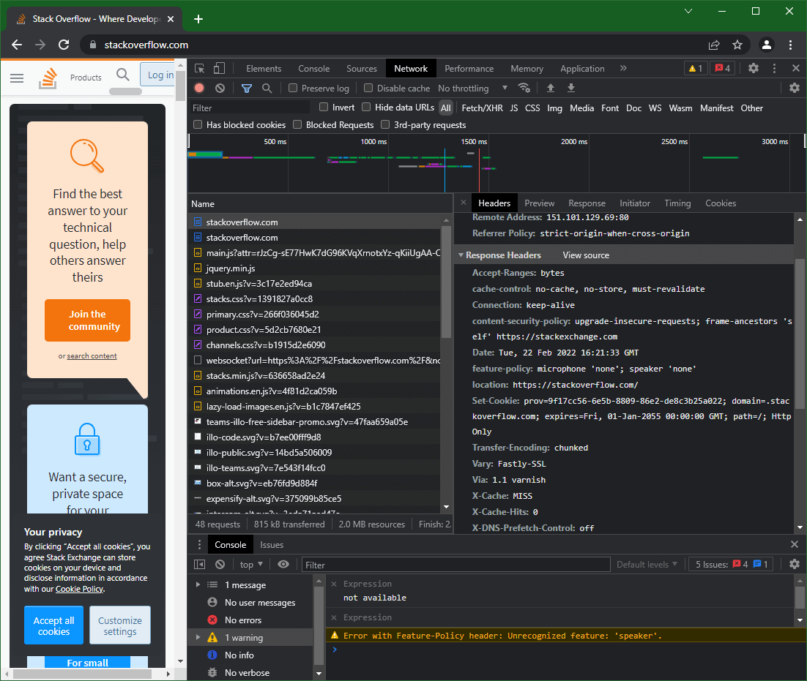
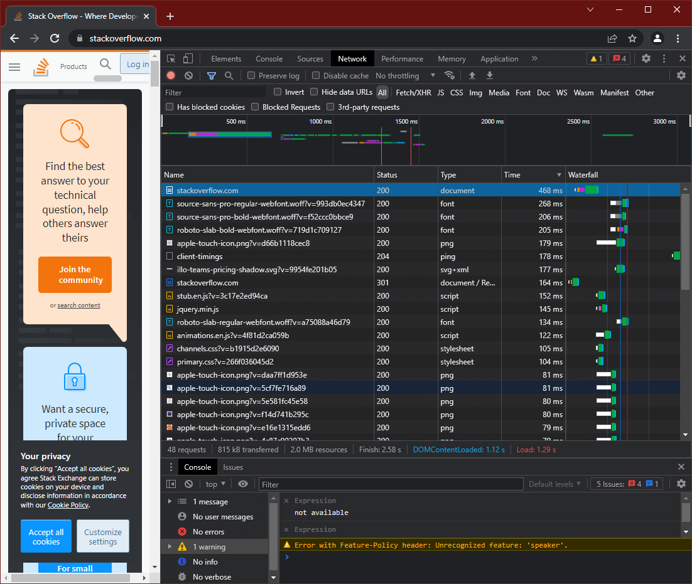
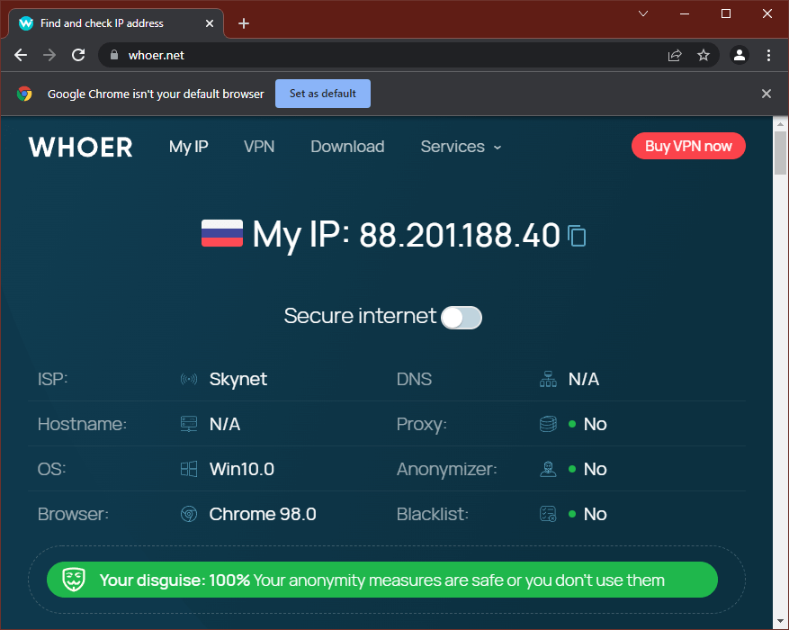

# Домашнее задание по лекции "Компьютерные сети. Часть 1"

## 1. Работа c HTTP через телнет. Подключитесь утилитой телнет к сайту `stackoverflow.com` и отправьте запрос `/questions`

Подключение к сайту осуществляется в формате: `telnet <адрес> <порт>`.
Каждые последующие строки заполняются в соответствии с HTTP протоколом.
Завершение заполнения запроса и его отправка осуществляется заданием пустой строки.

```console
vagrant@vagrant:~$ telnet stackoverflow.com 80
Trying 151.101.65.69...
Connected to stackoverflow.com.
Escape character is '^]'.
GET /questions HTTP/1.0
HOST: stackoverflow.com

HTTP/1.1 301 Moved Permanently
cache-control: no-cache, no-store, must-revalidate
location: https://stackoverflow.com/questions
x-request-guid: 754925bc-4f0a-4a66-b5be-1caaab3206b6
feature-policy: microphone 'none'; speaker 'none'
content-security-policy: upgrade-insecure-requests; frame-ancestors 'self' https://stackexchange.com
Accept-Ranges: bytes
Date: Sun, 20 Feb 2022 21:20:44 GMT
Via: 1.1 varnish
Connection: close
X-Served-By: cache-hhn4081-HHN
X-Cache: MISS
X-Cache-Hits: 0
X-Timer: S1645392044.157508,VS0,VE170
Vary: Fastly-SSL
X-DNS-Prefetch-Control: off
Set-Cookie: prov=cb807608-e781-3ab0-d478-d7baffc4906f; domain=.stackoverflow.com; expires=Fri, 01-Jan-2055 00:00:00 GMT; path=/; HttpOnly

Connection closed by foreign host.
vagrant@vagrant:~$
```
Данный вывод означает:

- `HTTP/1.1 301 Moved Permanently` - Код ответа 301 - запрошенный адрес перемещён на постоянной основе.

- `cache-control: no-cache, no-store, must-revalidate` - Управление кэшированием ответа в браузере. [Подробнее](https://developer.mozilla.org/en-US/docs/Web/HTTP/Headers/Cache-Control)

- `location: https://stackoverflow.com/questions` - Указание браузеру перейти на следующий адрес: `https://stackoverflow.com/questions`

- `feature-policy: microphone 'none'; speaker 'none'` - Функция позволяющая браузеру использовать определённые технологии/устройства - запрет фикрофона, запрет звука. [Подробнее](https://developer.mozilla.org/en-US/docs/Web/HTTP/Headers/Feature-Policy)

- `content-security-policy` - Ограничени контента: `upgrade-insecure-requests` говорит браузеру выдавать предупреждение(угроза) на всех не защищёных страницах (http://), `frame-ancestors 'self' https://stackexchange.com` задает родителей, которые могут включать данную страницу во `frame` контейнеры. [Подробнее](https://developer.mozilla.org/en-US/docs/Web/HTTP/Headers/Content-Security-Policy)

- `Accept-Ranges: bytes` - Говорит о поддержке сервером частичной загрузки (например, продолжение загрузки файлов вместо загрузки заново)

- `Date: Sun, 20 Feb 2022 21:20:44 GMT` - Текущая дата

- `Connection: close` - Говорит браузеру как поступить с соединением после загрузки страницы, в данном случае - закрыть

- `Via: 1.1 varnish` - Строка добавляемая PROXY серверами

- `Vary: Fastly-SSL` - Используется сервером для указания того, какие заголовки он использовал при выборе представления ресурса в алгоритме согласования контента

- `Set-Cookie` - Говорит браузеру создать для сайта следующие `cookie` : `prov` = `cb807608-e781-3ab0-d478-d7baffc4906f`, `domain` = `.stackoverflow.com`, `expires` = `Fri, 01-Jan-2055 00:00:00 GMT`, `path` = `/`, `HttpOnly`

- Заголовки группы `X-*` - Различные параметры, установленные сервером

В итоге: данный вывод означает, что запрашиваемая страница `http://stackoverflow.com/questions` перемещена на новый адрес `https://stackoverflow.com/questions` и предлагает браузеру перейти на неё, при этом создавая 5 файлов `cookie`.

---

## 2. Повторите задание 1 в браузере, используя консоль разработчика F12.



Ответный на запрос HTTP код можно посмотреть выделив в списке запросов (`Waterfall` - водопад) нужный, далее во вкладке `Headers` группа `Response Headers` (переключить `View source`):

```console
HTTP/1.1 301 Moved Permanently
cache-control: no-cache, no-store, must-revalidate
location: https://stackoverflow.com/
x-request-guid: 3d517f52-dc82-4960-b29e-cd6c3ec0f1e6
feature-policy: microphone 'none'; speaker 'none'
content-security-policy: upgrade-insecure-requests; frame-ancestors 'self' https://stackexchange.com
Transfer-Encoding: chunked
Accept-Ranges: bytes
Date: Tue, 22 Feb 2022 16:21:33 GMT
Via: 1.1 varnish
Connection: keep-alive
X-Served-By: cache-hhn4028-HHN
X-Cache: MISS
X-Cache-Hits: 0
X-Timer: S1645546894.917891,VS0,VE78
Vary: Fastly-SSL
X-DNS-Prefetch-Control: off
Set-Cookie: prov=9f17cc56-6e5b-8809-86e2-de8c3b25a022; domain=.stackoverflow.com; expires=Fri, 01-Jan-2055 00:00:00 GMT; path=/; HttpOnly
```

Время загрузки страницы отображается под списком запросов в строке: `Finish: 2.58 s   DOMContentLoaded: 1.12 s  Load: 1.29 s`, а именно: за 2.58 секунды (скриншот ниже)



Дольше всего обрабатывался запрос страницы `https://stackoverflow.com` (на скриншоте выше список отсортирован по времени обработки)

---

## 3. Какой IP адрес у вас в интернете?



В данном сеансе мой провайдер представляет меня в интернете от IP адреса `88.201.188.40`

---

## 4. Какому провайдеру принадлежит ваш IP адрес? Какой автономной системе AS? Воспользуйтесь утилитой `whois`

Получение информации из базы данных `whois.radb.net`

```console
vagrant@vagrant:~$ whois -B 88.201.188.40
% This is the RIPE Database query service.
% The objects are in RPSL format.
%
% The RIPE Database is subject to Terms and Conditions.
% See http://www.ripe.net/db/support/db-terms-conditions.pdf

% Information related to '88.201.184.0 - 88.201.199.255'

% Abuse contact for '88.201.184.0 - 88.201.199.255' is 'abuse@sknt.ru'

inetnum:        88.201.184.0 - 88.201.199.255
netname:        iWAN
descr:          iWAN network, Saint-Petersburg, Russia
country:        RU
admin-c:        MK5687-RIPE
tech-c:         MK5687-RIPE
status:         ASSIGNED PA
notify:         noc@sknt.ru
mnt-by:         MNT-SKNT
created:        2010-02-17T16:02:29Z
last-modified:  2018-10-26T17:51:46Z
source:         RIPE

person:         Mikhalevsky Konstantin
address:        Saint-Petersburg, Russia
address:        pr. Slavi 5
phone:          +7 (812) 386 20 20
nic-hdl:        MK5687-RIPE
mnt-by:         MNT-SKNT
created:        2005-10-28T12:38:02Z
last-modified:  2013-09-27T13:52:06Z
source:         RIPE

% Information related to '88.201.128.0/17AS35511'

route:          88.201.128.0/17
descr:          iWAN-Net
origin:         AS35511
mnt-by:         MNT-SKNT
created:        2005-11-15T16:19:59Z
last-modified:  2019-03-21T13:12:08Z
source:         RIPE

% Information related to '88.201.128.0/17AS35807'

route:          88.201.128.0/17
origin:         AS35807
mnt-by:         master239
mnt-by:         MNT-SKNT
created:        2019-10-15T19:27:48Z
last-modified:  2019-10-15T19:27:48Z
source:         RIPE

% This query was served by the RIPE Database Query Service version 1.102.2 (BLAARKOP)


vagrant@vagrant:~$
```

IP адрес **88.201.188.40** принадлежит провайдеру `MNT-SKNT` и связан с автономными системами `AS35511` и `AS35807`

---

## 5. Через какие сети проходит пакет, отправленный с вашего компьютера на адрес 8.8.8.8? Через какие AS? Воспользуйтесь утилитой `traceroute`

```console
vagrant@vagrant:~$ traceroute -A --icmp 8.8.8.8
traceroute to 8.8.8.8 (8.8.8.8), 30 hops max, 60 byte packets
 1  _gateway (10.0.2.2) [*]  0.246 ms  0.229 ms  0.225 ms
 2  router.asus.com (192.168.1.1) [*]  2.204 ms  2.196 ms  2.191 ms
 3  * * *
 4  Router.sknt.ru (93.100.0.61) [AS35807]  2.154 ms  2.146 ms  2.134 ms
 5  R20-CORE (93.100.0.14) [AS35807]  2.125 ms  2.371 ms  2.360 ms
 6  K12-CORE (185.37.128.144) [AS35807]  2.612 ms  2.056 ms  2.028 ms
 7  SEL-CORE (185.37.128.161) [AS35807]  2.016 ms  2.528 ms  2.508 ms
 8  72.14.216.110 (72.14.216.110) [AS15169]  2.217 ms  2.482 ms  2.478 ms
 9  74.125.244.129 (74.125.244.129) [AS15169]  3.727 ms  3.719 ms  3.702 ms
10  74.125.244.133 (74.125.244.133) [AS15169]  36.495 ms  37.984 ms  38.247 ms
11  142.251.51.187 (142.251.51.187) [AS15169]  6.492 ms  6.744 ms  5.486 ms
12  172.253.51.245 (172.253.51.245) [AS15169]  7.450 ms  6.448 ms  7.429 ms
13  * * *
14  * * *
15  * * *
16  * * *
17  * * *
18  * * *
19  * * *
20  * * *
21  * * *
22  dns.google (8.8.8.8) [AS15169]  5.040 ms  5.410 ms *
vagrant@vagrant:~$
```

Данный вывод показывает следующий маршрут пакетов:

1. `_gateway` - Локальная сеть

1. `router.asus.com` (192.168.1.1) - Домашний роутер ASUS

1. `* * *` - Предположительно какой-то узел интернет-провайдера

1. `Router.sknt.ru` (93.100.0.61) - Роутер интернет-провайдера, связанный с автономной системой AS35807

1. `R20-CORE` (93.100.0.14) - Промежуточный узел в автономной системе AS35807

1. `K12-CORE` (185.37.128.144) - Промежуточный узел в автономной системе AS35807

1. `SEL-CORE` (185.37.128.161) - Промежуточный узел в автономной системе AS35807

1. `72.14.216.110` (72.14.216.110) - Промежуточный узел в автономной системе AS15169

1. `74.125.244.129` (74.125.244.129) - Промежуточный узел в автономной системе AS15169

1. `74.125.244.133` (74.125.244.133) - Промежуточный узел в автономной системе AS15169

1. `142.251.51.187` (142.251.51.187) - Промежуточный узел в автономной системе AS15169

1. `172.253.51.245` (172.253.51.245) - Промежуточный узел в автономной системе AS15169

1. Несколько узлов, проигнорировавших наш запрос

1. `dns.google` (8.8.8.8) - Наша цель, находящаяся в автономной системе AS15169

---

## 6. Повторите задание 5 в утилите `mtr`. На каком участке наибольшая задержка - delay?

Вывод MTR в формате накопленных данных

```console
                                        My traceroute  [v0.93]
vagrant (10.0.2.15)                                                           2022-02-20T22:15:18+0000
Keys:  Help   Display mode   Restart statistics   Order of fields   quit
                                                              Packets               Pings
 Host                                                       Loss%   Snt   Last   Avg  Best  Wrst StDev
 1. AS???    _gateway                                        0.0%    85    0.5   0.5   0.4   0.9   0.1
 2. AS???    router.asus.com                                 0.0%    85    2.3   1.5   0.9   5.2   0.6
 3. (waiting for reply)
 4. AS35807  Router.sknt.ru                                  0.0%    85    1.8   2.3   1.2   9.1   1.3
 5. AS35807  R20-CORE                                        0.0%    85    1.8   2.2   1.0  18.7   1.9
 6. AS35807  K12-CORE                                        0.0%    85    4.0   2.4   1.1   5.8   0.7
 7. AS35807  SEL-CORE                                        0.0%    85    2.9   2.4   1.6   5.3   0.7
 8. AS15169  72.14.216.110                                   0.0%    85    3.0   2.4   1.3   8.9   1.0
 9. AS15169  74.125.244.129                                  0.0%    85    2.6   3.6   2.1  24.9   2.5
10. AS15169  74.125.244.133                                  0.0%    85    2.2   3.9   1.4  45.7   5.8
11. AS15169  142.251.51.187                                  0.0%    85   10.8   9.6   5.0  58.0   9.2
12. AS15169  172.253.51.245                                  0.0%    85    8.3   7.5   5.9  10.2   0.8
13. (waiting for reply)
14. (waiting for reply)
15. (waiting for reply)
16. (waiting for reply)
17. (waiting for reply)
18. (waiting for reply)
19. (waiting for reply)
20. (waiting for reply)
21. (waiting for reply)
22. AS15169  dns.google                                     13.1%    84    5.2   5.8   5.0   8.1   0.6 
```

Вывод MTR в формате данных в реальном времени

```console
                                        My traceroute  [v0.93]
vagrant (10.0.2.15)                                                           2022-02-20T22:18:51+0000
Keys:  Help   Display mode   Restart statistics   Order of fields   quit

                                    Last  66 pings
 1. AS???    _gateway               ..................................................................
 2. AS???    router.asus.com        .1..1111111..1...1111.111112.1..1.1...1..1..111.......111...1...11
 3. (waiting for reply)             ?????????????????????????????????????????????????????????????????
 4. AS35807  Router.sknt.ru         1111111111111111111.111111111111111111111111111131111111111111111
 5. AS35807  R20-CORE               11111111111111111111.111111111111.11112111.1111111111111111111111
 6. AS35807  K12-CORE               111111111.11111b2111111111111111111211111111111111111111111111111
 7. AS35807  SEL-CORE               1111111111111111111111111111111111.1111111111111c1111111111111111
 8. AS15169  72.14.216.110          11111111111111111111111111111111111112111111111111111111111111111
 9. AS15169  74.125.244.129         11111111111111111111111111111111111111111111131112111111111111111
10. AS15169  74.125.244.133         111111111111112111111131111112111111111311111111b1111321111111211
11. AS15169  142.251.51.187         223332222c222222222a222232233222c22a22222322232223222222222222222
12. AS15169  172.253.51.245         32222222222222222222222222222222222222222222222222222222222222222
13. (waiting for reply)             ?????????????????????????????????????????????????????????????????
14. (waiting for reply)             ?????????????????????????????????????????????????????????????????
15. (waiting for reply)             ?????????????????????????????????????????????????????????????????
16. (waiting for reply)             ?????????????????????????????????????????????????????????????????
17. (waiting for reply)             ?????????????????????????????????????????????????????????????????
18. (waiting for reply)             ?????????????????????????????????????????????????????????????????
19. (waiting for reply)             ?????????????????????????????????????????????????????????????????
20. (waiting for reply)             ?????????????????????????????????????????????????????????????????
21. (waiting for reply)             ?????????????????????????????????????????????????????????????????
22. AS15169  dns.google             22?2222?22??2222?222222222???222?2?2222?222?22222?2222222222?222?
Scale:  .:1 ms  1:4 ms  2:10 ms  3:17 ms  a:27 ms  b:39 ms  c:54 ms  >
```

Данные программы `MTR` показывают, что самые большие задержки возникают на узле `142.251.51.187`, связанном с автономной системой `AS15169`

---

## 7. Какие DNS сервера отвечают за доменное имя dns.google? Какие A записи? воспользуйтесь утилитой `dig`

Для исключения кэшированных данных используется ключ `+trace`

```console
vagrant@vagrant:~$ dig +trace dns.google

; <<>> DiG 9.16.1-Ubuntu <<>> +trace dns.google
;; global options: +cmd
.                       1597    IN      NS      k.root-servers.net.
.                       1597    IN      NS      g.root-servers.net.
.                       1597    IN      NS      e.root-servers.net.
.                       1597    IN      NS      i.root-servers.net.
.                       1597    IN      NS      b.root-servers.net.
.                       1597    IN      NS      c.root-servers.net.
.                       1597    IN      NS      l.root-servers.net.
.                       1597    IN      NS      m.root-servers.net.
.                       1597    IN      NS      d.root-servers.net.
.                       1597    IN      NS      a.root-servers.net.
.                       1597    IN      NS      h.root-servers.net.
.                       1597    IN      NS      j.root-servers.net.
.                       1597    IN      NS      f.root-servers.net.
;; Received 262 bytes from 127.0.0.53#53(127.0.0.53) in 0 ms

google.                 172800  IN      NS      ns-tld4.charlestonroadregistry.com.
google.                 172800  IN      NS      ns-tld3.charlestonroadregistry.com.
google.                 172800  IN      NS      ns-tld5.charlestonroadregistry.com.
google.                 172800  IN      NS      ns-tld2.charlestonroadregistry.com.
google.                 172800  IN      NS      ns-tld1.charlestonroadregistry.com.
google.                 86400   IN      DS      6125 8 2 80F8B78D23107153578BAD3800E9543500474E5C30C29698B40A3DB2 3ED9DA9F
google.                 86400   IN      RRSIG   DS 8 1 86400 20220305170000 20220220160000 9799 . G0LEdXi+iI/uasLpyAqi3ZwoihImu7C5VRjCvPzDHIBskOnzT2/BuHNJ ZYWpxiSx2y/99ckcJwpX2xHxqd2FTBLRQtbG7hdomUf535WVGoNc870v He5l8KqhzWgFifgpKpbkMSnmzAMiqfUdRvA4WPIR7ys+pWlaFfPc8kO1 S0NRXwmwI9mBmWlOrIDY660cCCvr6xqi/+FEwn/peCac7coG6J5H4rGz rs+kCeG/LEehLojMG9xQFDTxA0I6WV/UkCcSPahwOMl08f1UZskQzmaa nMDoTMJhI34WVN3AXYmfBk+WxNZVCxtvZcLuN3AIRmTslA4IN7AsQqPV Eot9UA==
;; Received 758 bytes from 192.36.148.17#53(i.root-servers.net) in 0 ms

dns.google.             10800   IN      NS      ns1.zdns.google.
dns.google.             10800   IN      NS      ns4.zdns.google.
dns.google.             10800   IN      NS      ns3.zdns.google.
dns.google.             10800   IN      NS      ns2.zdns.google.
dns.google.             3600    IN      DS      56044 8 2 1B0A7E90AA6B1AC65AA5B573EFC44ABF6CB2559444251B997103D2E4 0C351B08
dns.google.             3600    IN      RRSIG   DS 8 2 3600 20220311170640 20220217170640 39106 google. pK/htGk+JpEzuBe+hPxy5FS0+00XeBUvj9EAvLaShQ7uRlXINwaWHjlM Hiewe2/+3c/BVLhZfCiM3CWAwOhu6NmM8fHpUlJk/E7aGyBNTO8jv+Wl 6GM0uxC+dbgCeYEvPKHYY3yVnv/zJ1z/ML1RPfrPmN88sUcgXCqR9b0M nBU=
;; Received 506 bytes from 216.239.32.105#53(ns-tld1.charlestonroadregistry.com) in 39 ms

dns.google.             900     IN      A       8.8.8.8
dns.google.             900     IN      A       8.8.4.4
dns.google.             900     IN      RRSIG   A 8 2 900 20220313051007 20220219051007 25800 dns.google. iI6nfnIfbA0jJHuTJrDGGHmgS6YjjCogsAKdAw5uvbyKk+sHcPONpakM TCI7+wS1Y3jhRJ5iuDCbZCE71fvjROxrTzcjS0XOs8U0K2bsqnnxzRxo HZSWESNp24JwuKAMY9ot4CC4L+tmiFlXFWUkm9SMQ82Lg8wtKSmVCjV/ Ryg=
;; Received 241 bytes from 216.239.38.114#53(ns4.zdns.google) in 7 ms

vagrant@vagrant:~$
```

За доменное имя `dns.google` отвечают сервера c IP адресами `8.8.8.8` и `8.8.4.4` (соответствующие `A` записи)

По трассировке виден маршрут поиска:

1. `.` - получено от 127.0.0.53

1. `google.` - получено от 192.36.148.17 (i.root-servers.net)

1. `dns.google.` - получено от 216.239.32.105 (ns-tld1.charlestonroadregistry.com)

1. А записи получены от 216.239.38.114 (ns4.zdns.google)

---

Запрос DNS серверов, отвечающих за доменное имя `safe.dns.yandex.ru`:

```console
vagrant@vagrant:~$ dig +trace safe.dns.yandex.ru

; <<>> DiG 9.16.1-Ubuntu <<>> +trace safe.dns.yandex.ru
;; global options: +cmd
.                       1481    IN      NS      m.root-servers.net.
.                       1481    IN      NS      l.root-servers.net.
.                       1481    IN      NS      k.root-servers.net.
.                       1481    IN      NS      j.root-servers.net.
.                       1481    IN      NS      i.root-servers.net.
.                       1481    IN      NS      h.root-servers.net.
.                       1481    IN      NS      g.root-servers.net.
.                       1481    IN      NS      f.root-servers.net.
.                       1481    IN      NS      e.root-servers.net.
.                       1481    IN      NS      d.root-servers.net.
.                       1481    IN      NS      c.root-servers.net.
.                       1481    IN      NS      b.root-servers.net.
.                       1481    IN      NS      a.root-servers.net.
;; Received 262 bytes from 127.0.0.53#53(127.0.0.53) in 0 ms

ru.                     172800  IN      NS      a.dns.ripn.net.
ru.                     172800  IN      NS      b.dns.ripn.net.
ru.                     172800  IN      NS      d.dns.ripn.net.
ru.                     172800  IN      NS      e.dns.ripn.net.
ru.                     172800  IN      NS      f.dns.ripn.net.
ru.                     86400   IN      DS      7729 8 2 C035871113BB7C70C1FBFC1C9BFDFA9781733348D54F7EF9A4AD021A A00336F3
ru.                     86400   IN      RRSIG   DS 8 1 86400 20220307050000 20220222040000 9799 . KIHTUGR4IeWio5xEvk4+OQ/hYb3sA2P3DeeuOWqkmkappz8gYfqjJJUt WqvvDmUEfd5cKFOuhhzsJI+Mlg+aOqeE/WmgN1hvs+HqBW8tTE4rmmk5 neOa3wa1DTrlOXepun9U3s+k9i9U5r+bfitMJsz/Pm5BMPE/IVAibQge QCg3jhl6GnUJrUSCivUsV/+3jA4DkV2AiQA19Vy4nfsBHWj6tlgl/jyO 72im/62b3tAjldV3OUNoZjZWEEUPWkTYiDRFCQGzzXOxMeOjiIpcBHbT /+guj6f9CEAIJiUk9FPdBf8K2ypfJUvEftxeazaFscwXPbkB2Vyo/IJe vXzwpA==
;; Received 694 bytes from 192.203.230.10#53(e.root-servers.net) in 15 ms

yandex.ru.              345600  IN      NS      ns1.yandex.ru.
yandex.ru.              345600  IN      NS      ns2.yandex.ru.
yandex.ru.              345600  IN      NS      ns9.z5h64q92x9.net.
tdui9d4jkuds8b9t86gj39pgflcnlgm5.ru. 3600 IN NSEC3 1 1 3 00FF TE2UBP3667BR3LGH57QQ8881SRA9TEPF NS SOA RRSIG DNSKEY NSEC3PARAM
tdui9d4jkuds8b9t86gj39pgflcnlgm5.ru. 3600 IN RRSIG NSEC3 8 2 3600 20220326203413 20220217161900 13248 ru. YkEAIOe9Lig84PFrbG+0c7aFUitH6EGykHErH7qRu8GmKkFxzIf1NjYN hicFArzvbjuNrFg/xNfkeyCNUnKHG0DeP/smwq/J/ojQZ7sjUwQIPwdM tDIDgP0bFXDMC53lzr409zihUelAj76EvDccwJTL5PdzatjeDSNsPVne fFI=
qb1554gdsj49v8qicuisnr7gftjc5vca.ru. 3600 IN NSEC3 1 1 3 00FF QBGAC635CJF8GC7MBO6LLO752AI67EIQ NS DS RRSIG
qb1554gdsj49v8qicuisnr7gftjc5vca.ru. 3600 IN RRSIG NSEC3 8 2 3600 20220324153824 20220214101731 13248 ru. h0o4/YS0c+2MKSx4wH/VFU9+Kk755E7OGLA/pFbkNty5iBPxMthycmdM GZGF1oGMXlRzEiLdHKl+M5miPFp/L6X/KtTiXRQ0ZqWrKolOfgMJtCMv rX/DSAXfdCtPHkEi/MgnNxnVsxYquwIe56psYYgmjgf7BDv7wSH9JiuR L4w=
;; Received 690 bytes from 194.190.124.17#53(d.dns.ripn.net) in 51 ms

safe.dns.yandex.ru.     300     IN      A       77.88.8.88
yandex.ru.              345600  IN      NS      ns2.yandex.ru.
yandex.ru.              345600  IN      NS      ns1.yandex.ru.
yandex.ru.              345600  IN      NS      ns9.z5h64q92x9.net.
;; Received 256 bytes from 213.180.193.1#53(ns1.yandex.ru) in 15 ms

vagrant@vagrant:~$
```

Судя по выводу программы, за доменное имя `safe.dns.yandex.ru.` отвечает сервер с IP адресом `77.88.8.88` (использован маршрут: `127.0.0.53`->`e.root-servers.net`->`d.dns.ripn.net`->`ns1.yandex.ru`)

---

## 8. Проверьте PTR записи для IP адресов из задания 7. Какое доменное имя привязано к IP? воспользуйтесь утилитой `dig`

Проверка обратного вызова к `8.8.8.8`:

```console
vagrant@vagrant:~$ dig -x 8.8.8.8

; <<>> DiG 9.16.1-Ubuntu <<>> -x 8.8.8.8
;; global options: +cmd
;; Got answer:
;; ->>HEADER<<- opcode: QUERY, status: NOERROR, id: 11056
;; flags: qr rd ra; QUERY: 1, ANSWER: 1, AUTHORITY: 0, ADDITIONAL: 1

;; OPT PSEUDOSECTION:
; EDNS: version: 0, flags:; udp: 65494
;; QUESTION SECTION:
;8.8.8.8.in-addr.arpa.          IN      PTR

;; ANSWER SECTION:
8.8.8.8.in-addr.arpa.   1859    IN      PTR     dns.google.

;; Query time: 0 msec
;; SERVER: 127.0.0.53#53(127.0.0.53)
;; WHEN: Sun Feb 20 22:29:03 UTC 2022
;; MSG SIZE  rcvd: 73

vagrant@vagrant:~$
```

Ответ: PTR запись `dns.google.`

Проверка обратного вызова к `8.8.4.4`:


```console
vagrant@vagrant:~$ dig -x 8.8.4.4

; <<>> DiG 9.16.1-Ubuntu <<>> -x 8.8.4.4
;; global options: +cmd
;; Got answer:
;; ->>HEADER<<- opcode: QUERY, status: NOERROR, id: 29637
;; flags: qr rd ra; QUERY: 1, ANSWER: 1, AUTHORITY: 0, ADDITIONAL: 1

;; OPT PSEUDOSECTION:
; EDNS: version: 0, flags:; udp: 65494
;; QUESTION SECTION:
;4.4.8.8.in-addr.arpa.          IN      PTR

;; ANSWER SECTION:
4.4.8.8.in-addr.arpa.   2062    IN      PTR     dns.google.

;; Query time: 7 msec
;; SERVER: 127.0.0.53#53(127.0.0.53)
;; WHEN: Sun Feb 20 22:29:18 UTC 2022
;; MSG SIZE  rcvd: 73

vagrant@vagrant:~$
```

Ответ: PTR запись `dns.google.`

Проверка обратного вызова к `77.88.8.88`

```console
vagrant@vagrant:~$ dig -x 77.88.8.88

; <<>> DiG 9.16.1-Ubuntu <<>> -x 77.88.8.88
;; global options: +cmd
;; Got answer:
;; ->>HEADER<<- opcode: QUERY, status: NOERROR, id: 24122
;; flags: qr rd ra; QUERY: 1, ANSWER: 1, AUTHORITY: 0, ADDITIONAL: 1

;; OPT PSEUDOSECTION:
; EDNS: version: 0, flags:; udp: 65494
;; QUESTION SECTION:
;88.8.88.77.in-addr.arpa.       IN      PTR

;; ANSWER SECTION:
88.8.88.77.in-addr.arpa. 300    IN      PTR     safe.dns.yandex.ru.

;; Query time: 23 msec
;; SERVER: 127.0.0.53#53(127.0.0.53)
;; WHEN: Tue Feb 22 13:28:35 UTC 2022
;; MSG SIZE  rcvd: 84

vagrant@vagrant:~$
```

Ответ: PTR запись `safe.dns.yandex.ru.`

---

Использованные в лекции материалы:

- `traceroute -An 8.8.8.8` - Показывать маршрут. `A` - показывает AS (автономные системы), `n` - скрывает доменные имена

- `mtr -zn 8.8.8.8` - Показывать маршрут в реальном времени. `z` - показывает AS (автономные системы), `n` - скрывать доменные имена

- `ping` - Проверяет доступность сетевого адреса

- `whois` - Вывод информации об IP, `-h whois.radh.net <IP>` - запрос в базу. `-- '-i origin AS32331'` - показывает все диапазоны адресов автономной системы

- `bgpq3` - Пакет автоматизации GBP фильтрации для CISCO и JUNIPER роутеров (`man 8 bgpq3`)

- `dig` - Утилита поиска DNS (Требуется установка: `apt install dnsutils`)

- `telnet <адрес> <порт>` - Пользовательский интерфейс к протоколу TELNET

- `curl` - Отправка запросов на сервер

- `httpie` - Отправка запросов по HTTP протоколу (более простой cURL, Требуется установка: `apt install httpie`)

- `jq` - JSON процессор для коммандной строки (Требуется установка: `apt install jq`)
