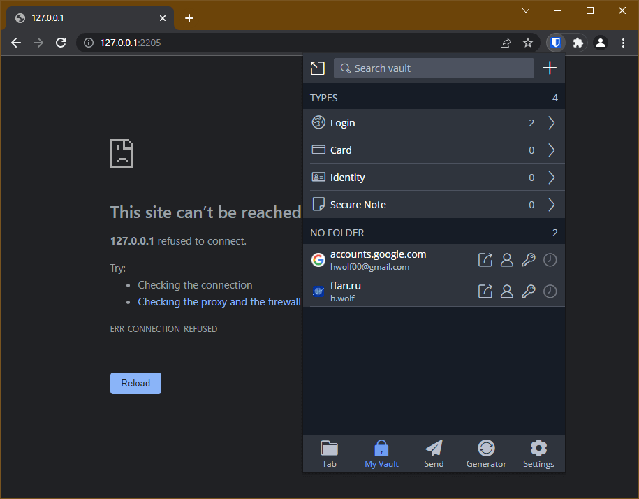
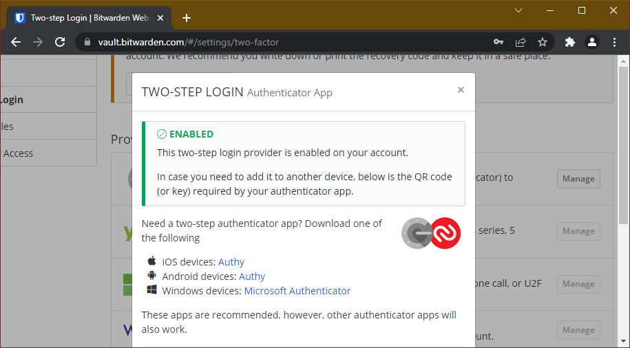
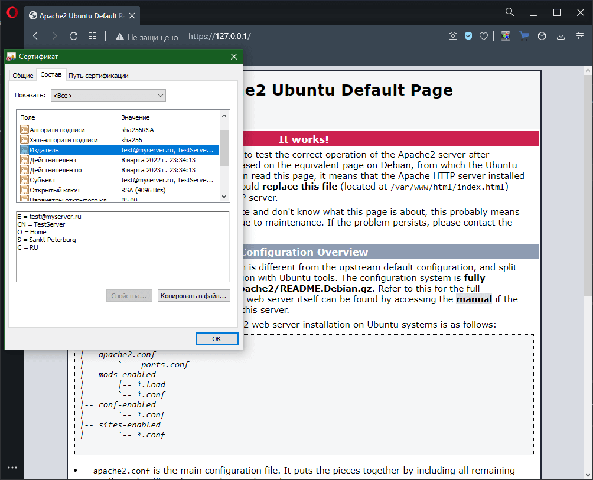
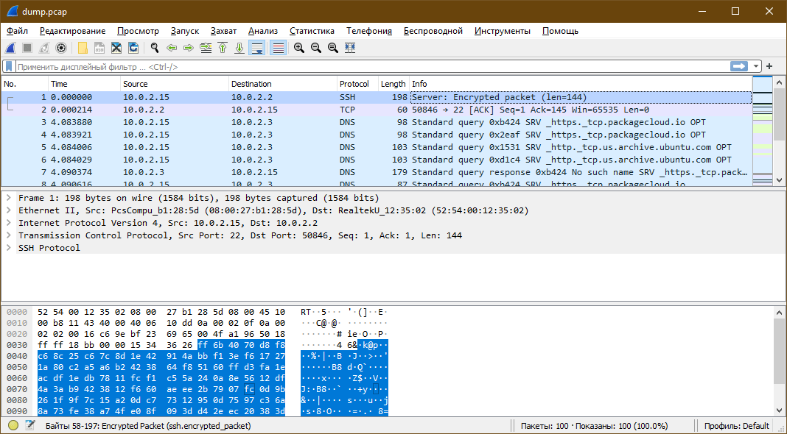

# Домашнее задание по лекции "3.9. Элементы безопасности информационных систем"

## 1. Установите Bitwarden плагин для браузера. Зарегестрируйтесь и сохраните несколько паролей



---

## 2. Установите Google authenticator на мобильный телефон. Настройте вход в Bitwarden акаунт через Google authenticator OTP



---

## 3. Установите apache2, сгенерируйте самоподписанный сертификат, настройте тестовый сайт для работы по HTTPS

Генерирование самоподписного сертификата:

```console
vagrant@vagrant:~$ sudo openssl req -x509 -nodes -days 365 -newkey rsa:4096 -keyout /etc/ssl/private/apache-selfsigned.key -out /etc/ssl/certs/apache-selfsigned.crt
Generating a RSA private key
....................................................................++++
..................++++
writing new private key to '/etc/ssl/private/apache-selfsigned.key'
-----
You are about to be asked to enter information that will be incorporated
into your certificate request.
What you are about to enter is what is called a Distinguished Name or a DN.
There are quite a few fields but you can leave some blank
For some fields there will be a default value,
If you enter '.', the field will be left blank.
-----
Country Name (2 letter code) [AU]:RU
State or Province Name (full name) [Some-State]:Sankt-Peterburg
Locality Name (eg, city) []:
Organization Name (eg, company) [Internet Widgits Pty Ltd]:Home
Organizational Unit Name (eg, section) []:
Common Name (e.g. server FQDN or YOUR name) []:TestServer
Email Address []:test@myserver.ru
vagrant@vagrant:~$
```

Конфигурация web-сервера **Apache** (файл поддержки SSL для сайта по умолчанию: `/etc/apache2/sites-available/default-ssl.conf`)

```console
<IfModule mod_ssl.c>
        <VirtualHost _default_:443>
                ServerAdmin webmaster@localhost

                DocumentRoot /var/www/html

                ErrorLog ${APACHE_LOG_DIR}/error.log
                CustomLog ${APACHE_LOG_DIR}/access.log combined

                SSLEngine on

                SSLCertificateFile      /etc/ssl/certs/apache-selfsigned.crt
                SSLCertificateKeyFile /etc/ssl/private/apache-selfsigned.key

                <FilesMatch "\.(cgi|shtml|phtml|php)$">
                                SSLOptions +StdEnvVars
                </FilesMatch>
                <Directory /usr/lib/cgi-bin>
                                SSLOptions +StdEnvVars
                </Directory>
        </VirtualHost>
</IfModule>
```

Активация конфигурационного файла сайта (**default-ssl.conf**)

```console
vagrant@vagrant:~$ sudo a2ensite default-ssl
Enabling site default-ssl.
To activate the new configuration, you need to run:
  systemctl reload apache2
vagrant@vagrant:~$ sudo systemctl reload apache2
vagrant@vagrant:~$
```

Проверка функционирования сайта



> В виртуальной машине гостевой порт SSL (443) проброшен на 443 порт хоста

---

## 4. Проверьте на TLS уязвимости произвольный сайт в интернете (кроме сайтов МВД, ФСБ, МинОбр, НацБанк, РосКосмос, РосАтом, РосНАНО и любых госкомпаний, объектов КИИ, ВПК ... и тому подобное)

Установка скрипта проверки

```console
vagrant@vagrant:~$ git clone --depth 1 https://github.com/drwetter/testssl.sh.git
Cloning into 'testssl.sh'...
remote: Enumerating objects: 100, done.
remote: Counting objects: 100% (100/100), done.
remote: Compressing objects: 100% (93/93), done.
remote: Total 100 (delta 14), reused 24 (delta 6), pack-reused 0
Receiving objects: 100% (100/100), 8.61 MiB | 1.58 MiB/s, done.
Resolving deltas: 100% (14/14), done.
vagrant@vagrant:~$
```

Тестирование локального сайта

```console
vagrant@vagrant:~/testssl.sh$ ./testssl.sh -U --sneaky 127.0.0.1

###########################################################
    testssl.sh       3.1dev from https://testssl.sh/dev/
    (55b654c 2022-03-08 20:07:29 -- )

      This program is free software. Distribution and
             modification under GPLv2 permitted.
      USAGE w/o ANY WARRANTY. USE IT AT YOUR OWN RISK!

       Please file bugs @ https://testssl.sh/bugs/

###########################################################

 Using "OpenSSL 1.0.2-chacha (1.0.2k-dev)" [~183 ciphers]
 on vagrant:./bin/openssl.Linux.x86_64
 (built: "Jan 18 17:12:17 2019", platform: "linux-x86_64")


 Start 2022-03-09 08:28:37        -->> 127.0.0.1:443 (127.0.0.1) <<--

 rDNS (127.0.0.1):       --
 Service detected:       HTTP


 Testing vulnerabilities

 Heartbleed (CVE-2014-0160)                not vulnerable (OK), no heartbeat extension
 CCS (CVE-2014-0224)                       not vulnerable (OK)
 Ticketbleed (CVE-2016-9244), experiment.  not vulnerable (OK)
 ROBOT                                     not vulnerable (OK)
 Secure Renegotiation (RFC 5746)           supported (OK)
 Secure Client-Initiated Renegotiation     not vulnerable (OK)
 CRIME, TLS (CVE-2012-4929)                not vulnerable (OK)
 BREACH (CVE-2013-3587)                    potentially NOT ok, "gzip" HTTP compression detected. - only supplied "/" tested
                                           Can be ignored for static pages or if no secrets in the page
 POODLE, SSL (CVE-2014-3566)               not vulnerable (OK)
 TLS_FALLBACK_SCSV (RFC 7507)              No fallback possible (OK), no protocol below TLS 1.2 offered
 SWEET32 (CVE-2016-2183, CVE-2016-6329)    not vulnerable (OK)
 FREAK (CVE-2015-0204)                     not vulnerable (OK)
 DROWN (CVE-2016-0800, CVE-2016-0703)      not vulnerable on this host and port (OK)
                                           no RSA certificate, thus certificate can't be used with SSLv2 elsewhere
 LOGJAM (CVE-2015-4000), experimental      common prime with 4096 bits detected: RFC3526/Oakley Group 16 (4096 bits),
                                           but no DH EXPORT ciphers
 BEAST (CVE-2011-3389)                     not vulnerable (OK), no SSL3 or TLS1
 LUCKY13 (CVE-2013-0169), experimental     potentially VULNERABLE, uses cipher block chaining (CBC) ciphers with TLS. Check patches
 Winshock (CVE-2014-6321), experimental    not vulnerable (OK)
 RC4 (CVE-2013-2566, CVE-2015-2808)        no RC4 ciphers detected (OK)


 Done 2022-03-09 08:29:06 [  30s] -->> 127.0.0.1:443 (127.0.0.1) <<--


vagrant@vagrant:~/testssl.sh$
```

---

## 5. Установите на Ubuntu ssh сервер, сгенерируйте новый приватный ключ. Скопируйте свой публичный ключ на другой сервер. Подключитесь к серверу по SSH-ключу

Установка **SSH** сервера на **Linux** (Debian/Ubuntu) выполняется командой `sudo apt install ssh-server`

Установка **SSH** сервера на **Windows 10** выполняется через меню `Пуск` -> `Параметры` -> `Приложения` -> `Приложения и возможности` -> `Управление дополнительными компонентами` -> `Добавить компонент` -> `Сервер OpenSSH` (Установить). После требуется включить соответствующую службу.

Генерирование пары ключей с типом по умолчанию `RSA`, длиной ключа в `4096` бит и комментарием `key_rsa_4096`. Имена и пути расположения файлов ключей оставлены по умолчанию.

```console
vagrant@vagrant:~$ ssh-keygen -b 4096 -C key_rsa_4096
Generating public/private rsa key pair.
Enter file in which to save the key (/home/vagrant/.ssh/id_rsa):
Enter passphrase (empty for no passphrase):
Enter same passphrase again:
Your identification has been saved in /home/vagrant/.ssh/id_rsa
Your public key has been saved in /home/vagrant/.ssh/id_rsa.pub
The key fingerprint is:
SHA256:9sKq3KGpNnqgheddhUN8LI8vNs87Vzl7Hy7AXpXKj74 key_rsa_4096
The key's randomart image is:
+---[RSA 4096]----+
|     . .         |
|      + o        |
|     . *        .|
|      + o      o |
| .     +S . ..o  |
|o o   =o.. o++   |
|.= . o.=o o.ooo. |
|. =..+ o+....oo..|
|.+.o=.o .+  .Eoo.|
+----[SHA256]-----+
vagrant@vagrant:~$ ls -l ~/.ssh
total 16
-rw------- 1 vagrant vagrant  389 Jan 31 11:38 authorized_keys
-rw------- 1 vagrant vagrant 3381 Mar  9 08:46 id_rsa
-rw-r--r-- 1 vagrant vagrant  738 Mar  9 08:46 id_rsa.pub
-rw-r--r-- 1 vagrant vagrant  222 Feb  9 12:09 known_hosts
vagrant@vagrant:~$
```

В задаче использовались две виртуальные машины, созданные при помощи **Vagrant**

Генерирование ключа выполнялось на исходной машине **Vagrant-1** со следующими сетевыми интерфейсами. Гостевой порт `22` проброшен на `2102` порт хоста.

```console
vagrant@vagrant:~$ ip -br a
lo               UNKNOWN        127.0.0.1/8 ::1/128
eth0             UP             10.0.2.15/24 fe80::a00:27ff:feb1:285d/64
eth1             UP             192.168.0.109/24 fe80::a00:27ff:fe3c:a531/64
eth2             UP             192.168.0.107/24 fe80::a00:27ff:fe6a:a71c/64
eth3             UP             192.168.0.108/24 fe80::a00:27ff:fed3:9a8e/64
vagrant@vagrant:~$
```

В качестве целевой машины используется **Vagrant-2** со следующими сетевыми интерфейсами. Гостевой порт `22` проброшен на `2202` порт хоста.

```console
vagrant@vagrant:~$ ip -br a
lo               UNKNOWN        127.0.0.1/8 ::1/128
eth0             UP             10.0.2.15/24 fe80::a00:27ff:fe8f:6fe/64
eth1             UP             192.168.0.112/24 fe80::a00:27ff:fe07:5625/64
eth2             UP             192.168.0.110/24 fe80::a00:27ff:fe58:ed06/64
eth3             UP             192.168.0.111/24 fe80::a00:27ff:fe85:b5f8/64
vagrant@vagrant:~$
```
Копирование открытого ключа (машина **Vagrant-1**)

Операция выполняется командой `ssh-copy-id <USER>@<HOST>`, где `<USER>` - пользователь целевой системы для которого копируется открытый ключ, `<HOST>` - хост целевой системы

```console
vagrant@vagrant:~$ ssh-copy-id vagrant@192.168.0.110
/usr/bin/ssh-copy-id: INFO: Source of key(s) to be installed: "/home/vagrant/.ssh/id_rsa.pub"
/usr/bin/ssh-copy-id: INFO: attempting to log in with the new key(s), to filter out any that are already installed
/usr/bin/ssh-copy-id: INFO: 1 key(s) remain to be installed -- if you are prompted now it is to install the new keys
vagrant@192.168.0.110's password:

Number of key(s) added: 1

Now try logging into the machine, with:   "ssh 'vagrant@192.168.0.110'"
and check to make sure that only the key(s) you wanted were added.

vagrant@vagrant:~$
```

Подключение по **SSH** с новым ключом (машина **Vagrant-1**)

```console
vagrant@vagrant:~$ ssh vagrant@192.168.0.110
Welcome to Ubuntu 20.04.3 LTS (GNU/Linux 5.4.0-91-generic x86_64)

 * Documentation:  https://help.ubuntu.com
 * Management:     https://landscape.canonical.com
 * Support:        https://ubuntu.com/advantage

  System information as of Wed 09 Mar 2022 10:49:31 AM UTC

  System load:  0.03               Users logged in:       1
  Usage of /:   14.7% of 30.88GB   IPv4 address for eth0: 10.0.2.15
  Memory usage: 20%                IPv4 address for eth1: 192.168.0.112
  Swap usage:   0%                 IPv4 address for eth2: 192.168.0.110
  Processes:    161                IPv4 address for eth3: 192.168.0.111


This system is built by the Bento project by Chef Software
More information can be found at https://github.com/chef/bento
Last login: Wed Mar  9 10:12:25 2022 from 10.0.2.2
vagrant@vagrant:~$
```

Проверка функционирования - создание директории в каталоге пользователя, закрытие сеанса SSH, просмотр списка директорий

```console
vagrant@vagrant:~$ ls
aa.sh  check.log  error  gg  hw  logs  node_exporter  out  test  testssl.sh
vagrant@vagrant:~$ mkdir TEST_DIR
vagrant@vagrant:~$ ls
aa.sh  check.log  error  gg  hw  logs  node_exporter  out  test  TEST_DIR  testssl.sh
vagrant@vagrant:~$ exit
logout
Connection to 192.168.0.110 closed.
vagrant@vagrant:~$ ls
aa.sh  check.log  error  gg  hw  logs  node_exporter  out  test  testssl.sh
vagrant@vagrant:~$
```

---

## 6. Переименуйте файлы ключей из задания 5. Настройте файл конфигурации SSH клиента, так чтобы вход на удаленный сервер осуществлялся по имени сервера

При решении задачи использовалась пара виртуальных машин из задания 5.

Переименование ключей (машина **Vagrant-1**)

```console
vagrant@vagrant:~$ mv ~/.ssh/id_rsa ~/.ssh/id_my_key_rsa
vagrant@vagrant:~$ mv ~/.ssh/id_rsa.pub ~/.ssh/id_my_key_rsa.pub
vagrant@vagrant:~$
```

Создание конфигурационного файла клиента **SSH** для использования группы параметров по имени (машина **Vagrant-1**)

```console
vagrant@vagrant:~$ cat>~/.ssh/config<<EOF
> Host vagrant-2
>   HostName 192.168.0.110
>   IdentityFile ~/.ssh/id_my_key_rsa
>   User vagrant
>   Port 22
> EOF
vagrant@vagrant:~$
```

Проверка подключения по **SSH** с импользованием группы параметров (машина **Vagrant-1**)

```console
vagrant@vagrant:~$ ssh vagrant-2
Welcome to Ubuntu 20.04.3 LTS (GNU/Linux 5.4.0-91-generic x86_64)

 * Documentation:  https://help.ubuntu.com
 * Management:     https://landscape.canonical.com
 * Support:        https://ubuntu.com/advantage

  System information as of Wed 09 Mar 2022 11:28:48 AM UTC

  System load:  0.0                Users logged in:       1
  Usage of /:   14.7% of 30.88GB   IPv4 address for eth0: 10.0.2.15
  Memory usage: 21%                IPv4 address for eth1: 192.168.0.112
  Swap usage:   0%                 IPv4 address for eth2: 192.168.0.110
  Processes:    155                IPv4 address for eth3: 192.168.0.111


This system is built by the Bento project by Chef Software
More information can be found at https://github.com/chef/bento
Last login: Wed Mar  9 11:25:33 2022 from 192.168.0.109
vagrant@vagrant:~$ exit
logout
Connection to 192.168.0.110 closed.
vagrant@vagrant:~$
```

---

## 7. Соберите дамп трафика утилитой tcpdump в формате pcap, 100 пакетов. Откройте файл pcap в Wireshark

В соответствии с руководством `man tcpdump`:

- Для ограничения числа собранных пакетов используется ключ `-c <NUMBER>`, где `<NUMBER>` - число пакетов

- Для сохранения принятых пакетов до вывода и обработки используется ключ `-w <FILE>`, где `<FILE>` - имя файла, куда будет сохранён дамп


```console
vagrant@vagrant:~$ sudo tcpdump -c 100 -w dump.pcap
tcpdump: listening on eth0, link-type EN10MB (Ethernet), capture size 262144 bytes
100 packets captured
114 packets received by filter
0 packets dropped by kernel
vagrant@vagrant:~$
```

Страница загрузки [Wireshark](https://www.wireshark.org/index.html#download)



---

## 8\*. Просканируйте хост scanme.nmap.org. Какие сервисы запущены?

Сканирование выполняется программой `NMap` (Установка `sudo apt install nmap`)

Вывод работы программы

```console
vagrant@vagrant:~$ nmap scanme.nmap.org
Starting Nmap 7.80 ( https://nmap.org ) at 2022-03-09 11:59 UTC
Nmap scan report for scanme.nmap.org (45.33.32.156)
Host is up (1.5s latency).
Other addresses for scanme.nmap.org (not scanned): 2600:3c01::f03c:91ff:fe18:bb2f
Not shown: 965 closed ports, 31 filtered ports
PORT      STATE SERVICE
22/tcp    open  ssh
80/tcp    open  http
9929/tcp  open  nping-echo
31337/tcp open  Elite

Nmap done: 1 IP address (1 host up) scanned in 105.35 seconds
vagrant@vagrant:~$
```

Из вывода видно, что закрыто 965 портов, 31 отфильтровано, из остальных открытых на следующих запущены:

- `22/tcp` - Сервер SSH доступа

- `80/tcp` - Web-сервер на стандартном порту

- `9929/tcp` - Сервис `nping-echo`

- `31337/tcp` - Сервис `Elite` - широко распространён в узких кругах хакеров (по сленгу 3=E, 1=L, 7=T) - используется в различных бэкдорах и троянах.

---

## 9\*. Установите и настройте фаервол ufw на web-сервер из задания 3. Откройте доступ снаружи только к портам 22,80,443

Установка `sudo apt install ufw` (по умолчанию, в **Ubuntu 20** установлен)

**ВНИМАНИЕ!** Все команды брандмауэра требуют прав администратора

Включение - `ufw enable`, выключение - `ufw disable`

Статус брандмауэра по умолчанию

```console
vagrant@vagrant:~$ sudo ufw enable
Command may disrupt existing ssh connections. Proceed with operation (y|n)? y
Firewall is active and enabled on system startup
vagrant@vagrant:~$ sudo ufw status verbose
Status: active
Logging: on (low)
Default: deny (incoming), allow (outgoing), disabled (routed)
New profiles: skip
vagrant@vagrant:~$
```

Из вывода следует, что все исходящие соединения разрешены, в входящие запрещены. То есть в данном состоянии подключиться по **SSH** не удастся.

Добавление правил разрешения `22`,`80` и `443` портов (только **TCP**)

```console
vagrant@vagrant:~$ sudo ufw allow 22/tcp
Rule added
Rule added(6)
vagrant@vagrant:~$ sudo ufw allow in on eth1 to any port 80 proto tcp
Rule added
Rule added(6)
vagrant@vagrant:~$ sudo ufw allow 443/tcp
Rule added
Rule added(6)
vagrant@vagrant:~$ sudo ufw reload
Firewall reloaded
vagrant@vagrant:~$
```

Статус после перезагрузки брандмауэра

```console
vagrant@vagrant:~$ sudo ufw status verbose
Status: active
Logging: on (low)
Default: deny (incoming), allow (outgoing), disabled (routed)
New profiles: skip

To                         Action      From
--                         ------      ----
22/tcp                     ALLOW IN    Anywhere
80/tcp on eth1             ALLOW IN    Anywhere
443/tcp                    ALLOW IN    Anywhere
22/tcp (v6)                ALLOW IN    Anywhere (v6)
80/tcp (v6) on eth1        ALLOW IN    Anywhere (v6)
443/tcp (v6)               ALLOW IN    Anywhere (v6)

vagrant@vagrant:~$
```

То есть, разрешены подключения с любых источников по стандартному порту **SSH** и **HTTPS**, а обычный **HTTP** доступен только с сетевого интерфейса `eth1`

---

Использованные в лекции материалы:

- Создание самоподписного сертификата: `sudo openssl req -x509 -nodes -days 365 -newkey rsa:4096 -keyout /etc/ssl/private/apache-selfsigned.key -out /etc/ssl/certs/apache-selfsigned.crt -subj "/C=RU/ST=Moscow/L=Company name/OU=Org/CN=www.example.com"`

- Настройка web-сервера `Apache 2` (пакет `apache2`)

  - Активация расширения SSL: `sudo a2enmod ssl`

  - Файл настроек конкретного сервера: `/etc/apache2/sites-available/your-domain-or-ip.conf`

    ```
    <VirtualHost *:443>
      ServerName your-domain-or-ip
      DocumentRoot /var/www/your-domain
      SSLEngine on
      SSLCertificateFile /etc/ssl/certs/apache-selfsigned.crt
      SSLCertificateKeyFile /etc/ssl/private/apache-selfsigned.key
    </VirtualHost>
    ```

  - Активация конфигурационного файла сайта: `sudo a2ensite <CONF>`, где `<CONF>` - файл конфигурации сайта без расширения

- Оптимальные конфигурации настроек web-серверов от [Mozilla](https://ssl-config.mozilla.org) с использованием SSL

- Тестирование TLS - инструмент [Dr.Wetter](https://github.com/drwetter/testssl.sh), [Примеры использования](https://www.tecmint.com/testssl-sh-test-tls-ssl-encryption-in-linux-commandline/)

  - Быстрый тест: `-e --fast --parallel <URL>`, где `<URL>` - адрес проверяемого ресурса

  - Стандартная проверка на уязвимости: `-U --sneaky <URL>`, где `<URL>` - адрес проверяемого ресурса

- SSH

  - Генерирование ключей: `ssh-keygen`

    - Стандартный путь закрытого ключа: `/home/<USERNAME>/.ssh/id_<TYPE>`, где `<USERNAME>` - имя пользователя, `<TYPE>` - тип ключей (по умолчанию **RSA**)

    - Стандартный путь открытого ключа: `/home/<USERNAME>/.ssh/id_<TYPE>.pub`, где `<USERNAME>` - имя пользователя, `<TYPE>` - тип ключей (по умолчанию **RSA**)

  - Проверка, есть ли в известных серверах: `ssh-keygen -F <SERVER>`, где `<SERVER>` - хост проверяемой машины

  - Удаление старого ключа сервера: `ssh-keygen -R <SERVER>`, где `<SERVER>` - хост сервера, для которого удаляется ключ

  - Изменение настройки: `ssh -o <OPTION_NAME>=<OPTION_VALUE> <SERVER>`, где `<OPTION_NAME>` - имя, а `<OPTION_VALUE>` - значение задаваемого параметра, `<SERVER>` - хост

  - Копирование открытого ключа на удаленный сервер:

    - Утилитой `ssh-copy-id <USERNAME>@<IP>`, где `<USERNAME>` - имя пользователя дл которого будет добавлен открытый ключ, `<IP>` - хост, куда будет скопирован открытый ключ

    - Вручную `cat public_key_string >> ~/.ssh/authorized_keys`

  - Сканирование и сохранение открытых ключей: `ssh-keyscan <SERVER_IP>` или `ssh-keyscan -H <HOST> >> ~/.ssh/known_hosts` (вывод хэшированных значений), где `<SERVER_IP>` и `<HOST>` - хост для которого ивыполняется поиск ключей

  - Проверка SSH шифров (если что-то не работает): `ssh-audit [-vvv] <HOST>` (требуется пакет `ssh-audit`. [Подробнее](https://github.com/arthepsy/ssh-audit)), где `<HOST>` - хост, к которому выполняестся подключение во время диагностики

  - Настройка SSH (файл `~/.ssh/config`):

    ```
    Host <HOST>
      HostName <DOMAIN_OR_IP>
      IdentityFile <KEY_FILE>
      User <USERNAME>
      Port <PORT>
      #StrictHostKeyChecking no   # Отключение проверку known_hosts
      #ProxyJump <HOST>           # Использовать проксирование
    ```

    Подробнее про [Jump](https://www.infoworld.com/article/3619278/proxyjump-is-safer-than-ssh-agent-forwarding.html)

- Брандмауэр `iptables` (пакеты `iptables` и `iptables-persistent`):

  - `iptables -t filter -L` - посмотреть список правил. `-v` - вывод числа пакетов

  - `iptables -F` - удаление всех правил

  - `iptables -A INPUT -s 1.1.1.1 -j DROP` - блокировать (**DROP**) входящий (**INPUT**) трафик от `1.1.1.1` (**-s**)

  - `iptables -A OUTPUT -p udp --dport 53 -j DROP` - блокировать исходящий (**OUTPUT**) UDP трафик на порт 53 (**--dport**)

  - `iptables -D OUTPUT -p udp --dport 53 -j DROP` - удалить (**-D**) правило

  - `iptables-save > /etc/iptables/rules.v4` - сохранение фильтров IPv4 (**iptables-persistent**)

  - `Iptables-save > /etc/iptables/rules.v6` - сохранение фильтров IPv6 (**iptables-persistent**)

  - `netfilter-persistent save` - сохранить правила в Ubuntu

  - `netfilter-persistent reload` - перезагрузить правила в Ubuntu

- Брандмауэр `UFW` (пакет `ufw`, использование требует прав администратора):

  - `ufw enable` - включить брандмауэр

  - `ufw status verbose` - посмотреть имеющиеся правила (`numbered` - вывод правил по номерам)

  - `ufw allow allow ssh/tcp` - добавить правило для любых IP

  - `ufw allow from 172.30.0.7/24` - добавить правило для определенной сети

  - `ufw delete allow from 172.30.0.7/24` - удалить правило

  - `ufw delete 2` - удалить правило №2

  - `ufw logging on` - включить логирования (файл по умолчанию `/var/log/ufw.log`)

- Инструменты **pentest**: `nmap`, `Burp Suite`, `Metasploit Framework`, `Aircrack-ng`, `Autopsy`, `wireshark`, `tcpdump`. Специализированный дистрибутив [Kali Linux](https://www.kali.org/tools/).

- Дополнительные материалы:

  - Книга по информационной безопасности: [CISSP All-In-One Exam Guide](https://dorlov.blogspot.com/2011/05/issp-cissp-all-in-one-exam-guide.html)

  - Проекты [Awesome SSH](https://project-awesome.org/moul/awesome-ssh)

  - Аналог SSH - [Teleport](https://goteleport.com/docs/)

  - [ngrok](https://github.com/inconshreveable/ngrok) - реверсивный прокси, создающий безопасный канал обмена данными между внешними источниками и запущенными локально сервисами.

