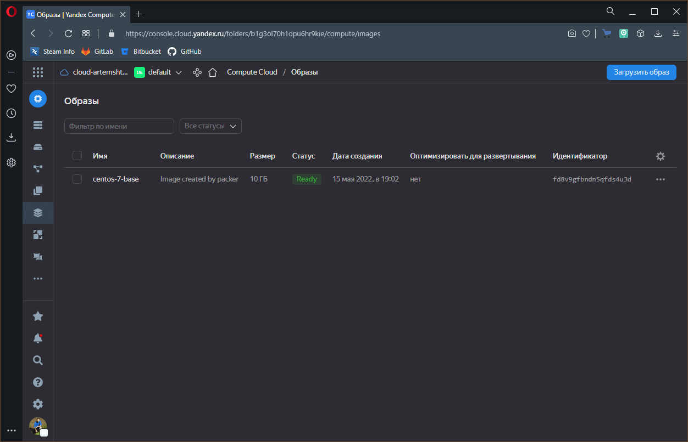
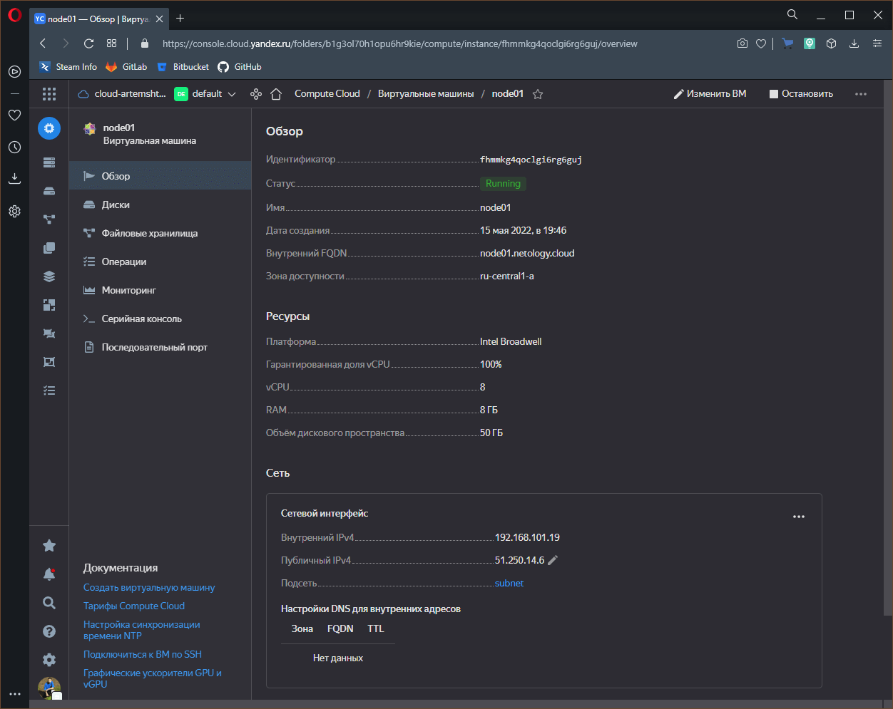
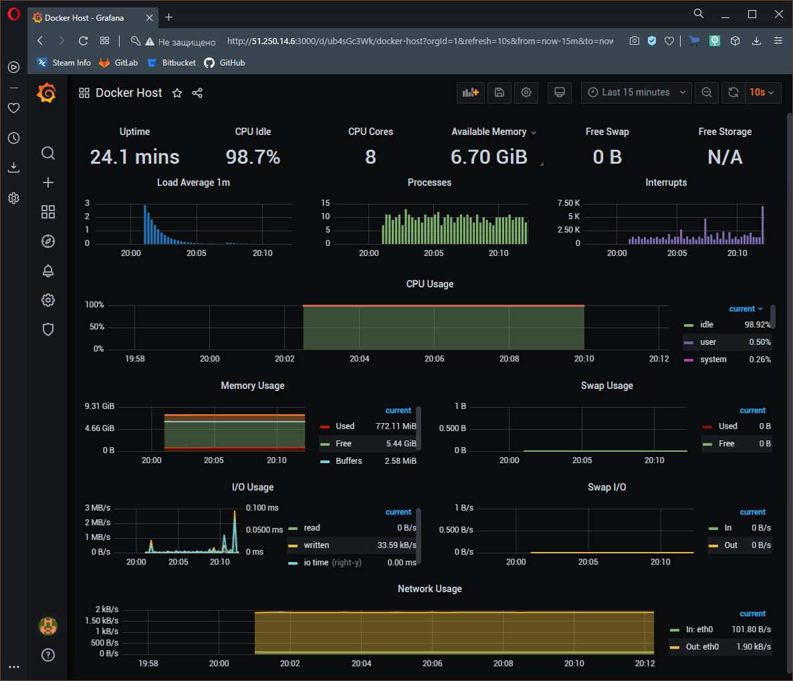
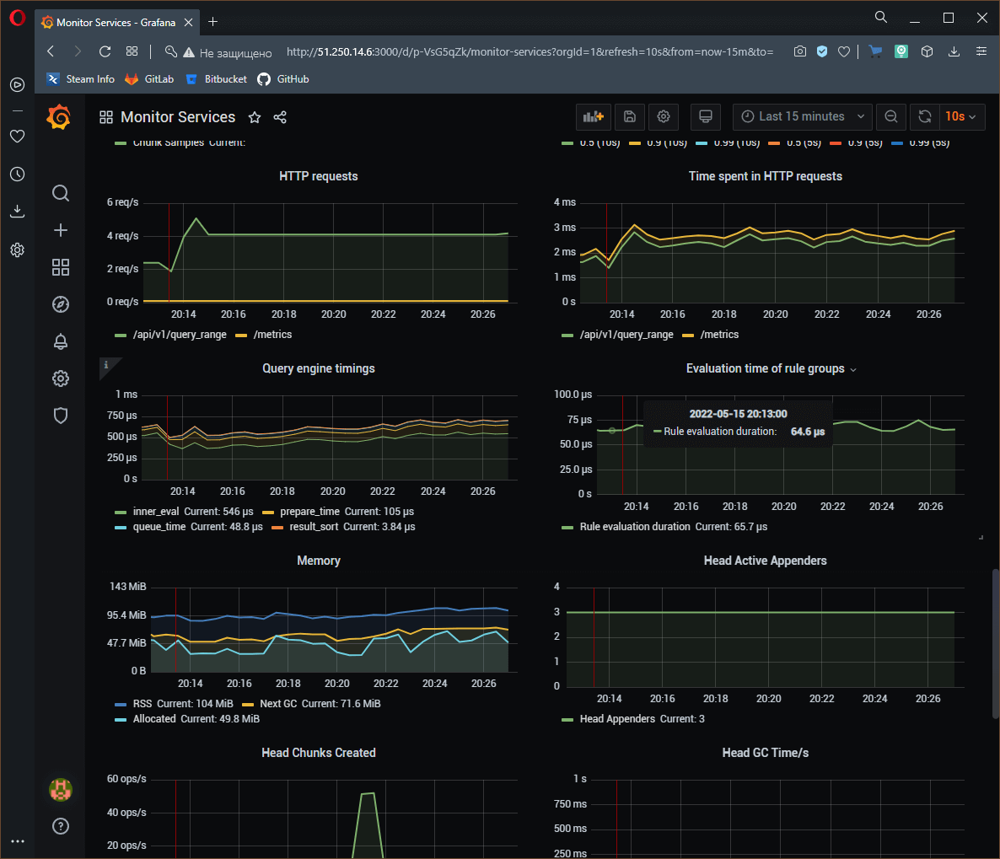
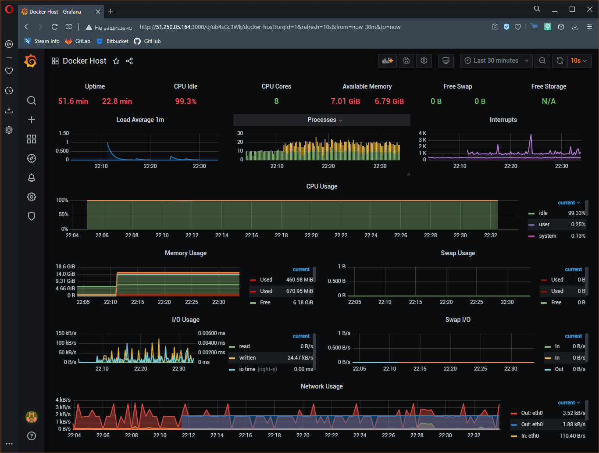

# Домашнее задание по лекции "Оркестрация группой Docker контейнеров на примере Docker Compose"

## Обязательная задача 1

Создать собственный образ операционной системы с помощью Packer.

Для получения зачета, вам необходимо предоставить cкриншот страницы c образом машины в облаке.

**Решение**

> Для работы нужно авторизаваться в Яндекс.Облаке (описано в доп. материалах)

После инициализации:

```console
sa@debian:~/hw-compose$ yc config list
token: AQAAAAADOVxNAATuwW_Wpk1xREErmh4N5XGG3-U
cloud-id: b1g91ed04feossfp3fm7
folder-id: b1g3ol70h1opu6hr9kie
compute-default-zone: ru-central1-a
sa@debian:~/hw-compose$
```

Создание сети:

```console
sa@debian:~$ yc vpc network create --name test-net --labels my-label=netology --description "test network via yc"
id: enpf0586gvvb4de6agb4
folder_id: b1g3ol70h1opu6hr9kie
created_at: "2022-05-15T16:42:04Z"
name: test-net
description: test network via yc
labels:
  my-label: netology

sa@debian:~$
```

Создание подсети:

```console
sa@debian:~$ yc vpc subnet create --name test-subnet-a --zone ru-central1-a --range 10.1.2.0/24 --network-name test-net --description "test subnet via yc"
id: e9bpi13ht5omf2kn1pmg
folder_id: b1g3ol70h1opu6hr9kie
created_at: "2022-05-15T16:42:52Z"
name: test-subnet-a
description: test subnet via yc
network_id: enpf0586gvvb4de6agb4
zone_id: ru-central1-a
v4_cidr_blocks:
- 10.1.2.0/24

sa@debian:~$
```

Внесение изменений в конфигурационный файл **packer** (folder_id, subnet_id, token, zone):

```console
sa@debian:~/hw-compose/packer$ cat centos-7-base.json
{
  "builders": [
    {
      "disk_type": "network-nvme",
      "folder_id": "b1g3ol70h1opu6hr9kie",
      "image_description": "Image created by packer",
      "image_family": "centos",
      "image_name": "centos-7-base",
      "source_image_family": "centos-7",
      "ssh_username": "centos",
      "subnet_id": "e9bpi13ht5omf2kn1pmg",
      "token": "AQAAAAADOVxNAATuwW_Wpk1xREErmh4N5XGG3-U",
      "type": "yandex",
      "use_ipv4_nat": true,
      "zone": "ru-central1-a"
    }
  ],
  "provisioners": [
    {
      "inline": [
        "sudo yum -y update",
        "sudo yum -y install bridge-utils bind-utils iptables curl net-tools tcpdump rsync telnet openssh-server"
      ],
      "type": "shell"
    }
  ]
}
sa@debian:~/hw-compose/packer$
```

Создание образа:

```console
sa@debian:~/hw-compose/packer$ packer validate centos-7-base.json
The configuration is valid.
sa@debian:~/hw-compose/packer$ packer build centos-7-base.json
yandex: output will be in this color.

==> yandex: Creating temporary RSA SSH key for instance...
==> yandex: Using as source image: fd8v9fc454c44fr6lngi (name: "centos-7-v20220314", family: "centos-7")
==> yandex: Use provided subnet id e9bjs233blt8v9j0kaea
==> yandex: Creating disk...
==> yandex: Creating instance...
==> yandex: Waiting for instance with id fhm90f96sv8tm51elv5t to become active...
    yandex: Detected instance IP: 51.250.11.38
==> yandex: Using SSH communicator to connect: 51.250.11.38
==> yandex: Waiting for SSH to become available...
==> yandex: Connected to SSH!
==> yandex: Provisioning with shell script: /tmp/packer-shell237984645
    yandex: Loaded plugins: fastestmirror
    yandex: Determining fastest mirrors
    yandex:  * base: mirror.sale-dedic.com
    yandex:  * extras: mirror.yandex.ru
    yandex:  * updates: mirror.corbina.net
    yandex: Resolving Dependencies
    yandex: --> Running transaction check
    yandex: ---> Package expat.x86_64 0:2.1.0-12.el7 will be updated
    yandex: ---> Package expat.x86_64 0:2.1.0-14.el7_9 will be an update
    yandex: ---> Package gzip.x86_64 0:1.5-10.el7 will be updated
    yandex: ---> Package gzip.x86_64 0:1.5-11.el7_9 will be an update
    yandex: ---> Package kernel.x86_64 0:3.10.0-1160.62.1.el7 will be installed
    yandex: ---> Package kernel-tools.x86_64 0:3.10.0-1160.59.1.el7 will be updated
    yandex: ---> Package kernel-tools.x86_64 0:3.10.0-1160.62.1.el7 will be an update
    yandex: ---> Package kernel-tools-libs.x86_64 0:3.10.0-1160.59.1.el7 will be updated
    yandex: ---> Package kernel-tools-libs.x86_64 0:3.10.0-1160.62.1.el7 will be an update
    yandex: ---> Package microcode_ctl.x86_64 2:2.1-73.11.el7_9 will be updated
    yandex: ---> Package microcode_ctl.x86_64 2:2.1-73.13.el7_9 will be an update
    yandex: ---> Package openssl.x86_64 1:1.0.2k-24.el7_9 will be updated
    yandex: ---> Package openssl.x86_64 1:1.0.2k-25.el7_9 will be an update
    yandex: ---> Package openssl-libs.x86_64 1:1.0.2k-24.el7_9 will be updated
    yandex: ---> Package openssl-libs.x86_64 1:1.0.2k-25.el7_9 will be an update
    yandex: ---> Package python-perf.x86_64 0:3.10.0-1160.59.1.el7 will be updated
    yandex: ---> Package python-perf.x86_64 0:3.10.0-1160.62.1.el7 will be an update
    yandex: ---> Package rsyslog.x86_64 0:8.24.0-57.el7_9.1 will be updated
    yandex: ---> Package rsyslog.x86_64 0:8.24.0-57.el7_9.2 will be an update
    yandex: ---> Package tzdata.noarch 0:2021e-1.el7 will be updated
    yandex: ---> Package tzdata.noarch 0:2022a-1.el7 will be an update
    yandex: ---> Package zlib.x86_64 0:1.2.7-19.el7_9 will be updated
    yandex: ---> Package zlib.x86_64 0:1.2.7-20.el7_9 will be an update
    yandex: --> Finished Dependency Resolution
    yandex:
    yandex: Dependencies Resolved
    yandex:
    yandex: ================================================================================
    yandex:  Package               Arch       Version                     Repository   Size
    yandex: ================================================================================
    yandex: Installing:
    yandex:  kernel                x86_64     3.10.0-1160.62.1.el7        updates      50 M
    yandex: Updating:
    yandex:  expat                 x86_64     2.1.0-14.el7_9              updates      83 k
    yandex:  gzip                  x86_64     1.5-11.el7_9                updates     130 k
    yandex:  kernel-tools          x86_64     3.10.0-1160.62.1.el7        updates     8.2 M
    yandex:  kernel-tools-libs     x86_64     3.10.0-1160.62.1.el7        updates     8.1 M
    yandex:  microcode_ctl         x86_64     2:2.1-73.13.el7_9           updates     4.2 M
    yandex:  openssl               x86_64     1:1.0.2k-25.el7_9           updates     494 k
    yandex:  openssl-libs          x86_64     1:1.0.2k-25.el7_9           updates     1.2 M
    yandex:  python-perf           x86_64     3.10.0-1160.62.1.el7        updates     8.2 M
    yandex:  rsyslog               x86_64     8.24.0-57.el7_9.2           updates     622 k
    yandex:  tzdata                noarch     2022a-1.el7                 updates     501 k
    yandex:  zlib                  x86_64     1.2.7-20.el7_9              updates      90 k
    yandex:
    yandex: Transaction Summary
    yandex: ================================================================================
    yandex: Install   1 Package
    yandex: Upgrade  11 Packages
    yandex:
    yandex: Total download size: 82 M
    yandex: Downloading packages:
    yandex: Delta RPMs disabled because /usr/bin/applydeltarpm not installed.
    yandex: --------------------------------------------------------------------------------
    yandex: Total                                               55 MB/s |  82 MB  00:01
    yandex: Running transaction check
    yandex: Running transaction test
    yandex: Transaction test succeeded
    yandex: Running transaction
    yandex:   Updating   : zlib-1.2.7-20.el7_9.x86_64                                  1/23
    yandex:   Updating   : 1:openssl-libs-1.0.2k-25.el7_9.x86_64                       2/23
    yandex:   Updating   : kernel-tools-libs-3.10.0-1160.62.1.el7.x86_64               3/23
    yandex:   Updating   : kernel-tools-3.10.0-1160.62.1.el7.x86_64                    4/23
    yandex:   Updating   : 1:openssl-1.0.2k-25.el7_9.x86_64                            5/23
    yandex:   Updating   : rsyslog-8.24.0-57.el7_9.2.x86_64                            6/23
    yandex:   Installing : kernel-3.10.0-1160.62.1.el7.x86_64                          7/23
    yandex:   Updating   : gzip-1.5-11.el7_9.x86_64                                    8/23
    yandex:   Updating   : tzdata-2022a-1.el7.noarch                                   9/23
    yandex:   Updating   : python-perf-3.10.0-1160.62.1.el7.x86_64                    10/23
    yandex:   Updating   : expat-2.1.0-14.el7_9.x86_64                                11/23
    yandex:   Updating   : 2:microcode_ctl-2.1-73.13.el7_9.x86_64                     12/23
    yandex:   Cleanup    : 1:openssl-1.0.2k-24.el7_9.x86_64                           13/23
    yandex:   Cleanup    : 1:openssl-libs-1.0.2k-24.el7_9.x86_64                      14/23
    yandex:   Cleanup    : kernel-tools-3.10.0-1160.59.1.el7.x86_64                   15/23
    yandex:   Cleanup    : rsyslog-8.24.0-57.el7_9.1.x86_64                           16/23
    yandex:   Cleanup    : tzdata-2021e-1.el7.noarch                                  17/23
    yandex:   Cleanup    : 2:microcode_ctl-2.1-73.11.el7_9.x86_64                     18/23
    yandex:   Cleanup    : zlib-1.2.7-19.el7_9.x86_64                                 19/23
    yandex:   Cleanup    : kernel-tools-libs-3.10.0-1160.59.1.el7.x86_64              20/23
    yandex:   Cleanup    : gzip-1.5-10.el7.x86_64                                     21/23
    yandex:   Cleanup    : python-perf-3.10.0-1160.59.1.el7.x86_64                    22/23
    yandex:   Cleanup    : expat-2.1.0-12.el7.x86_64                                  23/23
    yandex:   Verifying  : kernel-tools-libs-3.10.0-1160.62.1.el7.x86_64               1/23
    yandex:   Verifying  : 1:openssl-1.0.2k-25.el7_9.x86_64                            2/23
    yandex:   Verifying  : rsyslog-8.24.0-57.el7_9.2.x86_64                            3/23
    yandex:   Verifying  : 2:microcode_ctl-2.1-73.13.el7_9.x86_64                      4/23
    yandex:   Verifying  : expat-2.1.0-14.el7_9.x86_64                                 5/23
    yandex:   Verifying  : kernel-tools-3.10.0-1160.62.1.el7.x86_64                    6/23
    yandex:   Verifying  : python-perf-3.10.0-1160.62.1.el7.x86_64                     7/23
    yandex:   Verifying  : 1:openssl-libs-1.0.2k-25.el7_9.x86_64                       8/23
    yandex:   Verifying  : zlib-1.2.7-20.el7_9.x86_64                                  9/23
    yandex:   Verifying  : tzdata-2022a-1.el7.noarch                                  10/23
    yandex:   Verifying  : gzip-1.5-11.el7_9.x86_64                                   11/23
    yandex:   Verifying  : kernel-3.10.0-1160.62.1.el7.x86_64                         12/23
    yandex:   Verifying  : expat-2.1.0-12.el7.x86_64                                  13/23
    yandex:   Verifying  : zlib-1.2.7-19.el7_9.x86_64                                 14/23
    yandex:   Verifying  : gzip-1.5-10.el7.x86_64                                     15/23
    yandex:   Verifying  : tzdata-2021e-1.el7.noarch                                  16/23
    yandex:   Verifying  : 1:openssl-libs-1.0.2k-24.el7_9.x86_64                      17/23
    yandex:   Verifying  : kernel-tools-3.10.0-1160.59.1.el7.x86_64                   18/23
    yandex:   Verifying  : 1:openssl-1.0.2k-24.el7_9.x86_64                           19/23
    yandex:   Verifying  : 2:microcode_ctl-2.1-73.11.el7_9.x86_64                     20/23
    yandex:   Verifying  : kernel-tools-libs-3.10.0-1160.59.1.el7.x86_64              21/23
    yandex:   Verifying  : rsyslog-8.24.0-57.el7_9.1.x86_64                           22/23
    yandex:   Verifying  : python-perf-3.10.0-1160.59.1.el7.x86_64                    23/23
    yandex:
    yandex: Installed:
    yandex:   kernel.x86_64 0:3.10.0-1160.62.1.el7
    yandex:
    yandex: Updated:
    yandex:   expat.x86_64 0:2.1.0-14.el7_9
    yandex:   gzip.x86_64 0:1.5-11.el7_9
    yandex:   kernel-tools.x86_64 0:3.10.0-1160.62.1.el7
    yandex:   kernel-tools-libs.x86_64 0:3.10.0-1160.62.1.el7
    yandex:   microcode_ctl.x86_64 2:2.1-73.13.el7_9
    yandex:   openssl.x86_64 1:1.0.2k-25.el7_9
    yandex:   openssl-libs.x86_64 1:1.0.2k-25.el7_9
    yandex:   python-perf.x86_64 0:3.10.0-1160.62.1.el7
    yandex:   rsyslog.x86_64 0:8.24.0-57.el7_9.2
    yandex:   tzdata.noarch 0:2022a-1.el7
    yandex:   zlib.x86_64 0:1.2.7-20.el7_9
    yandex:
    yandex: Complete!
    yandex: Loaded plugins: fastestmirror
    yandex: Loading mirror speeds from cached hostfile
    yandex:  * base: mirror.sale-dedic.com
    yandex:  * extras: mirror.yandex.ru
    yandex:  * updates: mirror.corbina.net
    yandex: Package iptables-1.4.21-35.el7.x86_64 already installed and latest version
    yandex: Package curl-7.29.0-59.el7_9.1.x86_64 already installed and latest version
    yandex: Package net-tools-2.0-0.25.20131004git.el7.x86_64 already installed and latest version
    yandex: Package rsync-3.1.2-10.el7.x86_64 already installed and latest version
    yandex: Package openssh-server-7.4p1-22.el7_9.x86_64 already installed and latest version
    yandex: Resolving Dependencies
    yandex: --> Running transaction check
    yandex: ---> Package bind-utils.x86_64 32:9.11.4-26.P2.el7_9.9 will be installed
    yandex: --> Processing Dependency: bind-libs-lite(x86-64) = 32:9.11.4-26.P2.el7_9.9 for package: 32:bind-utils-9.11.4-26.P2.el7_9.9.x86_64
    yandex: --> Processing Dependency: bind-libs(x86-64) = 32:9.11.4-26.P2.el7_9.9 for package: 32:bind-utils-9.11.4-26.P2.el7_9.9.x86_64
    yandex: --> Processing Dependency: liblwres.so.160()(64bit) for package: 32:bind-utils-9.11.4-26.P2.el7_9.9.x86_64
    yandex: --> Processing Dependency: libisccfg.so.160()(64bit) for package: 32:bind-utils-9.11.4-26.P2.el7_9.9.x86_64
    yandex: --> Processing Dependency: libisc.so.169()(64bit) for package: 32:bind-utils-9.11.4-26.P2.el7_9.9.x86_64
    yandex: --> Processing Dependency: libirs.so.160()(64bit) for package: 32:bind-utils-9.11.4-26.P2.el7_9.9.x86_64
    yandex: --> Processing Dependency: libdns.so.1102()(64bit) for package: 32:bind-utils-9.11.4-26.P2.el7_9.9.x86_64
    yandex: --> Processing Dependency: libbind9.so.160()(64bit) for package: 32:bind-utils-9.11.4-26.P2.el7_9.9.x86_64
    yandex: --> Processing Dependency: libGeoIP.so.1()(64bit) for package: 32:bind-utils-9.11.4-26.P2.el7_9.9.x86_64
    yandex: ---> Package bridge-utils.x86_64 0:1.5-9.el7 will be installed
    yandex: ---> Package tcpdump.x86_64 14:4.9.2-4.el7_7.1 will be installed
    yandex: --> Processing Dependency: libpcap >= 14:1.5.3-10 for package: 14:tcpdump-4.9.2-4.el7_7.1.x86_64
    yandex: --> Processing Dependency: libpcap.so.1()(64bit) for package: 14:tcpdump-4.9.2-4.el7_7.1.x86_64
    yandex: ---> Package telnet.x86_64 1:0.17-66.el7 will be installed
    yandex: --> Running transaction check
    yandex: ---> Package GeoIP.x86_64 0:1.5.0-14.el7 will be installed
    yandex: --> Processing Dependency: geoipupdate for package: GeoIP-1.5.0-14.el7.x86_64
    yandex: ---> Package bind-libs.x86_64 32:9.11.4-26.P2.el7_9.9 will be installed
    yandex: --> Processing Dependency: bind-license = 32:9.11.4-26.P2.el7_9.9 for package: 32:bind-libs-9.11.4-26.P2.el7_9.9.x86_64
    yandex: ---> Package bind-libs-lite.x86_64 32:9.11.4-26.P2.el7_9.9 will be installed
    yandex: ---> Package libpcap.x86_64 14:1.5.3-13.el7_9 will be installed
    yandex: --> Running transaction check
    yandex: ---> Package bind-license.noarch 32:9.11.4-26.P2.el7_9.9 will be installed
    yandex: ---> Package geoipupdate.x86_64 0:2.5.0-1.el7 will be installed
    yandex: --> Finished Dependency Resolution
    yandex:
    yandex: Dependencies Resolved
    yandex:
    yandex: ================================================================================
    yandex:  Package            Arch       Version                        Repository   Size
    yandex: ================================================================================
    yandex: Installing:
    yandex:  bind-utils         x86_64     32:9.11.4-26.P2.el7_9.9        updates     261 k
    yandex:  bridge-utils       x86_64     1.5-9.el7                      base         32 k
    yandex:  tcpdump            x86_64     14:4.9.2-4.el7_7.1             base        422 k
    yandex:  telnet             x86_64     1:0.17-66.el7                  updates      64 k
    yandex: Installing for dependencies:
    yandex:  GeoIP              x86_64     1.5.0-14.el7                   base        1.5 M
    yandex:  bind-libs          x86_64     32:9.11.4-26.P2.el7_9.9        updates     157 k
    yandex:  bind-libs-lite     x86_64     32:9.11.4-26.P2.el7_9.9        updates     1.1 M
    yandex:  bind-license       noarch     32:9.11.4-26.P2.el7_9.9        updates      91 k
    yandex:  geoipupdate        x86_64     2.5.0-1.el7                    base         35 k
    yandex:  libpcap            x86_64     14:1.5.3-13.el7_9              updates     139 k
    yandex:
    yandex: Transaction Summary
    yandex: ================================================================================
    yandex: Install  4 Packages (+6 Dependent packages)
    yandex:
    yandex: Total download size: 3.8 M
    yandex: Installed size: 9.0 M
    yandex: Downloading packages:
    yandex: --------------------------------------------------------------------------------
    yandex: Total                                               13 MB/s | 3.8 MB  00:00
    yandex: Running transaction check
    yandex: Running transaction test
    yandex: Transaction test succeeded
    yandex: Running transaction
    yandex:   Installing : 32:bind-license-9.11.4-26.P2.el7_9.9.noarch                 1/10
    yandex:   Installing : geoipupdate-2.5.0-1.el7.x86_64                              2/10
    yandex:   Installing : GeoIP-1.5.0-14.el7.x86_64                                   3/10
    yandex:   Installing : 32:bind-libs-lite-9.11.4-26.P2.el7_9.9.x86_64               4/10
    yandex:   Installing : 32:bind-libs-9.11.4-26.P2.el7_9.9.x86_64                    5/10
    yandex:   Installing : 14:libpcap-1.5.3-13.el7_9.x86_64                            6/10
    yandex: pam_tally2: Error opening /var/log/tallylog for update: Permission denied
    yandex: pam_tally2: Authentication error
    yandex: useradd: failed to reset the tallylog entry of user "tcpdump"
    yandex:   Installing : 14:tcpdump-4.9.2-4.el7_7.1.x86_64                           7/10
    yandex:   Installing : 32:bind-utils-9.11.4-26.P2.el7_9.9.x86_64                   8/10
    yandex:   Installing : bridge-utils-1.5-9.el7.x86_64                               9/10
    yandex:   Installing : 1:telnet-0.17-66.el7.x86_64                                10/10
    yandex:   Verifying  : GeoIP-1.5.0-14.el7.x86_64                                   1/10
    yandex:   Verifying  : 14:libpcap-1.5.3-13.el7_9.x86_64                            2/10
    yandex:   Verifying  : 1:telnet-0.17-66.el7.x86_64                                 3/10
    yandex:   Verifying  : 32:bind-libs-9.11.4-26.P2.el7_9.9.x86_64                    4/10
    yandex:   Verifying  : geoipupdate-2.5.0-1.el7.x86_64                              5/10
    yandex:   Verifying  : 14:tcpdump-4.9.2-4.el7_7.1.x86_64                           6/10
    yandex:   Verifying  : 32:bind-license-9.11.4-26.P2.el7_9.9.noarch                 7/10
    yandex:   Verifying  : bridge-utils-1.5-9.el7.x86_64                               8/10
    yandex:   Verifying  : 32:bind-libs-lite-9.11.4-26.P2.el7_9.9.x86_64               9/10
    yandex:   Verifying  : 32:bind-utils-9.11.4-26.P2.el7_9.9.x86_64                  10/10
    yandex:
    yandex: Installed:
    yandex:   bind-utils.x86_64 32:9.11.4-26.P2.el7_9.9   bridge-utils.x86_64 0:1.5-9.el7
    yandex:   tcpdump.x86_64 14:4.9.2-4.el7_7.1           telnet.x86_64 1:0.17-66.el7
    yandex:
    yandex: Dependency Installed:
    yandex:   GeoIP.x86_64 0:1.5.0-14.el7
    yandex:   bind-libs.x86_64 32:9.11.4-26.P2.el7_9.9
    yandex:   bind-libs-lite.x86_64 32:9.11.4-26.P2.el7_9.9
    yandex:   bind-license.noarch 32:9.11.4-26.P2.el7_9.9
    yandex:   geoipupdate.x86_64 0:2.5.0-1.el7
    yandex:   libpcap.x86_64 14:1.5.3-13.el7_9
    yandex:
    yandex: Complete!
==> yandex: Stopping instance...
==> yandex: Deleting instance...
    yandex: Instance has been deleted!
==> yandex: Creating image: centos-7-base
==> yandex: Waiting for image to complete...
==> yandex: Success image create...
==> yandex: Destroying boot disk...
    yandex: Disk has been deleted!
Build 'yandex' finished after 6 minutes 1 second.

==> Wait completed after 6 minutes 1 second

==> Builds finished. The artifacts of successful builds are:
--> yandex: A disk image was created: centos-7-base (id: fd8v9gfbndn5qfds4u3d) with family name centos
sa@debian:~/hw-compose/packer$
```

Результат:



Список образов (чтобы узнать id образа): `yc compute image list`

Удаление образа: `yc compute image delete --id fd8v9gfbndn5qfds4u3d`

Удаление подсети: `yc vpc subnet delete --name test-subnet-a`

Удаление сети: `yc vpc network delete --name test-net`

---

## Обязательная задача 2

Создать вашу первую виртуальную машину в Яндекс.Облаке.

Для получения зачета, вам необходимо предоставить cкриншот страницы свойств созданной ВМ.

**Решение**

> Для работы нужно инициализировать Terraform для работы с провайдером (Яндекс.Облако) - описано в доп. материалах

Внесение изменений в переменные для **terraform** (ключи сервисного аккаунта заменены на токен)

```console
sa@debian:~/hw-compose/terraform$ cat provider.tf
# Provider
terraform {
  required_providers {
    yandex = {
      source = "yandex-cloud/yandex"
    }
  }
}

provider "yandex" {
  #service_account_key_file = "key.json"
  token     = "${var.yandex_token}"
  cloud_id  = "${var.yandex_cloud_id}"
  folder_id = "${var.yandex_folder_id}"
}
sa@debian:~/hw-compose/terraform$ cat variables.tf
# Заменить на ID своего облака
# https://console.cloud.yandex.ru/cloud?section=overview
variable "yandex_cloud_id" {
  default = "b1g91ed04feossfp3fm7"
}

# Заменить на Folder своего облака
# https://console.cloud.yandex.ru/cloud?section=overview
variable "yandex_folder_id" {
  default = "b1g3ol70h1opu6hr9kie"
}

# Заменить на ID своего образа
# ID можно узнать с помощью команды yc compute image list
variable "centos-7-base" {
  default = "fd8v9gfbndn5qfds4u3d"
}

variable "yandex_token" {
  default = "AQAAAAADOVxNAATuwW_Wpk1xREErmh4N5XGG3-U"
}
sa@debian:~/hw-compose/terraform$
```

Инициализация **terraform**:

```console
sa@debian:~/hw-compose/terraform$ terraform init

Initializing the backend...

Initializing provider plugins...
- Finding latest version of yandex-cloud/yandex...
- Installing yandex-cloud/yandex v0.74.0...
- Installed yandex-cloud/yandex v0.74.0 (self-signed, key ID E40F590B50BB8E40)

Partner and community providers are signed by their developers.
If you'd like to know more about provider signing, you can read about it here:
https://www.terraform.io/docs/cli/plugins/signing.html

Terraform has created a lock file .terraform.lock.hcl to record the provider
selections it made above. Include this file in your version control repository
so that Terraform can guarantee to make the same selections by default when
you run "terraform init" in the future.

Terraform has been successfully initialized!

You may now begin working with Terraform. Try running "terraform plan" to see
any changes that are required for your infrastructure. All Terraform commands
should now work.

If you ever set or change modules or backend configuration for Terraform,
rerun this command to reinitialize your working directory. If you forget, other
commands will detect it and remind you to do so if necessary.
sa@debian:~/hw-compose/terraform$
```

Создание инфраструктуры:

```console
sa@debian:~/hw-compose/terraform$ terraform apply -auto-approve

Terraform used the selected providers to generate the following execution plan. Resource actions are indicated with the
following symbols:
  + create

Terraform will perform the following actions:

  # yandex_compute_instance.node01 will be created
  + resource "yandex_compute_instance" "node01" {
      + allow_stopping_for_update = true
      + created_at                = (known after apply)
      + folder_id                 = (known after apply)
      + fqdn                      = (known after apply)
      + hostname                  = "node01.netology.cloud"
      + id                        = (known after apply)
      + metadata                  = {
          + "ssh-keys" = <<-EOT
                centos:ssh-rsa AAAAB3NzaC1yc2EAAAADAQABAAACAQDcd8T0yCNNeBPhpzjsgF9hjypMrOPNLwtLbzDTyIAZ+H9skatIeYiWZJxsHQzvDfTHMP9ICt5KbouF0O9ECLAoV2sMlCW6g9KWk3KDb8qmyD2M/tQ93UYzzd8/cWOgE+fkhXvLeLu5ATq8MjH7sAtJZxO3HhduNMA/ydG1WKp4HZKahQoY63n8l9A3qfrbLVz7U22IyIY1OdB/K0njOKlYKSvKzUbfcGpBuWpJQDLhfUGVfQYZfCNXBXuQpMGR85XRVRTjgPxnsKw9DeDLJa9N/btQGEHRLYKAGRMk1ZguT3mbpb8gsICKCmjWrLMP1ZWxo6MQcpB+y7DdSHvfcDVtffzN/Ipl3jO1jDz0PxN45dvdK1lfqjBkov5yY9Jz05/rd2sRXkrs1J9wSM40Rw72bNkW9Y72dSdTi1w36eberMFnzeplrvIqt2+Hywv7bBBAwAZWs/o/T7wWCbioRIHj43A2qhqV+7sSbmfW9/HKkgFgPkvI0WJMp31oEYzeGANi9/M4Nd7QRkTq+Mo8J1/k98pNsLJn5EtwSBsa6pAQAGELsanBbXN8+D1StVur6lNXhWF/VL8wrjXkTgF9x3TbEJG3qc1LHDEYyL8v71vOO3+5leHcflfcA+6I9Olt0gBqis3tsCwDXtawJg3S8cFPfKZwpgw7TGlpH294sHXrDw== sa@debian
            EOT
        }
      + name                      = "node01"
      + network_acceleration_type = "standard"
      + platform_id               = "standard-v1"
      + service_account_id        = (known after apply)
      + status                    = (known after apply)
      + zone                      = "ru-central1-a"

      + boot_disk {
          + auto_delete = true
          + device_name = (known after apply)
          + disk_id     = (known after apply)
          + mode        = (known after apply)

          + initialize_params {
              + block_size  = (known after apply)
              + description = (known after apply)
              + image_id    = "fd8v9gfbndn5qfds4u3d"
              + name        = "root-node01"
              + size        = 50
              + snapshot_id = (known after apply)
              + type        = "network-nvme"
            }
        }

      + network_interface {
          + index              = (known after apply)
          + ip_address         = (known after apply)
          + ipv4               = true
          + ipv6               = (known after apply)
          + ipv6_address       = (known after apply)
          + mac_address        = (known after apply)
          + nat                = true
          + nat_ip_address     = (known after apply)
          + nat_ip_version     = (known after apply)
          + security_group_ids = (known after apply)
          + subnet_id          = (known after apply)
        }

      + placement_policy {
          + host_affinity_rules = (known after apply)
          + placement_group_id  = (known after apply)
        }

      + resources {
          + core_fraction = 100
          + cores         = 8
          + memory        = 8
        }

      + scheduling_policy {
          + preemptible = (known after apply)
        }
    }

  # yandex_vpc_network.default will be created
  + resource "yandex_vpc_network" "default" {
      + created_at                = (known after apply)
      + default_security_group_id = (known after apply)
      + folder_id                 = (known after apply)
      + id                        = (known after apply)
      + labels                    = (known after apply)
      + name                      = "net"
      + subnet_ids                = (known after apply)
    }

  # yandex_vpc_subnet.default will be created
  + resource "yandex_vpc_subnet" "default" {
      + created_at     = (known after apply)
      + folder_id      = (known after apply)
      + id             = (known after apply)
      + labels         = (known after apply)
      + name           = "subnet"
      + network_id     = (known after apply)
      + v4_cidr_blocks = [
          + "192.168.101.0/24",
        ]
      + v6_cidr_blocks = (known after apply)
      + zone           = "ru-central1-a"
    }

Plan: 3 to add, 0 to change, 0 to destroy.

Changes to Outputs:
  + external_ip_address_node01_yandex_cloud = (known after apply)
  + internal_ip_address_node01_yandex_cloud = (known after apply)
yandex_vpc_network.default: Creating...
yandex_vpc_network.default: Creation complete after 1s [id=enpjgh83pm610t67ejf0]
yandex_vpc_subnet.default: Creating...
yandex_vpc_subnet.default: Creation complete after 1s [id=e9bi4lg2cevueu76leje]
yandex_compute_instance.node01: Creating...
yandex_compute_instance.node01: Still creating... [10s elapsed]
yandex_compute_instance.node01: Still creating... [20s elapsed]
yandex_compute_instance.node01: Still creating... [30s elapsed]
yandex_compute_instance.node01: Still creating... [40s elapsed]
yandex_compute_instance.node01: Still creating... [50s elapsed]
yandex_compute_instance.node01: Creation complete after 54s [id=fhmmkg4qoclgi6rg6guj]

Apply complete! Resources: 3 added, 0 changed, 0 destroyed.

Outputs:

external_ip_address_node01_yandex_cloud = "51.250.14.6"
internal_ip_address_node01_yandex_cloud = "192.168.101.19"
sa@debian:~/hw-compose/terraform$
```

Результат:



Удаление инфраструктуры: `terraform destroy -auto-approve`

---

## Обязательная задача 3

Создать ваш первый готовый к боевой эксплуатации компонент мониторинга, состоящий из стека микросервисов.

Для получения зачета, вам необходимо предоставить cкриншот работающего веб-интерфейса Grafana с текущими метриками.

**Решение**

Настройка сервисов:

```console
sa@debian:~/hw-compose/ansible$ cat inventory
[nodes:children]
manager

[manager]
node01.netology.cloud ansible_host=51.250.14.6
sa@debian:~/hw-compose/ansible$ ansible-playbook provision.yml

PLAY [nodes] ***********************************************************************************************************

TASK [Gathering Facts] *************************************************************************************************
The authenticity of host '51.250.14.6 (51.250.14.6)' can't be established.
ECDSA key fingerprint is SHA256:QL/gzy/D3ML+6ez6Zc+IsnOUIBHkQNwUPdEAmYiSwMg.
Are you sure you want to continue connecting (yes/no)? yes
ok: [node01.netology.cloud]

TASK [Create directory for ssh-keys] ***********************************************************************************
ok: [node01.netology.cloud]

TASK [Adding rsa-key in /root/.ssh/authorized_keys] ********************************************************************
changed: [node01.netology.cloud]

TASK [Checking DNS] ****************************************************************************************************
changed: [node01.netology.cloud]

TASK [Installing tools] ************************************************************************************************
changed: [node01.netology.cloud] => (item=[u'git', u'curl'])

TASK [Add docker repository] *******************************************************************************************
changed: [node01.netology.cloud]

TASK [Installing docker package] ***************************************************************************************
changed: [node01.netology.cloud] => (item=[u'docker-ce', u'docker-ce-cli', u'containerd.io'])

TASK [Enable docker daemon] ********************************************************************************************
changed: [node01.netology.cloud]

TASK [Install docker-compose] ******************************************************************************************
changed: [node01.netology.cloud]

TASK [Synchronization] *************************************************************************************************
changed: [node01.netology.cloud]

TASK [Pull all images in compose] **************************************************************************************
changed: [node01.netology.cloud]

TASK [Up all services in compose] **************************************************************************************
changed: [node01.netology.cloud]

PLAY RECAP *************************************************************************************************************
node01.netology.cloud      : ok=12   changed=10   unreachable=0    failed=0    skipped=0    rescued=0    ignored=0

sa@debian:~/hw-compose/ansible$
```

Результат:






---

## Дополнительная задача 4 (*)

Создать вторую ВМ и подключить её к мониторингу развёрнутому на первом сервере.

Для получения зачета, вам необходимо предоставить скриншот из Grafana, на котором будут отображаться метрики добавленного вами сервера.

**Решение**

Конфигурирование двух машин:

```console
sa@debian:~/hw-compose/terraform$ ls
key.json  network.tf  node01.tf  node02.tf  output.tf  provider.tf  variables.tf
sa@debian:~/hw-compose/terraform$ cat node*
resource "yandex_compute_instance" "node01" {
  name                      = "node01"
  zone                      = "ru-central1-a"
  hostname                  = "node01.netology.cloud"
  allow_stopping_for_update = true

  resources {
    cores  = 8
    memory = 8
  }

  boot_disk {
    initialize_params {
      image_id    = "${var.centos-7-base}"
      name        = "root-node01"
      type        = "network-nvme"
      size        = "50"
    }
  }

  network_interface {
    subnet_id = "${yandex_vpc_subnet.default.id}"
    nat       = true
  }

  metadata = {
    ssh-keys = "centos:${file("~/.ssh/id_rsa.pub")}"
  }
}
resource "yandex_compute_instance" "node02" {
  name                      = "node02"
  zone                      = "ru-central1-a"
  hostname                  = "node02.netology.cloud"
  allow_stopping_for_update = true

  resources {
    cores  = 8
    memory = 8
  }

  boot_disk {
    initialize_params {
      image_id    = "${var.centos-7-base}"
      name        = "root-node02"
      type        = "network-nvme"
      size        = "50"
    }
  }

  network_interface {
    subnet_id = "${yandex_vpc_subnet.default.id}"
    nat       = true
  }

  metadata = {
    ssh-keys = "centos:${file("~/.ssh/id_rsa.pub")}"
  }
}
sa@debian:~/hw-compose/terraform$
```

Создание:

```console
sa@debian:~/hw-compose/terraform$ terraform apply -auto-approve

Terraform used the selected providers to generate the following execution plan. Resource actions are indicated with the
following symbols:
  + create

Terraform will perform the following actions:

  # yandex_compute_instance.node01 will be created
  + resource "yandex_compute_instance" "node01" {
      + allow_stopping_for_update = true
      + created_at                = (known after apply)
      + folder_id                 = (known after apply)
      + fqdn                      = (known after apply)
      + hostname                  = "node01.netology.cloud"
      + id                        = (known after apply)
      + metadata                  = {
          + "ssh-keys" = <<-EOT
                centos:ssh-rsa AAAAB3NzaC1yc2EAAAADAQABAAACAQDcd8T0yCNNeBPhpzjsgF9hjypMrOPNLwtLbzDTyIAZ+H9skatIeYiWZJxsHQzvDfTHMP9ICt5KbouF0O9ECLAoV2sMlCW6g9KWk3KDb8qmyD2M/tQ93UYzzd8/cWOgE+fkhXvLeLu5ATq8MjH7sAtJZxO3HhduNMA/ydG1WKp4HZKahQoY63n8l9A3qfrbLVz7U22IyIY1OdB/K0njOKlYKSvKzUbfcGpBuWpJQDLhfUGVfQYZfCNXBXuQpMGR85XRVRTjgPxnsKw9DeDLJa9N/btQGEHRLYKAGRMk1ZguT3mbpb8gsICKCmjWrLMP1ZWxo6MQcpB+y7DdSHvfcDVtffzN/Ipl3jO1jDz0PxN45dvdK1lfqjBkov5yY9Jz05/rd2sRXkrs1J9wSM40Rw72bNkW9Y72dSdTi1w36eberMFnzeplrvIqt2+Hywv7bBBAwAZWs/o/T7wWCbioRIHj43A2qhqV+7sSbmfW9/HKkgFgPkvI0WJMp31oEYzeGANi9/M4Nd7QRkTq+Mo8J1/k98pNsLJn5EtwSBsa6pAQAGELsanBbXN8+D1StVur6lNXhWF/VL8wrjXkTgF9x3TbEJG3qc1LHDEYyL8v71vOO3+5leHcflfcA+6I9Olt0gBqis3tsCwDXtawJg3S8cFPfKZwpgw7TGlpH294sHXrDw== sa@debian
            EOT
        }
      + name                      = "node01"
      + network_acceleration_type = "standard"
      + platform_id               = "standard-v1"
      + service_account_id        = (known after apply)
      + status                    = (known after apply)
      + zone                      = "ru-central1-a"

      + boot_disk {
          + auto_delete = true
          + device_name = (known after apply)
          + disk_id     = (known after apply)
          + mode        = (known after apply)

          + initialize_params {
              + block_size  = (known after apply)
              + description = (known after apply)
              + image_id    = "fd8v9gfbndn5qfds4u3d"
              + name        = "root-node01"
              + size        = 50
              + snapshot_id = (known after apply)
              + type        = "network-nvme"
            }
        }

      + network_interface {
          + index              = (known after apply)
          + ip_address         = (known after apply)
          + ipv4               = true
          + ipv6               = (known after apply)
          + ipv6_address       = (known after apply)
          + mac_address        = (known after apply)
          + nat                = true
          + nat_ip_address     = (known after apply)
          + nat_ip_version     = (known after apply)
          + security_group_ids = (known after apply)
          + subnet_id          = (known after apply)
        }

      + placement_policy {
          + host_affinity_rules = (known after apply)
          + placement_group_id  = (known after apply)
        }

      + resources {
          + core_fraction = 100
          + cores         = 8
          + memory        = 8
        }

      + scheduling_policy {
          + preemptible = (known after apply)
        }
    }

  # yandex_compute_instance.node02 will be created
  + resource "yandex_compute_instance" "node02" {
      + allow_stopping_for_update = true
      + created_at                = (known after apply)
      + folder_id                 = (known after apply)
      + fqdn                      = (known after apply)
      + hostname                  = "node02.netology.cloud"
      + id                        = (known after apply)
      + metadata                  = {
          + "ssh-keys" = <<-EOT
                centos:ssh-rsa AAAAB3NzaC1yc2EAAAADAQABAAACAQDcd8T0yCNNeBPhpzjsgF9hjypMrOPNLwtLbzDTyIAZ+H9skatIeYiWZJxsHQzvDfTHMP9ICt5KbouF0O9ECLAoV2sMlCW6g9KWk3KDb8qmyD2M/tQ93UYzzd8/cWOgE+fkhXvLeLu5ATq8MjH7sAtJZxO3HhduNMA/ydG1WKp4HZKahQoY63n8l9A3qfrbLVz7U22IyIY1OdB/K0njOKlYKSvKzUbfcGpBuWpJQDLhfUGVfQYZfCNXBXuQpMGR85XRVRTjgPxnsKw9DeDLJa9N/btQGEHRLYKAGRMk1ZguT3mbpb8gsICKCmjWrLMP1ZWxo6MQcpB+y7DdSHvfcDVtffzN/Ipl3jO1jDz0PxN45dvdK1lfqjBkov5yY9Jz05/rd2sRXkrs1J9wSM40Rw72bNkW9Y72dSdTi1w36eberMFnzeplrvIqt2+Hywv7bBBAwAZWs/o/T7wWCbioRIHj43A2qhqV+7sSbmfW9/HKkgFgPkvI0WJMp31oEYzeGANi9/M4Nd7QRkTq+Mo8J1/k98pNsLJn5EtwSBsa6pAQAGELsanBbXN8+D1StVur6lNXhWF/VL8wrjXkTgF9x3TbEJG3qc1LHDEYyL8v71vOO3+5leHcflfcA+6I9Olt0gBqis3tsCwDXtawJg3S8cFPfKZwpgw7TGlpH294sHXrDw== sa@debian
            EOT
        }
      + name                      = "node02"
      + network_acceleration_type = "standard"
      + platform_id               = "standard-v1"
      + service_account_id        = (known after apply)
      + status                    = (known after apply)
      + zone                      = "ru-central1-a"

      + boot_disk {
          + auto_delete = true
          + device_name = (known after apply)
          + disk_id     = (known after apply)
          + mode        = (known after apply)

          + initialize_params {
              + block_size  = (known after apply)
              + description = (known after apply)
              + image_id    = "fd8v9gfbndn5qfds4u3d"
              + name        = "root-node02"
              + size        = 50
              + snapshot_id = (known after apply)
              + type        = "network-nvme"
            }
        }

      + network_interface {
          + index              = (known after apply)
          + ip_address         = (known after apply)
          + ipv4               = true
          + ipv6               = (known after apply)
          + ipv6_address       = (known after apply)
          + mac_address        = (known after apply)
          + nat                = true
          + nat_ip_address     = (known after apply)
          + nat_ip_version     = (known after apply)
          + security_group_ids = (known after apply)
          + subnet_id          = (known after apply)
        }

      + placement_policy {
          + host_affinity_rules = (known after apply)
          + placement_group_id  = (known after apply)
        }

      + resources {
          + core_fraction = 100
          + cores         = 8
          + memory        = 8
        }

      + scheduling_policy {
          + preemptible = (known after apply)
        }
    }

  # yandex_vpc_network.default will be created
  + resource "yandex_vpc_network" "default" {
      + created_at                = (known after apply)
      + default_security_group_id = (known after apply)
      + folder_id                 = (known after apply)
      + id                        = (known after apply)
      + labels                    = (known after apply)
      + name                      = "net"
      + subnet_ids                = (known after apply)
    }

  # yandex_vpc_subnet.default will be created
  + resource "yandex_vpc_subnet" "default" {
      + created_at     = (known after apply)
      + folder_id      = (known after apply)
      + id             = (known after apply)
      + labels         = (known after apply)
      + name           = "subnet"
      + network_id     = (known after apply)
      + v4_cidr_blocks = [
          + "192.168.101.0/24",
        ]
      + v6_cidr_blocks = (known after apply)
      + zone           = "ru-central1-a"
    }

Plan: 4 to add, 0 to change, 0 to destroy.

Changes to Outputs:
  + external_ip_address_node01_yandex_cloud = (known after apply)
  + external_ip_address_node02_yandex_cloud = (known after apply)
  + internal_ip_address_node01_yandex_cloud = (known after apply)
  + internal_ip_address_node02_yandex_cloud = (known after apply)
yandex_vpc_network.default: Creating...
yandex_vpc_network.default: Creation complete after 1s [id=enp0g5o0nm274212f1vn]
yandex_vpc_subnet.default: Creating...
yandex_vpc_subnet.default: Creation complete after 1s [id=e9bv2e4t6c4a5fdnspsj]
yandex_compute_instance.node01: Creating...
yandex_compute_instance.node02: Creating...
yandex_compute_instance.node01: Still creating... [10s elapsed]
yandex_compute_instance.node02: Still creating... [10s elapsed]
yandex_compute_instance.node01: Still creating... [20s elapsed]
yandex_compute_instance.node02: Still creating... [20s elapsed]
yandex_compute_instance.node02: Creation complete after 27s [id=fhm25gel0aj3mi0gp4db]
yandex_compute_instance.node01: Creation complete after 29s [id=fhm8l5sj24ll749hdnm5]

Apply complete! Resources: 4 added, 0 changed, 0 destroyed.

Outputs:

external_ip_address_node01_yandex_cloud = "51.250.85.164"
external_ip_address_node02_yandex_cloud = "51.250.85.200"
internal_ip_address_node01_yandex_cloud = "192.168.101.21"
internal_ip_address_node02_yandex_cloud = "192.168.101.27"
sa@debian:~/hw-compose/terraform$
```

Конфигурирование второй машины (node02):

```console
sa@debian:~/hw-compose/ansible$ ls stack2
docker-compose.yaml
sa@debian:~/hw-compose/ansible$ cat stack2/docker-compose.yaml
version: '2.1'

services:

  nodeexporter:
    image: prom/node-exporter:v0.18.1
    container_name: nodeexporter
    volumes:
      - /proc:/host/proc:ro
      - /sys:/host/sys:ro
      - /:/rootfs:ro
    command:
      - '--path.procfs=/host/proc'
      - '--path.rootfs=/rootfs'
      - '--path.sysfs=/host/sys'
      - '--collector.filesystem.ignored-mount-points=^/(sys|proc|dev|host|etc)($$|/)'
    restart: unless-stopped
    network_mode: host
    labels:
      org.label-schema.group: "monitoring"

  cadvisor:
    image: gcr.io/google-containers/cadvisor:v0.34.0
    container_name: cadvisor
    volumes:
      - /:/rootfs:ro
      - /var/run:/var/run:rw
      - /sys:/sys:ro
      - /var/lib/docker/:/var/lib/docker:ro
      - /cgroup:/cgroup:ro
    restart: unless-stopped
    network_mode: host
    labels:
      org.label-schema.group: "monitoring"

sa@debian:~/hw-compose/ansible$ cat inventory2
[nodes:children]
manager

[manager]
node02.netology.cloud ansible_host=51.250.85.200
sa@debian:~/hw-compose/ansible$ cat provision2.yml
---

  - hosts: nodes
    become: yes
    become_user: root
    remote_user: centos

    tasks:
      - name: Create directory for ssh-keys
        file: state=directory mode=0700 dest=/root/.ssh/

      - name: Adding rsa-key in /root/.ssh/authorized_keys
        copy: src=~/.ssh/id_rsa.pub dest=/root/.ssh/authorized_keys owner=root mode=0600
        ignore_errors: yes

      - name: Checking DNS
        command: host -t A google.com

      - name: Installing tools
        yum: >
          name={{ item }}
          state=present
          update_cache=yes
        with_items:
          - git
          - curl

      - name: Add docker repository
        command: yum-config-manager --add-repo https://download.docker.com/linux/centos/docker-ce.repo

      - name: Installing docker package
        yum: >
          name={{ item }}
          state=present
          update_cache=yes
        with_items:
          - docker-ce
          - docker-ce-cli
          - containerd.io

      - name: Enable docker daemon
        systemd:
          name: docker
          state: started
          enabled: yes

      - name: Install docker-compose
        raw: $(curl -L https://github.com/docker/compose/releases/download/1.29.2/docker-compose-`uname -s`-`uname -m` -o /usr/bin/docker-compose && chmod +x /usr/bin/docker-compose)

      - name: Synchronization
        copy:
          src: stack2/
          dest: "/opt/stack/"
          owner: root
          group: root
          mode: 0644
        become: true

      - name: Pull all images in compose
        command: docker-compose -f /opt/stack/docker-compose.yaml pull

      - name: Up all services in compose
        command: docker-compose -f /opt/stack/docker-compose.yaml up -d
sa@debian:~/hw-compose/ansible$ ansible-playbook provision2.yml

PLAY [nodes] ***********************************************************************************************************

TASK [Gathering Facts] *************************************************************************************************
The authenticity of host '51.250.85.200 (51.250.85.200)' can't be established.
ECDSA key fingerprint is SHA256:MXD7VuCQGWYapzCu5JFo02pONFEgt+n8pTJp6kj/n64.
Are you sure you want to continue connecting (yes/no)? yes
ok: [node02.netology.cloud]

TASK [Create directory for ssh-keys] ***********************************************************************************
ok: [node02.netology.cloud]

TASK [Adding rsa-key in /root/.ssh/authorized_keys] ********************************************************************
changed: [node02.netology.cloud]

TASK [Checking DNS] ****************************************************************************************************
changed: [node02.netology.cloud]

TASK [Installing tools] ************************************************************************************************
changed: [node02.netology.cloud] => (item=[u'git', u'curl'])

TASK [Add docker repository] *******************************************************************************************
changed: [node02.netology.cloud]

TASK [Installing docker package] ***************************************************************************************
changed: [node02.netology.cloud] => (item=[u'docker-ce', u'docker-ce-cli', u'containerd.io'])

TASK [Enable docker daemon] ********************************************************************************************
changed: [node02.netology.cloud]

TASK [Install docker-compose] ******************************************************************************************
changed: [node02.netology.cloud]

TASK [Synchronization] *************************************************************************************************
changed: [node02.netology.cloud]

TASK [Pull all images in compose] **************************************************************************************
changed: [node02.netology.cloud]

TASK [Up all services in compose] **************************************************************************************
changed: [node02.netology.cloud]

PLAY RECAP *************************************************************************************************************
node02.netology.cloud      : ok=12   changed=10   unreachable=0    failed=0    skipped=0    rescued=0    ignored=0

sa@debian:~/hw-compose/ansible$
```

Конфигурирование первой машины (node01):

```console
sa@debian:~/hw-compose/ansible$ cat inventory
[nodes:children]
manager

[manager]
node01.netology.cloud ansible_host=51.250.85.164
sa@debian:~/hw-compose/ansible$ cat provision.yml
---

  - hosts: nodes
    become: yes
    become_user: root
    remote_user: centos

    tasks:
      - name: Create directory for ssh-keys
        file: state=directory mode=0700 dest=/root/.ssh/

      - name: Adding rsa-key in /root/.ssh/authorized_keys
        copy: src=~/.ssh/id_rsa.pub dest=/root/.ssh/authorized_keys owner=root mode=0600
        ignore_errors: yes

      - name: Checking DNS
        command: host -t A google.com

      - name: Installing tools
        yum: >
          name={{ item }}
          state=present
          update_cache=yes
        with_items:
          - git
          - curl

      - name: Add docker repository
        command: yum-config-manager --add-repo https://download.docker.com/linux/centos/docker-ce.repo

      - name: Installing docker package
        yum: >
          name={{ item }}
          state=present
          update_cache=yes
        with_items:
          - docker-ce
          - docker-ce-cli
          - containerd.io

      - name: Enable docker daemon
        systemd:
          name: docker
          state: started
          enabled: yes

      - name: Install docker-compose
        raw: $(curl -L https://github.com/docker/compose/releases/download/1.29.2/docker-compose-`uname -s`-`uname -m` -o /usr/bin/docker-compose && chmod +x /usr/bin/docker-compose)

      - name: Synchronization
        copy:
          src: stack/
          dest: "/opt/stack/"
          owner: root
          group: root
          mode: 0644
        become: true

      - name: Pull all images in compose
        command: docker-compose -f /opt/stack/docker-compose.yaml pull

      - name: Up all services in compose
        command: docker-compose -f /opt/stack/docker-compose.yaml up -d
sa@debian:~/hw-compose/ansible$ cat stack/prometheus/prometheus.yml
global:
  scrape_interval:     15s
  evaluation_interval: 15s

  # Attach these labels to any time series or alerts when communicating with
  # external systems (federation, remote storage, Alertmanager).
  external_labels:
      monitor: 'prometheus'

# Load and evaluate rules in this file every 'evaluation_interval' seconds.
rule_files:
  - "alert.rules"

# A scrape configuration containing exactly one endpoint to scrape.
scrape_configs:
  - job_name: 'nodeexporter'
    scrape_interval: 5s
    static_configs:
      - targets: ['nodeexporter:9100']

  - job_name: 'nodeexporter2'
    scrape_interval: 5s
    static_configs:
      - targets: ['51.250.85.200:9100']

  - job_name: 'cadvisor'
    scrape_interval: 5s
    static_configs:
      - targets: ['cadvisor:8080']

  - job_name: 'prometheus'
    scrape_interval: 10s
    static_configs:
      - targets: ['localhost:9090']

  - job_name: 'pushgateway'
    scrape_interval: 10s
    honor_labels: true
    static_configs:
      - targets: ['pushgateway:9091']

  - job_name: 'alertmanager'
    scrape_interval: 10s
    honor_labels: true
    static_configs:
      - targets: ['alertmanager:9093']

  - job_name: 'grafana'
    scrape_interval: 10s
    honor_labels: true
    static_configs:
      - targets: ['grafana:3000']


alerting:
  alertmanagers:
  - scheme: http
    static_configs:
    - targets:
      - 'alertmanager:9093'
sa@debian:~/hw-compose/ansible$ ansible-playbook provision.yml

PLAY [nodes] ***********************************************************************************************************

TASK [Gathering Facts] *************************************************************************************************
The authenticity of host '51.250.85.164 (51.250.85.164)' can't be established.
ECDSA key fingerprint is SHA256:2LO3D0rAD+RehWxI57EytE55JAr6rnb/KOE7BjjtErs.
Are you sure you want to continue connecting (yes/no)? yes
ok: [node01.netology.cloud]

TASK [Create directory for ssh-keys] ***********************************************************************************
ok: [node01.netology.cloud]

TASK [Adding rsa-key in /root/.ssh/authorized_keys] ********************************************************************
changed: [node01.netology.cloud]

TASK [Checking DNS] ****************************************************************************************************
changed: [node01.netology.cloud]

TASK [Installing tools] ************************************************************************************************
changed: [node01.netology.cloud] => (item=[u'git', u'curl'])

TASK [Add docker repository] *******************************************************************************************
changed: [node01.netology.cloud]

TASK [Installing docker package] ***************************************************************************************
changed: [node01.netology.cloud] => (item=[u'docker-ce', u'docker-ce-cli', u'containerd.io'])

TASK [Enable docker daemon] ********************************************************************************************
changed: [node01.netology.cloud]

TASK [Install docker-compose] ******************************************************************************************
changed: [node01.netology.cloud]

TASK [Synchronization] *************************************************************************************************
changed: [node01.netology.cloud]

TASK [Pull all images in compose] **************************************************************************************
changed: [node01.netology.cloud]

TASK [Up all services in compose] **************************************************************************************
changed: [node01.netology.cloud]

PLAY RECAP *************************************************************************************************************
node01.netology.cloud      : ok=12   changed=10   unreachable=0    failed=0    skipped=0    rescued=0    ignored=0

sa@debian:~/hw-compose/ansible$
```

Результат:



> После добавления второй машины в мониторинг данные по нему начали собираться Prometeus с идентификатором `job="nodeexporter2"`. Но, созданные в предыдущей задаче дашборды не оптимизированы для отображения данных с нескольких хостов, поэтому часть панелей "сломалась" (исправил как смог), а часть начали отображать пары параметров, либо усреднённые значения с обоих хостов.

---

Дополнительные материалы

### Яндекс.Облако

Установка компонентов [Яндекс.Облака](https://cloud.yandex.ru/docs/cli/quickstart)

Инициализация профиля: `yc init`

Вывод текущей конфигурации: `yc config list`

Управление облачными ресурсами (образы, диски и т.п.): `yc compute <ресурс> --help`, где `<ресурс>` - идентификатор ресурса, например: `disk`, `image`

Управление инфраструктурой облака (сети, подсети, маршруты и т.п.): `yc vpc <ресурс> --help`, где `<ресурс>` - идентификатор ресурса, например: `network`, `subnet`

[Получение IAM-токена](https://cloud.yandex.ru/docs/iam/operations/iam-token/create-for-sa): `yc iam key create --service-account-name <аккаунт> --output <файл>`, где `<аккаунт>` - имя сервисного аккаунта, `<файл>` - файл, куда сохранить данные ключей (например, `key.json`)

```console
sa@debian:~/hw-compose/terraform$ yc iam key create --service-account-name sa-netology --output key.json
id: ajefoesbkvb8a11ric13
service_account_id: ajejil3vls7qe0kip2jl
created_at: "2022-05-15T17:39:40.519437197Z"
key_algorithm: RSA_2048

sa@debian:~/hw-compose/terraform$
```

### Packer

Проверка конфигурационного файла: `packer validate <файл>`, где `<файл>` - файл конфигурации packer в формате json, который нужно проверить на корректность

Сборка образа: `packer build <файл>`, где `<файл>` - файл конфигурации packer в формате json, по которому будет создан образ у провайдера

### Terraform

Инициализация инфраструктуры: `terraform init` (во время инициализации будет загружен плагин для работы с провайдером)

Проверка и вывод конфигурации инфраструктуры: `terraform plan`

Создание инфраструктуры: `terraform apply`

