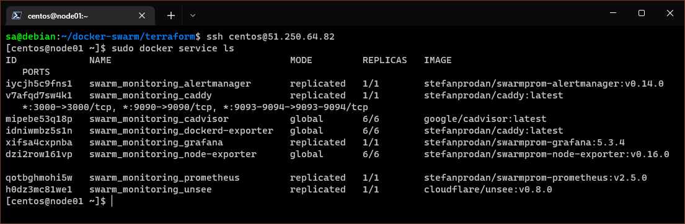

# Домашнее задание по лекции "5.5. Оркестрация кластером Docker контейнеров на примере Docker Swarm"

## Обязательная задача 1

Дайте письменые ответы на следующие вопросы:

1. В чём отличие режимов работы сервисов в Docker Swarm кластере: replication и global?

Сервис в режиме `global` запускается на всех нодах. Например, если кластер состоит из **12** нод, то на каждой из них будет развёрнут контейнер с данным сервисом.
Таким образом, всего в кластере будет **12** контейнеров данного сервиса, то есть число контернеров сервиса в режиме `global` равно числу нод кластера.

Сервис в режиме `replication` запускается на произвольных нодах в указанном количестве (числе реплик).
Например, допустим, кластер состоит из **12** нод, а сервис запускается с числом реплик равным **3**.
В этом случае **Docker** развернёт контейнер с данным сервисом на выбранных трёх нодах.
Таким образом, общее число контейнеров с данным сервисом равно указанному числу реплик.

2. Какой алгоритм выбора лидера используется в Docker Swarm кластере?

Алгоритм выбора лидера [Raft](http://thesecretlivesofdata.com/raft/) состоит в следующем:

  - Каждая нода менеджера может быть в трех состояниях: `follower` (последователь, а лучше слушатель), `candidate` (кандидат), `leader` (лидер)

  - Все ноды стартуют в статусе `follower`

  - В нодах со статусом `follower` стартует произвольный таймаут **от 150 до 300 мс**

  - Если `follower` по истечении таймаута не получит никаких запросов (ничего не услышал) его статус меняется на `candidate` (становится кандидатом)

  - Кандидат отправляет запросы на все остальные ноды (голосует за себя)

  - Если у других нод таймаут не истёк они отвечают (голосуют за отправившего запрос кандидата)

  - Кандидат получает статус `leader` (становится лидером) если получил ответы от большинства нод (получил большинство голосов)

  - Лидер начинает периодически сообщать остальным нодам о своём статусе

  - После отправки ответа на запрос кандидата у слушателей запускается другой таймаут в течении которого он ждёт ответа лидера

  - Если лидер отвечает статус ноды слушателея не меняется. Если не отвечает, то нода становится кандидатом.

3. Что такое Overlay Network?

Это специальный режим работы драйвера сети **Docker**.
В этом режиме создаётся распределённая сеть между несколькими **Docker** демонами на разных хостах.
Позволяет осуществлять обмен информацией между контейнерами, расположенными на разных хостах и управляемыми разными **Docker** демонами.
Используется в кластеризации `Docker swarm`.

---

## Обязательная задача 2

Создать ваш первый Docker Swarm кластер в Яндекс.Облаке

Для получения зачета, вам необходимо предоставить скриншот из терминала (консоли), с выводом команды `docker node ls`

Решение:

По итогу создания инфраструктуры были получены 6 IP адресов:
```console
external_ip_address_node01 = "51.250.64.82"
external_ip_address_node02 = "51.250.82.144"
external_ip_address_node03 = "51.250.92.193"
external_ip_address_node04 = "51.250.72.143"
external_ip_address_node05 = "51.250.84.248"
external_ip_address_node06 = "51.250.67.56"
```

Результат:

```console
[centos@node01 ~]$ sudo docker node ls
ID                            HOSTNAME             STATUS    AVAILABILITY   MANAGER STATUS   ENGINE VERSION
uor3egjh9gtw4lpnng4nl23cs *   node01.netology.yc   Ready     Active         Leader           20.10.16
plmjve6t6qi84dvvul7flupph     node02.netology.yc   Ready     Active         Reachable        20.10.16
xx3xefuu8y6sh993r6hwn8ut7     node03.netology.yc   Ready     Active         Reachable        20.10.16
t8td3ngh3demtlwatpzjacv9l     node04.netology.yc   Ready     Active                          20.10.16
rn6oa0gae0fms3nh9i7t8dlwe     node05.netology.yc   Ready     Active                          20.10.16
rt9cflu7qbc06vlniqvhogana     node06.netology.yc   Ready     Active                          20.10.16
```


---

## Обязательная задача 3

Создать ваш первый, готовый к боевой эксплуатации кластер мониторинга, состоящий из стека микросервисов.

Для получения зачета, вам необходимо предоставить скриншот из терминала (консоли), с выводом команды:
```
docker service ls
```

Результат:

```console
[centos@node01 ~]$ sudo docker service ls
ID             NAME                                MODE         REPLICAS   IMAGE                                          PORTS
iycjh5c9fns1   swarm_monitoring_alertmanager       replicated   1/1        stefanprodan/swarmprom-alertmanager:v0.14.0
v7afqd7sw4k1   swarm_monitoring_caddy              replicated   1/1        stefanprodan/caddy:latest                      *:3000->3000/tcp, *:9090->9090/tcp, *:9093-9094->9093-9094/tcp
mipebe53q18p   swarm_monitoring_cadvisor           global       6/6        google/cadvisor:latest
idniwmbz5s1n   swarm_monitoring_dockerd-exporter   global       6/6        stefanprodan/caddy:latest
xifsa4cxpnba   swarm_monitoring_grafana            replicated   1/1        stefanprodan/swarmprom-grafana:5.3.4
dzi2row161vp   swarm_monitoring_node-exporter      global       6/6        stefanprodan/swarmprom-node-exporter:v0.16.0
qotbghmohi5w   swarm_monitoring_prometheus         replicated   1/1        stefanprodan/swarmprom-prometheus:v2.5.0
h0dz3mc81we1   swarm_monitoring_unsee              replicated   1/1        cloudflare/unsee:v0.8.0
[centos@node01 ~]$
```



Данные мониторинга при обращении к `Grafana` с пятой ноды `node05`


Дополнительно:

Общее число контейнеров `23` объясняется режимом работы сервисов и числом нод **docker swarm**:
Три сервиса (`node-exporter`, `dockerd-exporter`, `cadvisor`) в режиме работы `global` создают по одному контейнеру на каждую ноду, то есть общим числом 18 (три сервиса на 6 нод).
Пять сервисов (`alertmanager`, `caddy`, `grafana`, `prometheus`,`gunsee`) в режиме работы `replication` и числом реплик `1` создают по одному контейнеру на каждый сервис, то есть дополнительно 5 контейнеров.
Таким образом и получается общее число контейнеров `23`

---

## Дополнительная задача 4 (*)

Выполнить на лидере Docker Swarm кластера команду (указанную ниже) и дать письменное описание её функционала, что она делает и зачем она нужна:
```
# см.документацию: https://docs.docker.com/engine/swarm/swarm_manager_locking/
docker swarm update --autolock=true
```

Решение (в ходе экспериментов, лидер среди нод был смещён на вторую ноду):

```console
[centos@node02 ~]$ sudo docker node ls
ID                            HOSTNAME             STATUS    AVAILABILITY   MANAGER STATUS   ENGINE VERSION
uor3egjh9gtw4lpnng4nl23cs     node01.netology.yc   Ready     Active                          20.10.16
plmjve6t6qi84dvvul7flupph *   node02.netology.yc   Ready     Active         Leader           20.10.16
xx3xefuu8y6sh993r6hwn8ut7     node03.netology.yc   Ready     Active                          20.10.16
t8td3ngh3demtlwatpzjacv9l     node04.netology.yc   Ready     Active         Reachable        20.10.16
rn6oa0gae0fms3nh9i7t8dlwe     node05.netology.yc   Ready     Active         Reachable        20.10.16
rt9cflu7qbc06vlniqvhogana     node06.netology.yc   Ready     Active                          20.10.16
[centos@node02 ~]$ sudo docker swarm update --autolock=true
Swarm updated.
To unlock a swarm manager after it restarts, run the `docker swarm unlock`
command and provide the following key:

    SW....-1-sA....kIYb5gbCpRzXseqyL0HyC4T0zyKbl....hBQM

Please remember to store this key in a password manager, since without it you
will not be able to restart the manager.
[centos@node02 ~]$
```
> Часть токена заменена на `....`

После выполнения команды `docker swarm update --autolock=true` переключается функция `autolock` - в данном случае включается.

**Docker** по умолчанию шифрует сообщения между нодами и **Raft** логи на нодах-манеджерах.
Но сами секретные ключи не защищены.
Активация функции [autolock](https://docs.docker.com/engine/swarm/swarm_manager_locking) позволяет защифровать эти самые ключи.
В момент активации функции будет сгенерирован специальный токен с которым будут зашифрованы используемые ключи.
После, при каждой перезагрузке **Docker** демона потребуется разблокировка кластера (расшифровка ключей) командой `docker swarm unlock`.

