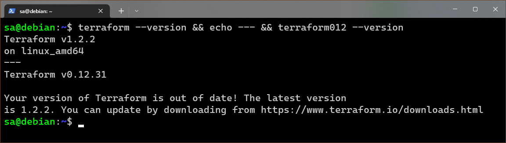

# Домашнее задание по лекции "7.1. Инфраструктура как код"

## Обязательная задача 1. Выбор инструментов.

### Легенда

Через час совещание на котором менеджер расскажет о новом проекте.
Начать работу над которым надо будет уже сегодня.
На данный момент известно, что это будет сервис, который ваша компания будет предоставлять внешним заказчикам.
Первое время, скорее всего, будет один внешний клиент, со временем внешних клиентов станет больше.
Так же по разговорам в компании есть вероятность, что техническое задание еще не четкое,
что приведет к большому количеству небольших релизов, тестирований интеграций, откатов,
доработок, то есть скучно не будет.

Вам, как девопс инженеру, будет необходимо принять решение об инструментах для организации инфраструктуры.
На данный момент в вашей компании уже используются следующие инструменты: 
- остатки Сloud Formation, 
- некоторые образы сделаны при помощи Packer,
- год назад начали активно использовать Terraform, 
- разработчики привыкли использовать Docker, 
- уже есть большая база Kubernetes конфигураций, 
- для автоматизации процессов используется Teamcity, 
- также есть совсем немного Ansible скриптов, 
- и ряд bash скриптов для упрощения рутинных задач.  

Для этого в рамках совещания надо будет выяснить подробности о проекте, чтобы в итоге определиться с инструментами:

1. Какой тип инфраструктуры будем использовать для этого проекта: изменяемый или не изменяемый?
1. Будет ли центральный сервер для управления инфраструктурой?
1. Будут ли агенты на серверах?
1. Будут ли использованы средства для управления конфигурацией или инициализации ресурсов? 
 
В связи с тем, что проект стартует уже сегодня, в рамках совещания надо будет определиться со всеми этими вопросами.

### В результате задачи необходимо

1. Ответить на четыре вопроса представленных в разделе "Легенда". 
1. Какие инструменты из уже используемых вы хотели бы использовать для нового проекта? 
1. Хотите ли рассмотреть возможность внедрения новых инструментов для этого проекта? 

Если для ответа на эти вопросы недостаточно информации, то напишите какие моменты уточните на совещании.

### **Решение:**

Ответы на вопросы:

1. Так как техническое задание не чёткое и ожидается большое количество релизов, откатов и доработок, то лучше всего использовать динамическую (изменяемую) инфраструктуру, чтобы быстрее применять соответствующие изменения. Использование в подобных условиях неизменяемой инфраструктуры чревато существенными временными задержки применения изменений, так как каждое изменение будет приводить к пересозданию образов, а потом их накатывание на сервера.
1. Использование центрального сервера управления инфраструктурой характерно для **pull** режима доставки изменений, когда управляемые сервера сами запрашивают и применяют изменения, но нет гарантии применения изменений за короткий временной промежуток, так как запрос обновлений агентами не синхронизирован. Применение такого подхода может породить ошибки во время разработки из-за "отстающих" серверов, которые ещё не применили изменения инфраструктуры. Противоположный подход - **push** - не требует отдельного центрального сервера и установки агентов на машины управляемой инфраструктуры. Для **push** режима также можно хранить информацию о всей инфраструктуре в одном месте (например, **Git**) и автоматизировать их доставку (например, через **CI/CD** в **GitLab**). Считаю, что на этапе разработки лучше не использовать центральный сервер управления инфраструктрой - и проще, и дешевле, однако, нужно уделить внимание надёжности связи с серверами, так как при потери связи с одним из них во время применения изменений она останется устаревшей.
1. Раз мы не будем использовать центральный сервер управления инфраструктурой, то нам и не нужно устанавливать агенты на управляемых серверах. Тем более, что большинство инструментов довольствуются **SSH** соединением для применения изменений инфраструктуры.
1. Использование средств для управления конфигурацией и инициализацией ресурсов просто необходимо, так как это существенно ускорит процесс разработки (внедрения изменений инфраструктуры) и тем более ожидается большое число корректировок инфраструктуры. Без подобной автоматизации мы рискуем утонуть в ручной перенастройке серверов и понаделать ошибок (где-то забыть что-то установить, где-то не заметить ошибки выполнения очередного этапа после чего долго выяснять почему не всё работает как нужно).

Разбор инструментов:

- Остатки **Сloud Formation оставить в прошлом** - во-первых, оно не обладает такой же гибкостью (поддерживает только **AWS**) как другие инструменты. При этом не является открытым и обладает меньшим сообществом, что затруднит решение гипотетических проблем в будущем.
- Образы **Packer** в принципе также можно **не тянуть с собой**. Образы можно создавать и при помощи **Docker**, тем более что сотрудники к нем привыкли.
- **Terraform** будем **использовать** для разворачивания инфраструктуры (какие будут сервера и с какими аппаратными ресурсами)
- **Docker** непременно будем **использовать** для формирования контейнеров с нашими микросервисами
- **Kubernates** также будем **использовать** - для управления контейнерами (оркестрации) **Docker**
- [Teamcity](https://www.jetbrains.com/ru-ru/teamcity/) продолжим **использовать** для автоматизации процессов - без CI/CD никуда
- **Ansible** обязательно будем **использовать** для автоматизированной донастройки серверов, разворачиваемых при помощи **Terraform**. Обладая процедурным подходом **Ansible** хорошо дополняет декларативный подход **Terraform**.
- от **bash** скриптов будем **отказываться**, так как без большого опыта работы с **bash** их код не очевиден. Простые можно оставить, а сложные лучше переписать на **Python**.

Применение других инструментов:

- **Python** для локальной автоматизации (например, подготовка каких-то промежуточных данных, получения и фильтрация логов для поиска конкретной информации и прочее) если она потребуется, а также для замены bash скриптов (элементарные bash скрипты, конечно, можно оставить)
- **GitLab** как система контроля версий и CI/CD - может выступать заменой **TeamCity**

Итоговый минимальный стек используемых инструментов: **TeamCity** (если в нём нет системы контроля версий, то дополнительно нужно использовать **Git**, либо заменить на **GitLab**), **Terraform**, **Ansible**, **Docker**, **Kubernates** (в принципе, может быть заменён на **Docker Swarm**)

---

## Обязательная задача 2. Установка терраформ. 

Официальный сайт: https://www.terraform.io/

Установите терраформ при помощи менеджера пакетов используемого в вашей операционной системе.
В виде результата этой задачи приложите вывод команды `terraform --version`.

### **Решение:**

Установка **Terraform** выполняется по [инструкции](https://www.terraform.io/downloads)

```console
sa@debian:~$ terraform --version
Terraform v1.2.2
on linux_amd64
sa@debian:~$
```

---

## Обязательная задача 3. Поддержка легаси кода. 

В какой-то момент вы обновили терраформ до новой версии, например с 0.12 до 0.13. 
А код одного из проектов настолько устарел, что не может работать с версией 0.13. 
В связи с этим необходимо сделать так, чтобы вы могли одновременно использовать последнюю версию 
терраформа установленную при помощи штатного менеджера пакетов и устаревшую версию 0.12.

В виде результата этой задачи приложите вывод `--version` двух версий терраформа доступных 
на вашем компьютере или виртуальной машине.

### **Решение:**

Список изменений (существующие версии) Terraform можно посмотреть на [GitHub](https://github.com/hashicorp/terraform/blob/main/CHANGELOG.md)

Для ветки [0.12](https://github.com/hashicorp/terraform/blob/v0.12/CHANGELOG.md) последняя стабильная версия `0.12.31`

На официальной странице загрузок **Terraform** есть ссылки на загрузки пакета в виде **zip** архива - ссылки вида: `https://releases.hashicorp.com/terraform/<версия>/terraform_<версия>_linux_<платформа>.zip`, где `<версия>` - версия ПО **Terraform**, `<платформа>` - платформа под которую скомпилировано ПО, может быть `386`, `amd64`, `arm` или `arm64`

Для реализации возможности запуска устаревшей версии **Terraform** нужно скачать конкретную версию и создать ссылку на исполняемый файл для запуска без указания пути.

```console
sa@debian:~$ sudo mkdir /usr/local/terraform012
sa@debian:~$ cd /usr/local/terraform012/
sa@debian:/usr/local/terraform012$ sudo wget https://releases.hashicorp.com/terraform/0.12.31/terraform_0.12.31_linux_am
d64.zip
--2022-06-06 02:07:13--  https://releases.hashicorp.com/terraform/0.12.31/terraform_0.12.31_linux_amd64.zip
Resolving releases.hashicorp.com (releases.hashicorp.com)... 199.232.34.49
Connecting to releases.hashicorp.com (releases.hashicorp.com)|199.232.34.49|:443... connected.
HTTP request sent, awaiting response... 200 OK
Length: 28441056 (27M) [application/zip]
Saving to: ‘terraform_0.12.31_linux_amd64.zip’

terraform_0.12.31_linux_amd64 100%[=================================================>]  27.12M   463KB/s    in 36s

2022-06-06 02:07:50 (773 KB/s) - ‘terraform_0.12.31_linux_amd64.zip’ saved [28441056/28441056]

sa@debian:/usr/local/terraform012$ sudo 7z x terraform_0.12.31_linux_amd64.zip

7-Zip [64] 16.02 : Copyright (c) 1999-2016 Igor Pavlov : 2016-05-21
p7zip Version 16.02 (locale=en_US.UTF-8,Utf16=on,HugeFiles=on,64 bits,2 CPUs AMD Ryzen 7 5800X 8-Core Processor
     (A20F10),ASM,AES-NI)

Scanning the drive for archives:
1 file, 28441056 bytes (28 MiB)

Extracting archive: terraform_0.12.31_linux_amd64.zip
--
Path = terraform_0.12.31_linux_amd64.zip
Type = zip
Physical Size = 28441056

Everything is Ok

Size:       69842229
Compressed: 28441056
sa@debian:/usr/local/terraform012$ sudo rm terraform_0.12.31_linux_amd64.zip
sa@debian:/usr/local/terraform012$ sudo ln -s /usr/local/terraform012/terraform /usr/bin/terraform012
sa@debian:/usr/local/terraform012$ cd ~
sa@debian:~$ terraform --version && echo --- && terraform012 --version
Terraform v1.2.2
on linux_amd64
---
Terraform v0.12.31

Your version of Terraform is out of date! The latest version
is 1.2.2. You can update by downloading from https://www.terraform.io/downloads.html
sa@debian:~$
```



> Действия выполнялись на виртуальной машине с **Debian10** через терминал по **SSH**. В демонстрации приведён скриншот терминала.

> Применительно к **Terraform**, состоящего из одного исполняемого файла, в принципе, было бы достаточно распаковать содержимое архива во временный каталог и перенести исполныемый файл в каталог `/usr/bin/` под другим именем, например `terraform012`

