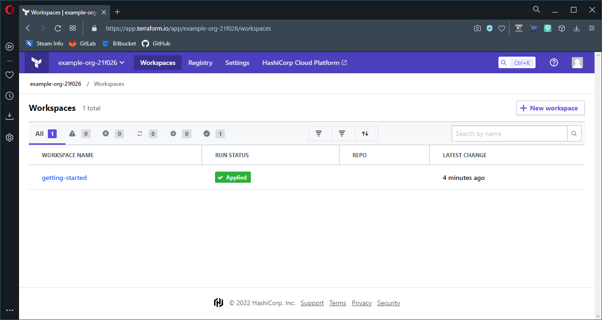
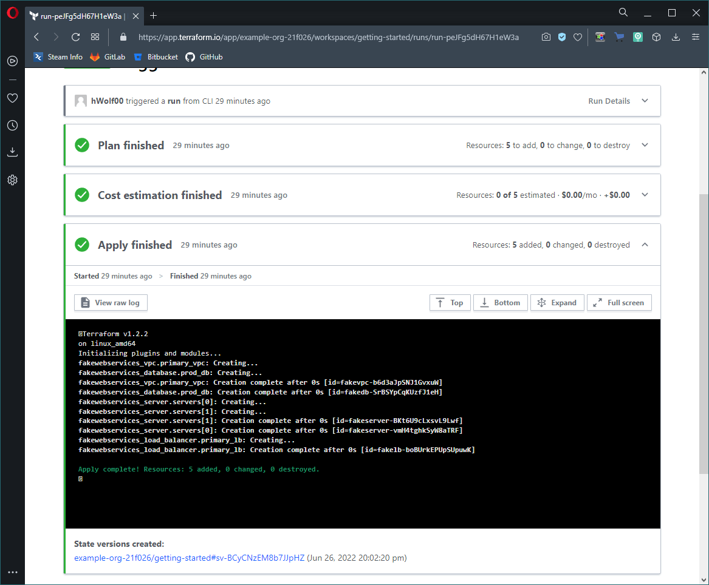
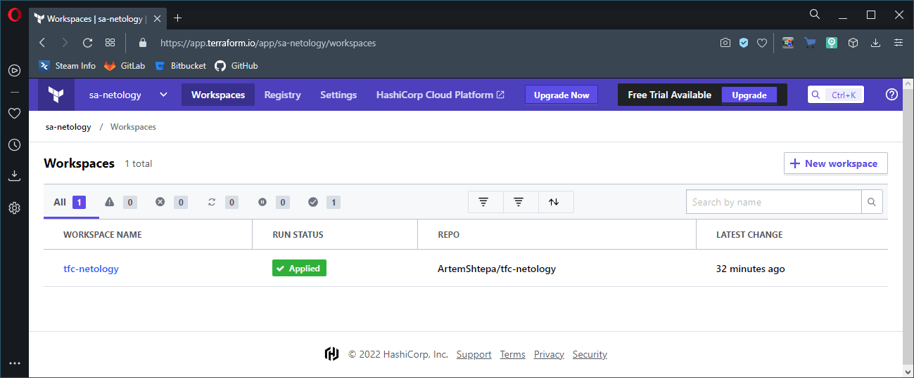
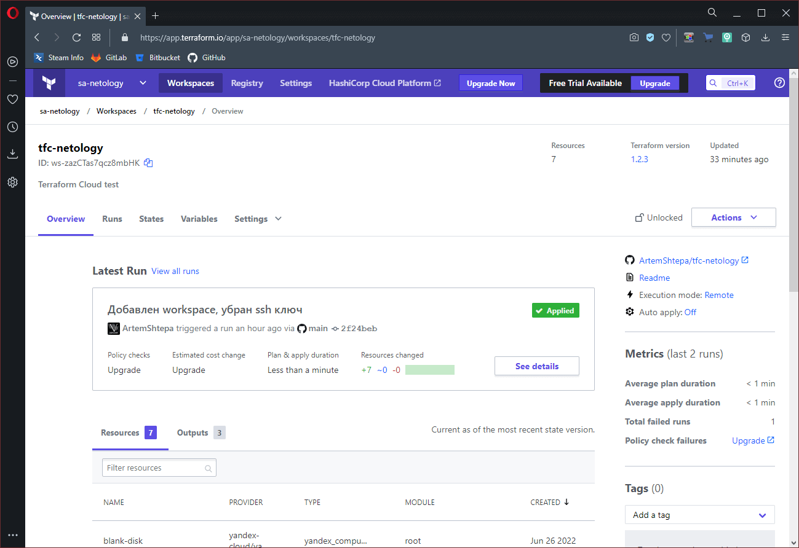
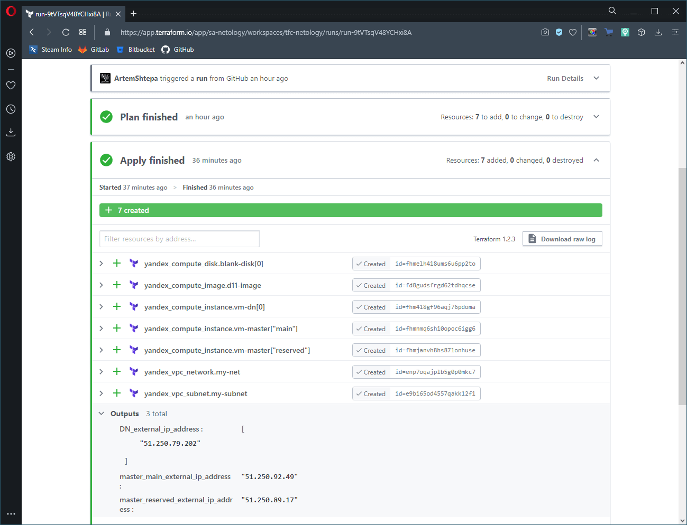

# Домашнее задание по лекции "7.4. Средства командной работы над инфраструктурой"

## Задача 1. Настроить terraform cloud (необязательно, но крайне желательно)

> В это задании предлагается познакомиться со средством командой работы над инфраструктурой предоставляемым разработчиками терраформа. 
>
> 1. Зарегистрируйтесь на [https://app.terraform.io/](https://app.terraform.io/). (регистрация бесплатная и не требует использования платежных инструментов).
> 1. Создайте в своем github аккаунте (или другом хранилище репозиториев) отдельный репозиторий с конфигурационными файлами прошлых занятий (или воспользуйтесь любым простым конфигом).
> 1. Зарегистрируйте этот репозиторий в [https://app.terraform.io/](https://app.terraform.io/).
> 1. Выполните plan и apply. 
>
> В качестве результата задания приложите снимок экрана с успешным применением конфигурации.

**Решение**:

После регистрации на сайте [Terraform Cloud](https://app.terraform.io/) доступно несколько вариантов дальнейшего использования:

### Использование **Terraform Cloud** через **CLI** (коммандный интерфейс):

В данном варианте используется пример из документации **Hashicorp**

После регистрации нужно авторизовать клиент **Terraform** в облаке командой `terraform login`

Для авторизации используется **API token**, который нужно сгенерировать в меню **"User Settings" -> "Tokens" -> "Create API token"**.

```console
sa@debian:~/tfcloud$ terraform login
Terraform will request an API token for app.terraform.io using your browser.

If login is successful, Terraform will store the token in plain text in
the following file for use by subsequent commands:
    /home/sa/.terraform.d/credentials.tfrc.json

Do you want to proceed?
  Only 'yes' will be accepted to confirm.

  Enter a value: yes


---------------------------------------------------------------------------------

Open the following URL to access the tokens page for app.terraform.io:
    https://app.terraform.io/app/settings/tokens?source=terraform-login


---------------------------------------------------------------------------------

Generate a token using your browser, and copy-paste it into this prompt.

Terraform will store the token in plain text in the following file
for use by subsequent commands:
    /home/sa/.terraform.d/credentials.tfrc.json

Token for app.terraform.io:
  Enter a value:


Retrieved token for user hWolf00


---------------------------------------------------------------------------------

                                          -
                                          -----                           -
                                          ---------                      --
                                          ---------  -                -----
                                           ---------  ------        -------
                                             -------  ---------  ----------
                                                ----  ---------- ----------
                                                  --  ---------- ----------
   Welcome to Terraform Cloud!                     -  ---------- -------
                                                      ---  ----- ---
   Documentation: terraform.io/docs/cloud             --------   -
                                                      ----------
                                                      ----------
                                                       ---------
                                                           -----
                                                               -


   New to TFC? Follow these steps to instantly apply an example configuration:

   $ git clone https://github.com/hashicorp/tfc-getting-started.git
   $ cd tfc-getting-started
   $ scripts/setup.sh


sa@debian:~/tfcloud$
```

В приведённом примере **Organization** и **Workspace** создаются скриптом,
также как и выполнение **plan** и **apply**:

```console
sa@debian:~/tfcloud/tfc-getting-started$ ./scripts/setup.sh


--------------------------------------------------------------------------
Getting Started with Terraform Cloud
-------------------------------------------------------------------------

Terraform Cloud offers secure, easy-to-use remote state management and allows
you to run Terraform remotely in a controlled environment. Terraform Cloud runs
can be performed on demand or triggered automatically by various events.

This script will set up everything you need to get started. You'll be
applying some example infrastructure - for free - in less than a minute.

First, we'll do some setup and configure Terraform to use Terraform Cloud.

Press any key to continue (ctrl-c to quit):

Creating an organization and workspace...

Writing remote backend configuration to backend.tf...

========================================================================

Ready to go; the example configuration is set up to use Terraform Cloud!

An example workspace named 'getting-started' was created for you.
You can view this workspace in the Terraform Cloud UI here:
https://app.terraform.io/app/example-org-21f026/workspaces/getting-started

Next, we'll run 'terraform init' to initialize the backend and providers:

$ terraform init

Press any key to continue (ctrl-c to quit):


Initializing the backend...

Successfully configured the backend "remote"! Terraform will automatically
use this backend unless the backend configuration changes.

Initializing provider plugins...
- Finding latest version of hashicorp/fakewebservices...
- Installing hashicorp/fakewebservices v0.2.3...
- Installed hashicorp/fakewebservices v0.2.3 (unauthenticated)

Terraform has created a lock file .terraform.lock.hcl to record the provider
selections it made above. Include this file in your version control repository
so that Terraform can guarantee to make the same selections by default when
you run "terraform init" in the future.

Terraform has been successfully initialized!

You may now begin working with Terraform. Try running "terraform plan" to see
any changes that are required for your infrastructure. All Terraform commands
should now work.

If you ever set or change modules or backend configuration for Terraform,
rerun this command to reinitialize your working directory. If you forget, other
commands will detect it and remind you to do so if necessary.

...

========================================================================

Now it’s time for 'terraform plan', to see what changes Terraform will perform:

$ terraform plan

Press any key to continue (ctrl-c to quit):

Running plan in the remote backend. Output will stream here. Pressing Ctrl-C
will stop streaming the logs, but will not stop the plan running remotely.

Preparing the remote plan...

To view this run in a browser, visit:
https://app.terraform.io/app/example-org-21f026/getting-started/runs/run-YxcKT953XAwKzmTG

Waiting for the plan to start...

Terraform v1.2.2
on linux_amd64
Initializing plugins and modules...

Terraform used the selected providers to generate the following execution
plan. Resource actions are indicated with the following symbols:
  + create

Terraform will perform the following actions:

  # fakewebservices_database.prod_db will be created
  + resource "fakewebservices_database" "prod_db" {
      + id   = (known after apply)
      + name = "Production DB"
      + size = 256
    }

  # fakewebservices_load_balancer.primary_lb will be created
  + resource "fakewebservices_load_balancer" "primary_lb" {
      + id      = (known after apply)
      + name    = "Primary Load Balancer"
      + servers = [
          + "Server 1",
          + "Server 2",
        ]
    }

  # fakewebservices_server.servers[0] will be created
  + resource "fakewebservices_server" "servers" {
      + id   = (known after apply)
      + name = "Server 1"
      + type = "t2.micro"
      + vpc  = "Primary VPC"
    }

  # fakewebservices_server.servers[1] will be created
  + resource "fakewebservices_server" "servers" {
      + id   = (known after apply)
      + name = "Server 2"
      + type = "t2.micro"
      + vpc  = "Primary VPC"
    }

  # fakewebservices_vpc.primary_vpc will be created
  + resource "fakewebservices_vpc" "primary_vpc" {
      + cidr_block = "0.0.0.0/1"
      + id         = (known after apply)
      + name       = "Primary VPC"
    }

Plan: 5 to add, 0 to change, 0 to destroy.


------------------------------------------------------------------------

Cost estimation:

Resources: 0 of 5 estimated
           $0.0/mo +$0.0

...

========================================================================

The plan is complete!

This plan was initiated from your local machine, but executed within
Terraform Cloud!

Terraform Cloud runs Terraform on disposable virtual machines in
its own cloud infrastructure. This 'remote execution' helps provide consistency
and visibility for critical provisioning operations. It also enables notifications,
version control integration, and powerful features like Sentinel policy enforcement
and cost estimation (shown in the output above).

To actually make changes, we'll run 'terraform apply'. We'll also auto-approve
the result, since this is an example:

$ terraform apply -auto-approve

Press any key to continue (ctrl-c to quit):

Running apply in the remote backend. Output will stream here. Pressing Ctrl-C
will cancel the remote apply if it's still pending. If the apply started it
will stop streaming the logs, but will not stop the apply running remotely.

Preparing the remote apply...

To view this run in a browser, visit:
https://app.terraform.io/app/example-org-21f026/getting-started/runs/run-peJFg5dH67H1eW3a

Waiting for the plan to start...

Terraform v1.2.2
on linux_amd64
Initializing plugins and modules...

Terraform used the selected providers to generate the following execution
plan. Resource actions are indicated with the following symbols:
  + create

Terraform will perform the following actions:

  # fakewebservices_database.prod_db will be created
  + resource "fakewebservices_database" "prod_db" {
      + id   = (known after apply)
      + name = "Production DB"
      + size = 256
    }

  # fakewebservices_load_balancer.primary_lb will be created
  + resource "fakewebservices_load_balancer" "primary_lb" {
      + id      = (known after apply)
      + name    = "Primary Load Balancer"
      + servers = [
          + "Server 1",
          + "Server 2",
        ]
    }

  # fakewebservices_server.servers[0] will be created
  + resource "fakewebservices_server" "servers" {
      + id   = (known after apply)
      + name = "Server 1"
      + type = "t2.micro"
      + vpc  = "Primary VPC"
    }

  # fakewebservices_server.servers[1] will be created
  + resource "fakewebservices_server" "servers" {
      + id   = (known after apply)
      + name = "Server 2"
      + type = "t2.micro"
      + vpc  = "Primary VPC"
    }

  # fakewebservices_vpc.primary_vpc will be created
  + resource "fakewebservices_vpc" "primary_vpc" {
      + cidr_block = "0.0.0.0/1"
      + id         = (known after apply)
      + name       = "Primary VPC"
    }

Plan: 5 to add, 0 to change, 0 to destroy.


------------------------------------------------------------------------

Cost estimation:

Resources: 0 of 5 estimated
           $0.0/mo +$0.0

------------------------------------------------------------------------

fakewebservices_vpc.primary_vpc: Creating...
fakewebservices_database.prod_db: Creating...
fakewebservices_vpc.primary_vpc: Creation complete after 0s [id=fakevpc-b6d3aJpSNJ1GvxuW]
fakewebservices_database.prod_db: Creation complete after 0s [id=fakedb-SrBSYpCqKUzfJ1eH]
fakewebservices_server.servers[0]: Creating...
fakewebservices_server.servers[1]: Creating...
fakewebservices_server.servers[1]: Creation complete after 0s [id=fakeserver-BKt6U9cLxsvL9Lwf]
fakewebservices_server.servers[0]: Creation complete after 0s [id=fakeserver-vmH4tghkSyW8aTRF]
fakewebservices_load_balancer.primary_lb: Creating...
fakewebservices_load_balancer.primary_lb: Creation complete after 0s [id=fakelb-boBUrkEPUpSUpuwK]

Apply complete! Resources: 5 added, 0 changed, 0 destroyed.


...

========================================================================

You did it! You just provisioned infrastructure with Terraform Cloud!

The organization we created here has a 30-day free trial of the Team &
Governance tier features. After the trial ends, you'll be moved to the Free tier.

You now have:

  * Workspaces for organizing your infrastructure. Terraform Cloud manages
    infrastructure collections with workspaces instead of directories. You
    can view your workspace here:
    https://app.terraform.io/app/example-org-21f026/workspaces/getting-started
  * Remote state management, with the ability to share outputs across
    workspaces. We've set up state management for you in your current
    workspace, and you can reference state from other workspaces using
    the 'terraform_remote_state' data source.
  * Much more!

To see the mock infrastructure you just provisioned and continue exploring
Terraform Cloud, visit:
https://app.terraform.io/fake-web-services

sa@debian:~/tfcloud/tfc-getting-started$
```

Результат применения:





### Использование **Terraform Cloud** через **GUI** и **workflow** (на примере **GitHub**):

Принцип работы:

1. Создать **Organization** через меню **"User Settings" -> "Organizations"**
1. Создать **Workspace** выбрав пункт **Version control workflow**
1. Выбрать **GitHub** как источник **workflow**
1. Во всплывающем окне авторизоваться в **GitHub** и выбрать нужный репозиторий (в примере `tfc-netology`)
1. Задать необходимые переменные (**YC_TOKEN** и т.д.) в соответствующем меню интерфейса (**Variables**)
1. Запустить **plan**, после чего **apply**.

Далее планирование (**plan**) будет выполняться автоматически при внесении изменений в репозитории.
После чего в зависимости от настроек автоматически, либо в ручном режиме применение изменений (**apply**).

Результат:








---

## Задача 2. Написать серверный конфиг для атлантиса. 

> Смысл задания – познакомиться с документацией о [серверной](https://www.runatlantis.io/docs/server-side-repo-config.html) конфигурации и конфигурации уровня [репозитория](https://www.runatlantis.io/docs/repo-level-atlantis-yaml.html).
>
> Создайте `server.yaml` который скажет атлантису:
> 1. Укажите, что атлантис должен работать только для репозиториев в вашем github (или любом другом) аккаунте.
> 1. На стороне клиентского конфига разрешите изменять `workflow`, то есть для каждого репозитория можно 
> будет указать свои дополнительные команды. 
> 1. В `workflow` используемом по-умолчанию сделайте так, что бы во время планирования не происходил `lock` состояния.
>
> Создайте `atlantis.yaml` который, если поместить в корень terraform проекта, скажет атлантису:
> 1. Надо запускать планирование и аплай для двух воркспейсов `stage` и `prod`.
> 1. Необходимо включить автопланирование при изменении любых файлов `*.tf`.
>
> В качестве результата приложите ссылку на файлы `server.yaml` и `atlantis.yaml`.

Решение:

Для активизации серверных настроек нужно либо прописать их в файле YAML формата (например, `server.yaml`) и запускать **Atlantis** с параметром `--repo-config` (например, `--repo-config=path/to/server.yaml`),
либо структурировать настройки в JSON блок и передать в качестве значения параметра `--repo-config-json` или переменной окружения `ATLANTIS_REPO_CONFIG_JSON`

Для указания работы **Atlantis** с **GitHub** репозиторием нужно задать его параметром `id` в блоке `repos`.
Например для репозитория `test-repo` аккаунту `test-acc`:
```yaml
repos:
- id: github.com/test-acc/test-repo
```

Для возможности использования произвольных **workflow** (не серверных) нужно их разрешить заданием параметр `allow_custom_workflows` в значении `true`. Иначе клиент сможет использовать только серверные **workflow**, которые разрешены параметром `allowed_workflows: [custom, test]` (в данном случае разрешается использовать `custom` и `test`)

Для изменения параметров **workflow** по умолчанию нужно для начала его назначить параметром `workflow` (например для **custom**: `workflow: custom`), а далее прописать сам **workflow** с нужными параметрами в блоке `workflows`:
```yaml
workflows:
  custom:
    plan:
      steps:
      - init
    apply:
      steps:
      - apply
```

Для исключения блокирования состояния нужно передать `extra_args` дополнительный аргумент `-lock` в значении `false` на соответствующем шаге **plan**

Для изменения поведения **Atlantis** на стороне клиента нужно в корне его репозитория разместить конфигурационный файл `atlantis.yaml`. (Другие имена файлов, включая `atlantis.yml` игнорируется)
По умолчанию, некоторые настройки заблокировы и для их разблокировки необходимо на стороне сервера прописать разрешённые в параметре `allowed_overrides`

> В документации указано, что при использовании клиентского конфигурационного файла **Atlantis** сам не определяет где запускать планирование, поэтому в конфигурации нужно прописать все используемые проекты (**name**, не обязательный) либо директории (**dir**, обязательный)

Для использования **Terraform workspace** нужно приписать его в параметре `workspace` (например, для **stage**: `workspace: stage`).
Чтобы запускать планирование (**plan**) и применение (**apply**) нескольких **workspace** их все нужно прописать, продублировав блок `dir`, например для **stage** и **prod**:

```yaml
- dir: .
  workspace: stage
- dir: .
  workspace: prod
```

Для изменения автопланирования нужно использовать подблок `autoplan`, где параметр `enable` управляет включением/отключением. При активации функции нужно прописать условия, например при изменении любых файлов `*.tf`:
```yaml
  autoplan:
    when_modified: ["*.tf"]
    enabled: true
```

### Итоговое содержание конфигурационного файла `server.yaml`:

```yaml
repos:
- id: github.com/ArtemShtepa/tfc-netology
  allow_custom_workflows: true
  workflow: custom
  allowed_overrides: [workflow]

workflows:
  custom:
    plan:
      steps:
      - init
      - plan:
        extra_args: ["-lock", "false"]
    apply:
      steps:
      - apply
```

### Итоговое содержимое конфигурационного файла `atlantis.yaml`:

```yaml
version: 3
projects:
- dir: .
  workspace: stage
  autoplan:
    when_modified: ["*.tf", "../modules/**/*.tf"]
    enabled: true
- dir: .
  workspace: prod
  autoplan:
    when_modified: ["*.tf", "../modules/**/*.tf"]
    enabled: true
```

> В данном примере планирование автоматически запускается также и при изменении любых файлов в используемых модулях, каталог которых находится на том же уровне, что и проект

---

## Задача 3. Знакомство с каталогом модулей.

> 1. В [каталоге модулей](https://registry.terraform.io/browse/modules) найдите официальный модуль от aws для создания `ec2` инстансов.
> 1. Изучите как устроен модуль. Задумайтесь, будете ли в своем проекте использовать этот модуль или непосредственно ресурс `aws_instance` без помощи модуля?
> 1. В рамках предпоследнего задания был создан ec2 при помощи ресурса `aws_instance`. Создайте аналогичный инстанс при помощи найденного модуля.
>
> В качестве результата задания приложите ссылку на созданный блок конфигураций.

В качестве решения я решил переписать свои **Terraform** файлы, где создаваемые **instance** будут выделены в отдельный модуль

> Блок `lifecycle` закомментирован, так как его расположение внутри `module` не позволяется, а где можно - нельзя использовать переменные. Поэтому, либо назначать его всем создаваемым инстансам, либо никому.

Исходный код модуля `vm-instance`: [ссылка на файл](/terraform/vm-instance/main.tf)

```terraform
variable name { default = "" }
variable description { default = "" }
variable platform { default = "standard-v1" }
variable cpu { default = "" }
variable ram { default = "" }
variable cpu_load { default = 5 }
variable main_disk_image { default = "" }
variable main_disk_size { default = "" }
variable subnet { default = "" }
variable ext_disk_id { default = [] }

terraform {
  required_providers {
    yandex = {
      source = "yandex-cloud/yandex"
    }
  }
  required_version = ">= 0.13"
}

resource "yandex_compute_instance" "vm-instance" {
  name        = var.name
  description = var.description
  platform_id = var.platform

  resources {
    cores         = var.cpu
    memory        = var.ram
    core_fraction = var.cpu_load
  }

  boot_disk {
    initialize_params {
      image_id = var.main_disk_image
      type     = "network-hdd"
      size     = var.main_disk_size
    }
  }

  dynamic "secondary_disk" {
    for_each = var.ext_disk_id
    content {
      disk_id     = secondary_disk.key
      device_name = "data"
    }
  }

  network_interface {
    subnet_id = var.subnet
    nat       = true
  }

  metadata = {
    ssh-keys = "admin:${file("~/.ssh/id_rsa.pub")}"
  }

  # lifecycle {
  #   create_before_destroy = true
  # }
}

output "external_ip" {
  value = "${yandex_compute_instance.vm-instance.network_interface.0.nat_ip_address}"
}
```

Изменённый основной файл: [ссылка на файл](/terraform/main.tf)

```terraform
resource "yandex_vpc_network" "my-net" {
  name = "cluster-network"
}

resource "yandex_vpc_subnet" "my-subnet" {
  name           = "cluster-subnet"
  v4_cidr_blocks = ["10.2.0.0/16"]
  zone           = var.YC_ZONE
  network_id     = yandex_vpc_network.my-net.id
}

resource "yandex_compute_image" "d11-image" {
  name          = "debian11-image"
  source_family = "debian-11"
}

resource "yandex_compute_disk" "blank-disk" {
  count = local.instance_count[terraform.workspace]

  name  = "node-disk-${count.index + 1}"
  type  = "network-hdd"
  zone  = var.YC_ZONE
  size  = local.node_disk[terraform.workspace]
}

module "vm-master" {
  source = "./vm-instance"

  for_each = local.master_nodes

  name        = "master-${each.key}"
  description = "Master Node - ${each.key}"
  cpu         = local.instance_cpu_cores[terraform.workspace]
  ram         = local.instance_ram[terraform.workspace]
  cpu_load    = local.instance_core_frac[terraform.workspace]
  main_disk_image = yandex_compute_image.d11-image.id
  main_disk_size  = local.primary_disk[terraform.workspace]
  subnet      = yandex_vpc_subnet.my-subnet.id
}

module "vm-dn" {
  source = "./vm-instance"

  count       = local.instance_count[terraform.workspace]
  name        = "node-${format("%01d", count.index + 1)}"
  description = "Data Node ${count.index + 1}"
  cpu         = local.instance_cpu_cores[terraform.workspace]
  ram         = local.instance_ram[terraform.workspace]
  cpu_load    = local.instance_core_frac[terraform.workspace]
  main_disk_image = yandex_compute_image.d11-image.id
  main_disk_size  = local.primary_disk[terraform.workspace]
  ext_disk_id     = toset(["${yandex_compute_disk.blank-disk[count.index].id}"])
  subnet      = yandex_vpc_subnet.my-subnet.id

  depends_on = [
    yandex_compute_disk.blank-disk
  ]
}
```

Изменённый файл вывода: [ссылка на файл](/terraform/output.tf)

```terraform
output "master_main_external_ip_address" {
  value = module.vm-master["main"].external_ip
}

output "master_reserved_external_ip_address" {
  value = module.vm-master["reserved"].external_ip
}

output "DN_external_ip_address" {
  value = module.vm-dn[*].external_ip
}
```

Проверка функционирования:

```console
sa@debian:~/terra/ins$ terraform apply -auto-approve

Terraform used the selected providers to generate the following execution plan. Resource actions are indicated with the
following symbols:
  + create

Terraform will perform the following actions:

  # yandex_compute_disk.blank-disk[0] will be created
  + resource "yandex_compute_disk" "blank-disk" {
      + block_size  = 4096
      + created_at  = (known after apply)
      + folder_id   = (known after apply)
      + id          = (known after apply)
      + name        = "node-disk-1"
      + product_ids = (known after apply)
      + size        = 20
      + status      = (known after apply)
      + type        = "network-hdd"
      + zone        = "ru-central1-a"

      + disk_placement_policy {
          + disk_placement_group_id = (known after apply)
        }
    }

  # yandex_compute_image.d11-image will be created
  + resource "yandex_compute_image" "d11-image" {
      + created_at      = (known after apply)
      + folder_id       = (known after apply)
      + id              = (known after apply)
      + min_disk_size   = (known after apply)
      + name            = "debian11-image"
      + os_type         = (known after apply)
      + pooled          = (known after apply)
      + product_ids     = (known after apply)
      + size            = (known after apply)
      + source_disk     = (known after apply)
      + source_family   = "debian-11"
      + source_image    = (known after apply)
      + source_snapshot = (known after apply)
      + source_url      = (known after apply)
      + status          = (known after apply)
    }

  # yandex_vpc_network.my-net will be created
  + resource "yandex_vpc_network" "my-net" {
      + created_at                = (known after apply)
      + default_security_group_id = (known after apply)
      + folder_id                 = (known after apply)
      + id                        = (known after apply)
      + labels                    = (known after apply)
      + name                      = "cluster-network"
      + subnet_ids                = (known after apply)
    }

  # yandex_vpc_subnet.my-subnet will be created
  + resource "yandex_vpc_subnet" "my-subnet" {
      + created_at     = (known after apply)
      + folder_id      = (known after apply)
      + id             = (known after apply)
      + labels         = (known after apply)
      + name           = "cluster-subnet"
      + network_id     = (known after apply)
      + v4_cidr_blocks = [
          + "10.2.0.0/16",
        ]
      + v6_cidr_blocks = (known after apply)
      + zone           = "ru-central1-a"
    }

  # module.vm-dn[0].yandex_compute_instance.vm-instance will be created
  + resource "yandex_compute_instance" "vm-instance" {
      + created_at                = (known after apply)
      + description               = "Data Node 1"
      + folder_id                 = (known after apply)
      + fqdn                      = (known after apply)
      + hostname                  = (known after apply)
      + id                        = (known after apply)
      + metadata                  = {
          + "ssh-keys" = <<-EOT
                admin:ssh-rsa AAAAB3NzaC1yc2EAAAADAQABAAACAQC+QtYRy3bmi9RpLrDl0OzvwEPOHcf+OUvbCrCRZ73l+FKYceT5XRc0yG5S3vzIMbI/kvV9DRwANqRjo6M2agYPgpg/meTnQ7qko/KPVXp6SXyOYUNppr8N6Gd04WAsOgIiBtslTTgJSNdqntYGOGYC24oLMRgs5rXa4EmrkQCP2u/mbAqpKSYl3Nj04zN6JgnHhvcOgf5VmEyuH7rFrVlAfcXLeSXvd/4HE2RyhhHqBYUwZfpXNZBYeY4k/XrvPbex+pZ00JAz6E/raUZSOdXZKfbCu7sKCUTVZyp17wbeKaCn2UqBw8LLOa8wdHKIf7aWKNrihPqmp1C7TSatg9b+rGKDbLuKppSF1fO5sk/VKhd4gbG3eGeXZqrKqpLGD2q4y8SgmOKWlHT4Jibiygyc6RbfYwA/6h9weM36x/YnN9jLAUNjQuZ/uQ9sRBl5d+OfCovENBvbZix8F4tqctRZDt/W9rVKE3EQcx4qGhTNB/GcqqqqwU8LjHbmzl1Srf5srwM5KpGJ4BhqJlIAjBufhAihfEWoDkFpI3GN9JmzNtCp0fUdghAFjp6AISQ/KTywCLZgsgQqn1lJ4TlLGnUCCfI9Lh0RRM7dR5ekPb+WawBem8IWMC6X6AWdvow91Rzc3N4jpwPwXr8NM5lvoh8Xh+eGHLF5VBtkb7CYn8NglQ== sa@debian
            EOT
        }
      + name                      = "node-1"
      + network_acceleration_type = "standard"
      + platform_id               = "standard-v1"
      + service_account_id        = (known after apply)
      + status                    = (known after apply)
      + zone                      = (known after apply)

      + boot_disk {
          + auto_delete = true
          + device_name = (known after apply)
          + disk_id     = (known after apply)
          + mode        = (known after apply)

          + initialize_params {
              + block_size  = (known after apply)
              + description = (known after apply)
              + image_id    = (known after apply)
              + name        = (known after apply)
              + size        = 10
              + snapshot_id = (known after apply)
              + type        = "network-hdd"
            }
        }

      + network_interface {
          + index              = (known after apply)
          + ip_address         = (known after apply)
          + ipv4               = true
          + ipv6               = (known after apply)
          + ipv6_address       = (known after apply)
          + mac_address        = (known after apply)
          + nat                = true
          + nat_ip_address     = (known after apply)
          + nat_ip_version     = (known after apply)
          + security_group_ids = (known after apply)
          + subnet_id          = (known after apply)
        }

      + placement_policy {
          + host_affinity_rules = (known after apply)
          + placement_group_id  = (known after apply)
        }

      + resources {
          + core_fraction = 20
          + cores         = 2
          + memory        = 4
        }

      + scheduling_policy {
          + preemptible = (known after apply)
        }

      + secondary_disk {
          + auto_delete = false
          + device_name = "data"
          + disk_id     = (known after apply)
          + mode        = "READ_WRITE"
        }
    }

  # module.vm-master["main"].yandex_compute_instance.vm-instance will be created
  + resource "yandex_compute_instance" "vm-instance" {
      + created_at                = (known after apply)
      + description               = "Master Node - main"
      + folder_id                 = (known after apply)
      + fqdn                      = (known after apply)
      + hostname                  = (known after apply)
      + id                        = (known after apply)
      + metadata                  = {
          + "ssh-keys" = <<-EOT
                admin:ssh-rsa AAAAB3NzaC1yc2EAAAADAQABAAACAQC+QtYRy3bmi9RpLrDl0OzvwEPOHcf+OUvbCrCRZ73l+FKYceT5XRc0yG5S3vzIMbI/kvV9DRwANqRjo6M2agYPgpg/meTnQ7qko/KPVXp6SXyOYUNppr8N6Gd04WAsOgIiBtslTTgJSNdqntYGOGYC24oLMRgs5rXa4EmrkQCP2u/mbAqpKSYl3Nj04zN6JgnHhvcOgf5VmEyuH7rFrVlAfcXLeSXvd/4HE2RyhhHqBYUwZfpXNZBYeY4k/XrvPbex+pZ00JAz6E/raUZSOdXZKfbCu7sKCUTVZyp17wbeKaCn2UqBw8LLOa8wdHKIf7aWKNrihPqmp1C7TSatg9b+rGKDbLuKppSF1fO5sk/VKhd4gbG3eGeXZqrKqpLGD2q4y8SgmOKWlHT4Jibiygyc6RbfYwA/6h9weM36x/YnN9jLAUNjQuZ/uQ9sRBl5d+OfCovENBvbZix8F4tqctRZDt/W9rVKE3EQcx4qGhTNB/GcqqqqwU8LjHbmzl1Srf5srwM5KpGJ4BhqJlIAjBufhAihfEWoDkFpI3GN9JmzNtCp0fUdghAFjp6AISQ/KTywCLZgsgQqn1lJ4TlLGnUCCfI9Lh0RRM7dR5ekPb+WawBem8IWMC6X6AWdvow91Rzc3N4jpwPwXr8NM5lvoh8Xh+eGHLF5VBtkb7CYn8NglQ== sa@debian
            EOT
        }
      + name                      = "master-main"
      + network_acceleration_type = "standard"
      + platform_id               = "standard-v1"
      + service_account_id        = (known after apply)
      + status                    = (known after apply)
      + zone                      = (known after apply)

      + boot_disk {
          + auto_delete = true
          + device_name = (known after apply)
          + disk_id     = (known after apply)
          + mode        = (known after apply)

          + initialize_params {
              + block_size  = (known after apply)
              + description = (known after apply)
              + image_id    = (known after apply)
              + name        = (known after apply)
              + size        = 10
              + snapshot_id = (known after apply)
              + type        = "network-hdd"
            }
        }

      + network_interface {
          + index              = (known after apply)
          + ip_address         = (known after apply)
          + ipv4               = true
          + ipv6               = (known after apply)
          + ipv6_address       = (known after apply)
          + mac_address        = (known after apply)
          + nat                = true
          + nat_ip_address     = (known after apply)
          + nat_ip_version     = (known after apply)
          + security_group_ids = (known after apply)
          + subnet_id          = (known after apply)
        }

      + placement_policy {
          + host_affinity_rules = (known after apply)
          + placement_group_id  = (known after apply)
        }

      + resources {
          + core_fraction = 20
          + cores         = 2
          + memory        = 4
        }

      + scheduling_policy {
          + preemptible = (known after apply)
        }
    }

  # module.vm-master["reserved"].yandex_compute_instance.vm-instance will be created
  + resource "yandex_compute_instance" "vm-instance" {
      + created_at                = (known after apply)
      + description               = "Master Node - reserved"
      + folder_id                 = (known after apply)
      + fqdn                      = (known after apply)
      + hostname                  = (known after apply)
      + id                        = (known after apply)
      + metadata                  = {
          + "ssh-keys" = <<-EOT
                admin:ssh-rsa AAAAB3NzaC1yc2EAAAADAQABAAACAQC+QtYRy3bmi9RpLrDl0OzvwEPOHcf+OUvbCrCRZ73l+FKYceT5XRc0yG5S3vzIMbI/kvV9DRwANqRjo6M2agYPgpg/meTnQ7qko/KPVXp6SXyOYUNppr8N6Gd04WAsOgIiBtslTTgJSNdqntYGOGYC24oLMRgs5rXa4EmrkQCP2u/mbAqpKSYl3Nj04zN6JgnHhvcOgf5VmEyuH7rFrVlAfcXLeSXvd/4HE2RyhhHqBYUwZfpXNZBYeY4k/XrvPbex+pZ00JAz6E/raUZSOdXZKfbCu7sKCUTVZyp17wbeKaCn2UqBw8LLOa8wdHKIf7aWKNrihPqmp1C7TSatg9b+rGKDbLuKppSF1fO5sk/VKhd4gbG3eGeXZqrKqpLGD2q4y8SgmOKWlHT4Jibiygyc6RbfYwA/6h9weM36x/YnN9jLAUNjQuZ/uQ9sRBl5d+OfCovENBvbZix8F4tqctRZDt/W9rVKE3EQcx4qGhTNB/GcqqqqwU8LjHbmzl1Srf5srwM5KpGJ4BhqJlIAjBufhAihfEWoDkFpI3GN9JmzNtCp0fUdghAFjp6AISQ/KTywCLZgsgQqn1lJ4TlLGnUCCfI9Lh0RRM7dR5ekPb+WawBem8IWMC6X6AWdvow91Rzc3N4jpwPwXr8NM5lvoh8Xh+eGHLF5VBtkb7CYn8NglQ== sa@debian
            EOT
        }
      + name                      = "master-reserved"
      + network_acceleration_type = "standard"
      + platform_id               = "standard-v1"
      + service_account_id        = (known after apply)
      + status                    = (known after apply)
      + zone                      = (known after apply)

      + boot_disk {
          + auto_delete = true
          + device_name = (known after apply)
          + disk_id     = (known after apply)
          + mode        = (known after apply)

          + initialize_params {
              + block_size  = (known after apply)
              + description = (known after apply)
              + image_id    = (known after apply)
              + name        = (known after apply)
              + size        = 10
              + snapshot_id = (known after apply)
              + type        = "network-hdd"
            }
        }

      + network_interface {
          + index              = (known after apply)
          + ip_address         = (known after apply)
          + ipv4               = true
          + ipv6               = (known after apply)
          + ipv6_address       = (known after apply)
          + mac_address        = (known after apply)
          + nat                = true
          + nat_ip_address     = (known after apply)
          + nat_ip_version     = (known after apply)
          + security_group_ids = (known after apply)
          + subnet_id          = (known after apply)
        }

      + placement_policy {
          + host_affinity_rules = (known after apply)
          + placement_group_id  = (known after apply)
        }

      + resources {
          + core_fraction = 20
          + cores         = 2
          + memory        = 4
        }

      + scheduling_policy {
          + preemptible = (known after apply)
        }
    }

Plan: 7 to add, 0 to change, 0 to destroy.

Changes to Outputs:
  + DN_external_ip_address              = [
      + (known after apply),
    ]
  + master_main_external_ip_address     = (known after apply)
  + master_reserved_external_ip_address = (known after apply)
yandex_vpc_network.my-net: Creating...
yandex_compute_image.d11-image: Creating...
yandex_compute_disk.blank-disk[0]: Creating...
yandex_vpc_network.my-net: Creation complete after 1s [id=enp7ogp2e6hapk8k1b36]
yandex_vpc_subnet.my-subnet: Creating...
yandex_vpc_subnet.my-subnet: Creation complete after 1s [id=e9bpulc0rkkhcqiq8qlp]
yandex_compute_image.d11-image: Creation complete after 6s [id=fd82pe6o2c8anulsqsvt]
module.vm-master["main"].yandex_compute_instance.vm-instance: Creating...
module.vm-master["reserved"].yandex_compute_instance.vm-instance: Creating...
yandex_compute_disk.blank-disk[0]: Creation complete after 6s [id=fhmrpr66putmc46ds08j]
module.vm-dn[0].yandex_compute_instance.vm-instance: Creating...
module.vm-master["main"].yandex_compute_instance.vm-instance: Still creating... [10s elapsed]
module.vm-master["reserved"].yandex_compute_instance.vm-instance: Still creating... [10s elapsed]
module.vm-dn[0].yandex_compute_instance.vm-instance: Still creating... [10s elapsed]
module.vm-master["reserved"].yandex_compute_instance.vm-instance: Still creating... [20s elapsed]
module.vm-master["main"].yandex_compute_instance.vm-instance: Still creating... [20s elapsed]
module.vm-dn[0].yandex_compute_instance.vm-instance: Still creating... [20s elapsed]
module.vm-master["main"].yandex_compute_instance.vm-instance: Still creating... [30s elapsed]
module.vm-master["reserved"].yandex_compute_instance.vm-instance: Still creating... [30s elapsed]
module.vm-dn[0].yandex_compute_instance.vm-instance: Still creating... [30s elapsed]
module.vm-master["main"].yandex_compute_instance.vm-instance: Still creating... [40s elapsed]
module.vm-master["reserved"].yandex_compute_instance.vm-instance: Still creating... [40s elapsed]
module.vm-dn[0].yandex_compute_instance.vm-instance: Still creating... [40s elapsed]
module.vm-master["reserved"].yandex_compute_instance.vm-instance: Creation complete after 47s [id=fhmr5bulklc1qkappocr]
module.vm-master["main"].yandex_compute_instance.vm-instance: Creation complete after 49s [id=fhmoled85nll9sn1ttek]
module.vm-dn[0].yandex_compute_instance.vm-instance: Still creating... [50s elapsed]
module.vm-dn[0].yandex_compute_instance.vm-instance: Still creating... [1m0s elapsed]
module.vm-dn[0].yandex_compute_instance.vm-instance: Creation complete after 1m3s [id=fhm5mhkpf6oa2595gcfv]

Apply complete! Resources: 7 added, 0 changed, 0 destroyed.

Outputs:

DN_external_ip_address = [
  "51.250.79.32",
]
master_main_external_ip_address = "51.250.75.93"
master_reserved_external_ip_address = "51.250.92.124"
sa@debian:~/terra/ins$ yc compute instance list
+----------------------+-----------------+---------------+---------+---------------+-------------+
|          ID          |      NAME       |    ZONE ID    | STATUS  |  EXTERNAL IP  | INTERNAL IP |
+----------------------+-----------------+---------------+---------+---------------+-------------+
| fhm5mhkpf6oa2595gcfv | node-1          | ru-central1-a | RUNNING | 51.250.79.32  | 10.2.0.8    |
| fhmoled85nll9sn1ttek | master-main     | ru-central1-a | RUNNING | 51.250.75.93  | 10.2.0.35   |
| fhmr5bulklc1qkappocr | master-reserved | ru-central1-a | RUNNING | 51.250.92.124 | 10.2.0.27   |
+----------------------+-----------------+---------------+---------+---------------+-------------+

sa@debian:~/terra/ins$
```
