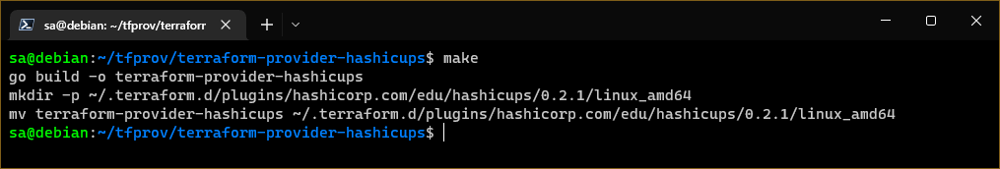

# Домашнее задание по лекции "7.6. Написание собственных провайдеров для Terraform."

> Бывает, что
> * общедоступная документация по терраформ ресурсам не всегда достоверна,
> * в документации не хватает каких-нибудь правил валидации или неточно описаны параметры,
> * понадобиться использовать провайдер без официальной документации,
> * может возникнуть необходимость написать свой провайдер для системы используемой в ваших проектах.   

## Обязательная задача 1

> Давайте потренируемся читать исходный код AWS провайдера, который можно склонировать от сюда: 
> [https://github.com/hashicorp/terraform-provider-aws.git](https://github.com/hashicorp/terraform-provider-aws.git).
> Просто найдите нужные ресурсы в исходном коде и ответы на вопросы станут понятны.  
>
> 1. Найдите, где перечислены все доступные `resource` и `data_source`, приложите ссылку на эти строки в коде на гитхабе.
> 1. Для создания очереди сообщений SQS используется ресурс `aws_sqs_queue` у которого есть параметр `name`. 
>     * С каким другим параметром конфликтует `name`? Приложите строчку кода, в которой это указано.
>     * Какая максимальная длина имени? 
>    * Какому регулярному выражению должно подчиняться имя? 

### **Решение**:

**Terraform** провайдер должен описать свою схему, в которой перечислены все ресурсы (**Resource**) и источники данных (**DataSource**), которые определяются выражениями `ResourcesMap:` и `DataSourcesMap:` соотвественно. Поэтому для поиска всех указанных сущностей достаточно найти данные выражения.

Таким образом, все доступные `resource` и `data_source` перечислены в файле `/internal/provider/provider.go` на следующих строках:

`data_source` - строки с 425 по 913
```golang
		DataSourcesMap: map[string]*schema.Resource{
			"aws_acm_certificate": acm.DataSourceCertificate(),

			"aws_acmpca_certificate_authority": acmpca.DataSourceCertificateAuthority(),
			"aws_acmpca_certificate":           acmpca.DataSourceCertificate(),

			"aws_api_gateway_api_key":     apigateway.DataSourceAPIKey(),
			"aws_api_gateway_domain_name": apigateway.DataSourceDomainName(),
			"aws_api_gateway_export":      apigateway.DataSourceExport(),
			"aws_api_gateway_resource":    apigateway.DataSourceResource(),
			"aws_api_gateway_rest_api":    apigateway.DataSourceRestAPI(),
			"aws_api_gateway_sdk":         apigateway.DataSourceSdk(),
			"aws_api_gateway_vpc_link":    apigateway.DataSourceVPCLink(),

			"aws_apigatewayv2_api":    apigatewayv2.DataSourceAPI(),
			"aws_apigatewayv2_apis":   apigatewayv2.DataSourceAPIs(),
...
			"aws_wafregional_ipset":           wafregional.DataSourceIPSet(),
			"aws_wafregional_rule":            wafregional.DataSourceRule(),
			"aws_wafregional_rate_based_rule": wafregional.DataSourceRateBasedRule(),
			"aws_wafregional_web_acl":         wafregional.DataSourceWebACL(),

			"aws_wafv2_ip_set":            wafv2.DataSourceIPSet(),
			"aws_wafv2_regex_pattern_set": wafv2.DataSourceRegexPatternSet(),
			"aws_wafv2_rule_group":        wafv2.DataSourceRuleGroup(),
			"aws_wafv2_web_acl":           wafv2.DataSourceWebACL(),

			"aws_workspaces_bundle":    workspaces.DataSourceBundle(),
			"aws_workspaces_directory": workspaces.DataSourceDirectory(),
			"aws_workspaces_image":     workspaces.DataSourceImage(),
			"aws_workspaces_workspace": workspaces.DataSourceWorkspace(),
		},
```

`resource` - строки с 915 по 2093
```golang
		ResourcesMap: map[string]*schema.Resource{
			"aws_accessanalyzer_analyzer":     accessanalyzer.ResourceAnalyzer(),
			"aws_accessanalyzer_archive_rule": accessanalyzer.ResourceArchiveRule(),

			"aws_account_alternate_contact": account.ResourceAlternateContact(),

			"aws_acm_certificate":            acm.ResourceCertificate(),
			"aws_acm_certificate_validation": acm.ResourceCertificateValidation(),

			"aws_acmpca_certificate":                       acmpca.ResourceCertificate(),
			"aws_acmpca_certificate_authority":             acmpca.ResourceCertificateAuthority(),
			"aws_acmpca_certificate_authority_certificate": acmpca.ResourceCertificateAuthorityCertificate(),
			"aws_acmpca_policy":                            acmpca.ResourcePolicy(),

			"aws_applicationinsights_application": applicationinsights.ResourceApplication(),

...
			"aws_wafv2_web_acl":                       wafv2.ResourceWebACL(),
			"aws_wafv2_web_acl_association":           wafv2.ResourceWebACLAssociation(),
			"aws_wafv2_web_acl_logging_configuration": wafv2.ResourceWebACLLoggingConfiguration(),

			"aws_worklink_fleet": worklink.ResourceFleet(),
			"aws_worklink_website_certificate_authority_association": worklink.ResourceWebsiteCertificateAuthorityAssociation(),

			"aws_workspaces_directory": workspaces.ResourceDirectory(),
			"aws_workspaces_ip_group":  workspaces.ResourceIPGroup(),
			"aws_workspaces_workspace": workspaces.ResourceWorkspace(),

			"aws_xray_encryption_config": xray.ResourceEncryptionConfig(),
			"aws_xray_group":             xray.ResourceGroup(),
		 	"aws_xray_sampling_rule":     xray.ResourceSamplingRule(),
		},
```

Параметры ресурса `aws_sqs_queue` определяются в файле `/internal/service/sqs/queue.go`

Параметр `name` конфликтует с `name_prefix`, что явно указывается в их описании на соответствующих строках кода (с 82 по 95):

```golang
		"name": {
			Type:          schema.TypeString,
			Optional:      true,
			Computed:      true,
			ForceNew:      true,
			ConflictsWith: []string{"name_prefix"},
		},
		"name_prefix": {
			Type:          schema.TypeString,
			Optional:      true,
			Computed:      true,
			ForceNew:      true,
			ConflictsWith: []string{"name"},
		},
```

Судя по следующему куску кода из `/internal/service/sqs/queue.go`
```golang
		if fifoQueue {
			re = regexp.MustCompile(`^[a-zA-Z0-9_-]{1,75}\.fifo$`)
		} else {
			re = regexp.MustCompile(`^[a-zA-Z0-9_-]{1,80}$`)
		}
```
имя должно удовлетварять регулярному выражению `^[a-zA-Z0-9_-]{1,80}$`,
из которого следует, что длина имени не может быть больше `80` символов,
при этом разрешается использовать только латинские символы (маленькие и большие),
цифры, подчёркивание и дефис, причём есть исключение - последие пять символов могут составлять фразу `.fifo`

---

## Дополнительная задача 2

> В рамках вебинара и презентации мы разобрали как создать свой собственный провайдер на примере кофемашины. 
> Также вот официальная документация о создании провайдера: 
> [https://learn.hashicorp.com/collections/terraform/providers](https://learn.hashicorp.com/collections/terraform/providers).
> 
> 1. Проделайте все шаги создания провайдера.
> 2. В виде результата приложение ссылку на исходный код.
> 3. Попробуйте скомпилировать провайдер, если получится то приложите снимок экрана с командой и результатом компиляции.

Исходный код после шагов создания провайдера, включая функцию импортирования состояния (без выгрузки в Terraform Registry) представлен в подкаталоге [src](src)

Сборка провайдера осуществляется командой `go build -o <file>`, где `<file>` - имя исполняемого файла, который будет создан во время компиляции

В примере компиляция выполяется через **Makefile**:
```makefile
HOSTNAME=hashicorp.com
NAMESPACE=edu
NAME=hashicups
BINARY=terraform-provider-${NAME}
VERSION=0.2.1
OS_ARCH=linux_amd64

default: install

build:
        go build -o ${BINARY}

install: build
        mkdir -p ~/.terraform.d/plugins/${HOSTNAME}/${NAMESPACE}/${NAME}/${VERSION}/${OS_ARCH}
        mv ${BINARY} ~/.terraform.d/plugins/${HOSTNAME}/${NAMESPACE}/${NAME}/${VERSION}/${OS_ARCH}
```



> По умолчанию **Terraform** ищет локальные провайдены по следующему пути `~/.terraform.d/plugins/<host>/<namespace>/<name>/<version>/<os_arch>`, где
>   - <host> - условный хост провайдера (русерс компании разработчика)
>   - <namespace> - пространство имён 
>   - <name> - имя провайдера
>   - <version> - версия провадера
>   - <os_arch> - архитектура, например `linux_amd64`
> Если использовались не стандартный Terraform Registry (например, зеркала Яндекс.Облака), то скорее всего Terraform не сможет найти локального провайдера. Для решения можно вернуть Terraform Registry по умолчанию (переименовать или удалить файл `~/.terraformrc`)

> После выполнения `terraform init` при необходимости перекомпилирования провайдера нужно сбросить lock версий удалив файл `.terraform.lock.hcl`

Применение **Terraform**

```console
sa@debian:~/tfprov/terraform-provider-hashicups/examples$ terraform apply --auto-approve
data.hashicups_order.order: Reading...
module.psl.data.hashicups_coffees.all: Reading...
module.psl.data.hashicups_coffees.all: Read complete after 0s [id=1657117343]
data.hashicups_order.order: Read complete after 0s

Terraform used the selected providers to generate the following execution plan. Resource actions are indicated with the
following symbols:
  + create

Terraform will perform the following actions:

  # hashicups_order.edu will be created
  + resource "hashicups_order" "edu" {
      + id           = (known after apply)
      + last_updated = (known after apply)

      + items {
          + quantity = 2

          + coffee {
              + description = (known after apply)
              + id          = 3
              + image       = (known after apply)
              + name        = (known after apply)
              + price       = (known after apply)
              + teaser      = (known after apply)
            }
        }
      + items {
          + quantity = 3

          + coffee {
              + description = (known after apply)
              + id          = 2
              + image       = (known after apply)
              + name        = (known after apply)
              + price       = (known after apply)
              + teaser      = (known after apply)
            }
        }
    }

Plan: 1 to add, 0 to change, 0 to destroy.

Changes to Outputs:
  + edu_order = {
      + id           = (known after apply)
      + items        = [
          + {
              + coffee   = [
                  + {
                      + description = (known after apply)
                      + id          = 3
                      + image       = (known after apply)
                      + name        = (known after apply)
                      + price       = (known after apply)
                      + teaser      = (known after apply)
                    },
                ]
              + quantity = 2
            },
          + {
              + coffee   = [
                  + {
                      + description = (known after apply)
                      + id          = 2
                      + image       = (known after apply)
                      + name        = (known after apply)
                      + price       = (known after apply)
                      + teaser      = (known after apply)
                    },
                ]
              + quantity = 3
            },
        ]
      + last_updated = (known after apply)
    }
  + order     = {
      + id    = 1
      + items = []
    }
  + psl       = {
      + "1" = {
          + description = ""
          + id          = 1
          + image       = "/packer.png"
          + ingredients = [
              + {
                  + ingredient_id = 1
                },
              + {
                  + ingredient_id = 2
                },
              + {
                  + ingredient_id = 4
                },
            ]
          + name        = "Packer Spiced Latte"
          + price       = 350
          + teaser      = "Packed with goodness to spice up your images"
        }
    }
hashicups_order.edu: Creating...
hashicups_order.edu: Creation complete after 0s [id=17]

Apply complete! Resources: 1 added, 0 changed, 0 destroyed.

Outputs:

edu_order = {
  "id" = "17"
  "items" = tolist([
    {
      "coffee" = tolist([
        {
          "description" = ""
          "id" = 3
          "image" = "/nomad.png"
          "name" = "Nomadicano"
          "price" = 150
          "teaser" = "Drink one today and you will want to schedule another"
        },
      ])
      "quantity" = 2
    },
    {
      "coffee" = tolist([
        {
          "description" = ""
          "id" = 2
          "image" = "/vault.png"
          "name" = "Vaulatte"
          "price" = 200
          "teaser" = "Nothing gives you a safe and secure feeling like a Vaulatte"
        },
      ])
      "quantity" = 3
    },
  ])
  "last_updated" = tostring(null)
}
order = {
  "id" = 1
  "items" = tolist([])
}
psl = {
  "1" = {
    "description" = ""
    "id" = 1
    "image" = "/packer.png"
    "ingredients" = tolist([
      {
        "ingredient_id" = 1
      },
      {
        "ingredient_id" = 2
      },
      {
        "ingredient_id" = 4
      },
    ])
    "name" = "Packer Spiced Latte"
    "price" = 350
    "teaser" = "Packed with goodness to spice up your images"
  }
}
sa@debian:~/tfprov/terraform-provider-hashicups/examples$
```