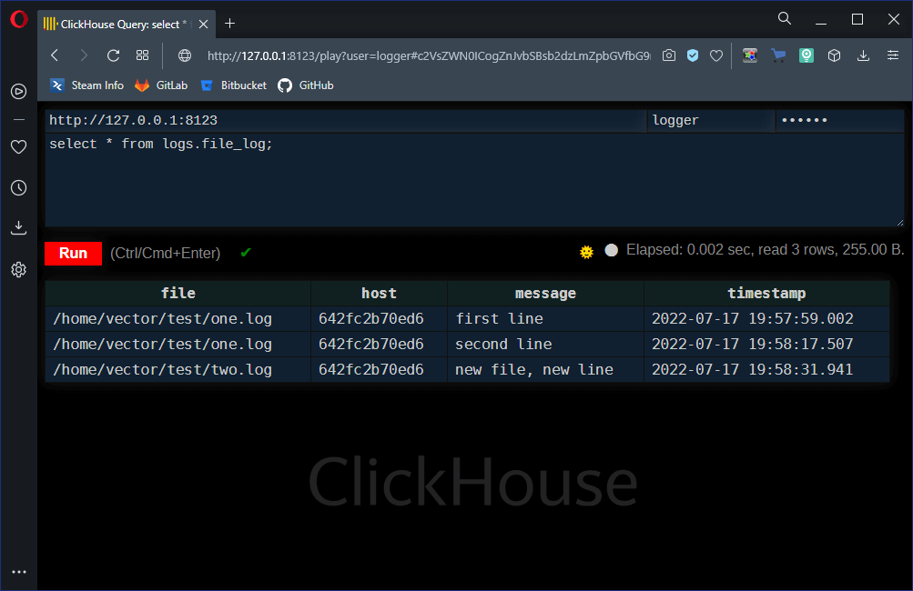

# Домашнее задание по лекции "8.2 Работа с Playbook"

## Подготовка к выполнению

> 1. (Необязательно) Изучите, что такое [clickhouse](https://www.youtube.com/watch?v=fjTNS2zkeBs) и [vector](https://www.youtube.com/watch?v=CgEhyffisLY)
> 2. Создайте свой собственный (или используйте старый) публичный репозиторий на github с произвольным именем.
> 3. Скачайте [playbook](./playbook/) из репозитория с домашним заданием и перенесите его в свой репозиторий.
> 4. Подготовьте хосты в соответствии с группами из предподготовленного playbook.

## Основная часть

### 1. Приготовьте свой собственный inventory файл `prod.yml`

Так как ["нормальные" герои всегда идут в обход](https://www.youtube.com/watch?v=R9CJ9BVtBJg), в качестве инфраструктуры были выбраны **Docker** контейнеры, со следующим манифестом:

```yaml
---
version: "2.4"

services:
  clickhouse_vm:
    image: centos:7
    container_name: clickhouse-01
    ports:
      - "9000:9000"
      - "8123:8123"
    tty: true
  vector_vm:
    image: centos:7
    container_name: vector-01
    ports:
      - "8383:8383"
      - "8686:8686"
    tty: true
...
```

Соответствующий **inventory** файл `inventory/prod.yml`:

```yaml
---
clickhouse:
  hosts:
    clickhouse-01:
      ansible_connection: docker
vector:
  hosts:
    vector-01:
      ansible_connection: docker
...
```

---

### 2. Допишите playbook: нужно сделать ещё один play, который устанавливает и настраивает [vector](https://vector.dev)

Для использования модулей из следующего пункта подходит установка **Vector** в [ручном режиме из архива](https://vector.dev/docs/setup/installation/manual/from-archives/#linux-x86_64)

Шаги установки:
1. Скачать архив по ссылке `https://packages.timber.io/vector/<version>/vector-<version>-x86_64-unknown-linux-musl.tar.gz`, где `<version>` - версия **Vector**
1. Распаковать архив в произвольный каталог
1. Исполняемый файл будет находится по пути `bin/vector`
1. Примеры настроек демонов будут в каталоге `etc/systemd`
1. Примеры конфигурационных файлов **Vector** будут в каталоге `config`

---

### 3. При создании tasks рекомендую использовать модули: `get_url`, `template`, `unarchive`, `file`.

Следующие модули отвечают за:
- `get_url` - Скачиваение файла по URL и сохранение в системе (поддерживает настройку прав и т.п.)
- `template` - Формирование файла в целевой системе на основе указанного файла шаблона. Изменение данных реализуется через [jinja2](https://jinja.palletsprojects.com/en/latest/templates/)
- `unarchive` - Распаковка ахвиров в целевую систему
- `file` - Управление файлами и каталогами, в том числе проверка существования, создание и удаление

> При использовании модуля `unarchive` не рекомендуется использовать символ точки (текущего каталога) как начало пути в целевой машине, так как при этом результирующий путь будет не очевидным и в случае его некорректности сообщение об ошибки явно об этом не скажет.

---

### 4. Tasks должны: скачать нужной версии дистрибутив, выполнить распаковку в выбранную директорию, установить vector.

Для удобства используемая версию будет задаваться в параметрах `group_vars/vector/vars.yml`:

```yaml
---
vector_version: "0.23.0"
vector_datadir: "/var/lib/vector"
...
```

Также в переменных будет задан каталог данных **Vector**

---

### 5. Запустите `ansible-lint site.yml` и исправьте ошибки, если они есть.

**Ansible-lint** устанавливается отдельно от **Ansible** по [инструкции](https://ansible-lint.readthedocs.io/en/latest/installing/)

Пример работы анализатора кода:

```console
sa@debian:~/my-ansible-2$ ansible-lint
Failed to guess project directory using git: fatal: не найден git репозиторий (или один из родительских каталогов): .git
WARNING  Failed to discover lintable files using git: fatal: не найден git репозиторий (или один из родительских каталогов): .git
WARNING  Listing 3 violation(s) that are fatal
yaml: too many blank lines (1 > 0) (yaml[empty-lines])
files/logger.yml:13

yaml: truthy value should be one of [false, true] (yaml[truthy])
site.yml:101

yaml: truthy value should be one of [false, true] (yaml[truthy])
site.yml:107

You can skip specific rules or tags by adding them to your configuration file:
# .config/ansible-lint.yml
warn_list:  # or 'skip_list' to silence them completely
  - yaml  # Violations reported by yamllint.

Finished with 3 failure(s), 0 warning(s) on 9 files.
sa@debian:~/my-ansible-2$
```

В данном примере, в первом случае много пустых строк, а в остальных неправильное значение **Boolean** переменной, а именно: `remote_src: yes` как указано в [документации](https://docs.ansible.com/ansible/latest/collections/ansible/builtin/copy_module.html), что не является корректным.

При отсутствии ошибок вывод будет примерно следующим:

```console
sa@debian:~/my-ansible-2$ ansible-lint
Failed to guess project directory using git: fatal: не найден git репозиторий (или один из родительских каталогов): .git
WARNING  Failed to discover lintable files using git: fatal: не найден git репозиторий (или один из родительских каталогов): .git
sa@debian:~/my-ansible-2$
```

---

### 6. Попробуйте запустить playbook на этом окружении с флагом `--check`.

Ключ `--check` позволяет запустить **playbook** без внесения каких-либо изменений на целевой машине, вместо чего **Ansible** попытается предсказать какие изменения будут.

К сожалению, ничего интересного на моём окружении вывод команды не содержит, мало того **playbook** будет завершён практически вначале:

```console
sa@debian:~/my-ansible-2$ ansible-playbook -i inventory/prod.yml site.yml --check

PLAY [Install sudo and systemctl] **************************************************************************************

TASK [Gathering Facts] *************************************************************************************************
ok: [vector-01]
ok: [clickhouse-01]

TASK [Install sudo] ****************************************************************************************************
changed: [vector-01]
changed: [clickhouse-01]

TASK [Install systemctl] ***********************************************************************************************
changed: [vector-01]
changed: [clickhouse-01]

TASK [Ensure run directory for ansible check_systemd] ******************************************************************
changed: [clickhouse-01]
changed: [vector-01]

PLAY [Install Clickhouse] **********************************************************************************************

TASK [Gathering Facts] *************************************************************************************************
ok: [clickhouse-01]

TASK [Get clickhouse noarch distrib] ***********************************************************************************
changed: [clickhouse-01] => (item=clickhouse-client)
changed: [clickhouse-01] => (item=clickhouse-server)
failed: [clickhouse-01] (item=clickhouse-common-static) => {"ansible_loop_var": "item", "changed": false, "dest": "./clickhouse-common-static-22.3.3.44.rpm", "elapsed": 0, "item": "clickhouse-common-static", "msg": "Request failed", "response": "HTTP Error 404: Not Found", "status_code": 404, "url": "https://packages.clickhouse.com/rpm/stable/clickhouse-common-static-22.3.3.44.noarch.rpm"}

TASK [Get clickhouse static distrib] ***********************************************************************************
changed: [clickhouse-01]

TASK [Install clickhouse packages] *************************************************************************************
fatal: [clickhouse-01]: FAILED! => {"changed": false, "module_stderr": "/bin/sh: sudo: command not found\n", "module_stdout": "", "msg": "MODULE FAILURE\nSee stdout/stderr for the exact error", "rc": 127}

PLAY RECAP *************************************************************************************************************
clickhouse-01              : ok=6    changed=4    unreachable=0    failed=1    skipped=0    rescued=1    ignored=0
vector-01                  : ok=4    changed=3    unreachable=0    failed=0    skipped=0    rescued=0    ignored=0

sa@debian:~/my-ansible-2$
```

В данном случае провал произошёл из-за того, что в используемом образе `centos:7` нет пакета `sudo`, который требуется для установка пакетов на шаге `Install clickhouse packages`

---

### 7. Запустите playbook на `prod.yml` окружении с флагом `--diff`. Убедитесь, что изменения на системе произведены.

Флаг `--diff` добавляет в вывод блоки `--- before` и `+++ after`, в которых содержится информация по производимым изменениям в целевой системе:

```console
sa@debian:~/my-ansible-2$ ansible-playbook -i inventory/prod.yml site.yml --diff

PLAY [Install sudo and systemctl] **************************************************************************************

TASK [Gathering Facts] *************************************************************************************************
ok: [clickhouse-01]
ok: [vector-01]

TASK [Install sudo] ****************************************************************************************************
changed: [vector-01]
changed: [clickhouse-01]

TASK [Install systemctl] ***********************************************************************************************
changed: [vector-01]
changed: [clickhouse-01]

TASK [Ensure run directory for ansible check_systemd] ******************************************************************
--- before
+++ after
@@ -1,4 +1,4 @@
 {
     "path": "/run/systemd/system/",
-    "state": "absent"
+    "state": "directory"
 }

changed: [vector-01]
--- before
+++ after
@@ -1,4 +1,4 @@
 {
     "path": "/run/systemd/system/",
-    "state": "absent"
+    "state": "directory"
 }

changed: [clickhouse-01]

PLAY [Install Clickhouse] **********************************************************************************************

TASK [Gathering Facts] *************************************************************************************************
ok: [clickhouse-01]

TASK [Get clickhouse noarch distrib] ***********************************************************************************
changed: [clickhouse-01] => (item=clickhouse-client)
changed: [clickhouse-01] => (item=clickhouse-server)
failed: [clickhouse-01] (item=clickhouse-common-static) => {"ansible_loop_var": "item", "changed": false, "dest": "./clickhouse-common-static-22.3.3.44.rpm", "elapsed": 0, "item": "clickhouse-common-static", "msg": "Request failed", "response": "HTTP Error 404: Not Found", "status_code": 404, "url": "https://packages.clickhouse.com/rpm/stable/clickhouse-common-static-22.3.3.44.noarch.rpm"}

TASK [Get clickhouse static distrib] ***********************************************************************************
changed: [clickhouse-01]

TASK [Install clickhouse packages] *************************************************************************************
changed: [clickhouse-01]

TASK [Configure clickhouse host bind] **********************************************************************************
--- before
+++ after: /home/sa/my-ansible-2/files/clickhouse.yml
@@ -0,0 +1 @@
+listen_host: 0.0.0.0

changed: [clickhouse-01] => (item={'src': 'clickhouse.yml', 'dest': '/etc/clickhouse-server/config.d/all-hosts.yml'})
--- before
+++ after: /home/sa/my-ansible-2/files/logger.yml
@@ -0,0 +1,12 @@
+profiles:
+  default:
+    date_time_input_format: best_effort
+
+users:
+  logger:
+    password: 'logger'
+    networks:
+      ip: '::/0'
+    profile: default
+    quota: default
+    access_management: 0

changed: [clickhouse-01] => (item={'src': 'logger.yml', 'dest': '/etc/clickhouse-server/users.d/logger.yml'})

RUNNING HANDLER [Start clickhouse service] *****************************************************************************
changed: [clickhouse-01]

TASK [Bring clickhouse alive if docker restart] ************************************************************************
ok: [clickhouse-01]

TASK [Create database] *************************************************************************************************
changed: [clickhouse-01]

TASK [Create tables] ***************************************************************************************************
changed: [clickhouse-01]

PLAY [Install Vector] **************************************************************************************************

TASK [Gathering Facts] *************************************************************************************************
ok: [vector-01]

TASK [Download distrib] ************************************************************************************************
changed: [vector-01]

TASK [Create vector group] *********************************************************************************************
changed: [vector-01]

TASK [Create vector user] **********************************************************************************************
changed: [vector-01]

TASK [Unpack vector distrib] *******************************************************************************************
changed: [vector-01]

TASK [Install vector executable] ***************************************************************************************
changed: [vector-01] => (item={'src': '/home/vector/bin/vector', 'dest': '/usr/bin/vector', 'mode': '+x'})
changed: [vector-01] => (item={'src': '/home/vector/etc/systemd/vector.service', 'dest': '/usr/lib/systemd/system/vector.service', 'mode': ''})

TASK [Create vector directories] ***************************************************************************************
--- before
+++ after
@@ -1,5 +1,5 @@
 {
-    "owner": 0,
+    "owner": 1000,
     "path": "/var/lib/vector",
-    "state": "absent"
+    "state": "directory"
 }

changed: [vector-01] => (item=/var/lib/vector)
--- before
+++ after
@@ -1,5 +1,5 @@
 {
-    "owner": 0,
+    "owner": 1000,
     "path": "/home/vector/test",
-    "state": "absent"
+    "state": "directory"
 }

changed: [vector-01] => (item=/home/vector/test)
--- before
+++ after
@@ -1,5 +1,5 @@
 {
-    "owner": 0,
+    "owner": 1000,
     "path": "/etc/vector",
-    "state": "absent"
+    "state": "directory"
 }

changed: [vector-01] => (item=/etc/vector)

TASK [Install vector configuration] ************************************************************************************
--- before
+++ after: /home/sa/.ansible/tmp/ansible-local-191639pheeozlj/tmp_nj1h655/vector.j2
@@ -0,0 +1,25 @@
+# Set global options
+data_dir = "/var/lib/vector"
+
+# Vector's API (disabled by default)
+# Enable and try it out with the `vector top` command
+[api]
+enabled = true
+address = "0.0.0.0:8686"
+
+[sources.test_log]
+type = "file"
+ignore_older_secs = 600
+include = [ "/home/vector/test/*.log" ]
+read_from = "beginning"
+
+[sinks.docker_clickhouse]
+type = "clickhouse"
+inputs = [ "test_log" ]
+database = "logs"
+endpoint = "http://clickhouse-01:8123"
+table = "file_log"
+compression = "gzip"
+auth = { user = "logger", password = "logger", strategy = "basic" }
+skip_unknown_fields = true
+

changed: [vector-01]

RUNNING HANDLER [Start vector service] *********************************************************************************
changed: [vector-01]

TASK [Bring vector alive if docker restart] ****************************************************************************
ok: [vector-01]

PLAY RECAP *************************************************************************************************************
clickhouse-01              : ok=12   changed=9    unreachable=0    failed=0    skipped=0    rescued=1    ignored=0
vector-01                  : ok=14   changed=11   unreachable=0    failed=0    skipped=0    rescued=0    ignored=0

sa@debian:~/my-ansible-2$
```

---

### 8. Повторно запустите playbook с флагом `--diff` и убедитесь, что playbook идемпотентен.

Идемпотентность с флагом `--diff` определыется по отсутствию блоков `--- before` и `+++ after`.

Также об идемпотентность можно судить по отсутствию блоков `changed` в выводе `PLAY RECAP`:

```console
sa@debian:~/my-ansible-2$ ansible-playbook -i inventory/prod.yml site.yml --diff

PLAY [Install sudo and systemctl] **************************************************************************************

TASK [Gathering Facts] *************************************************************************************************
ok: [vector-01]
ok: [clickhouse-01]

TASK [Install sudo] ****************************************************************************************************
ok: [vector-01]
ok: [clickhouse-01]

TASK [Install systemctl] ***********************************************************************************************
ok: [clickhouse-01]
ok: [vector-01]

TASK [Ensure run directory for ansible check_systemd] ******************************************************************
ok: [vector-01]
ok: [clickhouse-01]

PLAY [Install Clickhouse] **********************************************************************************************

TASK [Gathering Facts] *************************************************************************************************
ok: [clickhouse-01]

TASK [Get clickhouse noarch distrib] ***********************************************************************************
ok: [clickhouse-01] => (item=clickhouse-client)
ok: [clickhouse-01] => (item=clickhouse-server)
failed: [clickhouse-01] (item=clickhouse-common-static) => {"ansible_loop_var": "item", "changed": false, "dest": "./clickhouse-common-static-22.3.3.44.rpm", "elapsed": 0, "gid": 0, "group": "root", "item": "clickhouse-common-static", "mode": "0644", "msg": "Request failed", "owner": "root", "response": "HTTP Error 404: Not Found", "size": 246310036, "state": "file", "status_code": 404, "uid": 0, "url": "https://packages.clickhouse.com/rpm/stable/clickhouse-common-static-22.3.3.44.noarch.rpm"}

TASK [Get clickhouse static distrib] ***********************************************************************************
ok: [clickhouse-01]

TASK [Install clickhouse packages] *************************************************************************************
ok: [clickhouse-01]

TASK [Configure clickhouse host bind] **********************************************************************************
ok: [clickhouse-01] => (item={'src': 'clickhouse.yml', 'dest': '/etc/clickhouse-server/config.d/all-hosts.yml'})
ok: [clickhouse-01] => (item={'src': 'logger.yml', 'dest': '/etc/clickhouse-server/users.d/logger.yml'})

TASK [Bring clickhouse alive if docker restart] ************************************************************************
ok: [clickhouse-01]

TASK [Create database] *************************************************************************************************
ok: [clickhouse-01]

TASK [Create tables] ***************************************************************************************************
ok: [clickhouse-01]

PLAY [Install Vector] **************************************************************************************************

TASK [Gathering Facts] *************************************************************************************************
ok: [vector-01]

TASK [Download distrib] ************************************************************************************************
ok: [vector-01]

TASK [Create vector group] *********************************************************************************************
ok: [vector-01]

TASK [Create vector user] **********************************************************************************************
ok: [vector-01]

TASK [Unpack vector distrib] *******************************************************************************************
ok: [vector-01]

TASK [Install vector executable] ***************************************************************************************
ok: [vector-01] => (item={'src': '/home/vector/bin/vector', 'dest': '/usr/bin/vector', 'mode': '+x'})
ok: [vector-01] => (item={'src': '/home/vector/etc/systemd/vector.service', 'dest': '/usr/lib/systemd/system/vector.service', 'mode': ''})

TASK [Create vector directories] ***************************************************************************************
ok: [vector-01] => (item=/var/lib/vector)
ok: [vector-01] => (item=/home/vector/test)
ok: [vector-01] => (item=/etc/vector)

TASK [Install vector configuration] ************************************************************************************
ok: [vector-01]

TASK [Bring vector alive if docker restart] ****************************************************************************
ok: [vector-01]

PLAY RECAP *************************************************************************************************************
clickhouse-01              : ok=11   changed=0    unreachable=0    failed=0    skipped=0    rescued=1    ignored=0
vector-01                  : ok=13   changed=0    unreachable=0    failed=0    skipped=0    rescued=0    ignored=0

sa@debian:~/my-ansible-2$
```

---

### 9. Подготовьте README.md файл по своему playbook. В нём должно быть описано: что делает playbook, какие у него есть параметры и теги.

Вывод всех тэгов осуществляется командой `ansible-playbook -i <inventory> <playbook> --list-tags`, где `<inventory>` - описание окружения для **playbook** `<playbook>`:

```console
sa@debian:~/my-ansible-2$ ansible-playbook site.yml --list-tags -i inventory/prod.yml

playbook: site.yml

  play #1 (all): Install sudo and systemctl     TAGS: []
      TASK TAGS: [docker]

  play #2 (clickhouse): Install Clickhouse      TAGS: []
      TASK TAGS: [db, docker]

  play #3 (vector): Install Vector      TAGS: []
      TASK TAGS: [docker]
sa@debian:~/my-ansible-2$
```

---

### 10. Готовый playbook выложите в свой репозиторий, поставьте тег `08-ansible-02-playbook` на фиксирующий коммит, в ответ предоставьте ссылку на него.

Ссылка на репозиторий [my-ansible](https://github.com/ArtemShtepa/my-ansible/tree/08-ansible-02-playbook)

---

## Проверка функционирования связки **Clickhouse** и **Vector**

```console
sa@debian:~/my-ansible-2$ docker exec -ti vector-01 bash
[root@642fc2b70ed6 /]# echo "first line" > /home/vector/test/one.log
[root@642fc2b70ed6 /]# echo "second line" >> /home/vector/test/one.log
[root@642fc2b70ed6 /]# echo "new file, new line" > /home/vector/test/two.log
[root@642fc2b70ed6 /]# exit
exit
sa@debian:~/my-ansible-2$
```


