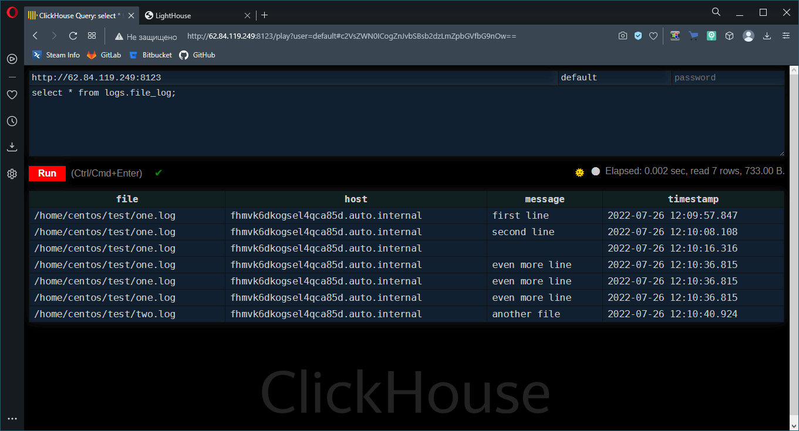
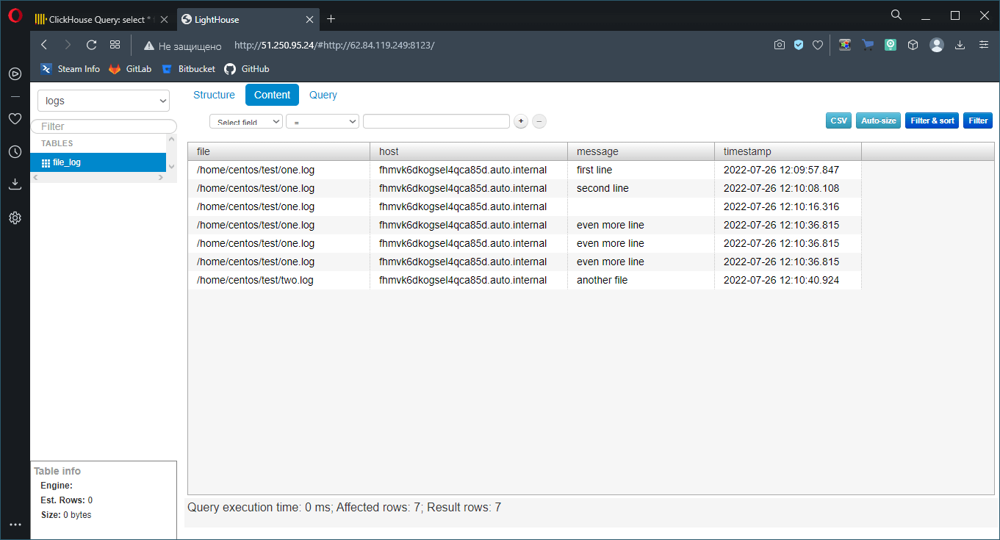

# Домашнее задание по лекции "8.3 Использование Yandex Cloud"

## Подготовка к выполнению

> Подготовьте в Yandex Cloud три хоста: для `clickhouse`, для `vector` и для `lighthouse`.
> Ссылка на репозиторий LightHouse: https://github.com/VKCOM/lighthouse

## Основная часть

При решении этой задачи использовалась инфраструктура **Яндекс.Облака**,
разворачиваемая соответствующим провайдером для **Terraform**.

Файл описания инфраструктуры:

```terraform
variable "YC_CLOUD_ID" { default = "" }
variable "YC_FOLDER_ID" { default = "" }
variable "YC_ZONE" { default = "" }

terraform {
  required_providers {
    yandex = {
      source = "yandex-cloud/yandex"
    }
  }
  required_version = ">= 0.13"
}

provider "yandex" {
  service_account_key_file = "/home/sa/.ssh/yc-key.json"
  cloud_id  = var.YC_CLOUD_ID
  folder_id = var.YC_FOLDER_ID
  zone      = var.YC_ZONE
}

resource "yandex_compute_image" "centos-7" {
  name          = "centos-7"
  source_family = "centos-7"
}

resource "yandex_compute_instance" "vm" {
  for_each = local.vm_nodes

  name        = "${each.key}"
  description = "Node for ${each.key}"

  platform_id = "standard-v1"

  resources {
    cores         = 2
    memory        = 4
    core_fraction = 20
  }

  boot_disk {
    initialize_params {
      image_id = yandex_compute_image.centos-7.id
      type     = "network-hdd"
      size     = 10
    }
  }

  network_interface {
    subnet_id = "${yandex_vpc_subnet.my-subnet.id}"
    nat       = true
  }

  metadata = {
    ssh-keys = "centos:${file("~/.ssh/id_ed25519.pub")}"
  }
}

resource "yandex_vpc_network" "my-net" {
  name = "vm-network"
}

resource "yandex_vpc_subnet" "my-subnet" {
  name = "cluster-subnet"
  v4_cidr_blocks = ["10.2.0.0/16"]
  zone = var.YC_ZONE
  network_id = yandex_vpc_network.my-net.id
  depends_on = [yandex_vpc_network.my-net]
}

output "clickhouse_ip" {
  value = yandex_compute_instance.vm["clickhouse"].network_interface.0.nat_ip_address
}

output "vector_ip" {
  value = yandex_compute_instance.vm["vector"].network_interface.0.nat_ip_address
}

output "lighthouse_ip" {
  value = yandex_compute_instance.vm["lighthouse"].network_interface.0.nat_ip_address
}

locals { 
  vm_nodes = toset(["clickhouse", "vector", "lighthouse"])
}
```

Для корректной работы на другом окружении необходимо скорректировать строку: `ssh-keys = "centos:${file("~/.ssh/id_ed25519.pub")}"` - где задать путь к SSH ключу, который будет интегрирован в создаваемые в **Яндекс.Облаке** машины.

Для авторизации в **Яндекс.Облаке** задать файл-ключ сервисного аккаунта в строке: `service_account_key_file = "/home/sa/.ssh/yc-key.json"`, либо добавить переменную `variable "YC_TOKEN_ID" { default = "" }` и `token  = var.YC_TOKEN` в соответствующих разделах

А также задать следующие переменные из окружения командами:
- `export TF_VAR_YC_CLOUD_ID=$(yc config get cloud-id)`
- `export TF_VAR_YC_FOLDER_ID=$(yc config get folder-id)`
- `export TF_VAR_YC_ZONE=$(yc config get compute-default-zone)`
- `export TF_VAR_YC_TOKEN=$(yc config get token)` (при необходимости)

Подготовка инфраструктуры используя **Terraform** с провайдером **Yandex.Cloud**:

```console
sa@debian:~/my-ansible-3$ ./go.sh apply

Terraform used the selected providers to generate the following execution plan. Resource actions are indicated with the
following symbols:
  + create

Terraform will perform the following actions:

  # yandex_compute_image.centos-7 will be created
  + resource "yandex_compute_image" "centos-7" {
      + created_at      = (known after apply)
      + folder_id       = (known after apply)
      + id              = (known after apply)
      + min_disk_size   = (known after apply)
      + name            = "centos-7"
      + os_type         = (known after apply)
      + pooled          = (known after apply)
      + product_ids     = (known after apply)
      + size            = (known after apply)
      + source_disk     = (known after apply)
      + source_family   = "centos-7"
      + source_image    = (known after apply)
      + source_snapshot = (known after apply)
      + source_url      = (known after apply)
      + status          = (known after apply)
    }

  # yandex_compute_instance.vm["clickhouse"] will be created
  + resource "yandex_compute_instance" "vm" {
      + created_at                = (known after apply)
      + description               = "Node for clickhouse"
      + folder_id                 = (known after apply)
      + fqdn                      = (known after apply)
      + hostname                  = (known after apply)
      + id                        = (known after apply)
      + metadata                  = {
          + "ssh-keys" = <<-EOT
                centos:ssh-ed25519 AAAAC3NzaC1lZDI1NTE5AAAAIPihkt6ofLE79fEhZKRistV61GAS6jQtQGpDs0KaIYPR sa@debian
            EOT
        }
      + name                      = "clickhouse"
      + network_acceleration_type = "standard"
      + platform_id               = "standard-v1"
      + service_account_id        = (known after apply)
      + status                    = (known after apply)
      + zone                      = (known after apply)

      + boot_disk {
          + auto_delete = true
          + device_name = (known after apply)
          + disk_id     = (known after apply)
          + mode        = (known after apply)

          + initialize_params {
              + block_size  = (known after apply)
              + description = (known after apply)
              + image_id    = (known after apply)
              + name        = (known after apply)
              + size        = 10
              + snapshot_id = (known after apply)
              + type        = "network-hdd"
            }
        }

      + network_interface {
          + index              = (known after apply)
          + ip_address         = (known after apply)
          + ipv4               = true
          + ipv6               = (known after apply)
          + ipv6_address       = (known after apply)
          + mac_address        = (known after apply)
          + nat                = true
          + nat_ip_address     = (known after apply)
          + nat_ip_version     = (known after apply)
          + security_group_ids = (known after apply)
          + subnet_id          = (known after apply)
        }

      + placement_policy {
          + host_affinity_rules = (known after apply)
          + placement_group_id  = (known after apply)
        }

      + resources {
          + core_fraction = 20
          + cores         = 2
          + memory        = 4
        }

      + scheduling_policy {
          + preemptible = (known after apply)
        }
    }

  # yandex_compute_instance.vm["lighthouse"] will be created
  + resource "yandex_compute_instance" "vm" {
      + created_at                = (known after apply)
      + description               = "Node for lighthouse"
      + folder_id                 = (known after apply)
      + fqdn                      = (known after apply)
      + hostname                  = (known after apply)
      + id                        = (known after apply)
      + metadata                  = {
          + "ssh-keys" = <<-EOT
                centos:ssh-ed25519 AAAAC3NzaC1lZDI1NTE5AAAAIPihkt6ofLE79fEhZKRistV61GAS6jQtQGpDs0KaIYPR sa@debian
            EOT
        }
      + name                      = "lighthouse"
      + network_acceleration_type = "standard"
      + platform_id               = "standard-v1"
      + service_account_id        = (known after apply)
      + status                    = (known after apply)
      + zone                      = (known after apply)

      + boot_disk {
          + auto_delete = true
          + device_name = (known after apply)
          + disk_id     = (known after apply)
          + mode        = (known after apply)

          + initialize_params {
              + block_size  = (known after apply)
              + description = (known after apply)
              + image_id    = (known after apply)
              + name        = (known after apply)
              + size        = 10
              + snapshot_id = (known after apply)
              + type        = "network-hdd"
            }
        }

      + network_interface {
          + index              = (known after apply)
          + ip_address         = (known after apply)
          + ipv4               = true
          + ipv6               = (known after apply)
          + ipv6_address       = (known after apply)
          + mac_address        = (known after apply)
          + nat                = true
          + nat_ip_address     = (known after apply)
          + nat_ip_version     = (known after apply)
          + security_group_ids = (known after apply)
          + subnet_id          = (known after apply)
        }

      + placement_policy {
          + host_affinity_rules = (known after apply)
          + placement_group_id  = (known after apply)
        }

      + resources {
          + core_fraction = 20
          + cores         = 2
          + memory        = 4
        }

      + scheduling_policy {
          + preemptible = (known after apply)
        }
    }

  # yandex_compute_instance.vm["vector"] will be created
  + resource "yandex_compute_instance" "vm" {
      + created_at                = (known after apply)
      + description               = "Node for vector"
      + folder_id                 = (known after apply)
      + fqdn                      = (known after apply)
      + hostname                  = (known after apply)
      + id                        = (known after apply)
      + metadata                  = {
          + "ssh-keys" = <<-EOT
                centos:ssh-ed25519 AAAAC3NzaC1lZDI1NTE5AAAAIPihkt6ofLE79fEhZKRistV61GAS6jQtQGpDs0KaIYPR sa@debian
            EOT
        }
      + name                      = "vector"
      + network_acceleration_type = "standard"
      + platform_id               = "standard-v1"
      + service_account_id        = (known after apply)
      + status                    = (known after apply)
      + zone                      = (known after apply)

      + boot_disk {
          + auto_delete = true
          + device_name = (known after apply)
          + disk_id     = (known after apply)
          + mode        = (known after apply)

          + initialize_params {
              + block_size  = (known after apply)
              + description = (known after apply)
              + image_id    = (known after apply)
              + name        = (known after apply)
              + size        = 10
              + snapshot_id = (known after apply)
              + type        = "network-hdd"
            }
        }

      + network_interface {
          + index              = (known after apply)
          + ip_address         = (known after apply)
          + ipv4               = true
          + ipv6               = (known after apply)
          + ipv6_address       = (known after apply)
          + mac_address        = (known after apply)
          + nat                = true
          + nat_ip_address     = (known after apply)
          + nat_ip_version     = (known after apply)
          + security_group_ids = (known after apply)
          + subnet_id          = (known after apply)
        }

      + placement_policy {
          + host_affinity_rules = (known after apply)
          + placement_group_id  = (known after apply)
        }

      + resources {
          + core_fraction = 20
          + cores         = 2
          + memory        = 4
        }

      + scheduling_policy {
          + preemptible = (known after apply)
        }
    }

  # yandex_vpc_network.my-net will be created
  + resource "yandex_vpc_network" "my-net" {
      + created_at                = (known after apply)
      + default_security_group_id = (known after apply)
      + folder_id                 = (known after apply)
      + id                        = (known after apply)
      + labels                    = (known after apply)
      + name                      = "vm-network"
      + subnet_ids                = (known after apply)
    }

  # yandex_vpc_subnet.my-subnet will be created
  + resource "yandex_vpc_subnet" "my-subnet" {
      + created_at     = (known after apply)
      + folder_id      = (known after apply)
      + id             = (known after apply)
      + labels         = (known after apply)
      + name           = "cluster-subnet"
      + network_id     = (known after apply)
      + v4_cidr_blocks = [
          + "10.2.0.0/16",
        ]
      + v6_cidr_blocks = (known after apply)
      + zone           = "ru-central1-a"
    }

Plan: 6 to add, 0 to change, 0 to destroy.

Changes to Outputs:
  + clickhouse_ip = (known after apply)
  + lighthouse_ip = (known after apply)
  + vector_ip     = (known after apply)
yandex_compute_image.centos-7: Creating...
yandex_vpc_network.my-net: Creating...
yandex_vpc_network.my-net: Creation complete after 1s [id=enptk466n64srdgommo7]
yandex_vpc_subnet.my-subnet: Creating...
yandex_vpc_subnet.my-subnet: Creation complete after 1s [id=e9bps24178k9d05s1ihp]
yandex_compute_image.centos-7: Creation complete after 5s [id=fd8tshviukta9ppavvch]
yandex_compute_instance.vm["clickhouse"]: Creating...
yandex_compute_instance.vm["vector"]: Creating...
yandex_compute_instance.vm["lighthouse"]: Creating...
yandex_compute_instance.vm["clickhouse"]: Still creating... [10s elapsed]
yandex_compute_instance.vm["vector"]: Still creating... [10s elapsed]
yandex_compute_instance.vm["lighthouse"]: Still creating... [10s elapsed]
yandex_compute_instance.vm["lighthouse"]: Still creating... [20s elapsed]
yandex_compute_instance.vm["clickhouse"]: Still creating... [20s elapsed]
yandex_compute_instance.vm["vector"]: Still creating... [20s elapsed]
yandex_compute_instance.vm["clickhouse"]: Still creating... [30s elapsed]
yandex_compute_instance.vm["lighthouse"]: Still creating... [30s elapsed]
yandex_compute_instance.vm["vector"]: Still creating... [30s elapsed]
yandex_compute_instance.vm["lighthouse"]: Creation complete after 33s [id=fhmoiim6dte6dvgb2sph]
yandex_compute_instance.vm["vector"]: Still creating... [40s elapsed]
yandex_compute_instance.vm["clickhouse"]: Still creating... [40s elapsed]
yandex_compute_instance.vm["clickhouse"]: Creation complete after 42s [id=fhmgftqfiqqjmu2e9vdl]
yandex_compute_instance.vm["vector"]: Creation complete after 43s [id=fhmvk6dkogsel4qca85d]

Apply complete! Resources: 6 added, 0 changed, 0 destroyed.

Outputs:

clickhouse_ip = "62.84.119.249"
lighthouse_ip = "51.250.95.24"
vector_ip = "51.250.94.63"
sa@debian:~/my-ansible-3$
```

---

### 1. Допишите playbook: нужно сделать ещё один play, который устанавливает и настраивает lighthouse.

Так как в отличии от предыдущего решения с **Docker** контейнерами в этом используются реальные
машины, то большая часть **playbook** была переписана.

Все используемые в решении файлы помещены в репозиторий [my-ansible с тегом 08-ansible-03-yandex](https://github.com/ArtemShtepa/my-ansible/tree/08-ansible-03-yandex)

---

### 2. При создании tasks рекомендую использовать модули: `get_url`, `template`, `yum`, `apt`.

Следующие модули отвечают за:

- **ansible.builtin.**`get_url` - Скачиваение файла по URL и сохранение в системе (поддерживает настройку прав и т.п.)
- **ansible.builtin.**`template` - Формирование файла в целевой системе на основе указанного файла шаблона. Изменение данных реализуется через jinja2
- **ansible.builtin.**`yum` и **ansible.builtin.**`apt` - Использование функционала пакетного менеджера **yum** и **apt** соответственно. Решение менее гибкое чем использование модуля `ansible.builtin.service`, но поддерживает специфические для каждого менеджера функции.

---

### 3. Tasks должны: скачать статику lighthouse, установить nginx или любой другой webserver, настроить его конфиг для открытия lighthouse, запустить webserver.

Проект **lighthouse** представляет собой статические файлы на языке **JavaScript**, разметки **HTML** и таблиц стилей **CSS** для любого web сервера и размещён на GitHub в виде открытого [репозитория](https://github.com/VKCOM/lighthouse)

В решении использован предлагаемый web сервер **NGinX**

План решения:
- Скачать репозиторий **Lighthouse**
- Установить **nginx** через пакетный менеджер
- Настроить **nginx** на использование в качестве исходных файлов сервера статику **Lighthouse**

---

### 4. Приготовьте свой собственный inventory файл `prod.yml`.

В отличии от предыдущего решения со статическим **inventory** в данном решении используется один из видов динамического **inventory**, а именно заполнение хостов с использованием интерфейса командной строки (CLI) **Yandex.Cloud**.

Соответственно файл текущего inventory представлен шаблоном групп, без указания конкретных хостов

```yaml
---
clickhouse:
  hosts:
vector:
  hosts:
lighthouse:
  hosts:
...
```

---

### 5. Запустите `ansible-lint site.yml` и исправьте ошибки, если они есть.

```console
sa@debian:~/my-ansible-3$ ansible-lint
Failed to guess project directory using git: fatal: не найден git репозиторий (или один из родительских каталогов): .git
WARNING  Failed to discover lintable files using git: fatal: не найден git репозиторий (или один из родительских каталогов): .git
sa@debian:~/my-ansible-3$
```

---

### 6. Попробуйте запустить playbook на этом окружении с флагом `--check`.

Ключ `--check` позволяет запустить **playbook** без внесения каких-либо изменений на целевой машине, вместо чего **Ansible** попытается предсказать какие изменения будут.

---

### 7. Запустите playbook на `prod.yml` окружении с флагом `--diff`. Убедитесь, что изменения на системе произведены.

Флаг `--diff` добавляет в вывод блоки `--- before` и `+++ after`, в которых содержится информация по производимым изменениям в целевой системе.

Настройка инфраструктуры через **Ansible**:

```console
sa@debian:~/my-ansible-3$ ./go.sh run
[WARNING]: provided hosts list is empty, only localhost is available. Note that the implicit localhost does not match
'all'

PLAY [Generate dynamic inventory] **************************************************************************************

TASK [Get instances from Yandex.Cloud CLI] *****************************************************************************
ok: [localhost]

TASK [Set instances to facts] ******************************************************************************************
ok: [localhost]

TASK [Add instances IP to hosts] ***************************************************************************************
ok: [localhost] => (item={'id': 'fhmgftqfiqqjmu2e9vdl', 'folder_id': 'b1g3ol70h1opu6hr9kie', 'created_at': '2022-07-26T11:41:23Z', 'name': 'clickhouse', 'description': 'Node for clickhouse', 'zone_id': 'ru-central1-a', 'platform_id': 'standard-v1', 'resources': {'memory': '4294967296', 'cores': '2', 'core_fraction': '20'}, 'status': 'RUNNING', 'metadata_options': {'gce_http_endpoint': 'ENABLED', 'aws_v1_http_endpoint': 'ENABLED', 'gce_http_token': 'ENABLED', 'aws_v1_http_token': 'ENABLED'}, 'boot_disk': {'mode': 'READ_WRITE', 'device_name': 'fhmsses6an6j4eueefp7', 'auto_delete': True, 'disk_id': 'fhmsses6an6j4eueefp7'}, 'network_interfaces': [{'index': '0', 'mac_address': 'd0:0d:10:7f:74:f9', 'subnet_id': 'e9bps24178k9d05s1ihp', 'primary_v4_address': {'address': '10.2.0.8', 'one_to_one_nat': {'address': '62.84.119.249', 'ip_version': 'IPV4'}}}], 'fqdn': 'fhmgftqfiqqjmu2e9vdl.auto.internal', 'scheduling_policy': {}, 'network_settings': {'type': 'STANDARD'}, 'placement_policy': {}})
ok: [localhost] => (item={'id': 'fhmoiim6dte6dvgb2sph', 'folder_id': 'b1g3ol70h1opu6hr9kie', 'created_at': '2022-07-26T11:41:23Z', 'name': 'lighthouse', 'description': 'Node for lighthouse', 'zone_id': 'ru-central1-a', 'platform_id': 'standard-v1', 'resources': {'memory': '4294967296', 'cores': '2', 'core_fraction': '20'}, 'status': 'RUNNING', 'metadata_options': {'gce_http_endpoint': 'ENABLED', 'aws_v1_http_endpoint': 'ENABLED', 'gce_http_token': 'ENABLED', 'aws_v1_http_token': 'ENABLED'}, 'boot_disk': {'mode': 'READ_WRITE', 'device_name': 'fhmdb6spbivle0t323t0', 'auto_delete': True, 'disk_id': 'fhmdb6spbivle0t323t0'}, 'network_interfaces': [{'index': '0', 'mac_address': 'd0:0d:18:94:ac:66', 'subnet_id': 'e9bps24178k9d05s1ihp', 'primary_v4_address': {'address': '10.2.0.32', 'one_to_one_nat': {'address': '51.250.95.24', 'ip_version': 'IPV4'}}}], 'fqdn': 'fhmoiim6dte6dvgb2sph.auto.internal', 'scheduling_policy': {}, 'network_settings': {'type': 'STANDARD'}, 'placement_policy': {}})
ok: [localhost] => (item={'id': 'fhmvk6dkogsel4qca85d', 'folder_id': 'b1g3ol70h1opu6hr9kie', 'created_at': '2022-07-26T11:41:23Z', 'name': 'vector', 'description': 'Node for vector', 'zone_id': 'ru-central1-a', 'platform_id': 'standard-v1', 'resources': {'memory': '4294967296', 'cores': '2', 'core_fraction': '20'}, 'status': 'RUNNING', 'metadata_options': {'gce_http_endpoint': 'ENABLED', 'aws_v1_http_endpoint': 'ENABLED', 'gce_http_token': 'ENABLED', 'aws_v1_http_token': 'ENABLED'}, 'boot_disk': {'mode': 'READ_WRITE', 'device_name': 'fhml6n4v1ivgh38vj98o', 'auto_delete': True, 'disk_id': 'fhml6n4v1ivgh38vj98o'}, 'network_interfaces': [{'index': '0', 'mac_address': 'd0:0d:1f:a1:9b:4c', 'subnet_id': 'e9bps24178k9d05s1ihp', 'primary_v4_address': {'address': '10.2.0.24', 'one_to_one_nat': {'address': '51.250.94.63', 'ip_version': 'IPV4'}}}], 'fqdn': 'fhmvk6dkogsel4qca85d.auto.internal', 'scheduling_policy': {}, 'network_settings': {'type': 'STANDARD'}, 'placement_policy': {}})

TASK [Check instance count] ********************************************************************************************
ok: [localhost] => {
    "msg": "Total instance count: 3"
}

PLAY [Approve SSH fingerprint] *****************************************************************************************

TASK [Check known_hosts for] *******************************************************************************************
ok: [62.84.119.249 -> localhost]
ok: [51.250.95.24 -> localhost]
ok: [51.250.94.63 -> localhost]

TASK [Skip question for adding host key] *******************************************************************************
ok: [62.84.119.249]
ok: [51.250.95.24]
ok: [51.250.94.63]

TASK [Add SSH fingerprint to known host] *******************************************************************************
ok: [51.250.95.24]
ok: [51.250.94.63]
ok: [62.84.119.249]

PLAY [Install Clickhouse] **********************************************************************************************

TASK [Gathering Facts] *************************************************************************************************
ok: [62.84.119.249]

TASK [Get clickhouse noarch distrib] ***********************************************************************************
changed: [62.84.119.249] => (item=clickhouse-client)
changed: [62.84.119.249] => (item=clickhouse-server)
failed: [62.84.119.249] (item=clickhouse-common-static) => {"ansible_loop_var": "item", "changed": false, "dest": "./clickhouse-common-static-22.3.3.44.rpm", "elapsed": 0, "item": "clickhouse-common-static", "msg": "Request failed", "response": "HTTP Error 404: Not Found", "status_code": 404, "url": "https://packages.clickhouse.com/rpm/stable/clickhouse-common-static-22.3.3.44.noarch.rpm"}

TASK [Get clickhouse static distrib] ***********************************************************************************
changed: [62.84.119.249]

TASK [Install clickhouse packages] *************************************************************************************
changed: [62.84.119.249]

TASK [Configure clickhouse host bind] **********************************************************************************
changed: [62.84.119.249] => (item={'src': 'clickhouse.yml', 'dest': '/etc/clickhouse-server/config.d/all-hosts.yml'})
changed: [62.84.119.249] => (item={'src': 'logger.yml', 'dest': '/etc/clickhouse-server/users.d/logger.yml'})

RUNNING HANDLER [Start clickhouse service] *****************************************************************************
changed: [62.84.119.249]

TASK [Check clickhouse active] *****************************************************************************************
ok: [62.84.119.249]

TASK [Create database] *************************************************************************************************
changed: [62.84.119.249]

TASK [Create tables] ***************************************************************************************************
changed: [62.84.119.249]

PLAY [Install Vector] **************************************************************************************************

TASK [Gathering Facts] *************************************************************************************************
ok: [51.250.94.63]

TASK [Download distrib] ************************************************************************************************
changed: [51.250.94.63]

TASK [Create distrib directory] ****************************************************************************************
changed: [51.250.94.63]

TASK [Unpack vector distrib] *******************************************************************************************
changed: [51.250.94.63]

TASK [Install vector executable] ***************************************************************************************
changed: [51.250.94.63]

TASK [Create vector directories] ***************************************************************************************
changed: [51.250.94.63] => (item=/var/lib/vector)
changed: [51.250.94.63] => (item=/etc/vector)

TASK [Create test directory] *******************************************************************************************
changed: [51.250.94.63]

TASK [Install vector configuration] ************************************************************************************
changed: [51.250.94.63]

TASK [Install vector service file] *************************************************************************************
changed: [51.250.94.63]

TASK [Enable vector service] *******************************************************************************************
changed: [51.250.94.63]

RUNNING HANDLER [Start vector service] *********************************************************************************
changed: [51.250.94.63]

PLAY [Install Lighthouse] **********************************************************************************************

TASK [Gathering Facts] *************************************************************************************************
ok: [51.250.95.24]

TASK [Install epel-release for centos7] ********************************************************************************
changed: [51.250.95.24]

TASK [Install NGinX and Git] *******************************************************************************************
changed: [51.250.95.24] => (item=nginx)
changed: [51.250.95.24] => (item=git)

TASK [Check lighthouse files] ******************************************************************************************
fatal: [51.250.95.24]: FAILED! => {"changed": false, "msg": "file (/usr/share/nginx/lighthouse/app.js) is absent, cannot continue", "path": "/usr/share/nginx/lighthouse/app.js", "state": "absent"}
...ignoring

TASK [Clone VK Lighthouse] *********************************************************************************************
changed: [51.250.95.24]

TASK [Change lighthouse default host] **********************************************************************************
changed: [51.250.95.24]

TASK [Configure NGinX] *************************************************************************************************
changed: [51.250.95.24]

TASK [Enable NGinX autostart] ******************************************************************************************
changed: [51.250.95.24]

RUNNING HANDLER [Restart nginx] ****************************************************************************************
changed: [51.250.95.24]

PLAY [Echo instances hint] *********************************************************************************************

TASK [Gathering Facts] *************************************************************************************************
ok: [localhost]

TASK [Clickhouse IP] ***************************************************************************************************
ok: [localhost] => {
    "msg": "Clickhouse IP: 62.84.119.249"
}

TASK [Vector IP] *******************************************************************************************************
ok: [localhost] => {
    "msg": "Vector IP    : 51.250.94.63"
}

TASK [Lighthouse IP] ***************************************************************************************************
ok: [localhost] => {
    "msg": "Clickhouse IP: 51.250.95.24"
}

PLAY RECAP *************************************************************************************************************
51.250.94.63               : ok=14   changed=10   unreachable=0    failed=0    skipped=0    rescued=0    ignored=0
51.250.95.24               : ok=12   changed=7    unreachable=0    failed=0    skipped=0    rescued=0    ignored=1
62.84.119.249              : ok=11   changed=6    unreachable=0    failed=0    skipped=0    rescued=1    ignored=0
localhost                  : ok=8    changed=0    unreachable=0    failed=0    skipped=0    rescued=0    ignored=0

sa@debian:~/my-ansible-3$
```
> Для сокращения вывода ключ **--diff** не использовался
---

### 8. Повторно запустите playbook с флагом `--diff` и убедитесь, что playbook идемпотентен.

Идемпотентность с флагом `--diff` определыется по отсутствию блоков `--- before` и `+++ after`.

Также об идемпотентность можно судить по отсутствию блоков `changed` в выводе `PLAY RECAP`:

```console
sa@debian:~/my-ansible-3$ ansible-playbook -i inventory/prod.yml site.yml --diff
[WARNING]: provided hosts list is empty, only localhost is available. Note that the implicit localhost does not match
'all'

PLAY [Generate dynamic inventory] **************************************************************************************

TASK [Get instances from Yandex.Cloud CLI] *****************************************************************************
ok: [localhost]

TASK [Set instances to facts] ******************************************************************************************
ok: [localhost]

TASK [Add instances IP to hosts] ***************************************************************************************
ok: [localhost] => (item={'id': 'fhmgftqfiqqjmu2e9vdl', 'folder_id': 'b1g3ol70h1opu6hr9kie', 'created_at': '2022-07-26T11:41:23Z', 'name': 'clickhouse', 'description': 'Node for clickhouse', 'zone_id': 'ru-central1-a', 'platform_id': 'standard-v1', 'resources': {'memory': '4294967296', 'cores': '2', 'core_fraction': '20'}, 'status': 'RUNNING', 'metadata_options': {'gce_http_endpoint': 'ENABLED', 'aws_v1_http_endpoint': 'ENABLED', 'gce_http_token': 'ENABLED', 'aws_v1_http_token': 'ENABLED'}, 'boot_disk': {'mode': 'READ_WRITE', 'device_name': 'fhmsses6an6j4eueefp7', 'auto_delete': True, 'disk_id': 'fhmsses6an6j4eueefp7'}, 'network_interfaces': [{'index': '0', 'mac_address': 'd0:0d:10:7f:74:f9', 'subnet_id': 'e9bps24178k9d05s1ihp', 'primary_v4_address': {'address': '10.2.0.8', 'one_to_one_nat': {'address': '62.84.119.249', 'ip_version': 'IPV4'}}}], 'fqdn': 'fhmgftqfiqqjmu2e9vdl.auto.internal', 'scheduling_policy': {}, 'network_settings': {'type': 'STANDARD'}, 'placement_policy': {}})
ok: [localhost] => (item={'id': 'fhmoiim6dte6dvgb2sph', 'folder_id': 'b1g3ol70h1opu6hr9kie', 'created_at': '2022-07-26T11:41:23Z', 'name': 'lighthouse', 'description': 'Node for lighthouse', 'zone_id': 'ru-central1-a', 'platform_id': 'standard-v1', 'resources': {'memory': '4294967296', 'cores': '2', 'core_fraction': '20'}, 'status': 'RUNNING', 'metadata_options': {'gce_http_endpoint': 'ENABLED', 'aws_v1_http_endpoint': 'ENABLED', 'gce_http_token': 'ENABLED', 'aws_v1_http_token': 'ENABLED'}, 'boot_disk': {'mode': 'READ_WRITE', 'device_name': 'fhmdb6spbivle0t323t0', 'auto_delete': True, 'disk_id': 'fhmdb6spbivle0t323t0'}, 'network_interfaces': [{'index': '0', 'mac_address': 'd0:0d:18:94:ac:66', 'subnet_id': 'e9bps24178k9d05s1ihp', 'primary_v4_address': {'address': '10.2.0.32', 'one_to_one_nat': {'address': '51.250.95.24', 'ip_version': 'IPV4'}}}], 'fqdn': 'fhmoiim6dte6dvgb2sph.auto.internal', 'scheduling_policy': {}, 'network_settings': {'type': 'STANDARD'}, 'placement_policy': {}})
ok: [localhost] => (item={'id': 'fhmvk6dkogsel4qca85d', 'folder_id': 'b1g3ol70h1opu6hr9kie', 'created_at': '2022-07-26T11:41:23Z', 'name': 'vector', 'description': 'Node for vector', 'zone_id': 'ru-central1-a', 'platform_id': 'standard-v1', 'resources': {'memory': '4294967296', 'cores': '2', 'core_fraction': '20'}, 'status': 'RUNNING', 'metadata_options': {'gce_http_endpoint': 'ENABLED', 'aws_v1_http_endpoint': 'ENABLED', 'gce_http_token': 'ENABLED', 'aws_v1_http_token': 'ENABLED'}, 'boot_disk': {'mode': 'READ_WRITE', 'device_name': 'fhml6n4v1ivgh38vj98o', 'auto_delete': True, 'disk_id': 'fhml6n4v1ivgh38vj98o'}, 'network_interfaces': [{'index': '0', 'mac_address': 'd0:0d:1f:a1:9b:4c', 'subnet_id': 'e9bps24178k9d05s1ihp', 'primary_v4_address': {'address': '10.2.0.24', 'one_to_one_nat': {'address': '51.250.94.63', 'ip_version': 'IPV4'}}}], 'fqdn': 'fhmvk6dkogsel4qca85d.auto.internal', 'scheduling_policy': {}, 'network_settings': {'type': 'STANDARD'}, 'placement_policy': {}})

TASK [Check instance count] ********************************************************************************************
ok: [localhost] => {
    "msg": "Total instance count: 3"
}

PLAY [Approve SSH fingerprint] *****************************************************************************************

TASK [Check known_hosts for] *******************************************************************************************
ok: [62.84.119.249 -> localhost]
ok: [51.250.95.24 -> localhost]
ok: [51.250.94.63 -> localhost]

TASK [Skip question for adding host key] *******************************************************************************
skipping: [62.84.119.249]
skipping: [51.250.95.24]
skipping: [51.250.94.63]

TASK [Add SSH fingerprint to known host] *******************************************************************************
skipping: [62.84.119.249]
skipping: [51.250.95.24]
skipping: [51.250.94.63]

PLAY [Install Clickhouse] **********************************************************************************************

TASK [Gathering Facts] *************************************************************************************************
ok: [62.84.119.249]

TASK [Get clickhouse noarch distrib] ***********************************************************************************
ok: [62.84.119.249] => (item=clickhouse-client)
ok: [62.84.119.249] => (item=clickhouse-server)
failed: [62.84.119.249] (item=clickhouse-common-static) => {"ansible_loop_var": "item", "changed": false, "dest": "./clickhouse-common-static-22.3.3.44.rpm", "elapsed": 0, "gid": 1000, "group": "centos", "item": "clickhouse-common-static", "mode": "0664", "msg": "Request failed", "owner": "centos", "response": "HTTP Error 404: Not Found", "secontext": "unconfined_u:object_r:user_home_t:s0", "size": 246310036, "state": "file", "status_code": 404, "uid": 1000, "url": "https://packages.clickhouse.com/rpm/stable/clickhouse-common-static-22.3.3.44.noarch.rpm"}

TASK [Get clickhouse static distrib] ***********************************************************************************
ok: [62.84.119.249]

TASK [Install clickhouse packages] *************************************************************************************
ok: [62.84.119.249]

TASK [Configure clickhouse host bind] **********************************************************************************
ok: [62.84.119.249] => (item={'src': 'clickhouse.yml', 'dest': '/etc/clickhouse-server/config.d/all-hosts.yml'})
ok: [62.84.119.249] => (item={'src': 'logger.yml', 'dest': '/etc/clickhouse-server/users.d/logger.yml'})

TASK [Check clickhouse active] *****************************************************************************************
ok: [62.84.119.249]

TASK [Create database] *************************************************************************************************
ok: [62.84.119.249]

TASK [Create tables] ***************************************************************************************************
ok: [62.84.119.249]

PLAY [Install Vector] **************************************************************************************************

TASK [Gathering Facts] *************************************************************************************************
ok: [51.250.94.63]

TASK [Download distrib] ************************************************************************************************
ok: [51.250.94.63]

TASK [Create distrib directory] ****************************************************************************************
ok: [51.250.94.63]

TASK [Unpack vector distrib] *******************************************************************************************
ok: [51.250.94.63]

TASK [Install vector executable] ***************************************************************************************
ok: [51.250.94.63]

TASK [Create vector directories] ***************************************************************************************
ok: [51.250.94.63] => (item=/var/lib/vector)
ok: [51.250.94.63] => (item=/etc/vector)

TASK [Create test directory] *******************************************************************************************
ok: [51.250.94.63]

TASK [Install vector configuration] ************************************************************************************
ok: [51.250.94.63]

TASK [Install vector service file] *************************************************************************************
ok: [51.250.94.63]

TASK [Enable vector service] *******************************************************************************************
ok: [51.250.94.63]

PLAY [Install Lighthouse] **********************************************************************************************

TASK [Gathering Facts] *************************************************************************************************
ok: [51.250.95.24]

TASK [Install epel-release for centos7] ********************************************************************************
ok: [51.250.95.24]

TASK [Install NGinX and Git] *******************************************************************************************
ok: [51.250.95.24] => (item=nginx)
ok: [51.250.95.24] => (item=git)

TASK [Check lighthouse files] ******************************************************************************************
ok: [51.250.95.24]

TASK [Clone VK Lighthouse] *********************************************************************************************
skipping: [51.250.95.24]

TASK [Change lighthouse default host] **********************************************************************************
ok: [51.250.95.24]

TASK [Configure NGinX] *************************************************************************************************
ok: [51.250.95.24]

TASK [Enable NGinX autostart] ******************************************************************************************
ok: [51.250.95.24]

PLAY [Echo instances hint] *********************************************************************************************

TASK [Gathering Facts] *************************************************************************************************
ok: [localhost]

TASK [Clickhouse IP] ***************************************************************************************************
ok: [localhost] => {
    "msg": "Clickhouse IP: 62.84.119.249"
}

TASK [Vector IP] *******************************************************************************************************
ok: [localhost] => {
    "msg": "Vector IP    : 51.250.94.63"
}

TASK [Lighthouse IP] ***************************************************************************************************
ok: [localhost] => {
    "msg": "Clickhouse IP: 51.250.95.24"
}

PLAY RECAP *************************************************************************************************************
51.250.94.63               : ok=11   changed=0    unreachable=0    failed=0    skipped=2    rescued=0    ignored=0
51.250.95.24               : ok=8    changed=0    unreachable=0    failed=0    skipped=3    rescued=0    ignored=0
62.84.119.249              : ok=8    changed=0    unreachable=0    failed=0    skipped=2    rescued=1    ignored=0
localhost                  : ok=8    changed=0    unreachable=0    failed=0    skipped=0    rescued=0    ignored=0

sa@debian:~/my-ansible-3$
```

---

### 9. Подготовьте README.md файл по своему playbook. В нём должно быть описано: что делает playbook, какие у него есть параметры и теги.

Файл описания представлен в репозитории

---

### 10. Готовый playbook выложите в свой репозиторий, поставьте тег `08-ansible-03-yandex` на фиксирующий коммит, в ответ предоставьте ссылку на него.

Ссылка на репозиторий [my-ansible](https://github.com/ArtemShtepa/my-ansible/tree/08-ansible-03-yandex)

---

### Проверка функуионирования связки **Clickhouse**, **Vector** и **Lighthouse**:

Внесение изменений в отслеживаемые источники (**Vector** -> **Sources**):

```console
sa@debian:~/my-ansible-3$ ssh centos@51.250.94.63
[centos@fhmvk6dkogsel4qca85d ~]$ echo "first line" > ~/test/one.log
[centos@fhmvk6dkogsel4qca85d ~]$ echo "second line" > ~/test/one.log
[centos@fhmvk6dkogsel4qca85d ~]$ echo "even more line" >> ~/test/one.log
[centos@fhmvk6dkogsel4qca85d ~]$ echo "even more line" >> ~/test/one.log
[centos@fhmvk6dkogsel4qca85d ~]$ echo "even more line" >> ~/test/one.log
[centos@fhmvk6dkogsel4qca85d ~]$ echo "another file" >> ~/test/two.log
[centos@fhmvk6dkogsel4qca85d ~]$ exit
logout
Connection to 51.250.94.63 closed.
sa@debian:~/my-ansible-3$
```

Результат изменений на серверах:




