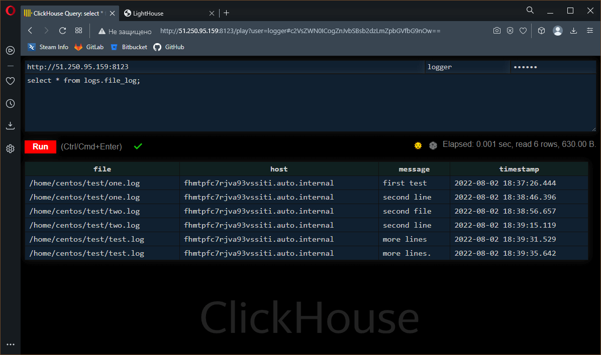
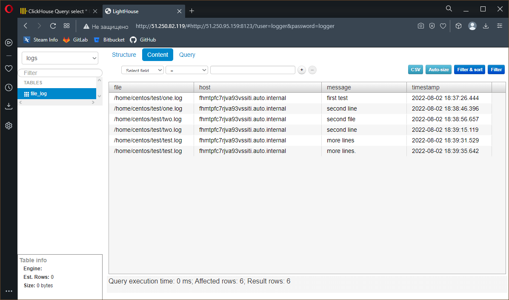

# Домашнее задание по лекции "8.4 Работа с Roles"

## Подготовка к выполнению
> 1. (Необязательно) Познакомтесь с [lighthouse](https://youtu.be/ymlrNlaHzIY?t=929)
> 2. Создайте два пустых публичных репозитория в любом своём проекте: vector-role и lighthouse-role.
> 3. Добавьте публичную часть своего ключа к своему профилю в github.

## Основная часть

> Наша основная цель - разбить наш playbook на отдельные roles. Задача: сделать roles для clickhouse, vector и lighthouse и написать playbook для использования этих ролей. Ожидаемый результат: существуют три ваших репозитория: два с roles и один с playbook.
>
> 1. Создать в старой версии playbook файл `requirements.yml` и заполнить его следующим содержимым:
>
>   ```yaml
>   ---
>     - src: git@github.com:AlexeySetevoi/ansible-clickhouse.git
>       scm: git
>       version: "1.11.0"
>       name: clickhouse 
>   ```
> 2. При помощи `ansible-galaxy` скачать себе эту роль.
> 3. Создать новый каталог с ролью при помощи `ansible-galaxy role init vector-role`
> 4. На основе tasks из старого playbook заполните новую role. Разнесите переменные между `vars` и `default`.
> 5. Перенести нужные шаблоны конфигов в `templates`
> 6. Описать в `README.md` обе роли и их параметры.
> 7. Повторите шаги 3-6 для lighthouse. Помните, что одна роль должна настраивать один продукт.
> 8. Выложите все roles в репозитории. Проставьте тэги, используя семантическую нумерацию Добавьте roles в `requirements.yml` в playbook.
> 9. Переработайте playbook на использование roles. Не забудьте про зависимости lighthouse и возможности совмещения `roles` с `tasks`.
> 10. Выложите playbook в репозиторий.
> 11. В ответ приведите ссылки на оба репозитория с roles и одну ссылку на репозиторий с playbook.

Загрузка ролей выполняется командой: `ansible-galaxy install -r <файл>`, где `<файл>` - YAML файл с информацией о требуемых компонентах (ролях), включая информацию о способе их получения.

Если используемая роль уже загружена или её нужно обновить, то необходимо добавить ключ `--force`

```console
sa@debian:~/my-ansible-4$ ansible-galaxy install -r requirements.yml
Starting galaxy role install process
- extracting clickhouse to /home/sa/.ansible/roles/clickhouse
- clickhouse (1.11.0) was installed successfully
sa@debian:~/my-ansible-4$
```

Для упрощения подготовки роли можно воспользоваться командой `ansible-galaxy role init <роль>`, где `<роль>` - имя инициализируемой роли.
Данная команда создаст шаблон новой роли, а именно - набор каталогов и предзаполненных файлов внутри директории `<роль>`.

Пример вывода команды:
```console
sa@debian:~/my-ansible-4$ ansible-galaxy role init vector-role
- Role vector-role was created successfully
sa@debian:~/my-ansible-4$ ansible-galaxy role init lighthouse-role
- Role lighthouse-role was created successfully
sa@debian:~/my-ansible-4$
```
В структуре каталогов роли переменные делятся на две группы: `defaults` и `vars`.
В **defaults** хранятся переменные и их значения по умолчанию, которые пользователь может переопределить на любом уровне (**group vars**, **host vars** и т.п.)
В **vars** хранятся переменные и их значения, которые обычно не предназначены для переопределения пользователем, а используются для упрощения дальнейшей разработки роли.
Исключение [--extra-vars](https://docs.ansible.com/ansible/latest/user_guide/playbooks_variables.html), которые при передаче в командной строке `ansible-playbook` могут их переопределить.

---

## Выполнение задачи

Репозиторий файлов [Ansible](https://github.com/ArtemShtepa/my-ansible/tree/08-ansible-04-role)

Репозиторий роли для [Vector](https://github.com/ArtemShtepa/vector-role)

Репозиторий роли для [Lighthouse](https://github.com/ArtemShtepa/lighthouse-role)

### Разворачивание инфраструктуры в Яндекс.Облаке

```console
sa@debian:~/my-ansible-4$ ./go.sh apply

Terraform used the selected providers to generate the following execution plan. Resource actions are indicated with the
following symbols:
  + create

Terraform will perform the following actions:

  # yandex_compute_image.centos-7 will be created
  + resource "yandex_compute_image" "centos-7" {
      + created_at      = (known after apply)
      + folder_id       = (known after apply)
      + id              = (known after apply)
      + min_disk_size   = (known after apply)
      + name            = "centos-7"
      + os_type         = (known after apply)
      + pooled          = (known after apply)
      + product_ids     = (known after apply)
      + size            = (known after apply)
      + source_disk     = (known after apply)
      + source_family   = "centos-7"
      + source_image    = (known after apply)
      + source_snapshot = (known after apply)
      + source_url      = (known after apply)
      + status          = (known after apply)
    }

  # yandex_compute_instance.vm["clickhouse"] will be created
  + resource "yandex_compute_instance" "vm" {
      + created_at                = (known after apply)
      + description               = "Node for clickhouse"
      + folder_id                 = (known after apply)
      + fqdn                      = (known after apply)
      + hostname                  = (known after apply)
      + id                        = (known after apply)
      + metadata                  = {
          + "ssh-keys" = <<-EOT
                centos:ssh-ed25519 AAAAC3NzaC1lZDI1NTE5AAAAIPihkt6ofLE79fEhZKRistV61GAS6jQtQGpDs0KaIYPR sa@debian
            EOT
        }
      + name                      = "clickhouse"
      + network_acceleration_type = "standard"
      + platform_id               = "standard-v1"
      + service_account_id        = (known after apply)
      + status                    = (known after apply)
      + zone                      = (known after apply)

      + boot_disk {
          + auto_delete = true
          + device_name = (known after apply)
          + disk_id     = (known after apply)
          + mode        = (known after apply)

          + initialize_params {
              + block_size  = (known after apply)
              + description = (known after apply)
              + image_id    = (known after apply)
              + name        = (known after apply)
              + size        = 10
              + snapshot_id = (known after apply)
              + type        = "network-hdd"
            }
        }

      + network_interface {
          + index              = (known after apply)
          + ip_address         = (known after apply)
          + ipv4               = true
          + ipv6               = (known after apply)
          + ipv6_address       = (known after apply)
          + mac_address        = (known after apply)
          + nat                = true
          + nat_ip_address     = (known after apply)
          + nat_ip_version     = (known after apply)
          + security_group_ids = (known after apply)
          + subnet_id          = (known after apply)
        }

      + placement_policy {
          + host_affinity_rules = (known after apply)
          + placement_group_id  = (known after apply)
        }

      + resources {
          + core_fraction = 20
          + cores         = 2
          + memory        = 4
        }

      + scheduling_policy {
          + preemptible = (known after apply)
        }
    }

  # yandex_compute_instance.vm["lighthouse"] will be created
  + resource "yandex_compute_instance" "vm" {
      + created_at                = (known after apply)
      + description               = "Node for lighthouse"
      + folder_id                 = (known after apply)
      + fqdn                      = (known after apply)
      + hostname                  = (known after apply)
      + id                        = (known after apply)
      + metadata                  = {
          + "ssh-keys" = <<-EOT
                centos:ssh-ed25519 AAAAC3NzaC1lZDI1NTE5AAAAIPihkt6ofLE79fEhZKRistV61GAS6jQtQGpDs0KaIYPR sa@debian
            EOT
        }
      + name                      = "lighthouse"
      + network_acceleration_type = "standard"
      + platform_id               = "standard-v1"
      + service_account_id        = (known after apply)
      + status                    = (known after apply)
      + zone                      = (known after apply)

      + boot_disk {
          + auto_delete = true
          + device_name = (known after apply)
          + disk_id     = (known after apply)
          + mode        = (known after apply)

          + initialize_params {
              + block_size  = (known after apply)
              + description = (known after apply)
              + image_id    = (known after apply)
              + name        = (known after apply)
              + size        = 10
              + snapshot_id = (known after apply)
              + type        = "network-hdd"
            }
        }

      + network_interface {
          + index              = (known after apply)
          + ip_address         = (known after apply)
          + ipv4               = true
          + ipv6               = (known after apply)
          + ipv6_address       = (known after apply)
          + mac_address        = (known after apply)
          + nat                = true
          + nat_ip_address     = (known after apply)
          + nat_ip_version     = (known after apply)
          + security_group_ids = (known after apply)
          + subnet_id          = (known after apply)
        }

      + placement_policy {
          + host_affinity_rules = (known after apply)
          + placement_group_id  = (known after apply)
        }

      + resources {
          + core_fraction = 20
          + cores         = 2
          + memory        = 4
        }

      + scheduling_policy {
          + preemptible = (known after apply)
        }
    }

  # yandex_compute_instance.vm["vector"] will be created
  + resource "yandex_compute_instance" "vm" {
      + created_at                = (known after apply)
      + description               = "Node for vector"
      + folder_id                 = (known after apply)
      + fqdn                      = (known after apply)
      + hostname                  = (known after apply)
      + id                        = (known after apply)
      + metadata                  = {
          + "ssh-keys" = <<-EOT
                centos:ssh-ed25519 AAAAC3NzaC1lZDI1NTE5AAAAIPihkt6ofLE79fEhZKRistV61GAS6jQtQGpDs0KaIYPR sa@debian
            EOT
        }
      + name                      = "vector"
      + network_acceleration_type = "standard"
      + platform_id               = "standard-v1"
      + service_account_id        = (known after apply)
      + status                    = (known after apply)
      + zone                      = (known after apply)

      + boot_disk {
          + auto_delete = true
          + device_name = (known after apply)
          + disk_id     = (known after apply)
          + mode        = (known after apply)

          + initialize_params {
              + block_size  = (known after apply)
              + description = (known after apply)
              + image_id    = (known after apply)
              + name        = (known after apply)
              + size        = 10
              + snapshot_id = (known after apply)
              + type        = "network-hdd"
            }
        }

      + network_interface {
          + index              = (known after apply)
          + ip_address         = (known after apply)
          + ipv4               = true
          + ipv6               = (known after apply)
          + ipv6_address       = (known after apply)
          + mac_address        = (known after apply)
          + nat                = true
          + nat_ip_address     = (known after apply)
          + nat_ip_version     = (known after apply)
          + security_group_ids = (known after apply)
          + subnet_id          = (known after apply)
        }

      + placement_policy {
          + host_affinity_rules = (known after apply)
          + placement_group_id  = (known after apply)
        }

      + resources {
          + core_fraction = 20
          + cores         = 2
          + memory        = 4
        }

      + scheduling_policy {
          + preemptible = (known after apply)
        }
    }

  # yandex_vpc_network.my-net will be created
  + resource "yandex_vpc_network" "my-net" {
      + created_at                = (known after apply)
      + default_security_group_id = (known after apply)
      + folder_id                 = (known after apply)
      + id                        = (known after apply)
      + labels                    = (known after apply)
      + name                      = "vm-network"
      + subnet_ids                = (known after apply)
    }

  # yandex_vpc_subnet.my-subnet will be created
  + resource "yandex_vpc_subnet" "my-subnet" {
      + created_at     = (known after apply)
      + folder_id      = (known after apply)
      + id             = (known after apply)
      + labels         = (known after apply)
      + name           = "cluster-subnet"
      + network_id     = (known after apply)
      + v4_cidr_blocks = [
          + "10.2.0.0/16",
        ]
      + v6_cidr_blocks = (known after apply)
      + zone           = "ru-central1-a"
    }

Plan: 6 to add, 0 to change, 0 to destroy.

Changes to Outputs:
  + clickhouse_ip = (known after apply)
  + lighthouse_ip = (known after apply)
  + vector_ip     = (known after apply)
yandex_vpc_network.my-net: Creating...
yandex_compute_image.centos-7: Creating...
yandex_vpc_network.my-net: Creation complete after 1s [id=enpd667dm6i6klbkn2cq]
yandex_vpc_subnet.my-subnet: Creating...
yandex_vpc_subnet.my-subnet: Creation complete after 1s [id=e9b4ru2kdr119gcs03ei]
yandex_compute_image.centos-7: Creation complete after 6s [id=fd8imjn2smu24srdgjk0]
yandex_compute_instance.vm["vector"]: Creating...
yandex_compute_instance.vm["lighthouse"]: Creating...
yandex_compute_instance.vm["clickhouse"]: Creating...
yandex_compute_instance.vm["clickhouse"]: Still creating... [10s elapsed]
yandex_compute_instance.vm["lighthouse"]: Still creating... [10s elapsed]
yandex_compute_instance.vm["vector"]: Still creating... [10s elapsed]
yandex_compute_instance.vm["lighthouse"]: Still creating... [20s elapsed]
yandex_compute_instance.vm["clickhouse"]: Still creating... [20s elapsed]
yandex_compute_instance.vm["vector"]: Still creating... [20s elapsed]
yandex_compute_instance.vm["lighthouse"]: Creation complete after 27s [id=fhmrc4650h7e8ufefjtp]
yandex_compute_instance.vm["clickhouse"]: Still creating... [30s elapsed]
yandex_compute_instance.vm["vector"]: Still creating... [30s elapsed]
yandex_compute_instance.vm["clickhouse"]: Creation complete after 31s [id=fhmtlgq39cb44mnks2i4]
yandex_compute_instance.vm["vector"]: Still creating... [40s elapsed]
yandex_compute_instance.vm["vector"]: Creation complete after 48s [id=fhmtpfc7rjva93vssiti]

Apply complete! Resources: 6 added, 0 changed, 0 destroyed.

Outputs:

clickhouse_ip = "51.250.95.159"
lighthouse_ip = "51.250.82.119"
vector_ip = "51.250.78.230"
```

### Применение конфигурирования сервисов

```console
sa@debian:~/my-ansible-4$ ./go.sh run
[WARNING]: provided hosts list is empty, only localhost is available. Note that the implicit localhost does not match
'all'

PLAY [Generate dynamic inventory] **************************************************************************************

TASK [Get instances from Yandex.Cloud CLI] *****************************************************************************
ok: [localhost]

TASK [Set instances to facts] ******************************************************************************************
ok: [localhost]

TASK [Add instances IP to hosts] ***************************************************************************************
ok: [localhost] => (item={'id': 'fhmrc4650h7e8ufefjtp', 'folder_id': 'b1g3ol70h1opu6hr9kie', 'created_at': '2022-08-02T18:26:01Z', 'name': 'lighthouse', 'description': 'Node for lighthouse', 'zone_id': 'ru-central1-a', 'platform_id': 'standard-v1', 'resources': {'memory': '4294967296', 'cores': '2', 'core_fraction': '20'}, 'status': 'RUNNING', 'metadata_options': {'gce_http_endpoint': 'ENABLED', 'aws_v1_http_endpoint': 'ENABLED', 'gce_http_token': 'ENABLED', 'aws_v1_http_token': 'ENABLED'}, 'boot_disk': {'mode': 'READ_WRITE', 'device_name': 'fhm84p4f2j650ot61fji', 'auto_delete': True, 'disk_id': 'fhm84p4f2j650ot61fji'}, 'network_interfaces': [{'index': '0', 'mac_address': 'd0:0d:1b:61:0c:50', 'subnet_id': 'e9b4ru2kdr119gcs03ei', 'primary_v4_address': {'address': '10.2.0.12', 'one_to_one_nat': {'address': '51.250.82.119', 'ip_version': 'IPV4'}}}], 'fqdn': 'fhmrc4650h7e8ufefjtp.auto.internal', 'scheduling_policy': {}, 'network_settings': {'type': 'STANDARD'}, 'placement_policy': {}})
ok: [localhost] => (item={'id': 'fhmtlgq39cb44mnks2i4', 'folder_id': 'b1g3ol70h1opu6hr9kie', 'created_at': '2022-08-02T18:26:01Z', 'name': 'clickhouse', 'description': 'Node for clickhouse', 'zone_id': 'ru-central1-a', 'platform_id': 'standard-v1', 'resources': {'memory': '4294967296', 'cores': '2', 'core_fraction': '20'}, 'status': 'RUNNING', 'metadata_options': {'gce_http_endpoint': 'ENABLED', 'aws_v1_http_endpoint': 'ENABLED', 'gce_http_token': 'ENABLED', 'aws_v1_http_token': 'ENABLED'}, 'boot_disk': {'mode': 'READ_WRITE', 'device_name': 'fhm469b26pl0goajnqrs', 'auto_delete': True, 'disk_id': 'fhm469b26pl0goajnqrs'}, 'network_interfaces': [{'index': '0', 'mac_address': 'd0:0d:1d:ac:34:34', 'subnet_id': 'e9b4ru2kdr119gcs03ei', 'primary_v4_address': {'address': '10.2.0.23', 'one_to_one_nat': {'address': '51.250.95.159', 'ip_version': 'IPV4'}}}], 'fqdn': 'fhmtlgq39cb44mnks2i4.auto.internal', 'scheduling_policy': {}, 'network_settings': {'type': 'STANDARD'}, 'placement_policy': {}})
ok: [localhost] => (item={'id': 'fhmtpfc7rjva93vssiti', 'folder_id': 'b1g3ol70h1opu6hr9kie', 'created_at': '2022-08-02T18:26:01Z', 'name': 'vector', 'description': 'Node for vector', 'zone_id': 'ru-central1-a', 'platform_id': 'standard-v1', 'resources': {'memory': '4294967296', 'cores': '2', 'core_fraction': '20'}, 'status': 'RUNNING', 'metadata_options': {'gce_http_endpoint': 'ENABLED', 'aws_v1_http_endpoint': 'ENABLED', 'gce_http_token': 'ENABLED', 'aws_v1_http_token': 'ENABLED'}, 'boot_disk': {'mode': 'READ_WRITE', 'device_name': 'fhm05ek7166mnnmgps80', 'auto_delete': True, 'disk_id': 'fhm05ek7166mnnmgps80'}, 'network_interfaces': [{'index': '0', 'mac_address': 'd0:0d:1d:cb:d8:7d', 'subnet_id': 'e9b4ru2kdr119gcs03ei', 'primary_v4_address': {'address': '10.2.0.19', 'one_to_one_nat': {'address': '51.250.78.230', 'ip_version': 'IPV4'}}}], 'fqdn': 'fhmtpfc7rjva93vssiti.auto.internal', 'scheduling_policy': {}, 'network_settings': {'type': 'STANDARD'}, 'placement_policy': {}})

TASK [Check instance count] ********************************************************************************************
ok: [localhost] => {
    "msg": "Total instance count: 3"
}

PLAY [Approve SSH fingerprint] *****************************************************************************************

TASK [Check known_hosts for] *******************************************************************************************
ok: [51.250.82.119 -> localhost]
ok: [51.250.95.159 -> localhost]
ok: [51.250.78.230 -> localhost]

TASK [Skip question for adding host key] *******************************************************************************
ok: [51.250.82.119]
ok: [51.250.95.159]
ok: [51.250.78.230]

TASK [Add SSH fingerprint to known host] *******************************************************************************
ok: [51.250.82.119]
ok: [51.250.78.230]
ok: [51.250.95.159]

PLAY [Install Clickhouse] **********************************************************************************************

TASK [Gathering Facts] *************************************************************************************************
ok: [51.250.95.159]

TASK [clickhouse : Include OS Family Specific Variables] ***************************************************************
ok: [51.250.95.159]

TASK [clickhouse : include_tasks] **************************************************************************************
included: /home/sa/.ansible/roles/clickhouse/tasks/precheck.yml for 51.250.95.159

TASK [clickhouse : Requirements check | Checking sse4_2 support] *******************************************************
ok: [51.250.95.159]

TASK [clickhouse : Requirements check | Not supported distribution && release] *****************************************
skipping: [51.250.95.159]

TASK [clickhouse : include_tasks] **************************************************************************************
included: /home/sa/.ansible/roles/clickhouse/tasks/params.yml for 51.250.95.159

TASK [clickhouse : Set clickhouse_service_enable] **********************************************************************
ok: [51.250.95.159]

TASK [clickhouse : Set clickhouse_service_ensure] **********************************************************************
ok: [51.250.95.159]

TASK [clickhouse : include_tasks] **************************************************************************************
included: /home/sa/.ansible/roles/clickhouse/tasks/install/yum.yml for 51.250.95.159

TASK [clickhouse : Install by YUM | Ensure clickhouse repo installed] **************************************************
changed: [51.250.95.159]

TASK [clickhouse : Install by YUM | Ensure clickhouse package installed (latest)] **************************************
skipping: [51.250.95.159]

TASK [clickhouse : Install by YUM | Ensure clickhouse package installed (version 22.3.3.44)] ***************************
changed: [51.250.95.159]

TASK [clickhouse : include_tasks] **************************************************************************************
included: /home/sa/.ansible/roles/clickhouse/tasks/configure/sys.yml for 51.250.95.159

TASK [clickhouse : Check clickhouse config, data and logs] *************************************************************
ok: [51.250.95.159] => (item=/var/log/clickhouse-server)
changed: [51.250.95.159] => (item=/etc/clickhouse-server)
changed: [51.250.95.159] => (item=/var/lib/clickhouse/tmp/)
changed: [51.250.95.159] => (item=/var/lib/clickhouse/)

TASK [clickhouse : Config | Create config.d folder] ********************************************************************
changed: [51.250.95.159]

TASK [clickhouse : Config | Create users.d folder] *********************************************************************
changed: [51.250.95.159]

TASK [clickhouse : Config | Generate system config] ********************************************************************
changed: [51.250.95.159]

TASK [clickhouse : Config | Generate users config] *********************************************************************
changed: [51.250.95.159]

TASK [clickhouse : Config | Generate remote_servers config] ************************************************************
skipping: [51.250.95.159]

TASK [clickhouse : Config | Generate macros config] ********************************************************************
skipping: [51.250.95.159]

TASK [clickhouse : Config | Generate zookeeper servers config] *********************************************************
skipping: [51.250.95.159]

TASK [clickhouse : Config | Fix interserver_http_port and intersever_https_port collision] *****************************
skipping: [51.250.95.159]

TASK [clickhouse : Notify Handlers Now] ********************************************************************************

RUNNING HANDLER [clickhouse : Restart Clickhouse Service] **************************************************************
ok: [51.250.95.159]

TASK [clickhouse : include_tasks] **************************************************************************************
included: /home/sa/.ansible/roles/clickhouse/tasks/service.yml for 51.250.95.159

TASK [clickhouse : Ensure clickhouse-server.service is enabled: True and state: restarted] *****************************
changed: [51.250.95.159]

TASK [clickhouse : Wait for Clickhouse Server to Become Ready] *********************************************************
ok: [51.250.95.159]

TASK [clickhouse : include_tasks] **************************************************************************************
included: /home/sa/.ansible/roles/clickhouse/tasks/configure/db.yml for 51.250.95.159

TASK [clickhouse : Set ClickHose Connection String] ********************************************************************
ok: [51.250.95.159]

TASK [clickhouse : Gather list of existing databases] ******************************************************************
ok: [51.250.95.159]

TASK [clickhouse : Config | Delete database config] ********************************************************************
skipping: [51.250.95.159] => (item={'name': 'logs'})

TASK [clickhouse : Config | Create database config] ********************************************************************
changed: [51.250.95.159] => (item={'name': 'logs'})

TASK [clickhouse : include_tasks] **************************************************************************************
included: /home/sa/.ansible/roles/clickhouse/tasks/configure/dict.yml for 51.250.95.159

TASK [clickhouse : Config | Generate dictionary config] ****************************************************************
skipping: [51.250.95.159]

TASK [clickhouse : include_tasks] **************************************************************************************
skipping: [51.250.95.159]

TASK [Create tables] ***************************************************************************************************
changed: [51.250.95.159]

PLAY [Install Vector] **************************************************************************************************

TASK [Gathering Facts] *************************************************************************************************
ok: [51.250.78.230]

TASK [vector-role : Download distrib] **********************************************************************************
changed: [51.250.78.230]

TASK [vector-role : Create distrib directory] **************************************************************************
changed: [51.250.78.230]

TASK [vector-role : Unpack vector distrib] *****************************************************************************
changed: [51.250.78.230]

TASK [vector-role : Install vector executable] *************************************************************************
changed: [51.250.78.230]

TASK [vector-role : Create vector directories] *************************************************************************
changed: [51.250.78.230] => (item=/var/lib/vector)
changed: [51.250.78.230] => (item=/etc/vector)

TASK [vector-role : Create test directory] *****************************************************************************
changed: [51.250.78.230]

TASK [vector-role : Install vector configuration] **********************************************************************
changed: [51.250.78.230]

TASK [vector-role : Install vector service file] ***********************************************************************
changed: [51.250.78.230]

TASK [vector-role : Enable vector service] *****************************************************************************
changed: [51.250.78.230]

RUNNING HANDLER [vector-role : Start vector service] *******************************************************************
changed: [51.250.78.230]

PLAY [Install Lighthouse] **********************************************************************************************

TASK [Gathering Facts] *************************************************************************************************
ok: [51.250.82.119]

TASK [lighthouse-role : Install epel-release for centos7] **************************************************************
changed: [51.250.82.119]

TASK [lighthouse-role : Install NGinX and Git] *************************************************************************
changed: [51.250.82.119] => (item=nginx)
changed: [51.250.82.119] => (item=git)

TASK [lighthouse-role : Check lighthouse files] ************************************************************************
fatal: [51.250.82.119]: FAILED! => {"changed": false, "msg": "file (/usr/share/nginx/lighthouse/app.js) is absent, cannot continue", "path": "/usr/share/nginx/lighthouse/app.js", "state": "absent"}
...ignoring

TASK [lighthouse-role : Clone VK Lighthouse] ***************************************************************************
changed: [51.250.82.119]

TASK [lighthouse-role : Change lighthouse default host] ****************************************************************
changed: [51.250.82.119]

TASK [lighthouse-role : Configure NGinX] *******************************************************************************
changed: [51.250.82.119]

TASK [lighthouse-role : Enable NGinX autostart] ************************************************************************
changed: [51.250.82.119]

RUNNING HANDLER [lighthouse-role : Restart nginx] **********************************************************************
changed: [51.250.82.119]

PLAY [Echo instances hint] *********************************************************************************************

TASK [Gathering Facts] *************************************************************************************************
ok: [localhost]

TASK [Clickhouse IP] ***************************************************************************************************
ok: [localhost] => {
    "msg": "Clickhouse IP: 51.250.95.159"
}

TASK [Vector IP] *******************************************************************************************************
ok: [localhost] => {
    "msg": "Vector IP    : 51.250.78.230"
}

TASK [Lighthouse IP] ***************************************************************************************************
ok: [localhost] => {
    "msg": "Clickhouse IP: 51.250.82.119"
}

PLAY RECAP *************************************************************************************************************
51.250.78.230              : ok=14   changed=10   unreachable=0    failed=0    skipped=0    rescued=0    ignored=0
51.250.82.119              : ok=12   changed=7    unreachable=0    failed=0    skipped=0    rescued=0    ignored=1
51.250.95.159              : ok=29   changed=10   unreachable=0    failed=0    skipped=9    rescued=0    ignored=0
localhost                  : ok=8    changed=0    unreachable=0    failed=0    skipped=0    rescued=0    ignored=0

sa@debian:~/my-ansible-4$
```

### Внесение изменений, фиксируемых через **Vector**

```console
sa@debian:~/my-ansible-4$ ssh centos@51.250.78.230
[centos@fhmtpfc7rjva93vssiti ~]$ echo "first test" > ~/test/one.log
[centos@fhmtpfc7rjva93vssiti ~]$ echo "second line" >> ~/test/one.log
[centos@fhmtpfc7rjva93vssiti ~]$ echo "second file" > ~/test/two.log
[centos@fhmtpfc7rjva93vssiti ~]$ echo "second line" >> ~/test/two.log
[centos@fhmtpfc7rjva93vssiti ~]$ echo "more lines" > ~/test/test.log
[centos@fhmtpfc7rjva93vssiti ~]$ echo "more lines." >> ~/test/test.log
[centos@fhmtpfc7rjva93vssiti ~]$ exit
logout
Connection to 51.250.78.230 closed.
sa@debian:~/my-ansible-4$
```

### Визуальная фиксация функционирования системы





### Проверка идемпотентности

```console
sa@debian:~/my-ansible-4$ ./go.sh run
[WARNING]: provided hosts list is empty, only localhost is available. Note that the implicit localhost does not match
'all'

PLAY [Generate dynamic inventory] **************************************************************************************

TASK [Get instances from Yandex.Cloud CLI] *****************************************************************************
ok: [localhost]

TASK [Set instances to facts] ******************************************************************************************
ok: [localhost]

TASK [Add instances IP to hosts] ***************************************************************************************
ok: [localhost] => (item={'id': 'fhmrc4650h7e8ufefjtp', 'folder_id': 'b1g3ol70h1opu6hr9kie', 'created_at': '2022-08-02T18:26:01Z', 'name': 'lighthouse', 'description': 'Node for lighthouse', 'zone_id': 'ru-central1-a', 'platform_id': 'standard-v1', 'resources': {'memory': '4294967296', 'cores': '2', 'core_fraction': '20'}, 'status': 'RUNNING', 'metadata_options': {'gce_http_endpoint': 'ENABLED', 'aws_v1_http_endpoint': 'ENABLED', 'gce_http_token': 'ENABLED', 'aws_v1_http_token': 'ENABLED'}, 'boot_disk': {'mode': 'READ_WRITE', 'device_name': 'fhm84p4f2j650ot61fji', 'auto_delete': True, 'disk_id': 'fhm84p4f2j650ot61fji'}, 'network_interfaces': [{'index': '0', 'mac_address': 'd0:0d:1b:61:0c:50', 'subnet_id': 'e9b4ru2kdr119gcs03ei', 'primary_v4_address': {'address': '10.2.0.12', 'one_to_one_nat': {'address': '51.250.82.119', 'ip_version': 'IPV4'}}}], 'fqdn': 'fhmrc4650h7e8ufefjtp.auto.internal', 'scheduling_policy': {}, 'network_settings': {'type': 'STANDARD'}, 'placement_policy': {}})
ok: [localhost] => (item={'id': 'fhmtlgq39cb44mnks2i4', 'folder_id': 'b1g3ol70h1opu6hr9kie', 'created_at': '2022-08-02T18:26:01Z', 'name': 'clickhouse', 'description': 'Node for clickhouse', 'zone_id': 'ru-central1-a', 'platform_id': 'standard-v1', 'resources': {'memory': '4294967296', 'cores': '2', 'core_fraction': '20'}, 'status': 'RUNNING', 'metadata_options': {'gce_http_endpoint': 'ENABLED', 'aws_v1_http_endpoint': 'ENABLED', 'gce_http_token': 'ENABLED', 'aws_v1_http_token': 'ENABLED'}, 'boot_disk': {'mode': 'READ_WRITE', 'device_name': 'fhm469b26pl0goajnqrs', 'auto_delete': True, 'disk_id': 'fhm469b26pl0goajnqrs'}, 'network_interfaces': [{'index': '0', 'mac_address': 'd0:0d:1d:ac:34:34', 'subnet_id': 'e9b4ru2kdr119gcs03ei', 'primary_v4_address': {'address': '10.2.0.23', 'one_to_one_nat': {'address': '51.250.95.159', 'ip_version': 'IPV4'}}}], 'fqdn': 'fhmtlgq39cb44mnks2i4.auto.internal', 'scheduling_policy': {}, 'network_settings': {'type': 'STANDARD'}, 'placement_policy': {}})
ok: [localhost] => (item={'id': 'fhmtpfc7rjva93vssiti', 'folder_id': 'b1g3ol70h1opu6hr9kie', 'created_at': '2022-08-02T18:26:01Z', 'name': 'vector', 'description': 'Node for vector', 'zone_id': 'ru-central1-a', 'platform_id': 'standard-v1', 'resources': {'memory': '4294967296', 'cores': '2', 'core_fraction': '20'}, 'status': 'RUNNING', 'metadata_options': {'gce_http_endpoint': 'ENABLED', 'aws_v1_http_endpoint': 'ENABLED', 'gce_http_token': 'ENABLED', 'aws_v1_http_token': 'ENABLED'}, 'boot_disk': {'mode': 'READ_WRITE', 'device_name': 'fhm05ek7166mnnmgps80', 'auto_delete': True, 'disk_id': 'fhm05ek7166mnnmgps80'}, 'network_interfaces': [{'index': '0', 'mac_address': 'd0:0d:1d:cb:d8:7d', 'subnet_id': 'e9b4ru2kdr119gcs03ei', 'primary_v4_address': {'address': '10.2.0.19', 'one_to_one_nat': {'address': '51.250.78.230', 'ip_version': 'IPV4'}}}], 'fqdn': 'fhmtpfc7rjva93vssiti.auto.internal', 'scheduling_policy': {}, 'network_settings': {'type': 'STANDARD'}, 'placement_policy': {}})

TASK [Check instance count] ********************************************************************************************
ok: [localhost] => {
    "msg": "Total instance count: 3"
}

PLAY [Approve SSH fingerprint] *****************************************************************************************

TASK [Check known_hosts for] *******************************************************************************************
ok: [51.250.82.119 -> localhost]
ok: [51.250.78.230 -> localhost]
ok: [51.250.95.159 -> localhost]

TASK [Skip question for adding host key] *******************************************************************************
skipping: [51.250.82.119]
skipping: [51.250.95.159]
skipping: [51.250.78.230]

TASK [Add SSH fingerprint to known host] *******************************************************************************
skipping: [51.250.82.119]
skipping: [51.250.95.159]
skipping: [51.250.78.230]

PLAY [Install Clickhouse] **********************************************************************************************

TASK [Gathering Facts] *************************************************************************************************
ok: [51.250.95.159]

TASK [clickhouse : Include OS Family Specific Variables] ***************************************************************
ok: [51.250.95.159]

TASK [clickhouse : include_tasks] **************************************************************************************
included: /home/sa/.ansible/roles/clickhouse/tasks/precheck.yml for 51.250.95.159

TASK [clickhouse : Requirements check | Checking sse4_2 support] *******************************************************
ok: [51.250.95.159]

TASK [clickhouse : Requirements check | Not supported distribution && release] *****************************************
skipping: [51.250.95.159]

TASK [clickhouse : include_tasks] **************************************************************************************
included: /home/sa/.ansible/roles/clickhouse/tasks/params.yml for 51.250.95.159

TASK [clickhouse : Set clickhouse_service_enable] **********************************************************************
ok: [51.250.95.159]

TASK [clickhouse : Set clickhouse_service_ensure] **********************************************************************
ok: [51.250.95.159]

TASK [clickhouse : include_tasks] **************************************************************************************
included: /home/sa/.ansible/roles/clickhouse/tasks/install/yum.yml for 51.250.95.159

TASK [clickhouse : Install by YUM | Ensure clickhouse repo installed] **************************************************
ok: [51.250.95.159]

TASK [clickhouse : Install by YUM | Ensure clickhouse package installed (latest)] **************************************
skipping: [51.250.95.159]

TASK [clickhouse : Install by YUM | Ensure clickhouse package installed (version 22.3.3.44)] ***************************
ok: [51.250.95.159]

TASK [clickhouse : include_tasks] **************************************************************************************
included: /home/sa/.ansible/roles/clickhouse/tasks/configure/sys.yml for 51.250.95.159

TASK [clickhouse : Check clickhouse config, data and logs] *************************************************************
ok: [51.250.95.159] => (item=/var/log/clickhouse-server)
ok: [51.250.95.159] => (item=/etc/clickhouse-server)
ok: [51.250.95.159] => (item=/var/lib/clickhouse/tmp/)
ok: [51.250.95.159] => (item=/var/lib/clickhouse/)

TASK [clickhouse : Config | Create config.d folder] ********************************************************************
ok: [51.250.95.159]

TASK [clickhouse : Config | Create users.d folder] *********************************************************************
ok: [51.250.95.159]

TASK [clickhouse : Config | Generate system config] ********************************************************************
ok: [51.250.95.159]

TASK [clickhouse : Config | Generate users config] *********************************************************************
ok: [51.250.95.159]

TASK [clickhouse : Config | Generate remote_servers config] ************************************************************
skipping: [51.250.95.159]

TASK [clickhouse : Config | Generate macros config] ********************************************************************
skipping: [51.250.95.159]

TASK [clickhouse : Config | Generate zookeeper servers config] *********************************************************
skipping: [51.250.95.159]

TASK [clickhouse : Config | Fix interserver_http_port and intersever_https_port collision] *****************************
skipping: [51.250.95.159]

TASK [clickhouse : Notify Handlers Now] ********************************************************************************

TASK [clickhouse : include_tasks] **************************************************************************************
included: /home/sa/.ansible/roles/clickhouse/tasks/service.yml for 51.250.95.159

TASK [clickhouse : Ensure clickhouse-server.service is enabled: True and state: started] *******************************
ok: [51.250.95.159]

TASK [clickhouse : Wait for Clickhouse Server to Become Ready] *********************************************************
ok: [51.250.95.159]

TASK [clickhouse : include_tasks] **************************************************************************************
included: /home/sa/.ansible/roles/clickhouse/tasks/configure/db.yml for 51.250.95.159

TASK [clickhouse : Set ClickHose Connection String] ********************************************************************
ok: [51.250.95.159]

TASK [clickhouse : Gather list of existing databases] ******************************************************************
ok: [51.250.95.159]

TASK [clickhouse : Config | Delete database config] ********************************************************************
skipping: [51.250.95.159] => (item={'name': 'logs'})

TASK [clickhouse : Config | Create database config] ********************************************************************
skipping: [51.250.95.159] => (item={'name': 'logs'})

TASK [clickhouse : include_tasks] **************************************************************************************
included: /home/sa/.ansible/roles/clickhouse/tasks/configure/dict.yml for 51.250.95.159

TASK [clickhouse : Config | Generate dictionary config] ****************************************************************
skipping: [51.250.95.159]

TASK [clickhouse : include_tasks] **************************************************************************************
skipping: [51.250.95.159]

TASK [Create tables] ***************************************************************************************************
ok: [51.250.95.159]

PLAY [Install Vector] **************************************************************************************************

TASK [Gathering Facts] *************************************************************************************************
ok: [51.250.78.230]

TASK [vector-role : Download distrib] **********************************************************************************
ok: [51.250.78.230]

TASK [vector-role : Create distrib directory] **************************************************************************
ok: [51.250.78.230]

TASK [vector-role : Unpack vector distrib] *****************************************************************************
ok: [51.250.78.230]

TASK [vector-role : Install vector executable] *************************************************************************
ok: [51.250.78.230]

TASK [vector-role : Create vector directories] *************************************************************************
ok: [51.250.78.230] => (item=/var/lib/vector)
ok: [51.250.78.230] => (item=/etc/vector)

TASK [vector-role : Create test directory] *****************************************************************************
ok: [51.250.78.230]

TASK [vector-role : Install vector configuration] **********************************************************************
ok: [51.250.78.230]

TASK [vector-role : Install vector service file] ***********************************************************************
ok: [51.250.78.230]

TASK [vector-role : Enable vector service] *****************************************************************************
ok: [51.250.78.230]

PLAY [Install Lighthouse] **********************************************************************************************

TASK [Gathering Facts] *************************************************************************************************
ok: [51.250.82.119]

TASK [lighthouse-role : Install epel-release for centos7] **************************************************************
ok: [51.250.82.119]

TASK [lighthouse-role : Install NGinX and Git] *************************************************************************
ok: [51.250.82.119] => (item=nginx)
ok: [51.250.82.119] => (item=git)

TASK [lighthouse-role : Check lighthouse files] ************************************************************************
ok: [51.250.82.119]

TASK [lighthouse-role : Clone VK Lighthouse] ***************************************************************************
skipping: [51.250.82.119]

TASK [lighthouse-role : Change lighthouse default host] ****************************************************************
ok: [51.250.82.119]

TASK [lighthouse-role : Configure NGinX] *******************************************************************************
ok: [51.250.82.119]

TASK [lighthouse-role : Enable NGinX autostart] ************************************************************************
ok: [51.250.82.119]

PLAY [Echo instances hint] *********************************************************************************************

TASK [Gathering Facts] *************************************************************************************************
ok: [localhost]

TASK [Clickhouse IP] ***************************************************************************************************
ok: [localhost] => {
    "msg": "Clickhouse IP: 51.250.95.159"
}

TASK [Vector IP] *******************************************************************************************************
ok: [localhost] => {
    "msg": "Vector IP    : 51.250.78.230"
}

TASK [Lighthouse IP] ***************************************************************************************************
ok: [localhost] => {
    "msg": "Clickhouse IP: 51.250.82.119"
}

PLAY RECAP *************************************************************************************************************
51.250.78.230              : ok=11   changed=0    unreachable=0    failed=0    skipped=2    rescued=0    ignored=0
51.250.82.119              : ok=8    changed=0    unreachable=0    failed=0    skipped=3    rescued=0    ignored=0
51.250.95.159              : ok=25   changed=0    unreachable=0    failed=0    skipped=12   rescued=0    ignored=0
localhost                  : ok=8    changed=0    unreachable=0    failed=0    skipped=0    rescued=0    ignored=0

sa@debian:~/my-ansible-4$
```
