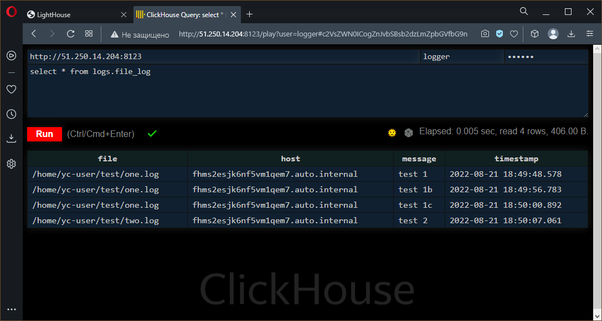
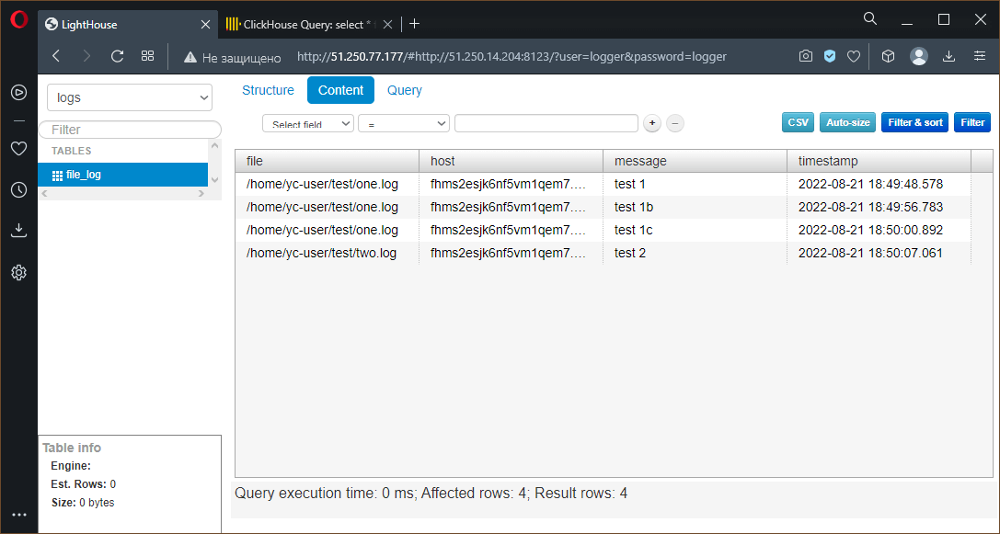

# Домашнее задание по лекции "8.6 Создание собственных Modules"

## Подготовка к выполнению

> 1. Создайте пустой публичных репозиторий в любом своём проекте: `my_own_collection`
> 2. Скачайте репозиторий ansible: `git clone https://github.com/ansible/ansible.git` по любому удобному вам пути
> 3. Зайдите в директорию ansible: `cd ansible`
> 4. Создайте виртуальное окружение: `python3 -m venv venv`
> 5. Активируйте виртуальное окружение: `. venv/bin/activate`. Дальнейшие действия производятся только в виртуальном окружении
> 6. Установите зависимости `pip install -r requirements.txt`
> 7. Запустить настройку окружения `. hacking/env-setup`
> 8. Если все шаги прошли успешно - выйти из виртуального окружения `deactivate`
> 9. Ваше окружение настроено, для того чтобы запустить его, нужно находиться в директории `ansible` и выполнить конструкцию `. venv/bin/activate && . hacking/env-setup`

```console
sa@debian:~/my-ansible-6/ansible$ python3 -m venv venv
sa@debian:~/my-ansible-6/ansible$ . venv/bin/activate
(venv) sa@debian:~/my-ansible-6/ansible$ pip install -r requirements.txt
Collecting jinja2>=3.0.0
  Using cached Jinja2-3.1.2-py3-none-any.whl (133 kB)
Collecting PyYAML>=5.1
  Downloading PyYAML-6.0-cp310-cp310-manylinux_2_5_x86_64.manylinux1_x86_64.manylinux_2_12_x86_64.manylinux2010_x86_64.whl (682 kB)
     ━━━━━━━━━━━━━━━━━━━━━━━━━━━━━━━━━━━━━━━━ 682.2/682.2 kB 3.5 MB/s eta 0:00:00
Collecting cryptography
  Using cached cryptography-37.0.4-cp36-abi3-manylinux_2_24_x86_64.whl (4.1 MB)
Collecting packaging
  Using cached packaging-21.3-py3-none-any.whl (40 kB)
Collecting resolvelib<0.9.0,>=0.5.3
  Using cached resolvelib-0.8.1-py2.py3-none-any.whl (16 kB)
Collecting MarkupSafe>=2.0
  Using cached MarkupSafe-2.1.1-cp310-cp310-manylinux_2_17_x86_64.manylinux2014_x86_64.whl (25 kB)
Collecting cffi>=1.12
  Using cached cffi-1.15.1-cp310-cp310-manylinux_2_17_x86_64.manylinux2014_x86_64.whl (441 kB)
Collecting pyparsing!=3.0.5,>=2.0.2
  Using cached pyparsing-3.0.9-py3-none-any.whl (98 kB)
Collecting pycparser
  Using cached pycparser-2.21-py2.py3-none-any.whl (118 kB)
Installing collected packages: resolvelib, PyYAML, pyparsing, pycparser, MarkupSafe, packaging, jinja2, cffi, cryptography
Successfully installed MarkupSafe-2.1.1 PyYAML-6.0 cffi-1.15.1 cryptography-37.0.4 jinja2-3.1.2 packaging-21.3 pycparser-2.21 pyparsing-3.0.9 resolvelib-0.8.1
(venv) sa@debian:~/my-ansible-6/ansible$ . hacking/env-setup
running egg_info
creating lib/ansible_core.egg-info
writing lib/ansible_core.egg-info/PKG-INFO
writing dependency_links to lib/ansible_core.egg-info/dependency_links.txt
writing entry points to lib/ansible_core.egg-info/entry_points.txt
writing requirements to lib/ansible_core.egg-info/requires.txt
writing top-level names to lib/ansible_core.egg-info/top_level.txt
writing manifest file 'lib/ansible_core.egg-info/SOURCES.txt'
reading manifest file 'lib/ansible_core.egg-info/SOURCES.txt'
reading manifest template 'MANIFEST.in'
warning: no files found matching 'SYMLINK_CACHE.json'
warning: no previously-included files found matching 'docs/docsite/rst_warnings'
warning: no previously-included files found matching 'docs/docsite/rst/conf.py'
warning: no previously-included files found matching 'docs/docsite/rst/index.rst'
warning: no previously-included files found matching 'docs/docsite/rst/dev_guide/index.rst'
warning: no previously-included files matching '*' found under directory 'docs/docsite/_build'
warning: no previously-included files matching '*.pyc' found under directory 'docs/docsite/_extensions'
warning: no previously-included files matching '*.pyo' found under directory 'docs/docsite/_extensions'
warning: no files found matching '*.ps1' under directory 'lib/ansible/modules/windows'
warning: no files found matching '*.yml' under directory 'lib/ansible/modules'
warning: no files found matching 'validate-modules' under directory 'test/lib/ansible_test/_util/controller/sanity/validate-modules'
adding license file 'COPYING'
writing manifest file 'lib/ansible_core.egg-info/SOURCES.txt'

Setting up Ansible to run out of checkout...

PATH=/home/sa/my-ansible-6/ansible/bin:/home/sa/my-ansible-6/ansible/venv/bin:/home/sa/.local/bin:/usr/bin:/home/sa/.local/bin:/home/sa/yandex-cloud/bin:/usr/local/bin:/usr/bin:/bin:/usr/local/games:/usr/games
PYTHONPATH=/home/sa/my-ansible-6/ansible/test/lib:/home/sa/my-ansible-6/ansible/lib
MANPATH=/home/sa/my-ansible-6/ansible/docs/man:/usr/share/man:/usr/local/man:/usr/local/share/man

Remember, you may wish to specify your host file with -i

Done!

(venv) sa@debian:~/my-ansible-6/ansible$ deactivate
sa@debian:~/my-ansible-6/ansible$
```

## Основная часть

Наша цель - написать собственный module, который мы можем использовать в своей role, через playbook.
Всё это должно быть собрано в виде collection и отправлено в наш репозиторий.

### 1. В виртуальном окружении создать новый `my_own_module.py` файл

Встроенные модули **Ansible** находятся по пути `lib/ansible/modules`, там и будем создавать файл, только с именем `file_content.py`

---

### 2. Наполнить его содержимым из [статьи](https://docs.ansible.com/ansible/latest/dev_guide/developing_modules_general.html#creating-a-module)

---

### 3. Перепишите файл в соответствии с требованиями ansible так, чтобы он выполнял следующую задачу

**Module** должен создавать текстовый файл на удалённом хосте по пути, определённом в параметре `path`, с содержимым, определённым в параметре `content`.

Готовый файл в репозитории: [file_content.py](https://github.com/ArtemShtepa/ansible-collection/blob/main/plugins/modules/file_content.py)

---

### 4. Проверьте module на исполняемость локально.

Для проверки модуля на исполняемость локально можно запустить его непостредственно в **Python** передав **JSON** файл с нужным содержимым

Пример передаваемого **JSON** файла
```json
{
    "ANSIBLE_MODULE_ARGS": {
        "path": "test23",
        "content": "test line"
    }
}
```

Команда запуска: `python -m <модуль> <файл>`, где `<модуль>` - путь к исполняемому модулю (`ansible.modules.file_content` для модуля `file_content` из каталога встроенных в **Ansible**), а `<файл>` - **JSON** файл с входными данными

Первый запуск, когда файла нет:
```console
(venv) sa@debian:~/my-ansible-6/ansible$ python -m ansible.modules.file_content payload.json

{"changed": true, "path": "test23", "content": "test line", "status": "created", "uid": 1000, "gid": 1000, "owner": "sa", "group": "sa", "mode": "0644", "state": "file", "size": 9, "invocation": {"module_args": {"path": "test23", "content": "test line"}}}
(venv) sa@debian:~/my-ansible-6/ansible$
```

Результат:
```json
{
    "changed": true,
    "path": "test23",
    "content": "test line",
    "status": "created",
    "uid": 1000,
    "gid": 1000,
    "owner": "sa",
    "group": "sa",
    "mode": "0644",
    "state": "file",
    "size": 9,
    "invocation": {
        "module_args": {
            "path": "test23",
            "content": "test line"
        }
    }
}
```

Второй запуск, когда файл уже существует:
```console
(venv) sa@debian:~/my-ansible-6/ansible$ python -m ansible.modules.file_content payload.json

{"changed": false, "path": "test23", "content": "test line", "status": "resisted", "uid": 1000, "gid": 1000, "owner": "sa", "group": "sa", "mode": "0644", "state": "file", "size": 9, "invocation": {"module_args": {"path": "test23", "content": "test line"}}}
(venv) sa@debian:~/my-ansible-6/ansible$
```

Результат:
```json
{
    "changed": false,
    "path": "test23",
    "content": "test line",
    "status": "resisted",
    "uid": 1000,
    "gid": 1000,
    "owner": "sa",
    "group": "sa",
    "mode": "0644",
    "state": "file",
    "size": 9,
    "invocation": {
        "module_args": {
            "path": "test23",
            "content": "test line"
        }
    }
}
```

Третий запуск с изменённым параметром `content`:
```console
(venv) sa@debian:~/my-ansible-6/ansible$ python -m ansible.modules.file_content payload.json

{"changed": true, "path": "test23", "content": "test line +add", "status": "modified", "uid": 1000, "gid": 1000, "owner": "sa", "group": "sa", "mode": "0644", "state": "file", "size": 14, "invocation": {"module_args": {"path": "test23", "content": "test line +add"}}}
(venv) sa@debian:~/my-ansible-6/ansible$
```

Результат:
```json
{
    "changed": true,
    "path": "test23",
    "content": "test line +add",
    "status": "modified",
    "uid": 1000,
    "gid": 1000,
    "owner": "sa",
    "group": "sa",
    "mode": "0644",
    "state": "file",
    "size": 14,
    "invocation": {
        "module_args": {
            "path": "test23",
            "content": "test line +add"
        }
    }
}
```

**JSON** блок вывода дополняется следующими параметрами: **uid**, **gid**, **owner**, **group**, **mode**, **state**, **size**. Так происходит всегда, когда в модуле есть параметр с именем `path` или `dest`. Само добавление выполняется при завершении модуля (функция `exit_json`).

Также в результат всегда добавляется блок **invocation** (если его нет) с параметрами вызова модуля. Добавление также выпоняется при завершении модуля.

---

### 5. Напишите single task playbook и используйте module в нём.

Пример подобного **playbook**:
```yaml
---
- name: Test module
  hosts: localhost
  tasks:
    - name: run on test23
      file_content:
        path: 'test23'
        content: 'write test'
...
```

Исполнение **playbook**: (файла **test23** нет)
```console
(venv) sa@debian:~/my-ansible-6/ansible$ ansible-playbook site.yml
[WARNING]: You are running the development version of Ansible. You should only run Ansible from "devel" if you are
modifying the Ansible engine, or trying out features under development. This is a rapidly changing source of code and
can become unstable at any point.
[WARNING]: No inventory was parsed, only implicit localhost is available
[WARNING]: provided hosts list is empty, only localhost is available. Note that the implicit localhost does not match
'all'

PLAY [Test module] *****************************************************************************************************

TASK [Gathering Facts] *************************************************************************************************
ok: [localhost]

TASK [run on test23 - write] *******************************************************************************************
changed: [localhost]

PLAY RECAP *************************************************************************************************************
localhost                  : ok=2    changed=1    unreachable=0    failed=0    skipped=0    rescued=0    ignored=0

(venv) sa@debian:~/my-ansible-6/ansible$
```

---

### 6. Проверьте через playbook на идемпотентность.

Повторный запуск **playbook** (файл **test23** уже существует):
```console
(venv) sa@debian:~/my-ansible-6/ansible$ ansible-playbook site.yml
[WARNING]: You are running the development version of Ansible. You should only run Ansible from "devel" if you are
modifying the Ansible engine, or trying out features under development. This is a rapidly changing source of code and
can become unstable at any point.
[WARNING]: No inventory was parsed, only implicit localhost is available
[WARNING]: provided hosts list is empty, only localhost is available. Note that the implicit localhost does not match
'all'

PLAY [Test module] *****************************************************************************************************

TASK [Gathering Facts] *************************************************************************************************
ok: [localhost]

TASK [run on test23 - write] *******************************************************************************************
ok: [localhost]

PLAY RECAP *************************************************************************************************************
localhost                  : ok=2    changed=0    unreachable=0    failed=0    skipped=0    rescued=0    ignored=0

(venv) sa@debian:~/my-ansible-6/ansible$
```

---

### 7. Выйдите из виртуального окружения.

Выход из окружения выполняется командой `deactivate`

---

### 8. Инициализируйте новую collection my_own_namespace.yandex_cloud_elk

Инициализация новой **collection** выполняется по шаблону `ansible-galaxy collection init <пространство>.<коллекция>`, где `<пространство>` - Пространство имён автора (название группы для всех **collection** автора), `<коллекция>` - название **collection**

Создание своей **collection** (вместо `my_own_namespace.yandex_cloud_elk` используется `artem_shtepa.utils`):

```console
sa@debian:~/my-ansible-6$ ansible-galaxy collection init artem_shtepa.utils
[WARNING]: You are running the development version of Ansible. You should only run Ansible from "devel" if you are
modifying the Ansible engine, or trying out features under development. This is a rapidly changing source of code and
can become unstable at any point.
- Collection artem_shtepa.utils was created successfully
sa@debian:~/my-ansible-6$
```

---

### 9. В данную collection перенесите свой module в соответствующую директорию.

**Module** в **Ansible** это частный случай **plugin**, а значит и размещать его нужно внутри каталога **plugins**.
В соответствии с подсказкой **Ansible** (`plugins\readme.md`) модули должны размещаться в каталоге `plugins\modules`.

---

### 10. Single task playbook преобразуйте в single task role и перенесите в collection. У role должны быть default всех параметров module

Ссылка на **single task role** в **collection**: [file_content](https://github.com/ArtemShtepa/ansible-collection/tree/main/roles/file_content)

---

### 11. Создайте playbook для использования этой role.

Ссылка на **playbook** в репозитории: [test_file_content](https://github.com/ArtemShtepa/ansible-collection/blob/main/playbooks/test_file_content.yml)

---

### 12. Заполните всю документацию по collection, выложите в свой репозиторий, поставьте тег `1.0.0` на этот коммит.

Ссылка на репозиторий версии **1.0.0**: [Ansible-Collection](https://github.com/ArtemShtepa/ansible-collection/tree/1.0.0)

---

### 13. Создайте архив .tar.gz этой collection в корневой директории collection.

Архив **collection** создаётся командой `ansible-galaxy collection build`

```console
sa@debian:~/my-ansible-6/artem_shtepa/utils$ ansible-galaxy collection build
[WARNING]: You are running the development version of Ansible. You should only run Ansible from "devel" if you are
modifying the Ansible engine, or trying out features under development. This is a rapidly changing source of code and
can become unstable at any point.
Created collection for artem_shtepa.utils at /home/sa/my-ansible-6/artem_shtepa/utils/artem_shtepa-utils-1.0.0.tar.gz
sa@debian:~/my-ansible-6/artem_shtepa/utils$
```

---

### 14. Создайте ещё одну директорию любого наименования, перенесите туда single task playbook и архив c collection.

```console
sa@debian:~/my-ansible-6/final_test$ ls
artem_shtepa-utils-1.0.0.tar.gz  test_file_content.yml
sa@debian:~/my-ansible-6/final_test$
```

---

### 15. Установите collection из локального архива

Установка **collection** из архива выполняется командой `ansible-galaxy collection install <архив.tar.gz>` - где `<архив.tar.gz>` - файл **.tar.gz** архива **collection**, созданный **Ansible**.
Если запрашиваемая версия уже установлена, но требуется её заменить нужно добавить ключ: `--force`

```console
sa@debian:~/my-ansible-6/final_test$ ansible-galaxy collection install artem_shtepa-utils-1.0.0.tar.gz
[WARNING]: You are running the development version of Ansible. You should only run Ansible from "devel" if you are
modifying the Ansible engine, or trying out features under development. This is a rapidly changing source of code and
can become unstable at any point.
Starting galaxy collection install process
Process install dependency map
Starting collection install process
Installing 'artem_shtepa.utils:1.0.0' to '/home/sa/.ansible/collections/ansible_collections/artem_shtepa/utils'
artem_shtepa.utils:1.0.0 was installed successfully
sa@debian:~/my-ansible-6/final_test$
```

---

### 16. Запустите playbook, убедитесь, что он работает.

```console
sa@debian:~/my-ansible-6/final_test$ ansible-playbook test_file_content.yml
[WARNING]: You are running the development version of Ansible. You should only run Ansible from "devel" if you are
modifying the Ansible engine, or trying out features under development. This is a rapidly changing source of code and
can become unstable at any point.
[WARNING]: No inventory was parsed, only implicit localhost is available
[WARNING]: provided hosts list is empty, only localhost is available. Note that the implicit localhost does not match
'all'

PLAY [Test file content role] ******************************************************************************************

TASK [Gathering Facts] *************************************************************************************************
ok: [localhost]

TASK [artem_shtepa.utils.file_content : Compute file] ******************************************************************
changed: [localhost]

PLAY RECAP *************************************************************************************************************
localhost                  : ok=2    changed=1    unreachable=0    failed=0    skipped=0    rescued=0    ignored=0

sa@debian:~/my-ansible-6/final_test$ ls
artem_shtepa-utils-1.0.0.tar.gz  test_file  test_file_content.yml
sa@debian:~/my-ansible-6/final_test$ cat test_file && echo ''
sequence_of_data
sa@debian:~/my-ansible-6/final_test$
```

---

### 17. В ответ необходимо прислать ссылку на репозиторий с collection

Репозиторий **collection** [Ansible-Collection](https://github.com/ArtemShtepa/ansible-collection)

---

## Необязательная часть

> 1. Реализуйте свой собственный модуль для создания хостов в Yandex Cloud.
> 2. Модуль может (и должен) иметь зависимость от `yc`, основной функционал: создание ВМ с нужным сайзингом на основе нужной ОС. Дополнительные модули по созданию кластеров Clickhouse, MySQL и прочего реализовывать не надо, достаточно простейшего создания ВМ.
> 3. Модуль может формировать динамическое inventory, но данная часть не является обязательной, достаточно, чтобы он делал хосты с указанной спецификацией в YAML.
> 4. Протестируйте модуль на идемпотентность, исполнимость. При успехе - добавьте данный модуль в свою коллекцию.
> 5. Измените playbook так, чтобы он умел создавать инфраструктуру под inventory, а после устанавливал весь ваш стек Observability на нужные хосты и настраивал его.
> 6. В итоге, ваша коллекция обязательно должна содержать: clickhouse-role(если есть своя), lighthouse-role, vector-role, два модуля: my_own_module и модуль управления Yandex Cloud хостами и playbook, который демонстрирует создание Observability стека.

Для функционирования хостов **Yandex.Cloud** необходимо наличие хотя бы одной сети (**net**) и одной подсети (**subnet**), в которых будут размещены создаваемые хосты.
Данный функционал, а именно создание и удаление сети и подсети, реализован в модуле `yc_vpc`.

Создание, изменение и удаление хостов в **Yandex.Cloud** реализовано в модуле `yc_cmp`.
Конфигурация создаваемых хостов реализована трансляцией сущестующих параметров в **Yandex Cloud CLI**.
То есть все параметры модуля `yc_cmp` из группы `config` преобразуются в соответствующие параметры командной строки для **Yandex Cloud CLI** с которыми он и запускается.

Документация по доступным параметрам [конфигурирования хостов CLI](https://cloud.yandex.ru/docs/cli/cli-ref/managed-services/compute/instance/create).
Исключение составляет параметр `--name`, который должен заполняться параметром `machine` данного модуля.

Так как модуль **Ansible** фактически представляет собой автономную единицу, исполняемую на хосте, из него невозможно вызвать другой модуль (например, для исполнения **ActionPlugin** `add_host`).
Однако, данная возможность может быть реализована в **action plugin**.

В демонстрации используется сторонняя роль для установки **Clickhouse** от **AlexeySetevoi**, которая может быть установлена из [Galaxy](https://galaxy.ansible.com/alexeysetevoi/clickhouse):
```console
ansible-galaxy install alexeysetevoi.clickhouse
```

Либо напрямую из репозитория [AlexeySetevoi](https://github.com/AlexeySetevoi/ansible-clickhouse): `ansible-galaxy install -r requirements.yml`

requirements.yml
```yaml
---
- name: clickhouse
  src: git@github.com:AlexeySetevoi/ansible-clickhouse.git
  scm: git
  version: "1.13"
...
```

### Установка коллекции (последней версии)

```console
ansible-galaxy collection install git+https://github.com/ArtemShtepa/ansible-collection.git
```

```console
sa@debian:~/my-ansible-6/final_test$ ansible-galaxy collection install git+https://github.com/ArtemShtepa/ansible-collection.git
[WARNING]: You are running the development version of Ansible. You should only run Ansible from "devel" if you are
modifying the Ansible engine, or trying out features under development. This is a rapidly changing source of code and
can become unstable at any point.
Клонирование в «/home/sa/.ansible/tmp/ansible-local-5439ynwvy_2o/tmpivd09sg4/ansible-collection72ngfhp_»…
remote: Enumerating objects: 61, done.
remote: Counting objects: 100% (61/61), done.
remote: Compressing objects: 100% (45/45), done.
remote: Total 61 (delta 2), reused 52 (delta 0), pack-reused 0
Получение объектов: 100% (61/61), 18.97 КиБ | 18.97 МиБ/с, готово.
Определение изменений: 100% (2/2), готово.
Ваша ветка обновлена в соответствии с «origin/main».
Starting galaxy collection install process
Process install dependency map
Starting collection install process
Installing 'artem_shtepa.utils:1.0.3' to '/home/sa/.ansible/collections/ansible_collections/artem_shtepa/utils'
Created collection for artem_shtepa.utils:1.0.3 at /home/sa/.ansible/collections/ansible_collections/artem_shtepa/utils
artem_shtepa.utils:1.0.3 was installed successfully
sa@debian:~/my-ansible-6/final_test$
```

### Демонстрация функционирования коллекции

```console
sa@debian:~/my-ansible-6/final_test$ ansible-playbook artem_shtepa.utils.demo_site.yml
[WARNING]: You are running the development version of Ansible. You should only run Ansible from "devel" if you are
modifying the Ansible engine, or trying out features under development. This is a rapidly changing source of code and
can become unstable at any point.
[WARNING]: No inventory was parsed, only implicit localhost is available
[WARNING]: provided hosts list is empty, only localhost is available. Note that the implicit localhost does not match
'all'
[WARNING]: running playbook inside collection artem_shtepa.utils

PLAY [Create infrastructure] *******************************************************************************************

TASK [Create net and subnet] *******************************************************************************************
changed: [localhost]

TASK [Create cloud instances] ******************************************************************************************
changed: [localhost] => (item={'name': 'clickhouse', 'cpu': 2, 'memory': '2GB', 'disk': '10GB'})
changed: [localhost] => (item={'name': 'lighthouse', 'cpu': 2, 'memory': '1GB', 'disk': '10GB'})
changed: [localhost] => (item={'name': 'vector', 'cpu': 2, 'memory': '1GB', 'disk': '10GB'})

TASK [Add instances IP to hosts] ***************************************************************************************
ok: [localhost] => (item={'changed': True, 'version': 'Yandex Cloud CLI 0.94.0 linux/amd64', 'yc_args': '--core-fraction 5 --cores 2 --memory 2GB --create-boot-disk size=10GB,image-folder-id=standard-images,image-family=centos-7 --public-ip --ssh-key ~/.ssh/id_ed25519.pub --zone ru-central1-a', 'config': {'id': 'fhmtmkvc2jvak6e0prrl', 'folder_id': 'b1g3ol70h1opu6hr9kie', 'created_at': '2022-08-21T18:35:02Z', 'name': 'clickhouse', 'zone_id': 'ru-central1-a', 'platform_id': 'standard-v2', 'resources': {'memory': '2147483648', 'cores': '2', 'core_fraction': '5'}, 'status': 'RUNNING', 'metadata_options': {'gce_http_endpoint': 'ENABLED', 'aws_v1_http_endpoint': 'ENABLED', 'gce_http_token': 'ENABLED', 'aws_v1_http_token': 'ENABLED'}, 'boot_disk': {'mode': 'READ_WRITE', 'device_name': 'fhm6c31p89iqsc0kc8di', 'auto_delete': True, 'disk_id': 'fhm6c31p89iqsc0kc8di'}, 'network_interfaces': [{'index': '0', 'mac_address': 'd0:0d:1d:b5:3e:c1', 'subnet_id': 'e9beentl6ha83tsghnla', 'primary_v4_address': {'address': '10.2.0.15', 'one_to_one_nat': {'address': '51.250.14.204', 'ip_version': 'IPV4'}}}], 'fqdn': 'fhmtmkvc2jvak6e0prrl.auto.internal', 'scheduling_policy': {}, 'network_settings': {'type': 'STANDARD'}, 'placement_policy': {}}, 'ip': '51.250.14.204', 'invocation': {'module_args': {'machine': 'clickhouse', 'state': 'exists', 'config': {'core-fraction': 5, 'cores': '2', 'memory': '2GB', 'create-boot-disk': {'size': '10GB', 'image-folder-id': 'standard-images', 'image-family': 'centos-7'}, 'public-ip': True, 'ssh-key': '~/.ssh/id_ed25519.pub', 'zone': 'ru-central1-a'}}}, 'failed': False, 'item': {'name': 'clickhouse', 'cpu': 2, 'memory': '2GB', 'disk': '10GB'}, 'ansible_loop_var': 'item'})
ok: [localhost] => (item={'changed': True, 'version': 'Yandex Cloud CLI 0.94.0 linux/amd64', 'yc_args': '--core-fraction 5 --cores 2 --memory 1GB --create-boot-disk size=10GB,image-folder-id=standard-images,image-family=centos-7 --public-ip --ssh-key ~/.ssh/id_ed25519.pub --zone ru-central1-a', 'config': {'id': 'fhmbbafsbeptrerdk514', 'folder_id': 'b1g3ol70h1opu6hr9kie', 'created_at': '2022-08-21T18:35:24Z', 'name': 'lighthouse', 'zone_id': 'ru-central1-a', 'platform_id': 'standard-v2', 'resources': {'memory': '1073741824', 'cores': '2', 'core_fraction': '5'}, 'status': 'RUNNING', 'metadata_options': {'gce_http_endpoint': 'ENABLED', 'aws_v1_http_endpoint': 'ENABLED', 'gce_http_token': 'ENABLED', 'aws_v1_http_token': 'ENABLED'}, 'boot_disk': {'mode': 'READ_WRITE', 'device_name': 'fhmkitknlfdi73maj95n', 'auto_delete': True, 'disk_id': 'fhmkitknlfdi73maj95n'}, 'network_interfaces': [{'index': '0', 'mac_address': 'd0:0d:b5:a9:fc:5b', 'subnet_id': 'e9beentl6ha83tsghnla', 'primary_v4_address': {'address': '10.2.0.12', 'one_to_one_nat': {'address': '51.250.77.177', 'ip_version': 'IPV4'}}}], 'fqdn': 'fhmbbafsbeptrerdk514.auto.internal', 'scheduling_policy': {}, 'network_settings': {'type': 'STANDARD'}, 'placement_policy': {}}, 'ip': '51.250.77.177', 'invocation': {'module_args': {'machine': 'lighthouse', 'state': 'exists', 'config': {'core-fraction': 5, 'cores': '2', 'memory': '1GB', 'create-boot-disk': {'size': '10GB', 'image-folder-id': 'standard-images', 'image-family': 'centos-7'}, 'public-ip': True, 'ssh-key': '~/.ssh/id_ed25519.pub', 'zone': 'ru-central1-a'}}}, 'failed': False, 'item': {'name': 'lighthouse', 'cpu': 2, 'memory': '1GB', 'disk': '10GB'}, 'ansible_loop_var': 'item'})
ok: [localhost] => (item={'changed': True, 'version': 'Yandex Cloud CLI 0.94.0 linux/amd64', 'yc_args': '--core-fraction 5 --cores 2 --memory 1GB --create-boot-disk size=10GB,image-folder-id=standard-images,image-family=centos-7 --public-ip --ssh-key ~/.ssh/id_ed25519.pub --zone ru-central1-a', 'config': {'id': 'fhms2esjk6nf5vm1qem7', 'folder_id': 'b1g3ol70h1opu6hr9kie', 'created_at': '2022-08-21T18:35:46Z', 'name': 'vector', 'zone_id': 'ru-central1-a', 'platform_id': 'standard-v2', 'resources': {'memory': '1073741824', 'cores': '2', 'core_fraction': '5'}, 'status': 'RUNNING', 'metadata_options': {'gce_http_endpoint': 'ENABLED', 'aws_v1_http_endpoint': 'ENABLED', 'gce_http_token': 'ENABLED', 'aws_v1_http_token': 'ENABLED'}, 'boot_disk': {'mode': 'READ_WRITE', 'device_name': 'fhmn3vbsb7bsg1tjv367', 'auto_delete': True, 'disk_id': 'fhmn3vbsb7bsg1tjv367'}, 'network_interfaces': [{'index': '0', 'mac_address': 'd0:0d:1c:13:b9:3a', 'subnet_id': 'e9beentl6ha83tsghnla', 'primary_v4_address': {'address': '10.2.0.5', 'one_to_one_nat': {'address': '51.250.91.16', 'ip_version': 'IPV4'}}}], 'fqdn': 'fhms2esjk6nf5vm1qem7.auto.internal', 'scheduling_policy': {}, 'network_settings': {'type': 'STANDARD'}, 'placement_policy': {}}, 'ip': '51.250.91.16', 'invocation': {'module_args': {'machine': 'vector', 'state': 'exists', 'config': {'core-fraction': 5, 'cores': '2', 'memory': '1GB', 'create-boot-disk': {'size': '10GB', 'image-folder-id': 'standard-images', 'image-family': 'centos-7'}, 'public-ip': True, 'ssh-key': '~/.ssh/id_ed25519.pub', 'zone': 'ru-central1-a'}}}, 'failed': False, 'item': {'name': 'vector', 'cpu': 2, 'memory': '1GB', 'disk': '10GB'}, 'ansible_loop_var': 'item'})

PLAY [Wait for instance ready] *****************************************************************************************

TASK [Ping SSH port] ***************************************************************************************************
ok: [51.250.77.177 -> localhost]
ok: [51.250.91.16 -> localhost]
ok: [51.250.14.204 -> localhost]

PLAY [Approve SSH fingerprint] *****************************************************************************************

TASK [Check known_hosts for] *******************************************************************************************
ok: [51.250.14.204 -> localhost]
ok: [51.250.77.177 -> localhost]
ok: [51.250.91.16 -> localhost]

TASK [Skip question for adding host key] *******************************************************************************
ok: [51.250.14.204]
ok: [51.250.77.177]
ok: [51.250.91.16]

TASK [Add SSH fingerprint to known host] *******************************************************************************
ok: [51.250.77.177]
ok: [51.250.91.16]
ok: [51.250.14.204]

PLAY [Install Clickhouse] **********************************************************************************************

TASK [Gathering Facts] *************************************************************************************************
ok: [51.250.14.204]

TASK [clickhouse : Include OS Family Specific Variables] ***************************************************************
ok: [51.250.14.204]

TASK [clickhouse : include_tasks] **************************************************************************************
included: /home/sa/.ansible/roles/clickhouse/tasks/precheck.yml for 51.250.14.204

TASK [clickhouse : Requirements check | Checking sse4_2 support] *******************************************************
ok: [51.250.14.204]

TASK [clickhouse : Requirements check | Not supported distribution && release] *****************************************
skipping: [51.250.14.204]

TASK [clickhouse : include_tasks] **************************************************************************************
included: /home/sa/.ansible/roles/clickhouse/tasks/params.yml for 51.250.14.204

TASK [clickhouse : Set clickhouse_service_enable] **********************************************************************
ok: [51.250.14.204]

TASK [clickhouse : Set clickhouse_service_ensure] **********************************************************************
ok: [51.250.14.204]

TASK [clickhouse : include_tasks] **************************************************************************************
included: /home/sa/.ansible/roles/clickhouse/tasks/install/yum.yml for 51.250.14.204

TASK [clickhouse : Install by YUM | Ensure clickhouse repo installed] **************************************************
changed: [51.250.14.204]

TASK [clickhouse : Install by YUM | Ensure clickhouse package installed (latest)] **************************************
skipping: [51.250.14.204]

TASK [clickhouse : Install by YUM | Ensure clickhouse package installed (version 22.3.3.44)] ***************************
changed: [51.250.14.204]

TASK [clickhouse : include_tasks] **************************************************************************************
included: /home/sa/.ansible/roles/clickhouse/tasks/configure/sys.yml for 51.250.14.204

TASK [clickhouse : Check clickhouse config, data and logs] *************************************************************
ok: [51.250.14.204] => (item=/var/log/clickhouse-server)
changed: [51.250.14.204] => (item=/etc/clickhouse-server)
changed: [51.250.14.204] => (item=/var/lib/clickhouse/tmp/)
changed: [51.250.14.204] => (item=/var/lib/clickhouse/)

TASK [clickhouse : Config | Create config.d folder] ********************************************************************
changed: [51.250.14.204]

TASK [clickhouse : Config | Create users.d folder] *********************************************************************
changed: [51.250.14.204]

TASK [clickhouse : Config | Generate system config] ********************************************************************
changed: [51.250.14.204]

TASK [clickhouse : Config | Generate users config] *********************************************************************
changed: [51.250.14.204]

TASK [clickhouse : Config | Generate remote_servers config] ************************************************************
skipping: [51.250.14.204]

TASK [clickhouse : Config | Generate macros config] ********************************************************************
skipping: [51.250.14.204]

TASK [clickhouse : Config | Generate zookeeper servers config] *********************************************************
skipping: [51.250.14.204]

TASK [clickhouse : Config | Fix interserver_http_port and intersever_https_port collision] *****************************
skipping: [51.250.14.204]

TASK [clickhouse : Notify Handlers Now] ********************************************************************************

RUNNING HANDLER [clickhouse : Restart Clickhouse Service] **************************************************************
ok: [51.250.14.204]

TASK [clickhouse : include_tasks] **************************************************************************************
included: /home/sa/.ansible/roles/clickhouse/tasks/service.yml for 51.250.14.204

TASK [clickhouse : Ensure clickhouse-server.service is enabled: True and state: restarted] *****************************
changed: [51.250.14.204]

TASK [clickhouse : Wait for Clickhouse Server to Become Ready] *********************************************************
ok: [51.250.14.204]

TASK [clickhouse : include_tasks] **************************************************************************************
included: /home/sa/.ansible/roles/clickhouse/tasks/configure/db.yml for 51.250.14.204

TASK [clickhouse : Set ClickHose Connection String] ********************************************************************
ok: [51.250.14.204]

TASK [clickhouse : Gather list of existing databases] ******************************************************************
ok: [51.250.14.204]

TASK [clickhouse : Config | Delete database config] ********************************************************************
skipping: [51.250.14.204] => (item={'name': 'logs'})
skipping: [51.250.14.204]

TASK [clickhouse : Config | Create database config] ********************************************************************
changed: [51.250.14.204] => (item={'name': 'logs'})

TASK [clickhouse : include_tasks] **************************************************************************************
included: /home/sa/.ansible/roles/clickhouse/tasks/configure/dict.yml for 51.250.14.204

TASK [clickhouse : Config | Generate dictionary config] ****************************************************************
skipping: [51.250.14.204]

TASK [clickhouse : include_tasks] **************************************************************************************
skipping: [51.250.14.204]

TASK [Create tables] ***************************************************************************************************
changed: [51.250.14.204]

PLAY [Install Vector] **************************************************************************************************

TASK [Gathering Facts] *************************************************************************************************
ok: [51.250.91.16]

TASK [vector-role : Download distrib] **********************************************************************************
changed: [51.250.91.16]

TASK [vector-role : Create distrib directory] **************************************************************************
changed: [51.250.91.16]

TASK [vector-role : Unpack vector distrib] *****************************************************************************
changed: [51.250.91.16]

TASK [vector-role : Install vector executable] *************************************************************************
changed: [51.250.91.16]

TASK [vector-role : Create vector directories] *************************************************************************
changed: [51.250.91.16] => (item=/var/lib/vector)
changed: [51.250.91.16] => (item=/etc/vector)

TASK [vector-role : Create test directory] *****************************************************************************
changed: [51.250.91.16]

TASK [vector-role : Install vector configuration] **********************************************************************
changed: [51.250.91.16]

TASK [vector-role : Install vector service file] ***********************************************************************
changed: [51.250.91.16]

TASK [vector-role : Enable vector service] *****************************************************************************
changed: [51.250.91.16]

RUNNING HANDLER [vector-role : Start vector service] *******************************************************************
changed: [51.250.91.16]

PLAY [Install Lighthouse] **********************************************************************************************

TASK [Gathering Facts] *************************************************************************************************
ok: [51.250.77.177]

TASK [lighthouse-role : Install epel-release for centos7] **************************************************************
changed: [51.250.77.177]

TASK [lighthouse-role : Install NGinX and Git] *************************************************************************
changed: [51.250.77.177] => (item=nginx)
changed: [51.250.77.177] => (item=git)

TASK [lighthouse-role : Check lighthouse files] ************************************************************************
fatal: [51.250.77.177]: FAILED! => {"changed": false, "msg": "file (/usr/share/nginx/lighthouse/app.js) is absent, cannot continue", "path": "/usr/share/nginx/lighthouse/app.js", "state": "absent"}
...ignoring

TASK [lighthouse-role : Clone VK Lighthouse] ***************************************************************************
changed: [51.250.77.177]

TASK [lighthouse-role : Change lighthouse default host] ****************************************************************
changed: [51.250.77.177]

TASK [lighthouse-role : Configure NGinX] *******************************************************************************
changed: [51.250.77.177]

TASK [lighthouse-role : Enable NGinX autostart] ************************************************************************
changed: [51.250.77.177]

RUNNING HANDLER [lighthouse-role : Restart nginx] **********************************************************************
changed: [51.250.77.177]

PLAY [Echo instances hint] *********************************************************************************************

TASK [Gathering Facts] *************************************************************************************************
ok: [localhost]

TASK [Clickhouse IP] ***************************************************************************************************
ok: [localhost] => {
    "msg": "Clickhouse IP: 51.250.14.204"
}

TASK [Vector IP] *******************************************************************************************************
ok: [localhost] => {
    "msg": "Vector IP    : 51.250.91.16"
}

TASK [Lighthouse IP] ***************************************************************************************************
ok: [localhost] => {
    "msg": "Lighthouse IP: 51.250.77.177"
}

PLAY RECAP *************************************************************************************************************
51.250.14.204              : ok=30   changed=10   unreachable=0    failed=0    skipped=9    rescued=0    ignored=0
51.250.77.177              : ok=13   changed=7    unreachable=0    failed=0    skipped=0    rescued=0    ignored=1
51.250.91.16               : ok=15   changed=10   unreachable=0    failed=0    skipped=0    rescued=0    ignored=0
localhost                  : ok=7    changed=2    unreachable=0    failed=0    skipped=0    rescued=0    ignored=0

sa@debian:~/my-ansible-6/final_test$ ssh yc-user@51.250.91.16
[yc-user@fhms2esjk6nf5vm1qem7 ~]$ echo "test 1" > test/one.log
[yc-user@fhms2esjk6nf5vm1qem7 ~]$ echo "test 1b" >> test/one.log
[yc-user@fhms2esjk6nf5vm1qem7 ~]$ echo "test 1c" >> test/one.log
[yc-user@fhms2esjk6nf5vm1qem7 ~]$ echo "test 2" > test/two.log
[yc-user@fhms2esjk6nf5vm1qem7 ~]$ exit
logout
Connection to 51.250.91.16 closed.
sa@debian:~/my-ansible-6/final_test$
```





### Уничтожение демонстрационного стека другим **playbook**

```console
sa@debian:~/my-ansible-6/final_test$ ansible-playbook artem_shtepa.utils.demo_site_remove.yml
[WARNING]: You are running the development version of Ansible. You should only run Ansible from "devel" if you are
modifying the Ansible engine, or trying out features under development. This is a rapidly changing source of code and
can become unstable at any point.
[WARNING]: No inventory was parsed, only implicit localhost is available
[WARNING]: provided hosts list is empty, only localhost is available. Note that the implicit localhost does not match
'all'
[WARNING]: running playbook inside collection artem_shtepa.utils

PLAY [Destroy infrastructure] ******************************************************************************************

TASK [Destroy cloud instances] *****************************************************************************************
changed: [localhost] => (item=clickhouse)
changed: [localhost] => (item=lighthouse)
changed: [localhost] => (item=vector)

TASK [Add instances IP to hosts] ***************************************************************************************
ok: [localhost] => (item={'changed': True, 'version': 'Yandex Cloud CLI 0.94.0 linux/amd64', 'config': {'id': 'fhmtmkvc2jvak6e0prrl', 'folder_id': 'b1g3ol70h1opu6hr9kie', 'created_at': '2022-08-21T18:35:02Z', 'name': 'clickhouse', 'zone_id': 'ru-central1-a', 'platform_id': 'standard-v2', 'resources': {'memory': '2147483648', 'cores': '2', 'core_fraction': '5'}, 'status': 'RUNNING', 'metadata_options': {'gce_http_endpoint': 'ENABLED', 'aws_v1_http_endpoint': 'ENABLED', 'gce_http_token': 'ENABLED', 'aws_v1_http_token': 'ENABLED'}, 'boot_disk': {'mode': 'READ_WRITE', 'device_name': 'fhm6c31p89iqsc0kc8di', 'auto_delete': True, 'disk_id': 'fhm6c31p89iqsc0kc8di'}, 'network_interfaces': [{'index': '0', 'mac_address': 'd0:0d:1d:b5:3e:c1', 'subnet_id': 'e9beentl6ha83tsghnla', 'primary_v4_address': {'address': '10.2.0.15', 'one_to_one_nat': {'address': '51.250.14.204', 'ip_version': 'IPV4'}}}], 'fqdn': 'fhmtmkvc2jvak6e0prrl.auto.internal', 'scheduling_policy': {}, 'network_settings': {'type': 'STANDARD'}, 'placement_policy': {}}, 'ip': '51.250.14.204', 'invocation': {'module_args': {'machine': 'clickhouse', 'state': 'absent', 'config': {'zone': 'ru-central1-a'}}}, 'failed': False, 'item': 'clickhouse', 'ansible_loop_var': 'item'})
ok: [localhost] => (item={'changed': True, 'version': 'Yandex Cloud CLI 0.94.0 linux/amd64', 'config': {'id': 'fhmbbafsbeptrerdk514', 'folder_id': 'b1g3ol70h1opu6hr9kie', 'created_at': '2022-08-21T18:35:24Z', 'name': 'lighthouse', 'zone_id': 'ru-central1-a', 'platform_id': 'standard-v2', 'resources': {'memory': '1073741824', 'cores': '2', 'core_fraction': '5'}, 'status': 'RUNNING', 'metadata_options': {'gce_http_endpoint': 'ENABLED', 'aws_v1_http_endpoint': 'ENABLED', 'gce_http_token': 'ENABLED', 'aws_v1_http_token': 'ENABLED'}, 'boot_disk': {'mode': 'READ_WRITE', 'device_name': 'fhmkitknlfdi73maj95n', 'auto_delete': True, 'disk_id': 'fhmkitknlfdi73maj95n'}, 'network_interfaces': [{'index': '0', 'mac_address': 'd0:0d:b5:a9:fc:5b', 'subnet_id': 'e9beentl6ha83tsghnla', 'primary_v4_address': {'address': '10.2.0.12', 'one_to_one_nat': {'address': '51.250.77.177', 'ip_version': 'IPV4'}}}], 'fqdn': 'fhmbbafsbeptrerdk514.auto.internal', 'scheduling_policy': {}, 'network_settings': {'type': 'STANDARD'}, 'placement_policy': {}}, 'ip': '51.250.77.177', 'invocation': {'module_args': {'machine': 'lighthouse', 'state': 'absent', 'config': {'zone': 'ru-central1-a'}}}, 'failed': False, 'item': 'lighthouse', 'ansible_loop_var': 'item'})
ok: [localhost] => (item={'changed': True, 'version': 'Yandex Cloud CLI 0.94.0 linux/amd64', 'config': {'id': 'fhms2esjk6nf5vm1qem7', 'folder_id': 'b1g3ol70h1opu6hr9kie', 'created_at': '2022-08-21T18:35:46Z', 'name': 'vector', 'zone_id': 'ru-central1-a', 'platform_id': 'standard-v2', 'resources': {'memory': '1073741824', 'cores': '2', 'core_fraction': '5'}, 'status': 'RUNNING', 'metadata_options': {'gce_http_endpoint': 'ENABLED', 'aws_v1_http_endpoint': 'ENABLED', 'gce_http_token': 'ENABLED', 'aws_v1_http_token': 'ENABLED'}, 'boot_disk': {'mode': 'READ_WRITE', 'device_name': 'fhmn3vbsb7bsg1tjv367', 'auto_delete': True, 'disk_id': 'fhmn3vbsb7bsg1tjv367'}, 'network_interfaces': [{'index': '0', 'mac_address': 'd0:0d:1c:13:b9:3a', 'subnet_id': 'e9beentl6ha83tsghnla', 'primary_v4_address': {'address': '10.2.0.5', 'one_to_one_nat': {'address': '51.250.91.16', 'ip_version': 'IPV4'}}}], 'fqdn': 'fhms2esjk6nf5vm1qem7.auto.internal', 'scheduling_policy': {}, 'network_settings': {'type': 'STANDARD'}, 'placement_policy': {}}, 'ip': '51.250.91.16', 'invocation': {'module_args': {'machine': 'vector', 'state': 'absent', 'config': {'zone': 'ru-central1-a'}}}, 'failed': False, 'item': 'vector', 'ansible_loop_var': 'item'})

TASK [Destroy net and subnet] ******************************************************************************************
changed: [localhost]

PLAY [Remove SSH fingerprint] ******************************************************************************************

TASK [Remove hostnames] ************************************************************************************************
ok: [51.250.14.204 -> localhost]
ok: [51.250.77.177 -> localhost]
ok: [51.250.91.16 -> localhost]

PLAY RECAP *************************************************************************************************************
51.250.14.204              : ok=1    changed=0    unreachable=0    failed=0    skipped=0    rescued=0    ignored=0
51.250.77.177              : ok=1    changed=0    unreachable=0    failed=0    skipped=0    rescued=0    ignored=0
51.250.91.16               : ok=1    changed=0    unreachable=0    failed=0    skipped=0    rescued=0    ignored=0
localhost                  : ok=3    changed=2    unreachable=0    failed=0    skipped=0    rescued=0    ignored=0

sa@debian:~/my-ansible-6/final_test$
```