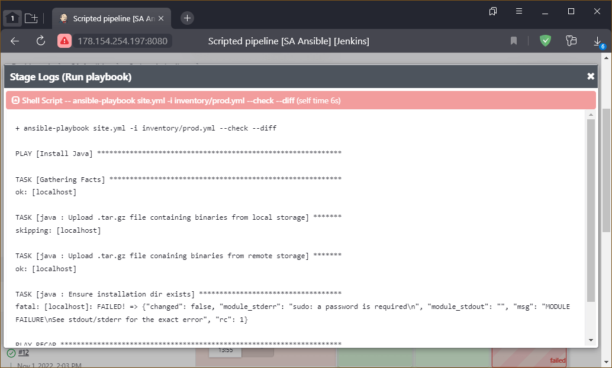

# Домашнее задание по лекции "9.4 Jenkins"

## Подготовка к выполнению

> 1. Создать 2 VM: для jenkins-master и jenkins-agent.
> 2. Установить jenkins при помощи playbook'a.
> 3. Запустить и проверить работоспособность.
> 4. Сделать первоначальную настройку.

Работа выполнялась в **Яндекс.Облаке**, поэтому использовался [Интерфейс командной строки Yandex Cloud](https://cloud.yandex.ru/docs/cli/quickstart)

Разворачивание "машинок" выполнялось провайдером **Яндекс.Облака** для **terraform** с его [зеркала](https://cloud.yandex.ru/docs/tutorials/infrastructure-management/terraform-quickstart#install-terraform).
Готовые файлы инфраструктуры: основной [main.tf](infrastructure/main.tf) и модуль [vm-instance](infrastructure/vm-instance/main.tf) (содержит прямую ссылку на открытый ключ)

Так как в исходном **playbook** явно используется пакетный менеджер `yum`, а также устанавливается репозиторий **Jenkins** для `redhat`, то в качестве операционной системы был выбран образ [CentOS Stream](https://cloud.yandex.ru/marketplace/products/yc/centos-stream-8). Для подключения к системе на основе этого образа **Яндекс.Облако** создаёт пользователя `centos`

Разворачивание **Jenkins** и его агентов (используется 1 нода, но придусмотрена возможность расширения) выполняется через **ansible**: [основной playbook](infrastructure/site.yml), [структура нод](infrastructure/cicd/hosts.yml) и [переменные](infrastructure/cicd/group_vars/jenkins.yml)

Для удобства необходимые команды были прописаны в **bash** скрипт: [go.sh](go.sh)

В приложенный к заданию **playbook** были внесены следуюдщие изменения:
  - Для поддержи динамического **inventory** в структуре хостов [hosts.yml](infrastructure/cicd/hosts.yml) удалены шаблоны **IP** адресов и заполнен пользователь
  - Добавлен блок реализации динамического **inventory**: `Generate dynamic inventory`
  - Добавлен блок активации SSH ключек для созданных "машинок": `Approve SSH fingerprint`
  - **LTS** репозиторий **Jenkins** заменён на обычный, так как было желание использовать плагин [Folders](https://plugins.jenkins.io/cloudbees-folder), но он требует версию **Jenkins** не ниже `2.372`, которая в **LTS** ещё не включена
  - Для блока настройки **agent** ноды добавлена **task** установки **molecule** и **molecule_docker**: `Install Molecule`
  - Для блока настройки **master** ноды добавлен вывод инициализирующего пароля **Jenkins**, чтобы не лезть за ним ручками
  - Для всех "машинок" добавлен блок вывода **public** ключа, чтобы не лезть за ними ручками (ключи понадобятся **molecule** для извлечения ролей): `Echo Public Key`
  - Для всех "машинок" добавлен блок внесения ключей хоста **GitHub** в список известных (**known_hosts**): `Ensure GitHub are present in known_hosts file` -  иначе ломается автоматика **Jenkins**
  - Для блока настройки **master** ноды добавлен вывод команды, позволяющей подключиться к хосту и вывести в терминал используемый **Jenkins private** ключ: `Commands to get private key`
  - Для блока настройки **agent** ноды добавлен блок активации агента (скопировать строку в `Launch command` и частично в `Remote root directory`): `Agent configuration`
  - Во избежание несовместимости **Ansible** и драйвера **Molecule Docker** для устанавливаемых пакетов **selinux**, **ansible**, **molecule**, **molecule_docker** указаны конкретные версии. Также дополнительно устанавливается **Python 3.9**.

>
> В решении данного задания **Jenkins** открывается по порту `8080`
>
> Чтобы избежать частичного перевода интерфейса **Jenkins** (многое остаётся не локализованным), нужно установить плагин `Locale`, после чего в настройках **Jenkins** появится блок выбора языка по умолчанию (вписать `en` и поставить галочку игнорирования настроек языка браузера)
>
> При настройке агентов нужно:
>   - Рабочий каталог задать равным значению параметра **playbook** `jenkins_agent_dir`
>   - Подключение выполнять запуском **java** агента через **SSH**, где путь исполняемого файла также должен соотвествовать значению параметра **playbook** `jenkins_agent_dir`
>   - В качестве адреса хоста использовать IP адрес "машинки" из группы `jenkins-agents` без указания конкретного пользователя
>
> Для успешного извлечения **Git** репозиториев из **GitHub** нужно:
>   - Добавить ключ мастера **Jenkins** в **GitHub**
>   - Добавить хост **GitHub** в список известных пользователю **jenkins** на всех нодах: `sudo su jenkins` (например, командой `git clone git@github.com:...`) - иначе агенты не смогут подключиться к **GitHub**

<details>
<summary>Разворачивание инфраструктуры</summary>

```console
sa@ubuntu22:~/9.4$ ./go.sh up

Terraform used the selected providers to generate the following execution plan. Resource actions are indicated with the
following symbols:
  + create

Terraform will perform the following actions:

  # yandex_compute_image.os-centos will be created
  + resource "yandex_compute_image" "os-centos" {
      + created_at      = (known after apply)
      + folder_id       = (known after apply)
      + id              = (known after apply)
      + min_disk_size   = (known after apply)
      + name            = "os-centos-stream"
      + os_type         = (known after apply)
      + pooled          = (known after apply)
      + product_ids     = (known after apply)
      + size            = (known after apply)
      + source_disk     = (known after apply)
      + source_family   = "centos-stream-8"
      + source_image    = (known after apply)
      + source_snapshot = (known after apply)
      + source_url      = (known after apply)
      + status          = (known after apply)
    }

  # yandex_vpc_network.my-net will be created
  + resource "yandex_vpc_network" "my-net" {
      + created_at                = (known after apply)
      + default_security_group_id = (known after apply)
      + folder_id                 = (known after apply)
      + id                        = (known after apply)
      + labels                    = (known after apply)
      + name                      = "cluster-network"
      + subnet_ids                = (known after apply)
    }

  # yandex_vpc_subnet.my-subnet will be created
  + resource "yandex_vpc_subnet" "my-subnet" {
      + created_at     = (known after apply)
      + folder_id      = (known after apply)
      + id             = (known after apply)
      + labels         = (known after apply)
      + name           = "cluster-subnet"
      + network_id     = (known after apply)
      + v4_cidr_blocks = [
          + "10.2.0.0/16",
        ]
      + v6_cidr_blocks = (known after apply)
      + zone           = "ru-central1-a"
    }

  # module.jen-master.yandex_compute_instance.vm-instance will be created
  + resource "yandex_compute_instance" "vm-instance" {
      + created_at                = (known after apply)
      + description               = "Jenkins Master"
      + folder_id                 = (known after apply)
      + fqdn                      = (known after apply)
      + hostname                  = (known after apply)
      + id                        = (known after apply)
      + metadata                  = {
          + "ssh-keys" = <<-EOT
                centos:ssh-ed25519 AAAAC3NzaC1lZDI1NTE5AAAAIMRj12xoipQ6bDAEXUxuP05AT5898pwRaTsPEE5BjTsv sa@ubuntu22
            EOT
        }
      + name                      = "jenkins-master-01"
      + network_acceleration_type = "standard"
      + platform_id               = "standard-v1"
      + service_account_id        = (known after apply)
      + status                    = (known after apply)
      + zone                      = (known after apply)

      + boot_disk {
          + auto_delete = true
          + device_name = "centos"
          + disk_id     = (known after apply)
          + mode        = (known after apply)

          + initialize_params {
              + block_size  = (known after apply)
              + description = (known after apply)
              + image_id    = (known after apply)
              + name        = (known after apply)
              + size        = 10
              + snapshot_id = (known after apply)
              + type        = "network-hdd"
            }
        }

      + network_interface {
          + index              = (known after apply)
          + ip_address         = (known after apply)
          + ipv4               = true
          + ipv6               = (known after apply)
          + ipv6_address       = (known after apply)
          + mac_address        = (known after apply)
          + nat                = true
          + nat_ip_address     = (known after apply)
          + nat_ip_version     = (known after apply)
          + security_group_ids = (known after apply)
          + subnet_id          = (known after apply)
        }

      + placement_policy {
          + host_affinity_rules = (known after apply)
          + placement_group_id  = (known after apply)
        }

      + resources {
          + core_fraction = 5
          + cores         = 2
          + memory        = 2
        }

      + scheduling_policy {
          + preemptible = (known after apply)
        }
    }

  # module.jen-slave[0].yandex_compute_instance.vm-instance will be created
  + resource "yandex_compute_instance" "vm-instance" {
      + created_at                = (known after apply)
      + description               = "Jenkins Slave Node 1"
      + folder_id                 = (known after apply)
      + fqdn                      = (known after apply)
      + hostname                  = (known after apply)
      + id                        = (known after apply)
      + metadata                  = {
          + "ssh-keys" = <<-EOT
                centos:ssh-ed25519 AAAAC3NzaC1lZDI1NTE5AAAAIMRj12xoipQ6bDAEXUxuP05AT5898pwRaTsPEE5BjTsv sa@ubuntu22
            EOT
        }
      + name                      = "jenkins-agent-01"
      + network_acceleration_type = "standard"
      + platform_id               = "standard-v1"
      + service_account_id        = (known after apply)
      + status                    = (known after apply)
      + zone                      = (known after apply)

      + boot_disk {
          + auto_delete = true
          + device_name = "centos"
          + disk_id     = (known after apply)
          + mode        = (known after apply)

          + initialize_params {
              + block_size  = (known after apply)
              + description = (known after apply)
              + image_id    = (known after apply)
              + name        = (known after apply)
              + size        = 10
              + snapshot_id = (known after apply)
              + type        = "network-hdd"
            }
        }

      + network_interface {
          + index              = (known after apply)
          + ip_address         = (known after apply)
          + ipv4               = true
          + ipv6               = (known after apply)
          + ipv6_address       = (known after apply)
          + mac_address        = (known after apply)
          + nat                = true
          + nat_ip_address     = (known after apply)
          + nat_ip_version     = (known after apply)
          + security_group_ids = (known after apply)
          + subnet_id          = (known after apply)
        }

      + placement_policy {
          + host_affinity_rules = (known after apply)
          + placement_group_id  = (known after apply)
        }

      + resources {
          + core_fraction = 20
          + cores         = 2
          + memory        = 4
        }

      + scheduling_policy {
          + preemptible = (known after apply)
        }
    }

Plan: 5 to add, 0 to change, 0 to destroy.

Changes to Outputs:
  + master_ip = (known after apply)
  + slave_ip  = [
      + (known after apply),
    ]
yandex_vpc_network.my-net: Creating...
yandex_compute_image.os-centos: Creating...
yandex_vpc_network.my-net: Creation complete after 2s [id=enpbhup5ssqa6ndcfpqs]
yandex_vpc_subnet.my-subnet: Creating...
yandex_vpc_subnet.my-subnet: Creation complete after 1s [id=e9buecm6olupomr0fgv1]
yandex_compute_image.os-centos: Still creating... [10s elapsed]
yandex_compute_image.os-centos: Creation complete after 11s [id=fd8k3bul4jhiafo87q5t]
module.jen-slave[0].yandex_compute_instance.vm-instance: Creating...
module.jen-master.yandex_compute_instance.vm-instance: Creating...
module.jen-slave[0].yandex_compute_instance.vm-instance: Still creating... [10s elapsed]
module.jen-master.yandex_compute_instance.vm-instance: Still creating... [10s elapsed]
module.jen-slave[0].yandex_compute_instance.vm-instance: Still creating... [20s elapsed]
module.jen-master.yandex_compute_instance.vm-instance: Still creating... [20s elapsed]
module.jen-slave[0].yandex_compute_instance.vm-instance: Still creating... [30s elapsed]
module.jen-master.yandex_compute_instance.vm-instance: Still creating... [30s elapsed]
module.jen-master.yandex_compute_instance.vm-instance: Still creating... [40s elapsed]
module.jen-slave[0].yandex_compute_instance.vm-instance: Still creating... [40s elapsed]
module.jen-master.yandex_compute_instance.vm-instance: Still creating... [50s elapsed]
module.jen-slave[0].yandex_compute_instance.vm-instance: Still creating... [50s elapsed]
module.jen-master.yandex_compute_instance.vm-instance: Still creating... [1m0s elapsed]
module.jen-slave[0].yandex_compute_instance.vm-instance: Still creating... [1m0s elapsed]
module.jen-slave[0].yandex_compute_instance.vm-instance: Creation complete after 1m1s [id=fhml6hg70ruicnjjpegm]
module.jen-master.yandex_compute_instance.vm-instance: Creation complete after 1m1s [id=fhm90et921n53rnjgpks]

Apply complete! Resources: 5 added, 0 changed, 0 destroyed.

Outputs:

master_ip = "178.154.254.197"
slave_ip = [
  "178.154.254.18",
]
sa@ubuntu22:~/9.4$ ./go.sh deploy

PLAY [Generate dynamic inventory] **************************************************************************************

TASK [Get instances from Yandex.Cloud CLI] *****************************************************************************
ok: [localhost]

TASK [Set instances to facts] ******************************************************************************************
ok: [localhost]

TASK [Add instances IP to hosts] ***************************************************************************************
ok: [localhost] => (item={'id': 'fhm90et921n53rnjgpks', 'folder_id': 'b1g3ol70h1opu6hr9kie', 'created_at': '2022-10-31T11:22:41Z', 'name': 'jenkins-master-01', 'description': 'Jenkins Master', 'zone_id': 'ru-central1-a', 'platform_id': 'standard-v1', 'resources': {'memory': '2147483648', 'cores': '2', 'core_fraction': '5'}, 'status': 'RUNNING', 'metadata_options': {'gce_http_endpoint': 'ENABLED', 'aws_v1_http_endpoint': 'ENABLED', 'gce_http_token': 'ENABLED', 'aws_v1_http_token': 'ENABLED'}, 'boot_disk': {'mode': 'READ_WRITE', 'device_name': 'centos', 'auto_delete': True, 'disk_id': 'fhm90knlb6e2d1hiqi2a'}, 'network_interfaces': [{'index': '0', 'mac_address': 'd0:0d:90:3b:a9:10', 'subnet_id': 'e9buecm6olupomr0fgv1', 'primary_v4_address': {'address': '10.2.0.26', 'one_to_one_nat': {'address': '178.154.254.197', 'ip_version': 'IPV4'}}}], 'fqdn': 'fhm90et921n53rnjgpks.auto.internal', 'scheduling_policy': {}, 'network_settings': {'type': 'STANDARD'}, 'placement_policy': {}})
ok: [localhost] => (item={'id': 'fhml6hg70ruicnjjpegm', 'folder_id': 'b1g3ol70h1opu6hr9kie', 'created_at': '2022-10-31T11:22:41Z', 'name': 'jenkins-agent-01', 'description': 'Jenkins Slave Node 1', 'zone_id': 'ru-central1-a', 'platform_id': 'standard-v1', 'resources': {'memory': '4294967296', 'cores': '2', 'core_fraction': '20'}, 'status': 'RUNNING', 'metadata_options': {'gce_http_endpoint': 'ENABLED', 'aws_v1_http_endpoint': 'ENABLED', 'gce_http_token': 'ENABLED', 'aws_v1_http_token': 'ENABLED'}, 'boot_disk': {'mode': 'READ_WRITE', 'device_name': 'centos', 'auto_delete': True, 'disk_id': 'fhmiubt6uodfipkp90v9'}, 'network_interfaces': [{'index': '0', 'mac_address': 'd0:0d:15:34:60:70', 'subnet_id': 'e9buecm6olupomr0fgv1', 'primary_v4_address': {'address': '10.2.0.10', 'one_to_one_nat': {'address': '178.154.254.18', 'ip_version': 'IPV4'}}}], 'fqdn': 'fhml6hg70ruicnjjpegm.auto.internal', 'scheduling_policy': {}, 'network_settings': {'type': 'STANDARD'}, 'placement_policy': {}})

TASK [Check instance count] ********************************************************************************************
ok: [localhost] => {
    "msg": "Total instance count: 2"
}

PLAY [Approve SSH fingerprint] *****************************************************************************************

TASK [Check known_hosts for] *******************************************************************************************
ok: [jenkins-master-01 -> localhost]
ok: [jenkins-agent-01 -> localhost]

TASK [Skip question for adding host key] *******************************************************************************
ok: [jenkins-master-01]
ok: [jenkins-agent-01]

TASK [Add SSH fingerprint to known host] *******************************************************************************
ok: [jenkins-agent-01]
ok: [jenkins-master-01]

PLAY [Preapre all hosts] ***********************************************************************************************

TASK [Gathering Facts] *************************************************************************************************
ok: [jenkins-master-01]
ok: [jenkins-agent-01]

TASK [Create group] ****************************************************************************************************
changed: [jenkins-agent-01]
changed: [jenkins-master-01]

TASK [Create user] *****************************************************************************************************
changed: [jenkins-agent-01]
changed: [jenkins-master-01]

TASK [Echo Public Key] *************************************************************************************************
ok: [jenkins-master-01] => {
    "ssh_key_info['ssh_public_key']": "ssh-rsa AAAAB3NzaC1yc2EAAAADAQABAAABgQChaQp2Upzkg7QDUdk6rtj3fLTGJcegS13JD74id1MGxRzZeZJFLuDowP31kKCkorgff8lqGsNOq5zczHiMHWMAX7TbQaoNFrYv57nAY/FEl8D/FNw8ZURV/b/V8WZW69LzSz74WNzwYMzWHoWEFfL7OLQydR8jCAZcYWGyaiWf+3KlUIIwnjYGUMyIHJ4QRlZeS4WJBrrGQiWnuG51UnD6AYGFHihzJiPoF1jxbFfQz5Wf+LzWzaD8dPlswoUXz45p+0ZLRN4h+JhMAebyao0D40ukzqPehGEsrkyBsUMhI9BqoYgU/I36oGTqKFNjEiDVV3kTd5tfwSVVe92Grm6FvUmVnHbbzBuiojODGj4sIKvYqyOsC87W04GUr54qUzS4ugizhcAoO0iIa9kjmv5pvPOSoFRX17ab2cBZbW/2Ta13TKpRHVyYs+LeksuoAzPb6cgHyeCFLQZEVrZ59sqrARVBlCtrpKFRovkFZe9mKFm/YMyByJfahN+E54Etxt0= ansible-generated on fhm90et921n53rnjgpks.auto.internal"
}
ok: [jenkins-agent-01] => {
    "ssh_key_info['ssh_public_key']": "ssh-rsa AAAAB3NzaC1yc2EAAAADAQABAAABgQCe6mPN/totoYhT2xHuRqSUb++lykkgS2W8k3SuYbC99G6DD/j9kNSJ4lCT0JEjMJj53XegRvHzGlQTxjEl0xJBFS+HP03n7uDvMaEuA6B7jG3LjzwPhvasbtRvv39bZMIHmOG3kufH2zu7SAnKg3Reafzf+ZwF7eqzWxoGYHlt3wZf42hw9zH6vdX2eWczmMNnOTcNiJqJ4K4iX3xStbpL84OJsC69xJcDQ8m70CPvOKtrMxRTbHuiKU9oDV4oWHB+sO8y+Pf97SsjWGGX1UUwir00jFG4YFSTR97ZxgA2U2fJyzrnYtSwIGaO/LaJCFTb7QrgrRVYY2rX/FJxqa6Cv+Wca7EVvGIqMbcKNE27NA83H54sS/yWqmgYs6ex9aKLc5GEjmRVDs4ebPRUTHlYMm4gAIuBjAi0KqKDiJirp0gQbt/Y2nGJMxeV4i5/DbAi07vR6qY3vVfTk9Qwlk3mxjTixwsOtUufp2CO7IAGR01j6lbqChDeuNtZw2Rw/FU= ansible-generated on fhml6hg70ruicnjjpegm.auto.internal"
}

TASK [Install JDK] *****************************************************************************************************
changed: [jenkins-master-01]
changed: [jenkins-agent-01]

TASK [Ensure GitHub are present in known_hosts file] *******************************************************************
# github.com:22 SSH-2.0-babeld-ea310e90
# github.com:22 SSH-2.0-babeld-ea310e90
# github.com:22 SSH-2.0-babeld-ea310e90
# github.com:22 SSH-2.0-babeld-ea310e90
# github.com:22 SSH-2.0-babeld-ea310e90
# github.com:22 SSH-2.0-babeld-ea310e90
# github.com:22 SSH-2.0-babeld-ea310e90
# github.com:22 SSH-2.0-babeld-ea310e90
# github.com:22 SSH-2.0-babeld-ea310e90
# github.com:22 SSH-2.0-babeld-ea310e90
[WARNING]: Module remote_tmp /home/jenkins/.ansible/tmp did not exist and was created with a mode of 0700, this may
cause issues when running as another user. To avoid this, create the remote_tmp dir with the correct permissions
manually
changed: [jenkins-master-01]
changed: [jenkins-agent-01]

PLAY [Get Jenkins master installed] ************************************************************************************

TASK [Gathering Facts] *************************************************************************************************
ok: [jenkins-master-01]

TASK [Get repo Jenkins] ************************************************************************************************
changed: [jenkins-master-01]

TASK [Add Jenkins key] *************************************************************************************************
changed: [jenkins-master-01]

TASK [Install epel-release] ********************************************************************************************
changed: [jenkins-master-01]

TASK [Install Jenkins and requirements] ********************************************************************************
changed: [jenkins-master-01]

TASK [Ensure jenkins agents are present in known_hosts file] ***********************************************************
# 178.154.254.18:22 SSH-2.0-OpenSSH_8.0
# 178.154.254.18:22 SSH-2.0-OpenSSH_8.0
# 178.154.254.18:22 SSH-2.0-OpenSSH_8.0
# 178.154.254.18:22 SSH-2.0-OpenSSH_8.0
# 178.154.254.18:22 SSH-2.0-OpenSSH_8.0
changed: [jenkins-master-01] => (item=jenkins-agent-01)

TASK [Start Jenkins] ***************************************************************************************************
changed: [jenkins-master-01]

TASK [Get initial password] ********************************************************************************************
ok: [jenkins-master-01]

TASK [Echo initial password] *******************************************************************************************
ok: [jenkins-master-01] => {
    "msg": "Use it to complete initialization: 1778e36f5a514defa49f414865bec9b5"
}

TASK [Commands to get private key] *************************************************************************************
ok: [jenkins-master-01] => {
    "msg": "ssh centos@178.154.254.197 sudo cat /home/jenkins/.ssh/id_rsa"
}

PLAY [Prepare jenkins agent] *******************************************************************************************

TASK [Gathering Facts] *************************************************************************************************
ok: [jenkins-agent-01]

TASK [Add master publickey into authorized_key] ************************************************************************
changed: [jenkins-agent-01]

TASK [Create agent_dir] ************************************************************************************************
changed: [jenkins-agent-01]

TASK [Add docker repo] *************************************************************************************************
changed: [jenkins-agent-01]

TASK [Install some required] *******************************************************************************************
changed: [jenkins-agent-01]

TASK [Update pip] ******************************************************************************************************
changed: [jenkins-agent-01]

TASK [Install Ansible 2.13.5] ******************************************************************************************
changed: [jenkins-agent-01]

TASK [Install Molecule] ************************************************************************************************
changed: [jenkins-agent-01]

TASK [Install Python 3.6] **********************************************************************************************
changed: [jenkins-agent-01]

TASK [Add local to PATH] ***********************************************************************************************
changed: [jenkins-agent-01]

TASK [Create docker group] *********************************************************************************************
ok: [jenkins-agent-01]

TASK [Add jenkinsuser to dockergroup] **********************************************************************************
changed: [jenkins-agent-01]

TASK [Restart docker] **************************************************************************************************
changed: [jenkins-agent-01]

TASK [Install agent.jar] ***********************************************************************************************
changed: [jenkins-agent-01]

TASK [Agent configuration] *********************************************************************************************
ok: [jenkins-agent-01] => {
    "msg": "To configure agent node use: ssh 178.154.254.18 java -jar /opt/jenkins_agent/agent.jar"
}

PLAY RECAP *************************************************************************************************************
jenkins-agent-01           : ok=24   changed=16   unreachable=0    failed=0    skipped=0    rescued=0    ignored=0
jenkins-master-01          : ok=19   changed=10   unreachable=0    failed=0    skipped=0    rescued=0    ignored=0
localhost                  : ok=4    changed=0    unreachable=0    failed=0    skipped=0    rescued=0    ignored=0

+----------------------+-------------------+---------------+---------+-----------------+-------------+
|          ID          |       NAME        |    ZONE ID    | STATUS  |   EXTERNAL IP   | INTERNAL IP |
+----------------------+-------------------+---------------+---------+-----------------+-------------+
| fhm90et921n53rnjgpks | jenkins-master-01 | ru-central1-a | RUNNING | 178.154.254.197 | 10.2.0.26   |
| fhml6hg70ruicnjjpegm | jenkins-agent-01  | ru-central1-a | RUNNING | 178.154.254.18  | 10.2.0.10   |
+----------------------+-------------------+---------------+---------+-----------------+-------------+

sa@ubuntu22:~/9.4$
```

</details>

Для решения задач в качестве основы подопытного я использовал свою **Ansible** коллекцию **CVL** стека.
Коллекция основана на ролях, двух моих и одной заимствованной, и поддерживает тестирование средствами **Molecule**.

`CVL` - это аббревиатура от **Clickhouse** + **Vector** + **Lighthouse**

---

## Основная часть

### 1. Сделать Freestyle Job, который будет запускать `molecule test` из любого вашего репозитория с ролью.


---

### 2. Сделать Declarative Pipeline Job, который будет запускать `molecule test` из любого вашего репозитория с ролью.

Готовый скрипт для **pipeline**

```jenkins
pipeline {
    agent any

    stages {
        stage('Get CVL roles') {
            steps {
                git branch: 'main', credentialsId: 'sa-github', url: 'git@github.com:ArtemShtepa/CVL-stack.git'
            }
        }
        stage('Molecute Test') {
            steps {
                sh 'molecule test'
            }
        }
    }
}
```


---

### 3. Перенести Declarative Pipeline в репозиторий в файл `Jenkinsfile`.

Так как имя файла `Jenkinsfile` будет использоваться в следующей задаче, декларативный **pipeline** сохранён в файл с именем `DeclarativeJenkinsfile`

---

### 4. Создать Multibranch Pipeline на запуск `Jenkinsfile` из репозитория.

> Использовать `Jenkinsfile` из предыдущего задания считаю не корректным, ибо в нём явно прописано извлечение конкретной ветки, что делает его содержимое избыточным.
> **Multibranch** уже извлекает всё содержимое нужной ветки.
> И если этот файл в обязательном порядке не менять в каждой ветке, не до конца понятно что будет собираться: извлечённая ветка от **multibranch** или та, которую извлёк скрипт.
> Данное поведение, я, к сожалению, проверить не догадался.
> В данном решении файлы `Jenkinsfile` разные из-за наличия в них маркеров (первый шаг) - без них файл можно было бы сделать единым для всех веток.

Для проверки решения в имеющемся репозиторий **CVL-stack** создан файл `Jenkinsfile` со следующим содержимым:

```jenkins
pipeline {
    agent any

    stages {
        stage('Main branch') {
            steps {
                echo 'MAIN'
            }
        }
        stage('Molecute Test') {
            steps {
                sh 'molecule test'
            }
        }
    }
}
```
> **Pipeline** состоит из двух этапов, где первый является своеобразным маркером ветки (выводит текст `MAIN` и имеет соответствующее название), а второй запускает тестирование **Molecule**

В **playbook** этапа **Molecule converge** добавлен **play** со следующим содержимым:

```yaml
- name: Project name
  hosts: localhost
  gather_facts: false
  tasks:
    - name: Project branch
      ansible.builtin.debug:
        msg: "It is MAIN branch"
```
> Также служит "маркером" исполняемой ветки

Далее от основной ветки `main` создано ответвление `second`, где перечисленные выше файлы изменены следующим образом:

Файл `Jenkinsfile`

```jenkins
pipeline {
    agent any

    stages {
        stage('Second branch') {
            steps {
                echo 'SECOND'
            }
        }
        stage('Molecute Test') {
            steps {
                sh 'molecule test'
            }
        }
    }
}
```

Изменённый **play** файла `molecule/default/converge.yml`:

```yaml
- name: Project name
  hosts: localhost
  gather_facts: false
  tasks:
    - name: Project branch
      ansible.builtin.debug:
        msg: "It is SECOND branch"
```

При сохранении конфигурации проекта выполняется сканирование репозитория в соответствии с настройками проекта для поиска нужных ссылок (веток, тегов и т.д.) - в данном случае ищутся только ветки.
Лог обработки выглядит подобным образом:

```console
Started
[Mon Oct 31 15:15:43 UTC 2022] Starting branch indexing...
 > git --version # timeout=10
 > git --version # 'git version 2.31.1'
using GIT_SSH to set credentials 
[INFO] Currently running in a labeled security context
[INFO] Currently SELinux is 'enforcing' on the host
 > /usr/bin/chcon --type=ssh_home_t /tmp/jenkins-gitclient-ssh9349166857291373915.key
Verifying host key using known hosts file
 > git ls-remote --symref -- git@github.com:ArtemShtepa/CVL-stack.git # timeout=10
Creating git repository in /var/lib/jenkins/caches/git-f69dbc5e9c49bafa75a1f1623749dd2b
 > git init /var/lib/jenkins/caches/git-f69dbc5e9c49bafa75a1f1623749dd2b # timeout=10
Setting origin to git@github.com:ArtemShtepa/CVL-stack.git
 > git config remote.origin.url git@github.com:ArtemShtepa/CVL-stack.git # timeout=10
Fetching & pruning origin...
Listing remote references...
 > git config --get remote.origin.url # timeout=10
 > git --version # timeout=10
 > git --version # 'git version 2.31.1'
using GIT_SSH to set credentials 
[INFO] Currently running in a labeled security context
[INFO] Currently SELinux is 'enforcing' on the host
 > /usr/bin/chcon --type=ssh_home_t /var/lib/jenkins/caches/git-f69dbc5e9c49bafa75a1f1623749dd2b@tmp/jenkins-gitclient-ssh4565873836439757084.key
Verifying host key using known hosts file
 > git ls-remote -h -- git@github.com:ArtemShtepa/CVL-stack.git # timeout=10
Fetching upstream changes from origin
 > git config --get remote.origin.url # timeout=10
using GIT_SSH to set credentials 
[INFO] Currently running in a labeled security context
[INFO] Currently SELinux is 'enforcing' on the host
 > /usr/bin/chcon --type=ssh_home_t /var/lib/jenkins/caches/git-f69dbc5e9c49bafa75a1f1623749dd2b@tmp/jenkins-gitclient-ssh16470572433904368790.key
Verifying host key using known hosts file
 > git fetch --tags --force --progress --prune -- origin +refs/heads/*:refs/remotes/origin/* # timeout=10
Checking branches...
  Checking branch main
      ‘Jenkinsfile’ found
    Met criteria
Scheduled build for branch: main
  Checking branch second
      ‘Jenkinsfile’ found
    Met criteria
Scheduled build for branch: second
Processed 2 branches
[Mon Oct 31 15:15:52 UTC 2022] Finished branch indexing. Indexing took 8.6 sec
Finished: SUCCESS
```

В логе видно, что было обнаружено две ветки: `main` и `second` - после чего они сразу были запланированы для сборки.
Имея два свободных **instance** агента обе сборки запустились параллельно, что через какое-то время привело к краху обоих.
Либо проявились какие-то **side** эффекты, либо агенту банально не хватило оперативной памяти (в ролях используются по три **Docker** контейнера с `CentOS 7` на каждую сборку).


Запуск сборок отдельно ожидаемо сбоев не дал.

Использование разных веток подтверждается как визуально, так и в логах сборки:

Вывод текста `MAIN` из одного из **stage** для **pipeline** основной **main** ветки


Вывод кусочка лога с текстом `It is SECOND branch` из вывода **playbook** второй (**second**) ветки


---

### 5. Создать Scripted Pipeline, наполнить его скриптом из [pipeline](./pipeline).

В исходном скрипте:
```jenkins
node("linux"){
    stage("Git checkout"){
        git credentialsId: '5ac0095d-0185-431b-94da-09a0ad9b0e2c', url: 'git@github.com:aragastmatb/example-playbook.git'
    }
    stage("Sample define secret_check"){
        secret_check=true
    }
    stage("Run playbook"){
        if (secret_check){
            sh 'ansible-playbook site.yml -i inventory/prod.yml'
        }
        else{
            echo 'need more action'
        }
        
    }
}
```

единственное, что нужно поменять - это `credentialsId` - сохранённый в секретах **credentals** доступа к **GitHub** (скорее всего **private** ключ)

Так как я раньше уже сохранял свой аналогичный **credentals**, то можно использовать его:
```jenkins
node("linux"){
    stage("Git checkout"){
        git credentialsId: 'sa-github', url: 'git@github.com:aragastmatb/example-playbook.git'
    }
    stage("Sample define secret_check"){
        secret_check=true
    }
    stage("Run playbook"){
        if (secret_check){
            sh 'ansible-playbook site.yml -i inventory/prod.yml'
        }
        else{
            echo 'need more action'
        }
        
    }
}
```

Однако, в скрипте указано использование агента с меткой `linux`.
Поэтому для того, чтобы запланированная сборка могла быть отправлена агенту на выполнение нужно:
  - либо убрать требование метки - заменить строчку `node("linux"){` на `node{`
  - либо добавить соответствующую метку ноде агента

Для решения выбран вариант добавления меток `linux ansible molecule`

---

### 6. Внести необходимые изменения, чтобы Pipeline запускал `ansible-playbook` без флагов `--check --diff`, если не установлен параметр при запуске джобы (prod_run = True), по умолчанию параметр имеет значение False и запускает прогон с флагами `--check --diff`.

Условия попроще:
  - Добавить параметр сборки `prod_run`
  - Если параметр не установлен (что эквивалентно значению `false`) запускать `ansible-playbook` с флагами `--check --diff`
  - Иначе (если параметр имеет значение true) запускать `ansible-playbook` без флагов

Готовый скрипт:
```jenkins
node("linux"){
    stage("Git checkout"){
        git credentialsId: 'sa-github', url: 'git@github.com:aragastmatb/example-playbook.git'
    }
    stage("Run playbook"){
        if (params.prod_line == true) {
            sh 'ansible-playbook site.yml -i inventory/prod.yml'
        }
        else
        {
            sh 'ansible-playbook site.yml -i inventory/prod.yml --check --diff'
        }
        
    }
}
```

Параметризированная сборка выглядит так:


---

### 7. Проверить работоспособность, исправить ошибки, исправленный Pipeline вложить в репозиторий в файл `ScriptedJenkinsfile`.

При исполнени **playbook** появляется ошибка:


```console
TASK [java : Ensure installation dir exists] ***********************************
fatal: [localhost]: FAILED! => {"changed": false, "module_stderr": "sudo: a password is required\n", "module_stdout": "", "msg": "MODULE FAILURE\nSee stdout/stderr for the exact error", "rc": 1}
```

Из вообщения видно, что **ansible** пытается выполнить команду с повышенными привелегиями (**sudo**), но соответствующий пароль не задан.
Проблему можно решить разными способами - подробнее в статье [Ansible – “sudo: a password is required”](https://www.shellhacks.com/ansible-sudo-a-password-is-required/)

Я выбрал вариант попроще, а именно - не спрашивать пароль для `sudo` операций пользователя `jenkins` для чего нужно:
  - Подключиться к ноде агента: `ssh centos@178.154.254.18`
  - Выполнить команду `sudo visudo`
  - Добавить в конец файла строку `jenkins  ALL=(ALL) NOPASSWD:ALL`

После внесённых изменений сборка проходит успешно при любом значении параметра:

> На скриншоте сборка состоит из трёх шагов - средний я добавил для уверенности, что сборка запускается от пользователя `jenkins`

---

### 8. Отправить ссылку на репозиторий с ролью и Declarative Pipeline и Scripted Pipeline.

Репозиторий решения: [CVL-stack](https://github.com/ArtemShtepa/CVL-stack) - содержит:
  - Сценарий проверки ролей стека **Clickhouse+Vector+Lighthouse**
  - Две ветки для **Multibranch pipeline**: `main` и `second` - используется файл **Jenkinsfile**
  - Основная ветка **main** содержит Файл `DeclarativeJenkinsfile` для **Declarative pipeline**
  - Основная ветка **main** содержит Файл `ScriptedJenkinsfile` для **Scripted pipeline** (включает отладочный шаг `id`)
  - Основная ветка **main** содержит файл `ScriptedCVLstackJenkinsfile` из второй дополнительной задачи

---

## Необязательная часть

### 1. Создать скрипт на groovy, который будет собирать все Job, которые завершились хотя бы раз неуспешно. Добавить скрипт в репозиторий с решением с названием `AllJobFailure.groovy`.

Для запуска скрипта нужно использовать **Script Console** мастер ноды **Jenkins**, которая находится в меню **Jenkins** -> **Manage Jenkins** -> **Script Console**.

> Также существуют **Script Console** каждой ноды агентов **Jenkins**, на них скрипт работать не будет - они расположены в **Jenkins** -> **Manage Jenkins** -> **Manage Nodes and Clouds** -> **(Node)** -> **Script Console**

```groovy
def folderFilter = "sa"
def failedList = []
  
Jenkins.instance.getAllItems(Job.class).each {
  def isDesired = true
  if(folderFilter != "") {
    isDesired = it.fullName.contains(folderFilter+"/")
  }
  if(isDesired) {
    def b_list = it.getBuilds()
    println("-".repeat(80))
    println("Job: "+it.fullName)
    println("Health: "+it.getBuildHealth().getScore()+"% of "+b_list.size()+" builds")
    for(String bb: b_list) {
      println("  "+bb)
    }
    if(it.getLastFailedBuild()!=null) {
      failedList << it.fullName
    }
  }
}
println("=".repeat(80))
if(failedList.size()>0){
  println("Dirty Jobs")
  println("=".repeat(80))
  failedList.each{
    println(it)
  }
}
```

Состояние сборок каталога `sa` (в скрипте **job** фильтруются по названию каталога, если он указан)


Результат работы скрипта:

```console
--------------------------------------------------------------------------------
Job: sa/Declarative CVL stack
Health: 100% of 1 builds
  sa/Declarative CVL stack #1
--------------------------------------------------------------------------------
Job: sa/Freestyle CVL stack
Health: 100% of 1 builds
  sa/Freestyle CVL stack #1
--------------------------------------------------------------------------------
Job: sa/Multibranch CVL stack/main
Health: 50% of 2 builds
  sa/Multibranch CVL stack/main #2
  sa/Multibranch CVL stack/main #1
--------------------------------------------------------------------------------
Job: sa/Multibranch CVL stack/second
Health: 50% of 2 builds
  sa/Multibranch CVL stack/second #2
  sa/Multibranch CVL stack/second #1
--------------------------------------------------------------------------------
Job: sa/Scripted pipeline
Health: 40% of 10 builds
  sa/Scripted pipeline #13
  sa/Scripted pipeline #12
  sa/Scripted pipeline #11
  sa/Scripted pipeline #10
  sa/Scripted pipeline #9
  sa/Scripted pipeline #8
  sa/Scripted pipeline #6
  sa/Scripted pipeline #3
  sa/Scripted pipeline #2
  sa/Scripted pipeline #1
--------------------------------------------------------------------------------
Job: sa/Tools version
Health: 100% of 1 builds
  sa/Tools version #1
================================================================================
Dirty Jobs
================================================================================
sa/Multibranch CVL stack/main
sa/Multibranch CVL stack/second
sa/Scripted pipeline
Result: [sa/Multibranch CVL stack/main, sa/Multibranch CVL stack/second, sa/Scripted pipeline]
```

### 2. Создать Scripted Pipeline таким образом, чтобы он мог сначала запустить через Ya.Cloud CLI необходимое количество инстансов, прописать их в инвентори плейбука и после этого запускать плейбук. Тем самым, мы должны по нажатию кнопки получить готовую к использованию систему.

Для реализации данного задания на ноду агента дополнительно был установлен **Яндекс.Облако CLI** и выполнена его инициализация.

Готовый скрипт решения:

```groovy
import groovy.json.JsonSlurper

yc_bin = "/home/jenkins/yandex-cloud/bin"
ssh_keyfile = '"/home/jenkins/.ssh/id_rsa.pub"'
inv_res = "---\n"

def raise_vm(name, config) {
    def vm_config = ""
    try {
        vm_config = sh (script: "$yc_bin/yc compute instance create $name $config --public-ip --ssh-key $ssh_keyfile --format json", returnStdout: true)
    } catch (e) {
        vm_config = sh (script: "$yc_bin/yc compute instance get $name --format json", returnStdout: true)
    }
    println(vm_config)
    def res = new JsonSlurper().parseText(vm_config)
    inv_res += "${name}:\n"+
                "  hosts:\n"+
                "    ${name}-01:\n"+
                "      ansible_host: "+res.network_interfaces[0].primary_v4_address.one_to_one_nat.address+"\n"+
                "  vars:\n"+
                "    ansible_user: yc-user\n"
}

node("ansible") {
    stage('Check YC config') {
        def yc_token = sh (script: "${yc_bin}/yc config get token", returnStdout: true) == 0
        def yc_cloud = sh (script: "${yc_bin}/yc config get cloud-id", returnStdout: true) == 0
        def yc_folder = sh (script: "${yc_bin}/yc config get folder-id", returnStdout: true) == 0
        def yc_zone = sh (script: "${yc_bin}/yc config get compute-default-zone", returnStdout: true) == 0
    }
    stage("Create Clickhouse VM") {
        raise_vm("clickhouse", "--core-fraction 5 --cores 2 --memory 2GB --create-boot-disk size=10GB,image-folder-id=standard-images,image-family=centos-7")
    }
    stage("Create Vector VM") {
        raise_vm("vector", "--core-fraction 5 --cores 2 --memory 1GB --create-boot-disk size=10GB,image-folder-id=standard-images,image-family=centos-7")
    }
    stage("Create Lighthouse VM") {
        raise_vm("lighthouse", "--core-fraction 5 --cores 2 --memory 1GB --create-boot-disk size=10GB,image-folder-id=standard-images,image-family=centos-7")
    }
    stage("Get CVL Ansible roles") {
        git branch: 'main', credentialsId: 'sa-github', url: 'git@github.com:ArtemShtepa/CVL-stack.git'
        sh 'ansible-galaxy install -r molecule/default/requirements.yml -p playbooks/roles/'
    }
    stage("Write inventory") {
        println(inv_res)
        writeFile file: 'inventory.yml', text: inv_res
    }
    stage("Run Ansible Playbook") {
        sh 'ansible-playbook -i inventory.yml playbooks/demo.yml'
    }
}
```

Скрипт содержит:
  1. Глобальные переменные:
     - `yc_bin` - путь к исполняемым файлам командного интерфейса **Яндекс.Облака**
     - `ssh_keyfile` - путь и имя файла **public** ключа, который будет добавляться на "машинки" (в решении используется сгенерированный ключ пользователя **jenkins**, но вместо него, естественно, можно использовать свой, для чего потребуется предварительно его скопировать на ноду агента)
     - `inv_res` - "накопитель" содержимого будущего **inventory** файла. Заполняется по мере создания "машинок"
  1. Функцию `raise_vm`, которая:
     - В качестве входных данных принимает имя "машинки" и её конфигурацию
     - В качестве выходных данных возвращает конфигурацию "машинки" в **JSON** формате, включая внешний **IP** адрес, который будет использоваться при создании **inventory** для **Ansible**
     - На основе входных данных функция пытается создать "машинку" в **Яндекс.Облаке** используя его командный интерфейс
     - Если "машинка" с таким именем уже существует запрашивает её конфигурацию
  1. **Scripted pipeline**, запускаемый на агентах с меткой `ansible`, состоящий из семи шагов: предварительного, создания "машинок", извлечения репозитория ролей **CVL** стека, запись файла **inventory** и запуск **playbook**
  1. Этап `Check YC config` является предвариательным и предназначен для проверки наличия установленного командного интерфейса **Яндекс.Облака** и его инициализацию
  1. Этапы `Create ... VM` создают "машинки" в **Яндекс.Облаке** используя функцию `raise_vm`
  1. Этап `Get CVL Ansible roles` извлекает репозиторий ролей **CVL** стека и устанавливает зависимости - непостредственно сами файлы используемых ролей через `ansible-galaxy`
  1. Этап `Write inventory` сохраняет в файл переменную "накопителя" для **inventory**
  1. Завершающий этап `Run Ansible Playbook` запускает на выполнение **playbook** с подготовленным **inventory**

Скрипт сохранён в Файл `ScriptedCVLstackJenkinsfile` в репозитории [CVL-stack](https://github.com/ArtemShtepa/CVL-stack)

События сборочной линии:


Для проверка функционирования стека были выпонены следующие действия:
  - Подключение к агенту **Jenkins**, откуда создавался весь **CVL** стек
  - Авторизация под пользователем `jenkins`, так как именно его ключи добавлялись на создаваемые в **Яндекс.Облаке** "машинки"
  - Подключение по **SSH** к "машинке", контролируемой **Vector**
  - Добавление данных в файлы
  - **Vector** увидит изменения в файлах и передаст информацию о них в базу **Clickhouse**
  - Открыв в браузере "машинку" с **Lighthouse** мы должны увидеть данные из подключенной базы **Clickhouse**

```console
sa@ubuntu22:~/9.4/test$ yc compute instance list
+----------------------+-------------------+---------------+---------+-----------------+-------------+
|          ID          |       NAME        |    ZONE ID    | STATUS  |   EXTERNAL IP   | INTERNAL IP |
+----------------------+-------------------+---------------+---------+-----------------+-------------+
| fhm90et921n53rnjgpks | jenkins-master-01 | ru-central1-a | RUNNING | 178.154.254.197 | 10.2.0.26   |
| fhmfimpg23teso1fuun3 | lighthouse        | ru-central1-a | RUNNING | 158.160.32.166  | 10.2.0.3    |
| fhml6hg70ruicnjjpegm | jenkins-agent-01  | ru-central1-a | RUNNING | 178.154.254.18  | 10.2.0.10   |
| fhmmbkfc15dneetsu1ku | vector            | ru-central1-a | RUNNING | 158.160.37.46   | 10.2.0.25   |
| fhmoduq6418dgldlo53a | clickhouse        | ru-central1-a | RUNNING | 51.250.8.121    | 10.2.0.21   |
+----------------------+-------------------+---------------+---------+-----------------+-------------+

sa@ubuntu22:~/9.4/test$ ssh centos@178.154.254.18
Last login: Thu Nov  3 14:41:03 2022 from 85.143.205.34
[centos@fhml6hg70ruicnjjpegm ~]$ sudo su jenkins
[jenkins@fhml6hg70ruicnjjpegm centos]$ ssh yc-user@158.160.37.46
[yc-user@fhmmbkfc15dneetsu1ku ~]$ cd test/
[yc-user@fhmmbkfc15dneetsu1ku test]$ echo "TEST1" >file-1.log
[yc-user@fhmmbkfc15dneetsu1ku test]$ echo "TEST1+ADD" >>file-1.log
[yc-user@fhmmbkfc15dneetsu1ku test]$ echo "TEST2" >file-2.log
[yc-user@fhmmbkfc15dneetsu1ku test]$ ls
file-1.log  file-2.log
[yc-user@fhmmbkfc15dneetsu1ku test]$ exit
logout
Connection to 158.160.37.46 closed.
[jenkins@fhml6hg70ruicnjjpegm centos]$
```


Структурированный лог сборки **Jenkins**


На карте сборок можно увидеть:
  - Сколько времени потребовалось на выполнение всей сборки
  - С каким результатом завершилась сборка
  - Сколько времени потребовал каждый шаг
  - Можно отдельно посмотреть лог каждого шага
  - Индикатор изменений в репозитории, на основе которого выполняется сборка даже для **Scripted pipeline**. Нажав на область с числом комитов откроется страница, где можно посмотреть комментарии и какие изменения были внесены.

На скриншоте можно заметить, что предпоследняя сборка `№94` была выполнена с нуля (при отсутствующих "машинках" в **Яндекс.Облаке**)
и видно сколько времени заняло создание "машинок" и разворачиание **CVL** стека.
Последняя сборка `№95` уже выполняется при существующих "машинках", поэтому соответствующие шаги выполнились значительно быстрее.
Также существенно сокращается длительность применение ролей **Ansible**.
