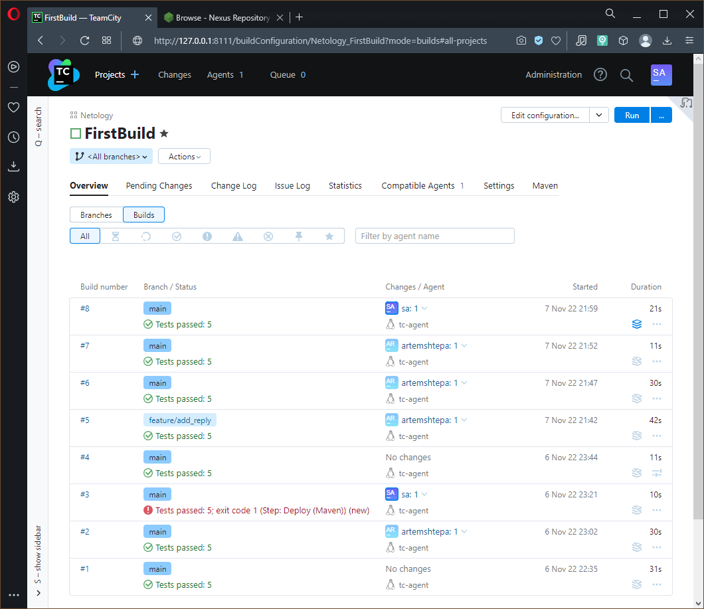
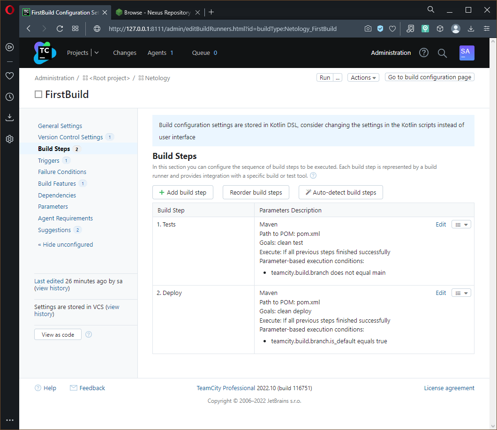
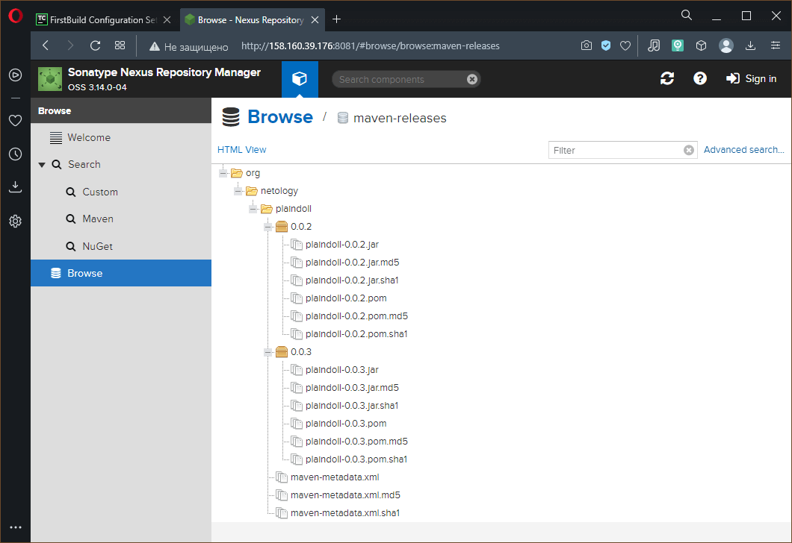
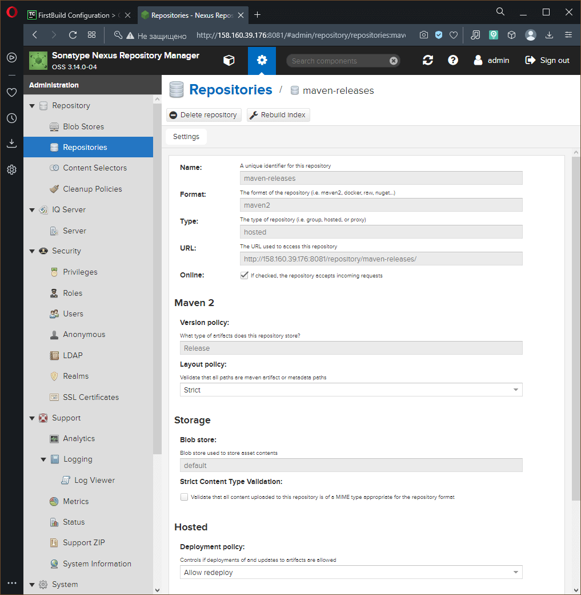
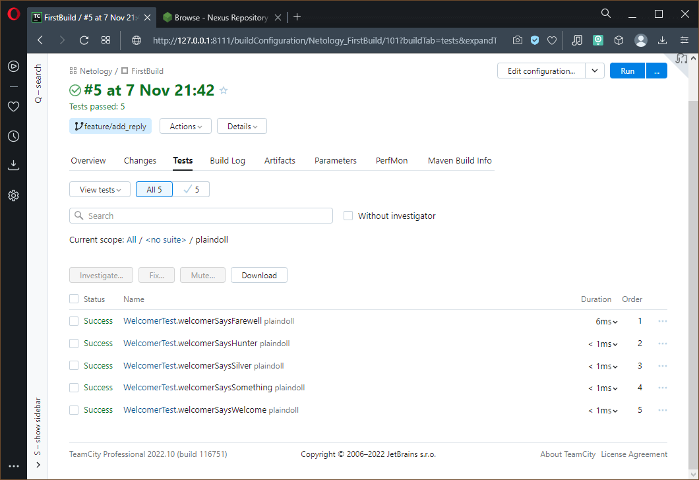
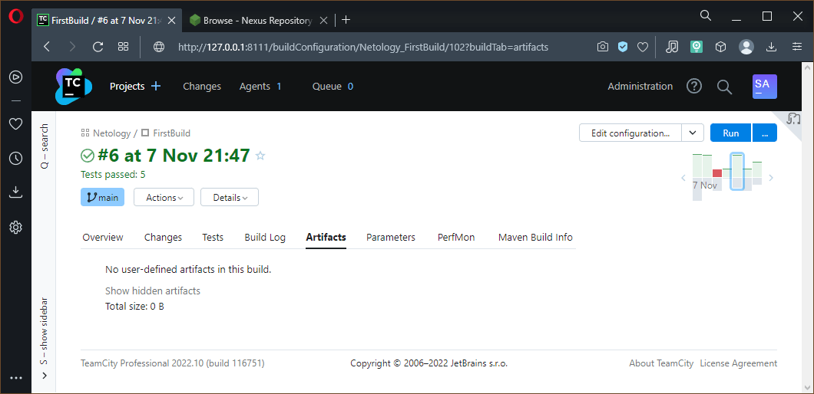
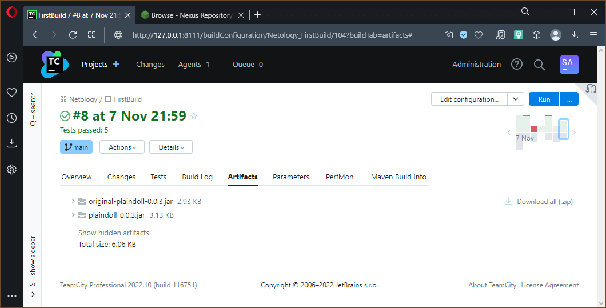
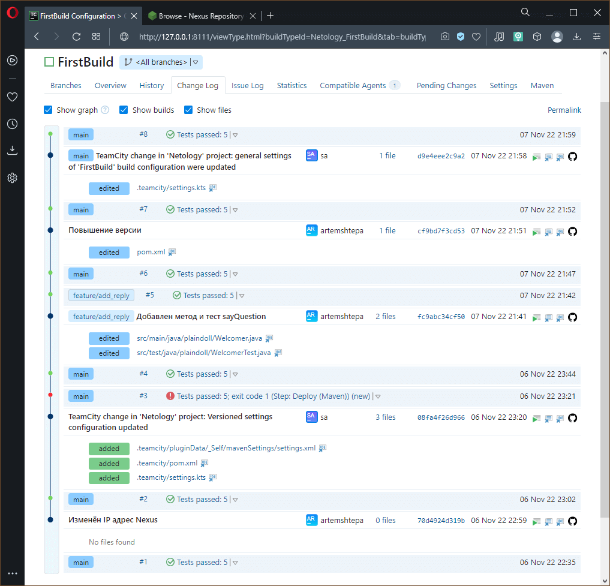

# Домашнее задание по лекции "9.5 Teamcity"

## Подготовка к выполнению

> 1. В Ya.Cloud создайте новый инстанс (4CPU4RAM) на основе образа `jetbrains/teamcity-server`
> 2. Дождитесь запуска teamcity, выполните первоначальную настройку
> 3. Создайте ещё один инстанс(2CPU4RAM) на основе образа `jetbrains/teamcity-agent`. Пропишите к нему переменную окружения `SERVER_URL: "http://<teamcity_url>:8111"`
> 4. Авторизуйте агент
> 5. Сделайте fork [репозитория](https://github.com/aragastmatb/example-teamcity)
> 6. Создать VM (2CPU4RAM) и запустить [playbook](./infrastructure)

При решении заданий использовались предложенные решения:
  - Файл манифеста **Docker** для нод сервера и агента **Teamcity** (поэтому их **IP** адреса `127.0.0.1`)
  - **Playbook** для разворачивания и настройки **Nexus** в **Яндекс.Облаке** на созданной вручную ВМ

> В решении приведены скриншоты после всех шагов выполнения задания

## Основная часть

### 1. Создайте новый проект в **teamcity** на основе **fork**
### 2. Сделайте **autodetect** конфигурации
### 3. Сохраните необходимые шаги, запустите первую сборку **master**'a

> **GitHub** по умолчанию назвал ветку **main**, так оно и пошло. Поэтому на скриншотах и в настройках вместо **master** используется **main**.

После настройки проекта первая сборка запускается ручками: **Build number** `#1`[^1]


### 4. Поменяйте условия сборки: если сборка по ветке `master`, то должен происходит `mvn clean deploy`, иначе `mvn clean test`

Для разветвления условия сборки создано два шага с взаимоисключающими условиями:
  - Шаг `1: Tests` - выполнение тестов `clean test` для всех веток, кроме `main` (даже если слово **main** встречается в названии ветки)
  - Шаг `2: Deploy` - выполнение `clean deploy` только при изменениях основной ветки

Иллюстрация шагов:


### 5. Для **deploy** будет необходимо загрузить [settings.xml](teamcity/settings.xml) в набор конфигураций **maven** у **teamcity**, предварительно записав туда креды для подключения к **nexus**
### 6. В `pom.xml` необходимо поменять ссылки на репозиторий и **nexus**
### 7. Запустите сборку по **master**, убедитесь что всё прошло успешно, артефакт появился в **nexus**

Запускать сборку вручную нет необходимости, потому что для изменения **IP** адреса нужно выполнить **commit** в основную ветку, после чего **Teamcity** сам запустит сборку и выложит артефакт в **Nexus**: **Build number** `#2`[^2]



> В `pom.xml` прописана версия `0.0.2`

### 8. Мигрируйте `build configuration` в репозиторий

Мигрирование конфигурации сборки выполняется в настройках проекта, а именно: **Project Settings** -> **Versioned Settings** (далее активировать синхронизацию и выбрать **VCS**)

> При активации данной функции **Teamcity** добавляет свои файлы в репозиторий и, конечно же, в основую ветку (тем более других нет),
> что приводит к автоматическому запуску сборки проекта (**Build number** `#3`[^3]) и
> естественному отказу **Nexus** принимать артефакт уже существующей версии,
> что видно на скриншотах.
> Такого поведения можно избежать разрешив **Nexus** **redeploy** артефактов в используемом репозитории, для чего
> нужно авторизховаться под учётной записью администратора,
> открыть настройки репозитория (в нашем случае используется `maven-releases`),
> изменить политику выкладки `Deployment policy` на `Allow redeploy` аналогично скриншоту ниже
> 
> После изменения настроек **Nexus** я вручную перезапустил последную сборку и она завершилась без пометок **Warning** - **Build number** `#4`[^4]

### 9. Создайте отдельную ветку `feature/add_reply` в репозитории

> Ветка создана от **main** командой `git switch -c feature/add_reply`

### 10. Напишите новый метод для класса Welcomer: метод должен возвращать произвольную реплику, содержащую слово `hunter`

Добавлен новый метод в класс `Welcomer.java`:
```java
	public String sayQuestion(){
		return "Amm... are you shooting well, hunter ?";
	}
```

### 11. Дополните тест для нового метода на поиск слова `hunter` в новой реплике

Расширен тест `WelcomerTest.java`:
```java
	@Test
	public void welcomerSaysHunter() {
		assertThat(welcomer.sayWelcome(), containsString("hunter"));
		assertThat(welcomer.sayFarewell(), containsString("hunter"));
		assertThat(welcomer.sayQuestion(), containsString("hunter"));
	}
```

> Мне показалось, что расширить существующий тест `welcomerSaysHunter` будет логичнее.
> Хотя, сейчас думаю, что лучше было создать отдельный `@Test`, тогда общее число тестов было бы `6`, а не `5`, что также отразилось бы в интерфейсе

### 12. Сделайте push всех изменений в новую ветку в репозиторий

> После публикации изменений **Teamcity** должен увидеть изменения и запустить сборку

### 13. Убедитесь что сборка самостоятельно запустилась, тесты прошли успешно

Результат успешной сборки: **Build number** `#5`[^5]


### 14. Внесите изменения из произвольной ветки `feature/add_reply` в `master` через `Merge`

Результат успешного слияния: **Build number** `#6`[^6]

После чего я решил повысить версию проекта с `0.0.2` до `0.0.3`, внеся изменения в `pom.xml`,
что в свою очередь породило очередную сборку **Build number** `#7`[^7] и появления соответствующего артефакта в **Nexus**

### 15. Убедитесь, что нет собранного артефакта в сборке по ветке `master`

Каждая сборка может содержать внутри себя необходимые разработчикам артефакты.
По умолчанию они не добавляются, что можно видеть открыв вкладку `Artifacts` нужной сборки:


### 16. Настройте конфигурацию так, чтобы она собирала `.jar` в артефакты сборки

Для того, чтобы добавить артефакты в сборку нужно изменить свойства проекта `Artifact paths` в разделе `General Settings`,
где вписать нуобходимые для включения файлы (можно использовать маскирование, например: `target/*.jar`)

### 17. Проведите повторную сборку мастера, убедитесь, что сбора прошла успешно и артефакты собраны

Для повторного запуска сборки опять ничего делать не нужно.
Так как в проекте настроена синхронизация конфигурации в **VCS** этого же репозитория,
изменение конфигурации (добавление артефактов в сборку) спровоцирует **commit** в основную ветку, что 
запустит сборку автоматически - **Build number** `#8`[^8]

Содержание артефактов сборки **#8**:


> Наличие внутренних артефактов сборки можно увидеть и в списке сборок по соответствующей иконке как на самом верхнем скриншоте

### 18. Проверьте, что конфигурация в репозитории содержит все настройки конфигурации из teamcity
### 19. В ответ предоставьте ссылку на репозиторий

Ссылка на репозиторий: [teamcity-example](https://github.com/ArtemShtepa/teamcity-example)

---

## Детальный лог сборок

[^1]: Первая сборка (ручная)
[^2]: Настройка подключения **Nexus**
[^3]: Автивация синхронизации конфигурации сборки с репозиторием
[^4]: Проверка **redeploy** артефактов **Nexus**
[^5]: Сборка новой версии для отдельной ветки
[^6]: Слияние ветки разработки в основную
[^7]: Повышение версии
[^8]: Активация сохранения артефактов внутри сборки


